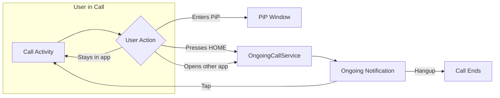

Keep calls alive when users navigate away from your app. Background handling ensures the call continues running when users press the home button, switch to another app, or lock their device.

## Overview

When a user leaves your call activity, Android may terminate it to free resources. The SDK provides `CometChatOngoingCallService` - a foreground service that:
- Keeps the call session active in the background
- Shows an ongoing notification in the status bar
- Allows users to return to the call with a single tap
- Provides a hangup action directly from the notification



## When to Use

| Scenario | Solution |
|----------|----------|
| User stays in call activity | No action needed |
| User enters Picture-in-Picture | [PiP Mode](/calls/android/picture-in-picture) handles this |
| User presses HOME during call | **Use OngoingCallService** |
| User switches to another app | **Use OngoingCallService** |
| Receiving calls when app is killed | [VoIP Calling](/calls/android/voip-calling) handles this |

<Note>
Background Handling is different from [VoIP Calling](/calls/android/voip-calling). VoIP handles **receiving** calls when the app is not running. Background Handling keeps an **active** call alive when the user leaves the app.
</Note>

---

## Implementation

### Step 1: Add Manifest Permissions

Add the required permissions and service declaration to your `AndroidManifest.xml`:

```xml
<manifest xmlns:android="http://schemas.android.com/apk/res/android">

    <!-- Required for foreground service -->
    <uses-permission android:name="android.permission.FOREGROUND_SERVICE" />
    <uses-permission android:name="android.permission.FOREGROUND_SERVICE_MEDIA_PLAYBACK" />
    <uses-permission android:name="android.permission.FOREGROUND_SERVICE_MICROPHONE" />
    <uses-permission android:name="android.permission.FOREGROUND_SERVICE_CAMERA" />
    <uses-permission android:name="android.permission.POST_NOTIFICATIONS" />

</manifest>
```

### Step 2: Start Service on Session Join

Start the ongoing call service when the user successfully joins a call session:

<Tabs>
<Tab title="Kotlin">
```kotlin
import com.cometchat.calls.services.CometChatOngoingCallService
import com.cometchat.calls.utils.OngoingNotification

class CallActivity : AppCompatActivity() {

    override fun onCreate(savedInstanceState: Bundle?) {
        super.onCreate(savedInstanceState)
        setContentView(R.layout.activity_call)

        val callSession = CallSession.getInstance()

        callSession.addSessionStatusListener(this, object : SessionStatusListener() {
            override fun onSessionJoined() {
                // Start the foreground service to keep call alive in background
                CometChatOngoingCallService.launch(this@CallActivity)
            }

            override fun onSessionLeft() {
                // Stop the service when call ends
                CometChatOngoingCallService.abort(this@CallActivity)
                finish()
            }

            override fun onConnectionClosed() {
                CometChatOngoingCallService.abort(this@CallActivity)
            }
        })

        // Join the session...
    }

    override fun onDestroy() {
        // Always stop the service when activity is destroyed
        CometChatOngoingCallService.abort(this)
        super.onDestroy()
    }
}
```
</Tab>
<Tab title="Java">
```java
import com.cometchat.calls.services.CometChatOngoingCallService;
import com.cometchat.calls.utils.OngoingNotification;

public class CallActivity extends AppCompatActivity {

    @Override
    protected void onCreate(Bundle savedInstanceState) {
        super.onCreate(savedInstanceState);
        setContentView(R.layout.activity_call);

        CallSession callSession = CallSession.getInstance();

        callSession.addSessionStatusListener(this, new SessionStatusListener() {
            @Override
            public void onSessionJoined() {
                // Start the foreground service to keep call alive in background
                CometChatOngoingCallService.launch(CallActivity.this);
            }

            @Override
            public void onSessionLeft() {
                // Stop the service when call ends
                CometChatOngoingCallService.abort(CallActivity.this);
                finish();
            }

            @Override
            public void onConnectionClosed() {
                CometChatOngoingCallService.abort(CallActivity.this);
            }
        });

        // Join the session...
    }

    @Override
    protected void onDestroy() {
        // Always stop the service when activity is destroyed
        CometChatOngoingCallService.abort(this);
        super.onDestroy();
    }
}
```
</Tab>
</Tabs>

---

## Custom Notification

Customize the ongoing call notification to match your app's branding:

<Tabs>
<Tab title="Kotlin">
```kotlin
import com.cometchat.calls.utils.OngoingNotification

private fun buildCustomNotification(): Notification {
    val channelId = "CometChat_Call_Ongoing_Conference"
    
    // Intent to return to call when notification is tapped
    val intent = Intent(this, CallActivity::class.java).apply {
        flags = Intent.FLAG_ACTIVITY_CLEAR_TOP or Intent.FLAG_ACTIVITY_SINGLE_TOP
    }
    val pendingIntent = PendingIntent.getActivity(
        this, 0, intent,
        PendingIntent.FLAG_UPDATE_CURRENT or PendingIntent.FLAG_IMMUTABLE
    )

    return NotificationCompat.Builder(this, channelId)
        .setSmallIcon(R.drawable.ic_call)
        .setContentTitle("Ongoing Call")
        .setContentText("Tap to return to your call")
        .setPriority(NotificationCompat.PRIORITY_HIGH)
        .setContentIntent(pendingIntent)
        .setOngoing(true)
        .setAutoCancel(false)
        .setVisibility(NotificationCompat.VISIBILITY_PUBLIC)
        .build()
}

// Use custom notification before launching service
callSession.addSessionStatusListener(this, object : SessionStatusListener() {
    override fun onSessionJoined() {
        OngoingNotification.buildOngoingConferenceNotification(buildCustomNotification())
        CometChatOngoingCallService.launch(this@CallActivity)
    }
})
```
</Tab>
<Tab title="Java">
```java
import com.cometchat.calls.utils.OngoingNotification;

private Notification buildCustomNotification() {
    String channelId = "CometChat_Call_Ongoing_Conference";
    
    // Intent to return to call when notification is tapped
    Intent intent = new Intent(this, CallActivity.class);
    intent.setFlags(Intent.FLAG_ACTIVITY_CLEAR_TOP | Intent.FLAG_ACTIVITY_SINGLE_TOP);
    PendingIntent pendingIntent = PendingIntent.getActivity(
        this, 0, intent,
        PendingIntent.FLAG_UPDATE_CURRENT | PendingIntent.FLAG_IMMUTABLE
    );

    return new NotificationCompat.Builder(this, channelId)
        .setSmallIcon(R.drawable.ic_call)
        .setContentTitle("Ongoing Call")
        .setContentText("Tap to return to your call")
        .setPriority(NotificationCompat.PRIORITY_HIGH)
        .setContentIntent(pendingIntent)
        .setOngoing(true)
        .setAutoCancel(false)
        .setVisibility(NotificationCompat.VISIBILITY_PUBLIC)
        .build();
}

// Use custom notification before launching service
callSession.addSessionStatusListener(this, new SessionStatusListener() {
    @Override
    public void onSessionJoined() {
        OngoingNotification.buildOngoingConferenceNotification(buildCustomNotification());
        CometChatOngoingCallService.launch(CallActivity.this);
    }
});
```
</Tab>
</Tabs>

<Note>
The notification channel ID must be `CometChat_Call_Ongoing_Conference` to work with the SDK's service.
</Note>

---

## Complete Example

<Tabs>
<Tab title="Kotlin">
```kotlin
class CallActivity : AppCompatActivity() {

    private lateinit var callSession: CallSession

    override fun onCreate(savedInstanceState: Bundle?) {
        super.onCreate(savedInstanceState)
        setContentView(R.layout.activity_call)

        callSession = CallSession.getInstance()
        
        setupSessionListener()
        joinCall()
    }

    private fun setupSessionListener() {
        callSession.addSessionStatusListener(this, object : SessionStatusListener() {
            override fun onSessionJoined() {
                // Build custom notification (optional)
                OngoingNotification.buildOngoingConferenceNotification(buildCustomNotification())
                
                // Start foreground service
                CometChatOngoingCallService.launch(this@CallActivity)
            }

            override fun onSessionLeft() {
                CometChatOngoingCallService.abort(this@CallActivity)
                finish()
            }

            override fun onConnectionClosed() {
                CometChatOngoingCallService.abort(this@CallActivity)
            }
        })
    }

    private fun joinCall() {
        val sessionId = intent.getStringExtra("SESSION_ID") ?: return
        val container = findViewById<FrameLayout>(R.id.callContainer)

        val sessionSettings = CometChatCalls.SessionSettingsBuilder()
            .setTitle("My Call")
            .build()

        CometChatCalls.joinSession(
            sessionId = sessionId,
            sessionSettings = sessionSettings,
            view = container,
            context = this,
            listener = object : CometChatCalls.CallbackListener<CallSession>() {
                override fun onSuccess(session: CallSession) {
                    Log.d(TAG, "Joined call successfully")
                }

                override fun onError(e: CometChatException) {
                    Log.e(TAG, "Failed to join: ${e.message}")
                    finish()
                }
            }
        )
    }

    private fun buildCustomNotification(): Notification {
        val channelId = "CometChat_Call_Ongoing_Conference"
        
        val intent = Intent(this, CallActivity::class.java).apply {
            flags = Intent.FLAG_ACTIVITY_CLEAR_TOP or Intent.FLAG_ACTIVITY_SINGLE_TOP
        }
        val pendingIntent = PendingIntent.getActivity(
            this, 0, intent,
            PendingIntent.FLAG_UPDATE_CURRENT or PendingIntent.FLAG_IMMUTABLE
        )

        return NotificationCompat.Builder(this, channelId)
            .setSmallIcon(R.drawable.ic_call)
            .setContentTitle("Ongoing Call")
            .setContentText("Tap to return to your call")
            .setPriority(NotificationCompat.PRIORITY_HIGH)
            .setContentIntent(pendingIntent)
            .setOngoing(true)
            .setAutoCancel(false)
            .setVisibility(NotificationCompat.VISIBILITY_PUBLIC)
            .build()
    }

    override fun onDestroy() {
        CometChatOngoingCallService.abort(this)
        super.onDestroy()
    }

    companion object {
        private const val TAG = "CallActivity"
    }
}
```
</Tab>
<Tab title="Java">
```java
public class CallActivity extends AppCompatActivity {

    private static final String TAG = "CallActivity";
    private CallSession callSession;

    @Override
    protected void onCreate(Bundle savedInstanceState) {
        super.onCreate(savedInstanceState);
        setContentView(R.layout.activity_call);

        callSession = CallSession.getInstance();
        
        setupSessionListener();
        joinCall();
    }

    private void setupSessionListener() {
        callSession.addSessionStatusListener(this, new SessionStatusListener() {
            @Override
            public void onSessionJoined() {
                // Build custom notification (optional)
                OngoingNotification.buildOngoingConferenceNotification(buildCustomNotification());
                
                // Start foreground service
                CometChatOngoingCallService.launch(CallActivity.this);
            }

            @Override
            public void onSessionLeft() {
                CometChatOngoingCallService.abort(CallActivity.this);
                finish();
            }

            @Override
            public void onConnectionClosed() {
                CometChatOngoingCallService.abort(CallActivity.this);
            }
        });
    }

    private void joinCall() {
        String sessionId = getIntent().getStringExtra("SESSION_ID");
        if (sessionId == null) return;
        
        FrameLayout container = findViewById(R.id.callContainer);

        SessionSettings sessionSettings = new CometChatCalls.SessionSettingsBuilder()
            .setTitle("My Call")
            .build();

        CometChatCalls.joinSession(
            sessionId,
            sessionSettings,
            container,
            this,
            new CometChatCalls.CallbackListener<CallSession>() {
                @Override
                public void onSuccess(CallSession session) {
                    Log.d(TAG, "Joined call successfully");
                }

                @Override
                public void onError(CometChatException e) {
                    Log.e(TAG, "Failed to join: " + e.getMessage());
                    finish();
                }
            }
        );
    }

    private Notification buildCustomNotification() {
        String channelId = "CometChat_Call_Ongoing_Conference";
        
        Intent intent = new Intent(this, CallActivity.class);
        intent.setFlags(Intent.FLAG_ACTIVITY_CLEAR_TOP | Intent.FLAG_ACTIVITY_SINGLE_TOP);
        PendingIntent pendingIntent = PendingIntent.getActivity(
            this, 0, intent,
            PendingIntent.FLAG_UPDATE_CURRENT | PendingIntent.FLAG_IMMUTABLE
        );

        return new NotificationCompat.Builder(this, channelId)
            .setSmallIcon(R.drawable.ic_call)
            .setContentTitle("Ongoing Call")
            .setContentText("Tap to return to your call")
            .setPriority(NotificationCompat.PRIORITY_HIGH)
            .setContentIntent(pendingIntent)
            .setOngoing(true)
            .setAutoCancel(false)
            .setVisibility(NotificationCompat.VISIBILITY_PUBLIC)
            .build();
    }

    @Override
    protected void onDestroy() {
        CometChatOngoingCallService.abort(this);
        super.onDestroy();
    }
}
```
</Tab>
</Tabs>

---

## API Reference

### CometChatOngoingCallService

| Method | Description |
|--------|-------------|
| `launch(context)` | Starts the foreground service with an ongoing notification |
| `abort(context)` | Stops the foreground service and removes the notification |

### OngoingNotification

| Method | Description |
|--------|-------------|
| `buildOngoingConferenceNotification(notification)` | Sets a custom notification to display. Call before `launch()` |
| `createNotificationChannel(activity)` | Creates the notification channel (called automatically) |

---

## Related Documentation

- [Picture-in-Picture](/calls/android/picture-in-picture) - Keep call visible while using other apps
- [VoIP Calling](/calls/android/voip-calling) - Receive calls when app is killed
- [Session Status Listener](/calls/android/session-status-listener) - Listen for session events
