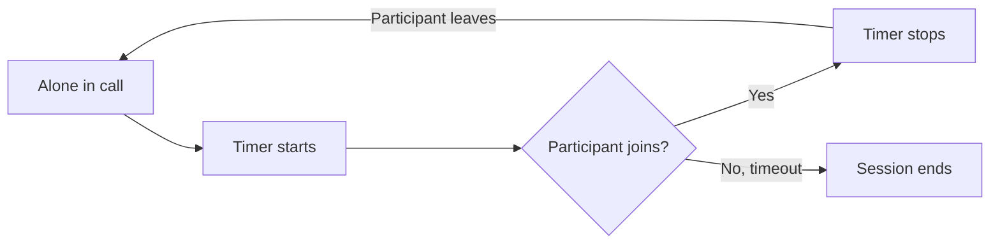

Configure automatic session termination when a user is alone in a call. Idle timeout helps manage resources by ending sessions that have no active participants.

## How Idle Timeout Works

When a user is the only participant in a call session, the idle timeout countdown begins. If no other participant joins before the timeout expires, the session automatically ends and the `onSessionTimedOut` callback is triggered.

The timer also restarts when other participants leave and only one user remains in the call.



This is useful for:
- Preventing abandoned call sessions from running indefinitely
- Managing server resources efficiently
- Providing a better user experience when the other party doesn't join

## Configure Idle Timeout

Set the idle timeout period using `setIdleTimeoutPeriod()` in `SessionSettingsBuilder`. The value is in seconds.

<Tabs>
<Tab title="Kotlin">
```kotlin
val sessionSettings = CometChatCalls.SessionSettingsBuilder()
    .setIdleTimeoutPeriod(120) // 2 minutes
    .setType(SessionType.VIDEO)
    .build()

CometChatCalls.joinSession(sessionId, sessionSettings, callViewContainer,
    object : CometChatCalls.CallbackListener<CallSession>() {
        override fun onSuccess(callSession: CallSession) {
            Log.d(TAG, "Joined session")
        }

        override fun onError(e: CometChatException) {
            Log.e(TAG, "Failed: ${e.message}")
        }
    }
)
```
</Tab>
<Tab title="Java">
```java
SessionSettings sessionSettings = new CometChatCalls.SessionSettingsBuilder()
    .setIdleTimeoutPeriod(120) // 2 minutes
    .setType(SessionType.VIDEO)
    .build();

CometChatCalls.joinSession(sessionId, sessionSettings, callViewContainer,
    new CometChatCalls.CallbackListener<CallSession>() {
        @Override
        public void onSuccess(CallSession callSession) {
            Log.d(TAG, "Joined session");
        }

        @Override
        public void onError(CometChatException e) {
            Log.e(TAG, "Failed: " + e.getMessage());
        }
    }
);
```
</Tab>
</Tabs>

| Parameter | Type | Default | Description |
|-----------|------|---------|-------------|
| `idleTimeoutPeriod` | int | 300 | Timeout in seconds when alone in the session |

## Handle Session Timeout

Listen for the `onSessionTimedOut` callback using `SessionStatusListener` to handle when the session ends due to idle timeout:

<Tabs>
<Tab title="Kotlin">
```kotlin
val callSession = CallSession.getInstance()

callSession.addSessionStatusListener(this, object : SessionStatusListener() {
    override fun onSessionTimedOut() {
        Log.d(TAG, "Session ended due to idle timeout")
        // Show message to user
        showToast("Call ended - no other participants joined")
        // Navigate away from call screen
        finish()
    }

    override fun onSessionJoined() {}
    override fun onSessionLeft() {}
    override fun onConnectionLost() {}
    override fun onConnectionRestored() {}
    override fun onConnectionClosed() {}
})
```
</Tab>
<Tab title="Java">
```java
CallSession callSession = CallSession.getInstance();

callSession.addSessionStatusListener(this, new SessionStatusListener() {
    @Override
    public void onSessionTimedOut() {
        Log.d(TAG, "Session ended due to idle timeout");
        // Show message to user
        showToast("Call ended - no other participants joined");
        // Navigate away from call screen
        finish();
    }

    @Override public void onSessionJoined() {}
    @Override public void onSessionLeft() {}
    @Override public void onConnectionLost() {}
    @Override public void onConnectionRestored() {}
    @Override public void onConnectionClosed() {}
});
```
</Tab>
</Tabs>

## Disable Idle Timeout

To disable idle timeout and allow sessions to run indefinitely, set a value of `0`:

<Tabs>
<Tab title="Kotlin">
```kotlin
val sessionSettings = CometChatCalls.SessionSettingsBuilder()
    .setIdleTimeoutPeriod(0) // Disable idle timeout
    .build()
```
</Tab>
<Tab title="Java">
```java
SessionSettings sessionSettings = new CometChatCalls.SessionSettingsBuilder()
    .setIdleTimeoutPeriod(0) // Disable idle timeout
    .build();
```
</Tab>
</Tabs>

<Warning>
Disabling idle timeout may result in sessions running indefinitely if participants don't join or leave properly. Use with caution.
</Warning>
