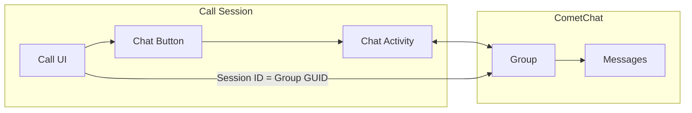

Add real-time messaging to your call experience using CometChat UI Kit. This allows participants to send text messages, share files, and communicate via chat while on a call.

## Overview

In-call chat creates a group conversation linked to the call session. When participants tap the chat button, they can:
- Send and receive text messages
- Share images, files, and media
- See message history from the current call
- Get unread message notifications via badge count



## Prerequisites

- CometChat Calls SDK integrated ([Setup](/calls/android/setup))
- CometChat Chat SDK integrated ([Chat SDK](/sdk/android/overview))
- CometChat UI Kit integrated ([UI Kit](/ui-kit/android/overview))

<Note>
The Chat SDK and UI Kit are separate from the Calls SDK. You'll need to add both dependencies to your project.
</Note>

---

## Step 1: Add UI Kit Dependency

Add the CometChat UI Kit to your `build.gradle`:

```groovy
dependencies {
    implementation 'com.cometchat:chat-uikit-android:4.+'
}
```

---

## Step 2: Enable Chat Button

Configure session settings to show the chat button:

<Tabs>
<Tab title="Kotlin">
```kotlin
val sessionSettings = CometChatCalls.SessionSettingsBuilder()
    .hideChatButton(false)  // Show the chat button
    .build()
```
</Tab>
<Tab title="Java">
```java
SessionSettings sessionSettings = new CometChatCalls.SessionSettingsBuilder()
    .hideChatButton(false)  // Show the chat button
    .build();
```
</Tab>
</Tabs>

---

## Step 3: Create Chat Group

Create or join a CometChat group using the session ID as the group GUID. This links the chat to the specific call session.

<Tabs>
<Tab title="Kotlin">
```kotlin
private fun setupChatGroup(sessionId: String, meetingName: String) {
    // Try to get existing group first
    CometChat.getGroup(sessionId, object : CometChat.CallbackListener<Group>() {
        override fun onSuccess(group: Group) {
            if (!group.isJoined) {
                // Join the existing group
                joinGroup(sessionId, group.groupType)
            } else {
                Log.d(TAG, "Already joined group: ${group.name}")
            }
        }

        override fun onError(e: CometChatException) {
            if (e.code == "ERR_GUID_NOT_FOUND") {
                // Group doesn't exist, create it
                createGroup(sessionId, meetingName)
            } else {
                Log.e(TAG, "Error getting group: ${e.message}")
            }
        }
    })
}

private fun createGroup(guid: String, name: String) {
    val group = Group(guid, name, CometChatConstants.GROUP_TYPE_PUBLIC, null)
    
    CometChat.createGroup(group, object : CometChat.CallbackListener<Group>() {
        override fun onSuccess(createdGroup: Group) {
            Log.d(TAG, "Group created: ${createdGroup.name}")
        }

        override fun onError(e: CometChatException) {
            Log.e(TAG, "Group creation failed: ${e.message}")
        }
    })
}

private fun joinGroup(guid: String, groupType: String) {
    CometChat.joinGroup(guid, groupType, null, object : CometChat.CallbackListener<Group>() {
        override fun onSuccess(joinedGroup: Group) {
            Log.d(TAG, "Joined group: ${joinedGroup.name}")
        }

        override fun onError(e: CometChatException) {
            Log.e(TAG, "Join group failed: ${e.message}")
        }
    })
}
```
</Tab>
<Tab title="Java">
```java
private void setupChatGroup(String sessionId, String meetingName) {
    // Try to get existing group first
    CometChat.getGroup(sessionId, new CometChat.CallbackListener<Group>() {
        @Override
        public void onSuccess(Group group) {
            if (!group.isJoined()) {
                // Join the existing group
                joinGroup(sessionId, group.getGroupType());
            } else {
                Log.d(TAG, "Already joined group: " + group.getName());
            }
        }

        @Override
        public void onError(CometChatException e) {
            if ("ERR_GUID_NOT_FOUND".equals(e.getCode())) {
                // Group doesn't exist, create it
                createGroup(sessionId, meetingName);
            } else {
                Log.e(TAG, "Error getting group: " + e.getMessage());
            }
        }
    });
}

private void createGroup(String guid, String name) {
    Group group = new Group(guid, name, CometChatConstants.GROUP_TYPE_PUBLIC, null);
    
    CometChat.createGroup(group, new CometChat.CallbackListener<Group>() {
        @Override
        public void onSuccess(Group createdGroup) {
            Log.d(TAG, "Group created: " + createdGroup.getName());
        }

        @Override
        public void onError(CometChatException e) {
            Log.e(TAG, "Group creation failed: " + e.getMessage());
        }
    });
}

private void joinGroup(String guid, String groupType) {
    CometChat.joinGroup(guid, groupType, null, new CometChat.CallbackListener<Group>() {
        @Override
        public void onSuccess(Group joinedGroup) {
            Log.d(TAG, "Joined group: " + joinedGroup.getName());
        }

        @Override
        public void onError(CometChatException e) {
            Log.e(TAG, "Join group failed: " + e.getMessage());
        }
    });
}
```
</Tab>
</Tabs>

---

## Step 4: Handle Chat Button Click

Listen for the chat button click and open your chat activity:

<Tabs>
<Tab title="Kotlin">
```kotlin
private var unreadMessageCount = 0

private fun setupChatButtonListener() {
    val callSession = CallSession.getInstance()
    
    callSession.addButtonClickListener(this, object : ButtonClickListener() {
        override fun onChatButtonClicked() {
            // Reset unread count when opening chat
            unreadMessageCount = 0
            callSession.setChatButtonUnreadCount(0)
            
            // Open chat activity
            val intent = Intent(this@CallActivity, ChatActivity::class.java).apply {
                putExtra("SESSION_ID", sessionId)
                putExtra("MEETING_NAME", meetingName)
            }
            startActivity(intent)
        }
    })
}
```
</Tab>
<Tab title="Java">
```java
private int unreadMessageCount = 0;

private void setupChatButtonListener() {
    CallSession callSession = CallSession.getInstance();
    
    callSession.addButtonClickListener(this, new ButtonClickListener() {
        @Override
        public void onChatButtonClicked() {
            // Reset unread count when opening chat
            unreadMessageCount = 0;
            callSession.setChatButtonUnreadCount(0);
            
            // Open chat activity
            Intent intent = new Intent(CallActivity.this, ChatActivity.class);
            intent.putExtra("SESSION_ID", sessionId);
            intent.putExtra("MEETING_NAME", meetingName);
            startActivity(intent);
        }
    });
}
```
</Tab>
</Tabs>

---

## Step 5: Track Unread Messages

Listen for incoming messages and update the badge count on the chat button:

<Tabs>
<Tab title="Kotlin">
```kotlin
private fun setupMessageListener() {
    CometChat.addMessageListener(TAG, object : CometChat.MessageListener() {
        override fun onTextMessageReceived(textMessage: TextMessage) {
            // Check if message is for our call's group
            val receiver = textMessage.receiver
            if (receiver is Group && receiver.guid == sessionId) {
                unreadMessageCount++
                CallSession.getInstance().setChatButtonUnreadCount(unreadMessageCount)
            }
        }

        override fun onMediaMessageReceived(mediaMessage: MediaMessage) {
            val receiver = mediaMessage.receiver
            if (receiver is Group && receiver.guid == sessionId) {
                unreadMessageCount++
                CallSession.getInstance().setChatButtonUnreadCount(unreadMessageCount)
            }
        }
    })
}

override fun onDestroy() {
    super.onDestroy()
    CometChat.removeMessageListener(TAG)
}
```
</Tab>
<Tab title="Java">
```java
private void setupMessageListener() {
    CometChat.addMessageListener(TAG, new CometChat.MessageListener() {
        @Override
        public void onTextMessageReceived(TextMessage textMessage) {
            // Check if message is for our call's group
            BaseMessage receiver = textMessage.getReceiver();
            if (receiver instanceof Group && ((Group) receiver).getGuid().equals(sessionId)) {
                unreadMessageCount++;
                CallSession.getInstance().setChatButtonUnreadCount(unreadMessageCount);
            }
        }

        @Override
        public void onMediaMessageReceived(MediaMessage mediaMessage) {
            BaseMessage receiver = mediaMessage.getReceiver();
            if (receiver instanceof Group && ((Group) receiver).getGuid().equals(sessionId)) {
                unreadMessageCount++;
                CallSession.getInstance().setChatButtonUnreadCount(unreadMessageCount);
            }
        }
    });
}

@Override
protected void onDestroy() {
    super.onDestroy();
    CometChat.removeMessageListener(TAG);
}
```
</Tab>
</Tabs>

---

## Step 6: Create Chat Activity

Create a chat activity using UI Kit components:

<Accordion title="activity_chat.xml">
```xml
<?xml version="1.0" encoding="utf-8"?>
<androidx.constraintlayout.widget.ConstraintLayout
    xmlns:android="http://schemas.android.com/apk/res/android"
    xmlns:app="http://schemas.android.com/apk/res-auto"
    android:id="@+id/main"
    android:layout_width="match_parent"
    android:layout_height="match_parent">

    <com.cometchat.chatuikit.messageheader.CometChatMessageHeader
        android:id="@+id/message_header"
        android:layout_width="match_parent"
        android:layout_height="wrap_content"
        app:layout_constraintTop_toTopOf="parent" />

    <com.cometchat.chatuikit.messagelist.CometChatMessageList
        android:id="@+id/message_list"
        android:layout_width="0dp"
        android:layout_height="0dp"
        app:layout_constraintTop_toBottomOf="@id/message_header"
        app:layout_constraintBottom_toTopOf="@id/message_composer"
        app:layout_constraintStart_toStartOf="parent"
        app:layout_constraintEnd_toEndOf="parent" />

    <com.cometchat.chatuikit.messagecomposer.CometChatMessageComposer
        android:id="@+id/message_composer"
        android:layout_width="match_parent"
        android:layout_height="wrap_content"
        app:layout_constraintBottom_toBottomOf="parent" />

    <ProgressBar
        android:id="@+id/progress_bar"
        android:layout_width="wrap_content"
        android:layout_height="wrap_content"
        android:visibility="gone"
        app:layout_constraintTop_toTopOf="parent"
        app:layout_constraintBottom_toBottomOf="parent"
        app:layout_constraintStart_toStartOf="parent"
        app:layout_constraintEnd_toEndOf="parent" />

</androidx.constraintlayout.widget.ConstraintLayout>
```
</Accordion>

<Tabs>
<Tab title="Kotlin">
```kotlin
class ChatActivity : AppCompatActivity() {

    private lateinit var messageList: CometChatMessageList
    private lateinit var messageComposer: CometChatMessageComposer
    private lateinit var messageHeader: CometChatMessageHeader
    private lateinit var progressBar: ProgressBar

    override fun onCreate(savedInstanceState: Bundle?) {
        super.onCreate(savedInstanceState)
        setContentView(R.layout.activity_chat)

        messageList = findViewById(R.id.message_list)
        messageComposer = findViewById(R.id.message_composer)
        messageHeader = findViewById(R.id.message_header)
        progressBar = findViewById(R.id.progress_bar)

        val sessionId = intent.getStringExtra("SESSION_ID") ?: return
        val meetingName = intent.getStringExtra("MEETING_NAME") ?: "Chat"

        loadGroup(sessionId, meetingName)
    }

    private fun loadGroup(guid: String, meetingName: String) {
        progressBar.visibility = View.VISIBLE

        CometChat.getGroup(guid, object : CometChat.CallbackListener<Group>() {
            override fun onSuccess(group: Group) {
                if (!group.isJoined) {
                    joinAndSetGroup(guid, group.groupType)
                } else {
                    setGroup(group)
                }
            }

            override fun onError(e: CometChatException) {
                if (e.code == "ERR_GUID_NOT_FOUND") {
                    createAndSetGroup(guid, meetingName)
                } else {
                    progressBar.visibility = View.GONE
                    Log.e(TAG, "Error: ${e.message}")
                }
            }
        })
    }

    private fun createAndSetGroup(guid: String, name: String) {
        val group = Group(guid, name, CometChatConstants.GROUP_TYPE_PUBLIC, null)
        CometChat.createGroup(group, object : CometChat.CallbackListener<Group>() {
            override fun onSuccess(createdGroup: Group) {
                setGroup(createdGroup)
            }

            override fun onError(e: CometChatException) {
                progressBar.visibility = View.GONE
            }
        })
    }

    private fun joinAndSetGroup(guid: String, groupType: String) {
        CometChat.joinGroup(guid, groupType, null, object : CometChat.CallbackListener<Group>() {
            override fun onSuccess(joinedGroup: Group) {
                setGroup(joinedGroup)
            }

            override fun onError(e: CometChatException) {
                progressBar.visibility = View.GONE
            }
        })
    }

    private fun setGroup(group: Group) {
        progressBar.visibility = View.GONE
        
        messageList.setGroup(group)
        messageComposer.setGroup(group)
        messageHeader.setGroup(group)

        // Hide auxiliary buttons (call, video) since we're already in a call
        messageHeader.setAuxiliaryButtonView { _, _, _ ->
            View(this).apply { visibility = View.GONE }
        }
    }

    companion object {
        private const val TAG = "ChatActivity"
    }
}
```
</Tab>
<Tab title="Java">
```java
public class ChatActivity extends AppCompatActivity {

    private static final String TAG = "ChatActivity";
    
    private CometChatMessageList messageList;
    private CometChatMessageComposer messageComposer;
    private CometChatMessageHeader messageHeader;
    private ProgressBar progressBar;

    @Override
    protected void onCreate(Bundle savedInstanceState) {
        super.onCreate(savedInstanceState);
        setContentView(R.layout.activity_chat);

        messageList = findViewById(R.id.message_list);
        messageComposer = findViewById(R.id.message_composer);
        messageHeader = findViewById(R.id.message_header);
        progressBar = findViewById(R.id.progress_bar);

        String sessionId = getIntent().getStringExtra("SESSION_ID");
        String meetingName = getIntent().getStringExtra("MEETING_NAME");
        
        if (sessionId == null) return;
        if (meetingName == null) meetingName = "Chat";

        loadGroup(sessionId, meetingName);
    }

    private void loadGroup(String guid, String meetingName) {
        progressBar.setVisibility(View.VISIBLE);

        CometChat.getGroup(guid, new CometChat.CallbackListener<Group>() {
            @Override
            public void onSuccess(Group group) {
                if (!group.isJoined()) {
                    joinAndSetGroup(guid, group.getGroupType());
                } else {
                    setGroup(group);
                }
            }

            @Override
            public void onError(CometChatException e) {
                if ("ERR_GUID_NOT_FOUND".equals(e.getCode())) {
                    createAndSetGroup(guid, meetingName);
                } else {
                    progressBar.setVisibility(View.GONE);
                    Log.e(TAG, "Error: " + e.getMessage());
                }
            }
        });
    }

    private void createAndSetGroup(String guid, String name) {
        Group group = new Group(guid, name, CometChatConstants.GROUP_TYPE_PUBLIC, null);
        CometChat.createGroup(group, new CometChat.CallbackListener<Group>() {
            @Override
            public void onSuccess(Group createdGroup) {
                setGroup(createdGroup);
            }

            @Override
            public void onError(CometChatException e) {
                progressBar.setVisibility(View.GONE);
            }
        });
    }

    private void joinAndSetGroup(String guid, String groupType) {
        CometChat.joinGroup(guid, groupType, null, new CometChat.CallbackListener<Group>() {
            @Override
            public void onSuccess(Group joinedGroup) {
                setGroup(joinedGroup);
            }

            @Override
            public void onError(CometChatException e) {
                progressBar.setVisibility(View.GONE);
            }
        });
    }

    private void setGroup(Group group) {
        progressBar.setVisibility(View.GONE);
        
        messageList.setGroup(group);
        messageComposer.setGroup(group);
        messageHeader.setGroup(group);

        // Hide auxiliary buttons since we're already in a call
        messageHeader.setAuxiliaryButtonView((context, user, group1) -> {
            View view = new View(context);
            view.setVisibility(View.GONE);
            return view;
        });
    }
}
```
</Tab>
</Tabs>

---

## Complete Example

Here's the complete CallActivity with in-call chat integration:

<Tabs>
<Tab title="Kotlin">
```kotlin
class CallActivity : AppCompatActivity() {

    private lateinit var callSession: CallSession
    private var sessionId: String = ""
    private var meetingName: String = ""
    private var unreadMessageCount = 0

    override fun onCreate(savedInstanceState: Bundle?) {
        super.onCreate(savedInstanceState)
        setContentView(R.layout.activity_call)

        sessionId = intent.getStringExtra("SESSION_ID") ?: return
        meetingName = intent.getStringExtra("MEETING_NAME") ?: "Meeting"

        callSession = CallSession.getInstance()

        // Setup chat group for this call
        setupChatGroup(sessionId, meetingName)
        
        // Listen for chat button clicks
        setupChatButtonListener()
        
        // Track incoming messages for badge
        setupMessageListener()
        
        // Join the call
        joinCall()
    }

    private fun setupChatGroup(sessionId: String, meetingName: String) {
        CometChat.getGroup(sessionId, object : CometChat.CallbackListener<Group>() {
            override fun onSuccess(group: Group) {
                if (!group.isJoined) {
                    CometChat.joinGroup(sessionId, group.groupType, null, 
                        object : CometChat.CallbackListener<Group>() {
                            override fun onSuccess(g: Group) {}
                            override fun onError(e: CometChatException) {}
                        })
                }
            }

            override fun onError(e: CometChatException) {
                if (e.code == "ERR_GUID_NOT_FOUND") {
                    val group = Group(sessionId, meetingName, 
                        CometChatConstants.GROUP_TYPE_PUBLIC, null)
                    CometChat.createGroup(group, object : CometChat.CallbackListener<Group>() {
                        override fun onSuccess(g: Group) {}
                        override fun onError(e: CometChatException) {}
                    })
                }
            }
        })
    }

    private fun setupChatButtonListener() {
        callSession.addButtonClickListener(this, object : ButtonClickListener() {
            override fun onChatButtonClicked() {
                unreadMessageCount = 0
                callSession.setChatButtonUnreadCount(0)
                
                startActivity(Intent(this@CallActivity, ChatActivity::class.java).apply {
                    putExtra("SESSION_ID", sessionId)
                    putExtra("MEETING_NAME", meetingName)
                })
            }
        })
    }

    private fun setupMessageListener() {
        CometChat.addMessageListener(TAG, object : CometChat.MessageListener() {
            override fun onTextMessageReceived(textMessage: TextMessage) {
                val receiver = textMessage.receiver
                if (receiver is Group && receiver.guid == sessionId) {
                    unreadMessageCount++
                    callSession.setChatButtonUnreadCount(unreadMessageCount)
                }
            }
        })
    }

    private fun joinCall() {
        val container = findViewById<FrameLayout>(R.id.callContainer)
        
        val sessionSettings = CometChatCalls.SessionSettingsBuilder()
            .setTitle(meetingName)
            .hideChatButton(false)
            .build()

        CometChatCalls.joinSession(
            sessionId = sessionId,
            sessionSettings = sessionSettings,
            view = container,
            context = this,
            listener = object : CometChatCalls.CallbackListener<CallSession>() {
                override fun onSuccess(session: CallSession) {
                    Log.d(TAG, "Joined call")
                }

                override fun onError(e: CometChatException) {
                    Log.e(TAG, "Join failed: ${e.message}")
                }
            }
        )
    }

    override fun onDestroy() {
        super.onDestroy()
        CometChat.removeMessageListener(TAG)
    }

    companion object {
        private const val TAG = "CallActivity"
    }
}
```
</Tab>
<Tab title="Java">
```java
public class CallActivity extends AppCompatActivity {

    private static final String TAG = "CallActivity";
    
    private CallSession callSession;
    private String sessionId;
    private String meetingName;
    private int unreadMessageCount = 0;

    @Override
    protected void onCreate(Bundle savedInstanceState) {
        super.onCreate(savedInstanceState);
        setContentView(R.layout.activity_call);

        sessionId = getIntent().getStringExtra("SESSION_ID");
        meetingName = getIntent().getStringExtra("MEETING_NAME");
        
        if (sessionId == null) return;
        if (meetingName == null) meetingName = "Meeting";

        callSession = CallSession.getInstance();

        // Setup chat group for this call
        setupChatGroup(sessionId, meetingName);
        
        // Listen for chat button clicks
        setupChatButtonListener();
        
        // Track incoming messages for badge
        setupMessageListener();
        
        // Join the call
        joinCall();
    }

    private void setupChatGroup(String sessionId, String meetingName) {
        CometChat.getGroup(sessionId, new CometChat.CallbackListener<Group>() {
            @Override
            public void onSuccess(Group group) {
                if (!group.isJoined()) {
                    CometChat.joinGroup(sessionId, group.getGroupType(), null,
                        new CometChat.CallbackListener<Group>() {
                            @Override public void onSuccess(Group g) {}
                            @Override public void onError(CometChatException e) {}
                        });
                }
            }

            @Override
            public void onError(CometChatException e) {
                if ("ERR_GUID_NOT_FOUND".equals(e.getCode())) {
                    Group group = new Group(sessionId, meetingName,
                        CometChatConstants.GROUP_TYPE_PUBLIC, null);
                    CometChat.createGroup(group, new CometChat.CallbackListener<Group>() {
                        @Override public void onSuccess(Group g) {}
                        @Override public void onError(CometChatException e) {}
                    });
                }
            }
        });
    }

    private void setupChatButtonListener() {
        callSession.addButtonClickListener(this, new ButtonClickListener() {
            @Override
            public void onChatButtonClicked() {
                unreadMessageCount = 0;
                callSession.setChatButtonUnreadCount(0);
                
                Intent intent = new Intent(CallActivity.this, ChatActivity.class);
                intent.putExtra("SESSION_ID", sessionId);
                intent.putExtra("MEETING_NAME", meetingName);
                startActivity(intent);
            }
        });
    }

    private void setupMessageListener() {
        CometChat.addMessageListener(TAG, new CometChat.MessageListener() {
            @Override
            public void onTextMessageReceived(TextMessage textMessage) {
                if (textMessage.getReceiver() instanceof Group) {
                    Group group = (Group) textMessage.getReceiver();
                    if (group.getGuid().equals(sessionId)) {
                        unreadMessageCount++;
                        callSession.setChatButtonUnreadCount(unreadMessageCount);
                    }
                }
            }
        });
    }

    private void joinCall() {
        FrameLayout container = findViewById(R.id.callContainer);
        
        SessionSettings sessionSettings = new CometChatCalls.SessionSettingsBuilder()
            .setTitle(meetingName)
            .hideChatButton(false)
            .build();

        CometChatCalls.joinSession(
            sessionId,
            sessionSettings,
            container,
            this,
            new CometChatCalls.CallbackListener<CallSession>() {
                @Override
                public void onSuccess(CallSession session) {
                    Log.d(TAG, "Joined call");
                }

                @Override
                public void onError(CometChatException e) {
                    Log.e(TAG, "Join failed: " + e.getMessage());
                }
            }
        );
    }

    @Override
    protected void onDestroy() {
        super.onDestroy();
        CometChat.removeMessageListener(TAG);
    }
}
```
</Tab>
</Tabs>

---

## Related Documentation

- [UI Kit Overview](/ui-kit/android/overview) - CometChat UI Kit components
- [Button Click Listener](/calls/android/button-click-listener) - Handle button clicks
- [SessionSettingsBuilder](/calls/android/session-settings) - Configure chat button visibility
