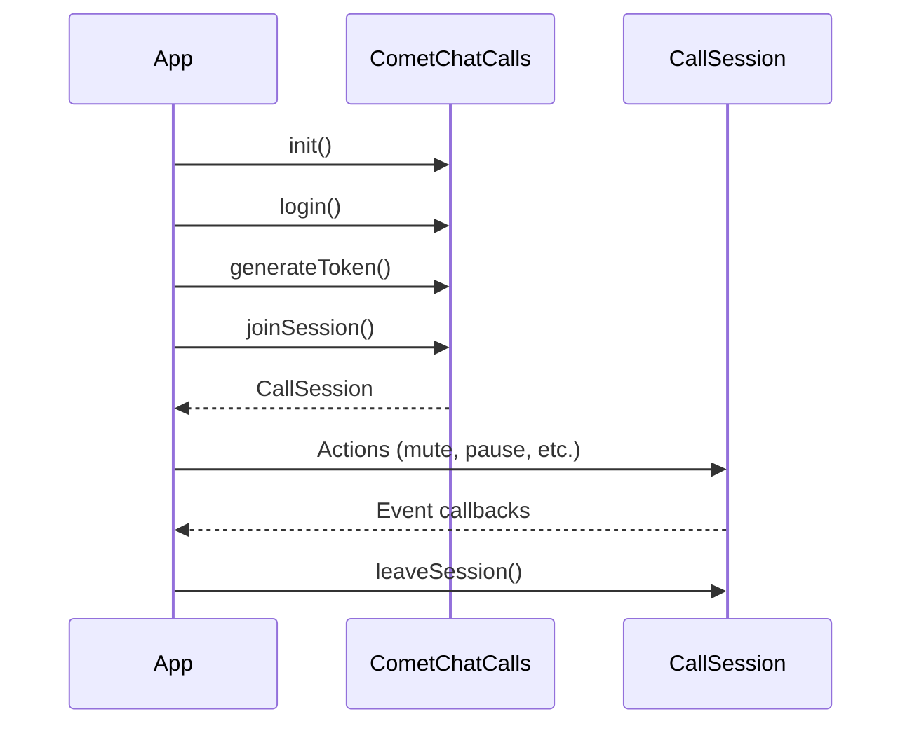

The CometChat Calls SDK enables real-time voice and video calling capabilities in your Android application. Built on top of WebRTC, it provides a complete calling solution with built-in UI components and extensive customization options.

<Info>
**Faster Integration with UI Kits**

If you're using CometChat UI Kits, voice and video calling can be quickly integrated:
- Incoming & outgoing call screens
- Call buttons with one-tap calling
- Call logs with history

👉 [Android UI Kit Calling Integration](/ui-kit/android/calling-integration)

Use this Calls SDK directly if you need advanced control over the calling experience, want extensive UI customization beyond what UI Kits offer, or are integrating calling into an app without using any CometChat chat features.
</Info>

## Prerequisites

Before integrating the Calls SDK, ensure you have:

1. **CometChat Account**: [Sign up](https://app.cometchat.com/signup) and create an app to get your App ID, Region, and Auth Key
2. **CometChat Users**: Users must exist in CometChat to use calling features. For testing, create users via the [Dashboard](https://app.cometchat.com) or [REST API](/rest-api/chat-apis/users/create-user). Authentication is handled by the Calls SDK - see [Authentication](/calls/android/authentication)
3. **Android Requirements**:
   - Minimum SDK: API Level 24 (Android 7.0)
   - AndroidX compatibility

## Call Flow

## Features

<CardGroup cols={2}>

<Card title="Ringing" icon="phone" href="/calls/android/ringing">
  Incoming and outgoing call notifications with accept/reject functionality
</Card>

<Card title="Call Layouts" icon="grid-2" href="/calls/android/call-layouts">
  Tile and Spotlight view modes for different call scenarios
</Card>

<Card title="Audio Modes" icon="volume-high" href="/calls/android/audio-modes">
  Switch between speaker, earpiece, Bluetooth, and headphones
</Card>

<Card title="Recording" icon="circle-dot" href="/calls/android/recording">
  Record call sessions for later playback
</Card>

<Card title="Call Logs" icon="clock-rotate-left" href="/calls/android/call-logs">
  Retrieve call history and details
</Card>

<Card title="Picture-in-Picture" icon="window-restore" href="/calls/android/picture-in-picture">
  Continue calls while using other apps
</Card>

<Card title="Raise Hand" icon="hand" href="/calls/android/raise-hand">
  Signal to get attention during calls
</Card>

<Card title="Idle Timeout" icon="timer" href="/calls/android/idle-timeout">
  Automatic session termination when alone in a call
</Card>

</CardGroup>

## Architecture

The SDK is organized around these core components:

| Component | Description |
|-----------|-------------|
| `CometChatCalls` | Main entry point for SDK initialization, authentication, and session management |
| `CallAppSettings` | Configuration for SDK initialization (App ID, Region) |
| `SessionSettings` | Configuration for individual call sessions |
| `CallSession` | Singleton that manages the active call and provides control methods |
| `Listeners` | Event interfaces for session, participant, media, and UI events |
