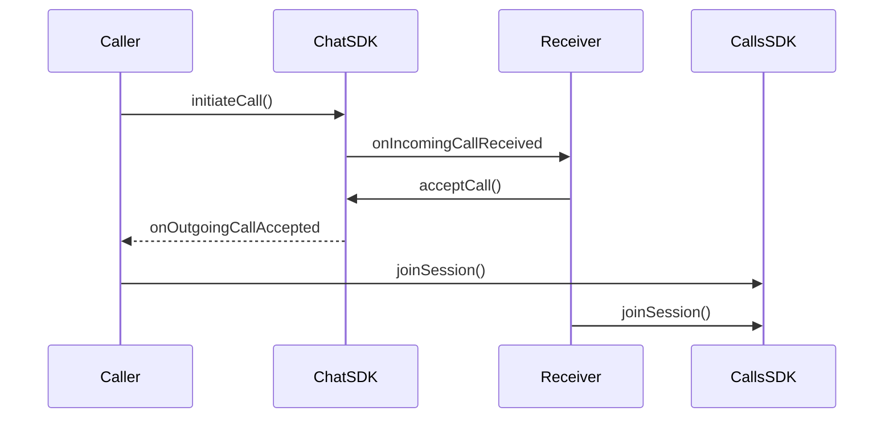
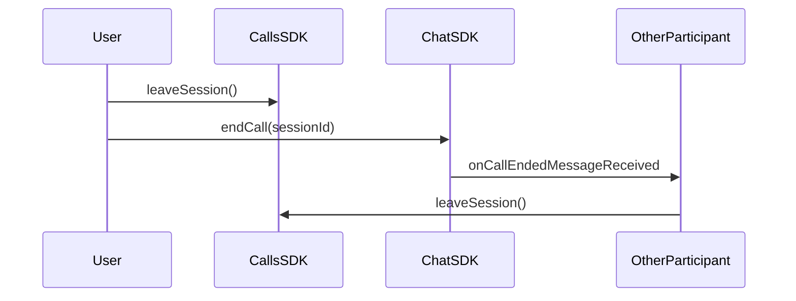

Implement incoming and outgoing call notifications with accept/reject functionality. Ringing enables real-time call signaling between users, allowing them to initiate calls and respond to incoming call requests.

<Note>
Ringing functionality requires the CometChat Chat SDK to be integrated alongside the Calls SDK. The Chat SDK handles call signaling (initiating, accepting, rejecting calls), while the Calls SDK manages the actual call session.
</Note>

## How Ringing Works

The ringing flow involves two SDKs working together:

1. **Chat SDK** - Handles call signaling (initiate, accept, reject, cancel)
2. **Calls SDK** - Manages the actual call session once accepted



## Initiate a Call

Use the Chat SDK to initiate a call to a user or group:

<Tabs>
<Tab title="Kotlin">
```kotlin
val receiverID = "USER_ID"
val receiverType = CometChatConstants.RECEIVER_TYPE_USER
val callType = CometChatConstants.CALL_TYPE_VIDEO

val call = Call(receiverID, receiverType, callType)

CometChat.initiateCall(call, object : CometChat.CallbackListener<Call>() {
    override fun onSuccess(call: Call) {
        Log.d(TAG, "Call initiated: ${call.sessionId}")
        // Show outgoing call UI
    }

    override fun onError(e: CometChatException) {
        Log.e(TAG, "Call initiation failed: ${e.message}")
    }
})
```
</Tab>
<Tab title="Java">
```java
String receiverID = "USER_ID";
String receiverType = CometChatConstants.RECEIVER_TYPE_USER;
String callType = CometChatConstants.CALL_TYPE_VIDEO;

Call call = new Call(receiverID, receiverType, callType);

CometChat.initiateCall(call, new CometChat.CallbackListener<Call>() {
    @Override
    public void onSuccess(Call call) {
        Log.d(TAG, "Call initiated: " + call.getSessionId());
        // Show outgoing call UI
    }

    @Override
    public void onError(CometChatException e) {
        Log.e(TAG, "Call initiation failed: " + e.getMessage());
    }
});
```
</Tab>
</Tabs>

| Parameter | Type | Description |
|-----------|------|-------------|
| `receiverID` | String | UID of the user or GUID of the group to call |
| `receiverType` | String | `CometChatConstants.RECEIVER_TYPE_USER` or `RECEIVER_TYPE_GROUP` |
| `callType` | String | `CometChatConstants.CALL_TYPE_VIDEO` or `CALL_TYPE_AUDIO` |

## Listen for Incoming Calls

Register a call listener to receive incoming call notifications:

<Tabs>
<Tab title="Kotlin">
```kotlin
val listenerID = "UNIQUE_LISTENER_ID"

CometChat.addCallListener(listenerID, object : CometChat.CallListener() {
    override fun onIncomingCallReceived(call: Call) {
        Log.d(TAG, "Incoming call from: ${call.callInitiator.name}")
        // Show incoming call UI with accept/reject options
    }

    override fun onOutgoingCallAccepted(call: Call) {
        Log.d(TAG, "Call accepted, joining session...")
        joinCallSession(call.sessionId)
    }

    override fun onOutgoingCallRejected(call: Call) {
        Log.d(TAG, "Call rejected")
        // Dismiss outgoing call UI
    }

    override fun onIncomingCallCancelled(call: Call) {
        Log.d(TAG, "Incoming call cancelled")
        // Dismiss incoming call UI
    }

    override fun onCallEndedMessageReceived(call: Call) {
        Log.d(TAG, "Call ended")
    }
})
```
</Tab>
<Tab title="Java">
```java
String listenerID = "UNIQUE_LISTENER_ID";

CometChat.addCallListener(listenerID, new CometChat.CallListener() {
    @Override
    public void onIncomingCallReceived(Call call) {
        Log.d(TAG, "Incoming call from: " + call.getCallInitiator().getName());
        // Show incoming call UI with accept/reject options
    }

    @Override
    public void onOutgoingCallAccepted(Call call) {
        Log.d(TAG, "Call accepted, joining session...");
        joinCallSession(call.getSessionId());
    }

    @Override
    public void onOutgoingCallRejected(Call call) {
        Log.d(TAG, "Call rejected");
        // Dismiss outgoing call UI
    }

    @Override
    public void onIncomingCallCancelled(Call call) {
        Log.d(TAG, "Incoming call cancelled");
        // Dismiss incoming call UI
    }

    @Override
    public void onCallEndedMessageReceived(Call call) {
        Log.d(TAG, "Call ended");
    }
});
```
</Tab>
</Tabs>

| Callback | Description |
|----------|-------------|
| `onIncomingCallReceived` | A new incoming call is received |
| `onOutgoingCallAccepted` | The receiver accepted your outgoing call |
| `onOutgoingCallRejected` | The receiver rejected your outgoing call |
| `onIncomingCallCancelled` | The caller cancelled the incoming call |
| `onCallEndedMessageReceived` | The call has ended |

<Warning>
Remember to remove the call listener when it's no longer needed to prevent memory leaks:
```kotlin
CometChat.removeCallListener(listenerID)
```
</Warning>

## Accept a Call

When an incoming call is received, accept it using the Chat SDK:

<Tabs>
<Tab title="Kotlin">
```kotlin
fun acceptIncomingCall(sessionId: String) {
    CometChat.acceptCall(sessionId, object : CometChat.CallbackListener<Call>() {
        override fun onSuccess(call: Call) {
            Log.d(TAG, "Call accepted")
            joinCallSession(call.sessionId)
        }

        override fun onError(e: CometChatException) {
            Log.e(TAG, "Accept call failed: ${e.message}")
        }
    })
}
```
</Tab>
<Tab title="Java">
```java
void acceptIncomingCall(String sessionId) {
    CometChat.acceptCall(sessionId, new CometChat.CallbackListener<Call>() {
        @Override
        public void onSuccess(Call call) {
            Log.d(TAG, "Call accepted");
            joinCallSession(call.getSessionId());
        }

        @Override
        public void onError(CometChatException e) {
            Log.e(TAG, "Accept call failed: " + e.getMessage());
        }
    });
}
```
</Tab>
</Tabs>

## Reject a Call

Reject an incoming call:

<Tabs>
<Tab title="Kotlin">
```kotlin
fun rejectIncomingCall(sessionId: String) {
    val status = CometChatConstants.CALL_STATUS_REJECTED

    CometChat.rejectCall(sessionId, status, object : CometChat.CallbackListener<Call>() {
        override fun onSuccess(call: Call) {
            Log.d(TAG, "Call rejected")
            // Dismiss incoming call UI
        }

        override fun onError(e: CometChatException) {
            Log.e(TAG, "Reject call failed: ${e.message}")
        }
    })
}
```
</Tab>
<Tab title="Java">
```java
void rejectIncomingCall(String sessionId) {
    String status = CometChatConstants.CALL_STATUS_REJECTED;

    CometChat.rejectCall(sessionId, status, new CometChat.CallbackListener<Call>() {
        @Override
        public void onSuccess(Call call) {
            Log.d(TAG, "Call rejected");
            // Dismiss incoming call UI
        }

        @Override
        public void onError(CometChatException e) {
            Log.e(TAG, "Reject call failed: " + e.getMessage());
        }
    });
}
```
</Tab>
</Tabs>

## Cancel a Call

Cancel an outgoing call before it's answered:

<Tabs>
<Tab title="Kotlin">
```kotlin
fun cancelOutgoingCall(sessionId: String) {
    val status = CometChatConstants.CALL_STATUS_CANCELLED

    CometChat.rejectCall(sessionId, status, object : CometChat.CallbackListener<Call>() {
        override fun onSuccess(call: Call) {
            Log.d(TAG, "Call cancelled")
            // Dismiss outgoing call UI
        }

        override fun onError(e: CometChatException) {
            Log.e(TAG, "Cancel call failed: ${e.message}")
        }
    })
}
```
</Tab>
<Tab title="Java">
```java
void cancelOutgoingCall(String sessionId) {
    String status = CometChatConstants.CALL_STATUS_CANCELLED;

    CometChat.rejectCall(sessionId, status, new CometChat.CallbackListener<Call>() {
        @Override
        public void onSuccess(Call call) {
            Log.d(TAG, "Call cancelled");
            // Dismiss outgoing call UI
        }

        @Override
        public void onError(CometChatException e) {
            Log.e(TAG, "Cancel call failed: " + e.getMessage());
        }
    });
}
```
</Tab>
</Tabs>

## Join the Call Session

After accepting a call (or when your outgoing call is accepted), join the call session using the Calls SDK:

<Tabs>
<Tab title="Kotlin">
```kotlin
fun joinCallSession(sessionId: String) {
    val callViewContainer = findViewById<RelativeLayout>(R.id.call_view_container)

    val sessionSettings = CometChatCalls.SessionSettingsBuilder()
        .setType(SessionType.VIDEO)
        .build()

    CometChatCalls.joinSession(sessionId, sessionSettings, callViewContainer,
        object : CometChatCalls.CallbackListener<CallSession>() {
            override fun onSuccess(callSession: CallSession) {
                Log.d(TAG, "Joined call session")
            }

            override fun onError(e: CometChatException) {
                Log.e(TAG, "Failed to join: ${e.message}")
            }
        }
    )
}
```
</Tab>
<Tab title="Java">
```java
void joinCallSession(String sessionId) {
    RelativeLayout callViewContainer = findViewById(R.id.call_view_container);

    SessionSettings sessionSettings = new CometChatCalls.SessionSettingsBuilder()
        .setType(SessionType.VIDEO)
        .build();

    CometChatCalls.joinSession(sessionId, sessionSettings, callViewContainer,
        new CometChatCalls.CallbackListener<CallSession>() {
            @Override
            public void onSuccess(CallSession callSession) {
                Log.d(TAG, "Joined call session");
            }

            @Override
            public void onError(CometChatException e) {
                Log.e(TAG, "Failed to join: " + e.getMessage());
            }
        }
    );
}
```
</Tab>
</Tabs>

<Note>
For more details on session customization and controlling the call, see [Actions](/calls/android/actions) and [Listeners](/calls/android/listeners).
</Note>

## End a Call

Properly ending a call requires coordination between both SDKs to ensure all participants are notified and call logs are recorded correctly.

<Warning>
Always call `CometChat.endCall()` when ending a call. This notifies the other participant and ensures the call is properly logged. Without this, the other user won't know the call has ended and call logs may be incomplete.
</Warning>



When using the default call UI, listen for the end call button click using `ButtonClickListener` and call `endCall()`:

<Tabs>
<Tab title="Kotlin">
```kotlin
val callSession = CallSession.getInstance()

// Listen for end call button click
callSession.addButtonClickListener(this, object : ButtonClickListener() {
    override fun onLeaveSessionButtonClicked() {
        endCall(currentSessionId)
    }
    // Other callbacks...
})

fun endCall(sessionId: String) {
    // 1. Leave the call session (Calls SDK)
    CallSession.getInstance().leaveSession()

    // 2. Notify other participants (Chat SDK)
    CometChat.endCall(sessionId, object : CometChat.CallbackListener<Call>() {
        override fun onSuccess(call: Call) {
            Log.d(TAG, "Call ended successfully")
            finish()
        }

        override fun onError(e: CometChatException) {
            Log.e(TAG, "End call failed: ${e.message}")
            finish()
        }
    })
}
```
</Tab>
<Tab title="Java">
```java
CallSession callSession = CallSession.getInstance();

// Listen for end call button click
callSession.addButtonClickListener(this, new ButtonClickListener() {
    @Override
    public void onLeaveSessionButtonClicked() {
        endCall(currentSessionId);
    }
    // Other callbacks...
});

void endCall(String sessionId) {
    // 1. Leave the call session (Calls SDK)
    CallSession.getInstance().leaveSession();

    // 2. Notify other participants (Chat SDK)
    CometChat.endCall(sessionId, new CometChat.CallbackListener<Call>() {
        @Override
        public void onSuccess(Call call) {
            Log.d(TAG, "Call ended successfully");
            finish();
        }

        @Override
        public void onError(CometChatException e) {
            Log.e(TAG, "End call failed: " + e.getMessage());
            finish();
        }
    });
}
```
</Tab>
</Tabs>

The other participant receives `onCallEndedMessageReceived` callback and should leave the session:

<Tabs>
<Tab title="Kotlin">
```kotlin
CometChat.addCallListener(listenerID, object : CometChat.CallListener() {
    override fun onCallEndedMessageReceived(call: Call) {
        CallSession.getInstance().leaveSession()
        finish()
    }
    // Other callbacks...
})
```
</Tab>
<Tab title="Java">
```java
CometChat.addCallListener(listenerID, new CometChat.CallListener() {
    @Override
    public void onCallEndedMessageReceived(Call call) {
        CallSession.getInstance().leaveSession();
        finish();
    }
    // Other callbacks...
});
```
</Tab>
</Tabs>

## Call Status Values

| Status | Description |
|--------|-------------|
| `initiated` | Call has been initiated but not yet answered |
| `ongoing` | Call is currently in progress |
| `busy` | Receiver is busy on another call |
| `rejected` | Receiver rejected the call |
| `cancelled` | Caller cancelled before receiver answered |
| `ended` | Call ended normally |
| `missed` | Receiver didn't answer in time |
| `unanswered` | Call was not answered |
