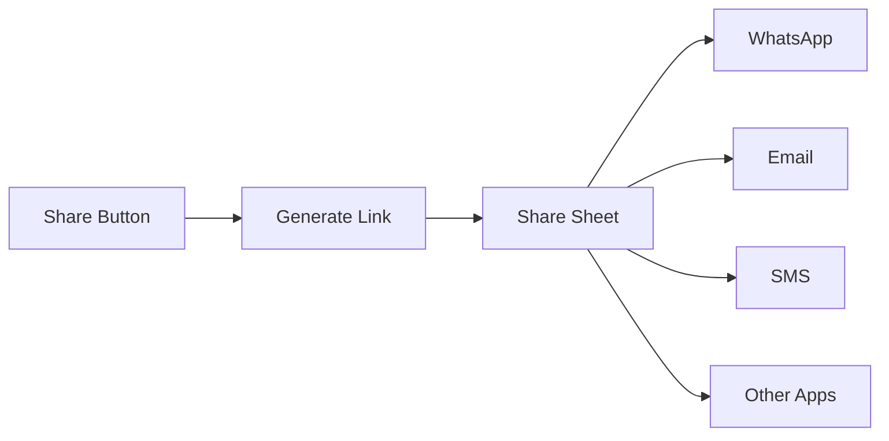

Enable participants to invite others to join a call by sharing a meeting link. The share invite button opens the system share sheet, allowing users to send the invite via any messaging app, email, or social media.

## Overview

The share invite feature:
- Generates a shareable meeting link with session ID
- Opens Android's native share sheet
- Works with any app that supports text sharing
- Can be triggered from the default button or custom UI



## Prerequisites

- CometChat Calls SDK integrated ([Setup](/calls/android/setup))
- Active call session ([Join Session](/calls/android/join-session))

---

## Step 1: Enable Share Button

Configure session settings to show the share invite button:

<Tabs>
<Tab title="Kotlin">
```kotlin
val sessionSettings = CometChatCalls.SessionSettingsBuilder()
    .hideShareInviteButton(false)  // Show the share button
    .build()
```
</Tab>
<Tab title="Java">
```java
SessionSettings sessionSettings = new CometChatCalls.SessionSettingsBuilder()
    .hideShareInviteButton(false)  // Show the share button
    .build();
```
</Tab>
</Tabs>

---

## Step 2: Handle Share Button Click

Listen for the share button click using `ButtonClickListener`:

<Tabs>
<Tab title="Kotlin">
```kotlin
private fun setupShareButtonListener() {
    val callSession = CallSession.getInstance()
    
    callSession.addButtonClickListener(this, object : ButtonClickListener() {
        override fun onShareInviteButtonClicked() {
            shareInviteLink()
        }
    })
}
```
</Tab>
<Tab title="Java">
```java
private void setupShareButtonListener() {
    CallSession callSession = CallSession.getInstance();
    
    callSession.addButtonClickListener(this, new ButtonClickListener() {
        @Override
        public void onShareInviteButtonClicked() {
            shareInviteLink();
        }
    });
}
```
</Tab>
</Tabs>

---

## Step 3: Generate and Share Link

Create the meeting invite URL and open the share sheet:

<Tabs>
<Tab title="Kotlin">
```kotlin
private fun shareInviteLink() {
    val inviteUrl = generateInviteUrl(sessionId, meetingName)
    
    val shareIntent = Intent(Intent.ACTION_SEND).apply {
        type = "text/plain"
        putExtra(Intent.EXTRA_SUBJECT, "Join my meeting: $meetingName")
        putExtra(Intent.EXTRA_TEXT, inviteUrl)
    }
    
    startActivity(Intent.createChooser(shareIntent, "Share meeting link"))
}

private fun generateInviteUrl(sessionId: String, meetingName: String): String {
    val encodedName = try {
        java.net.URLEncoder.encode(meetingName, "UTF-8")
    } catch (e: Exception) {
        meetingName
    }
    
    // Replace with your app's deep link or web URL
    return "https://yourapp.com/join?sessionId=$sessionId&name=$encodedName"
}
```
</Tab>
<Tab title="Java">
```java
private void shareInviteLink() {
    String inviteUrl = generateInviteUrl(sessionId, meetingName);
    
    Intent shareIntent = new Intent(Intent.ACTION_SEND);
    shareIntent.setType("text/plain");
    shareIntent.putExtra(Intent.EXTRA_SUBJECT, "Join my meeting: " + meetingName);
    shareIntent.putExtra(Intent.EXTRA_TEXT, inviteUrl);
    
    startActivity(Intent.createChooser(shareIntent, "Share meeting link"));
}

private String generateInviteUrl(String sessionId, String meetingName) {
    String encodedName;
    try {
        encodedName = java.net.URLEncoder.encode(meetingName, "UTF-8");
    } catch (Exception e) {
        encodedName = meetingName;
    }
    
    // Replace with your app's deep link or web URL
    return "https://yourapp.com/join?sessionId=" + sessionId + "&name=" + encodedName;
}
```
</Tab>
</Tabs>

---

## Custom Share Message

Customize the share message with more details:

<Tabs>
<Tab title="Kotlin">
```kotlin
private fun shareInviteLink() {
    val inviteUrl = generateInviteUrl(sessionId, meetingName)
    
    val shareMessage = """
        📞 Join my meeting: $meetingName
        
        Click the link below to join:
        $inviteUrl
        
        Meeting ID: $sessionId
    """.trimIndent()
    
    val shareIntent = Intent(Intent.ACTION_SEND).apply {
        type = "text/plain"
        putExtra(Intent.EXTRA_SUBJECT, "Meeting Invite: $meetingName")
        putExtra(Intent.EXTRA_TEXT, shareMessage)
    }
    
    startActivity(Intent.createChooser(shareIntent, "Share meeting link"))
}
```
</Tab>
<Tab title="Java">
```java
private void shareInviteLink() {
    String inviteUrl = generateInviteUrl(sessionId, meetingName);
    
    String shareMessage = "📞 Join my meeting: " + meetingName + "\n\n" +
        "Click the link below to join:\n" +
        inviteUrl + "\n\n" +
        "Meeting ID: " + sessionId;
    
    Intent shareIntent = new Intent(Intent.ACTION_SEND);
    shareIntent.setType("text/plain");
    shareIntent.putExtra(Intent.EXTRA_SUBJECT, "Meeting Invite: " + meetingName);
    shareIntent.putExtra(Intent.EXTRA_TEXT, shareMessage);
    
    startActivity(Intent.createChooser(shareIntent, "Share meeting link"));
}
```
</Tab>
</Tabs>

---

## Deep Link Handling

To allow users to join directly from the shared link, implement deep link handling in your app.

### Configure Deep Links

Add intent filters to your `AndroidManifest.xml`:

```xml
<activity
    android:name=".JoinActivity"
    android:exported="true">
    
    <!-- App Links (HTTPS) -->
    <intent-filter android:autoVerify="true">
        <action android:name="android.intent.action.VIEW" />
        <category android:name="android.intent.category.DEFAULT" />
        <category android:name="android.intent.category.BROWSABLE" />
        <data
            android:scheme="https"
            android:host="yourapp.com"
            android:pathPrefix="/join" />
    </intent-filter>
    
    <!-- Custom Scheme -->
    <intent-filter>
        <action android:name="android.intent.action.VIEW" />
        <category android:name="android.intent.category.DEFAULT" />
        <category android:name="android.intent.category.BROWSABLE" />
        <data
            android:scheme="yourapp"
            android:host="join" />
    </intent-filter>
</activity>
```

### Handle Deep Link

<Tabs>
<Tab title="Kotlin">
```kotlin
class JoinActivity : AppCompatActivity() {

    override fun onCreate(savedInstanceState: Bundle?) {
        super.onCreate(savedInstanceState)
        
        handleDeepLink(intent)
    }

    override fun onNewIntent(intent: Intent) {
        super.onNewIntent(intent)
        handleDeepLink(intent)
    }

    private fun handleDeepLink(intent: Intent) {
        val data = intent.data ?: return
        
        val sessionId = data.getQueryParameter("sessionId")
        val meetingName = data.getQueryParameter("name")
        
        if (sessionId != null) {
            // Check if user is logged in
            if (CometChat.getLoggedInUser() != null) {
                joinCall(sessionId, meetingName ?: "Meeting")
            } else {
                // Save params and redirect to login
                saveJoinParams(sessionId, meetingName)
                startActivity(Intent(this, LoginActivity::class.java))
            }
        }
    }

    private fun joinCall(sessionId: String, meetingName: String) {
        val intent = Intent(this, CallActivity::class.java).apply {
            putExtra("SESSION_ID", sessionId)
            putExtra("MEETING_NAME", meetingName)
        }
        startActivity(intent)
        finish()
    }

    private fun saveJoinParams(sessionId: String, meetingName: String?) {
        getSharedPreferences("join_params", MODE_PRIVATE).edit().apply {
            putString("sessionId", sessionId)
            putString("meetingName", meetingName)
            apply()
        }
    }
}
```
</Tab>
<Tab title="Java">
```java
public class JoinActivity extends AppCompatActivity {

    @Override
    protected void onCreate(Bundle savedInstanceState) {
        super.onCreate(savedInstanceState);
        
        handleDeepLink(getIntent());
    }

    @Override
    protected void onNewIntent(Intent intent) {
        super.onNewIntent(intent);
        handleDeepLink(intent);
    }

    private void handleDeepLink(Intent intent) {
        Uri data = intent.getData();
        if (data == null) return;
        
        String sessionId = data.getQueryParameter("sessionId");
        String meetingName = data.getQueryParameter("name");
        
        if (sessionId != null) {
            // Check if user is logged in
            if (CometChat.getLoggedInUser() != null) {
                joinCall(sessionId, meetingName != null ? meetingName : "Meeting");
            } else {
                // Save params and redirect to login
                saveJoinParams(sessionId, meetingName);
                startActivity(new Intent(this, LoginActivity.class));
            }
        }
    }

    private void joinCall(String sessionId, String meetingName) {
        Intent intent = new Intent(this, CallActivity.class);
        intent.putExtra("SESSION_ID", sessionId);
        intent.putExtra("MEETING_NAME", meetingName);
        startActivity(intent);
        finish();
    }

    private void saveJoinParams(String sessionId, String meetingName) {
        getSharedPreferences("join_params", MODE_PRIVATE)
            .edit()
            .putString("sessionId", sessionId)
            .putString("meetingName", meetingName)
            .apply();
    }
}
```
</Tab>
</Tabs>

---

## Custom Share Button

If you want to use a custom share button instead of the default one, hide the default button and implement your own:

<Tabs>
<Tab title="Kotlin">
```kotlin
// Hide default share button
val sessionSettings = CometChatCalls.SessionSettingsBuilder()
    .hideShareInviteButton(true)
    .build()

// Add your custom button
customShareButton.setOnClickListener {
    shareInviteLink()
}
```
</Tab>
<Tab title="Java">
```java
// Hide default share button
SessionSettings sessionSettings = new CometChatCalls.SessionSettingsBuilder()
    .hideShareInviteButton(true)
    .build();

// Add your custom button
customShareButton.setOnClickListener(v -> shareInviteLink());
```
</Tab>
</Tabs>

---

## Complete Example

<Tabs>
<Tab title="Kotlin">
```kotlin
class CallActivity : AppCompatActivity() {

    private var sessionId: String = ""
    private var meetingName: String = ""

    override fun onCreate(savedInstanceState: Bundle?) {
        super.onCreate(savedInstanceState)
        setContentView(R.layout.activity_call)

        sessionId = intent.getStringExtra("SESSION_ID") ?: return
        meetingName = intent.getStringExtra("MEETING_NAME") ?: "Meeting"

        setupShareButtonListener()
        joinCall()
    }

    private fun setupShareButtonListener() {
        CallSession.getInstance().addButtonClickListener(this, object : ButtonClickListener() {
            override fun onShareInviteButtonClicked() {
                shareInviteLink()
            }
        })
    }

    private fun shareInviteLink() {
        val inviteUrl = generateInviteUrl(sessionId, meetingName)
        
        val shareMessage = """
            📞 Join my meeting: $meetingName
            
            $inviteUrl
        """.trimIndent()
        
        val shareIntent = Intent(Intent.ACTION_SEND).apply {
            type = "text/plain"
            putExtra(Intent.EXTRA_TEXT, shareMessage)
        }
        
        startActivity(Intent.createChooser(shareIntent, "Share meeting link"))
    }

    private fun generateInviteUrl(sessionId: String, meetingName: String): String {
        val encodedName = java.net.URLEncoder.encode(meetingName, "UTF-8")
        return "https://yourapp.com/join?sessionId=$sessionId&name=$encodedName"
    }

    private fun joinCall() {
        val container = findViewById<FrameLayout>(R.id.callContainer)
        
        val sessionSettings = CometChatCalls.SessionSettingsBuilder()
            .setTitle(meetingName)
            .hideShareInviteButton(false)
            .build()

        CometChatCalls.joinSession(
            sessionId = sessionId,
            sessionSettings = sessionSettings,
            view = container,
            context = this,
            listener = object : CometChatCalls.CallbackListener<CallSession>() {
                override fun onSuccess(session: CallSession) {
                    Log.d(TAG, "Joined call")
                }

                override fun onError(e: CometChatException) {
                    Log.e(TAG, "Join failed: ${e.message}")
                }
            }
        )
    }

    companion object {
        private const val TAG = "CallActivity"
    }
}
```
</Tab>
<Tab title="Java">
```java
public class CallActivity extends AppCompatActivity {

    private static final String TAG = "CallActivity";
    private String sessionId;
    private String meetingName;

    @Override
    protected void onCreate(Bundle savedInstanceState) {
        super.onCreate(savedInstanceState);
        setContentView(R.layout.activity_call);

        sessionId = getIntent().getStringExtra("SESSION_ID");
        meetingName = getIntent().getStringExtra("MEETING_NAME");
        
        if (sessionId == null) return;
        if (meetingName == null) meetingName = "Meeting";

        setupShareButtonListener();
        joinCall();
    }

    private void setupShareButtonListener() {
        CallSession.getInstance().addButtonClickListener(this, new ButtonClickListener() {
            @Override
            public void onShareInviteButtonClicked() {
                shareInviteLink();
            }
        });
    }

    private void shareInviteLink() {
        String inviteUrl = generateInviteUrl(sessionId, meetingName);
        
        String shareMessage = "📞 Join my meeting: " + meetingName + "\n\n" + inviteUrl;
        
        Intent shareIntent = new Intent(Intent.ACTION_SEND);
        shareIntent.setType("text/plain");
        shareIntent.putExtra(Intent.EXTRA_TEXT, shareMessage);
        
        startActivity(Intent.createChooser(shareIntent, "Share meeting link"));
    }

    private String generateInviteUrl(String sessionId, String meetingName) {
        try {
            String encodedName = java.net.URLEncoder.encode(meetingName, "UTF-8");
            return "https://yourapp.com/join?sessionId=" + sessionId + "&name=" + encodedName;
        } catch (Exception e) {
            return "https://yourapp.com/join?sessionId=" + sessionId;
        }
    }

    private void joinCall() {
        FrameLayout container = findViewById(R.id.callContainer);
        
        SessionSettings sessionSettings = new CometChatCalls.SessionSettingsBuilder()
            .setTitle(meetingName)
            .hideShareInviteButton(false)
            .build();

        CometChatCalls.joinSession(
            sessionId,
            sessionSettings,
            container,
            this,
            new CometChatCalls.CallbackListener<CallSession>() {
                @Override
                public void onSuccess(CallSession session) {
                    Log.d(TAG, "Joined call");
                }

                @Override
                public void onError(CometChatException e) {
                    Log.e(TAG, "Join failed: " + e.getMessage());
                }
            }
        );
    }
}
```
</Tab>
</Tabs>

---

## Related Documentation

- [Button Click Listener](/calls/android/button-click-listener) - Handle button clicks
- [SessionSettingsBuilder](/calls/android/session-settings) - Configure share button visibility
- [Join Session](/calls/android/join-session) - Join a call session
