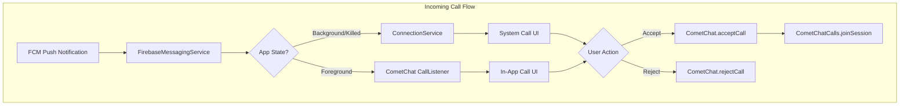
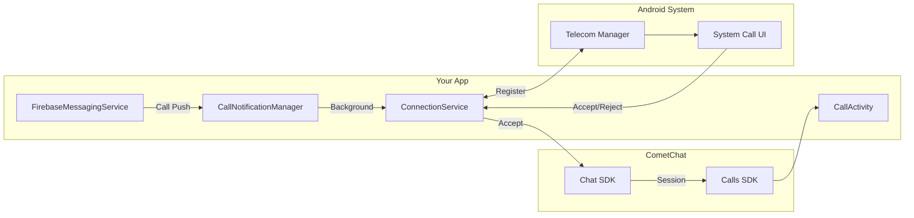
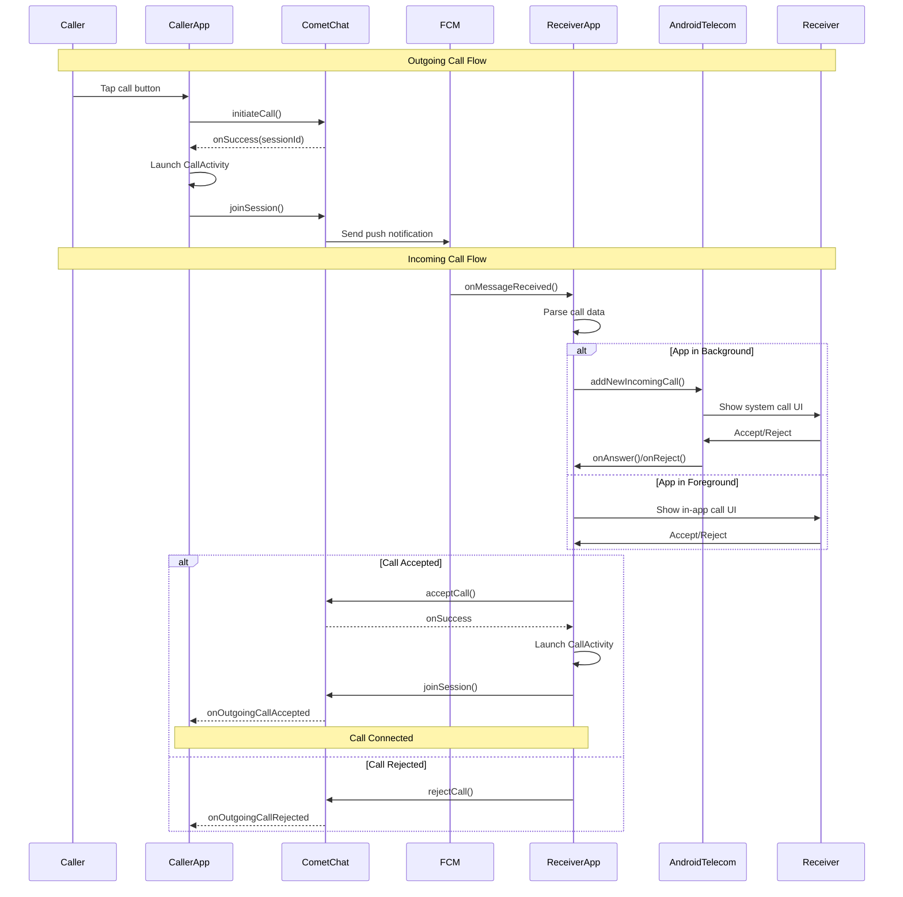

Implement native VoIP calling that works when your app is in the background or killed. This guide shows how to integrate Android's Telecom framework with CometChat to display system call UI, handle calls from the lock screen, and provide a native calling experience.

## Overview

VoIP calling differs from [basic in-app ringing](/calls/android/ringing) by leveraging Android's `ConnectionService` to:
- Show incoming calls on lock screen with system UI
- Handle calls when app is in background or killed
- Integrate with Bluetooth, car systems, and wearables
- Provide consistent call experience across Android devices



## Prerequisites

Before implementing VoIP calling, ensure you have:

- [CometChat Chat SDK](/sdk/android/overview) and [Calls SDK](/calls/android/setup) integrated
- [Firebase Cloud Messaging (FCM)](/notifications/android-push-notifications) configured
- [Push notifications enabled](/notifications/push-integration) in CometChat Dashboard
- Android 8.0+ (API 26+) for ConnectionService support

<Note>
This documentation builds on the [Ringing](/calls/android/ringing) functionality. Make sure you understand basic call signaling before implementing VoIP.
</Note>

---

## Architecture Overview

The VoIP implementation consists of several components working together:



| Component | Purpose |
|-----------|---------|
| `FirebaseMessagingService` | Receives push notifications for incoming calls when app is in background |
| `ConnectionService` | Android Telecom framework integration - manages call state with the system |
| `CallNotificationManager` | Decides whether to show system call UI or fallback notification |
| `PhoneAccount` | Registers your app as a calling app with Android's Telecom system |
| `Connection` | Represents an individual call and handles user actions (accept/reject/hold) |

---

## Step 1: Configure Push Notifications

Push notifications are essential for receiving incoming calls when your app is not in the foreground. When a call is initiated, CometChat sends a push notification to the receiver's device.

<Info>
For detailed FCM setup instructions, see the [Android Push Notifications](/notifications/android-push-notifications) documentation.
</Info>

### 1.1 Add FCM Dependencies

Add Firebase Messaging to your `build.gradle`:

```groovy
dependencies {
    implementation 'com.google.firebase:firebase-messaging:23.4.0'
}
```

### 1.2 Create FirebaseMessagingService

This service receives push notifications from FCM. When a call notification arrives, it extracts the call data and decides how to display the incoming call based on the app's state.


<Tabs>
<Tab title="Kotlin">
```kotlin
class CallFirebaseMessagingService : FirebaseMessagingService() {

    override fun onMessageReceived(remoteMessage: RemoteMessage) {
        val data = remoteMessage.data
        
        // Check if this is a call notification by examining the "type" field
        // CometChat sends call notifications with type="call"
        if (data["type"] == "call") {
            handleIncomingCall(data)
        }
    }

    private fun handleIncomingCall(data: Map<String, String>) {
        // Extract call information from the push payload
        // These fields are sent by CometChat when a call is initiated
        val sessionId = data["sessionId"] ?: return
        val callerName = data["senderName"] ?: "Unknown"
        val callerUid = data["senderUid"] ?: return
        val callType = data["callType"] ?: "video"  // "audio" or "video"
        val callerAvatar = data["senderAvatar"]

        // Create a CallData object to pass call information between components
        val callData = CallData(
            sessionId = sessionId,
            callerName = callerName,
            callerUid = callerUid,
            callType = callType,
            callerAvatar = callerAvatar
        )

        // If app is in foreground, let CometChat's CallListener handle it
        // This provides a seamless experience with in-app UI
        if (isAppInForeground()) {
            return
        }

        // App is in background/killed - show system call UI via ConnectionService
        // This ensures the user sees the incoming call even when not using the app
        CallNotificationManager.showIncomingCall(this, callData)
    }

    /**
     * Checks if the app is currently visible to the user.
     * We only want to use ConnectionService when the app is in background.
     */
    private fun isAppInForeground(): Boolean {
        val activityManager = getSystemService(Context.ACTIVITY_SERVICE) as ActivityManager
        val appProcesses = activityManager.runningAppProcesses ?: return false
        val packageName = packageName
        for (appProcess in appProcesses) {
            if (appProcess.importance == ActivityManager.RunningAppProcessInfo.IMPORTANCE_FOREGROUND
                && appProcess.processName == packageName) {
                return true
            }
        }
        return false
    }

    /**
     * Called when FCM generates a new token.
     * Register this token with CometChat to receive push notifications.
     */
    override fun onNewToken(token: String) {
        // Register the FCM token with CometChat's push notification service
        // This links the device to the logged-in user for push delivery
        CometChat.registerTokenForPushNotification(token, object : CometChat.CallbackListener<String>() {
            override fun onSuccess(s: String) {
                Log.d(TAG, "Push token registered successfully")
            }
            override fun onError(e: CometChatException) {
                Log.e(TAG, "Token registration failed: ${e.message}")
            }
        })
    }

    companion object {
        private const val TAG = "CallFCMService"
    }
}
```
</Tab>
<Tab title="Java">
```java
public class CallFirebaseMessagingService extends FirebaseMessagingService {

    private static final String TAG = "CallFCMService";

    @Override
    public void onMessageReceived(RemoteMessage remoteMessage) {
        Map<String, String> data = remoteMessage.getData();
        
        // Check if this is a call notification by examining the "type" field
        // CometChat sends call notifications with type="call"
        if ("call".equals(data.get("type"))) {
            handleIncomingCall(data);
        }
    }

    private void handleIncomingCall(Map<String, String> data) {
        // Extract call information from the push payload
        // These fields are sent by CometChat when a call is initiated
        String sessionId = data.get("sessionId");
        String callerName = data.get("senderName");
        String callerUid = data.get("senderUid");
        String callType = data.get("callType");
        String callerAvatar = data.get("senderAvatar");

        if (sessionId == null || callerUid == null) return;
        if (callerName == null) callerName = "Unknown";
        if (callType == null) callType = "video";

        // Create a CallData object to pass call information between components
        CallData callData = new CallData(
            sessionId, callerName, callerUid, callType, callerAvatar
        );

        // If app is in foreground, let CometChat's CallListener handle it
        if (isAppInForeground()) {
            return;
        }

        // App is in background/killed - show system call UI via ConnectionService
        CallNotificationManager.showIncomingCall(this, callData);
    }

    /**
     * Checks if the app is currently visible to the user.
     * We only want to use ConnectionService when the app is in background.
     */
    private boolean isAppInForeground() {
        ActivityManager activityManager = 
            (ActivityManager) getSystemService(Context.ACTIVITY_SERVICE);
        List<ActivityManager.RunningAppProcessInfo> appProcesses = 
            activityManager.getRunningAppProcesses();
        if (appProcesses == null) return false;
        
        String packageName = getPackageName();
        for (ActivityManager.RunningAppProcessInfo appProcess : appProcesses) {
            if (appProcess.importance == 
                ActivityManager.RunningAppProcessInfo.IMPORTANCE_FOREGROUND
                && appProcess.processName.equals(packageName)) {
                return true;
            }
        }
        return false;
    }

    /**
     * Called when FCM generates a new token.
     * Register this token with CometChat to receive push notifications.
     */
    @Override
    public void onNewToken(String token) {
        // Register the FCM token with CometChat's push notification service
        CometChat.registerTokenForPushNotification(token, new CometChat.CallbackListener<String>() {
            @Override
            public void onSuccess(String s) {
                Log.d(TAG, "Push token registered successfully");
            }
            @Override
            public void onError(CometChatException e) {
                Log.e(TAG, "Token registration failed: " + e.getMessage());
            }
        });
    }
}
```
</Tab>
</Tabs>

### 1.3 Create CallData Model

The `CallData` class is a simple data container that holds all information about an incoming or outgoing call. It implements `Parcelable` so it can be passed between Android components (Activities, Services, BroadcastReceivers).

<Tabs>
<Tab title="Kotlin">
```kotlin
/**
 * Data class representing call information.
 * Implements Parcelable to allow passing between Android components.
 */
data class CallData(
    val sessionId: String,      // Unique identifier for the call session
    val callerName: String,     // Display name of the caller
    val callerUid: String,      // CometChat UID of the caller
    val callType: String,       // "audio" or "video"
    val callerAvatar: String?   // URL to caller's avatar image (optional)
) : Parcelable {
    
    constructor(parcel: Parcel) : this(
        parcel.readString() ?: "",
        parcel.readString() ?: "",
        parcel.readString() ?: "",
        parcel.readString() ?: "",
        parcel.readString()
    )

    override fun writeToParcel(parcel: Parcel, flags: Int) {
        parcel.writeString(sessionId)
        parcel.writeString(callerName)
        parcel.writeString(callerUid)
        parcel.writeString(callType)
        parcel.writeString(callerAvatar)
    }

    override fun describeContents(): Int = 0

    companion object CREATOR : Parcelable.Creator<CallData> {
        override fun createFromParcel(parcel: Parcel): CallData = CallData(parcel)
        override fun newArray(size: Int): Array<CallData?> = arrayOfNulls(size)
    }
}
```
</Tab>
<Tab title="Java">
```java
/**
 * Data class representing call information.
 * Implements Parcelable to allow passing between Android components.
 */
public class CallData implements Parcelable {
    private final String sessionId;      // Unique identifier for the call session
    private final String callerName;     // Display name of the caller
    private final String callerUid;      // CometChat UID of the caller
    private final String callType;       // "audio" or "video"
    private final String callerAvatar;   // URL to caller's avatar image (optional)

    public CallData(String sessionId, String callerName, String callerUid, 
                    String callType, String callerAvatar) {
        this.sessionId = sessionId;
        this.callerName = callerName;
        this.callerUid = callerUid;
        this.callType = callType;
        this.callerAvatar = callerAvatar;
    }

    // Getters
    public String getSessionId() { return sessionId; }
    public String getCallerName() { return callerName; }
    public String getCallerUid() { return callerUid; }
    public String getCallType() { return callType; }
    public String getCallerAvatar() { return callerAvatar; }

    // Parcelable implementation for passing between components
    protected CallData(Parcel in) {
        sessionId = in.readString();
        callerName = in.readString();
        callerUid = in.readString();
        callType = in.readString();
        callerAvatar = in.readString();
    }

    @Override
    public void writeToParcel(Parcel dest, int flags) {
        dest.writeString(sessionId);
        dest.writeString(callerName);
        dest.writeString(callerUid);
        dest.writeString(callType);
        dest.writeString(callerAvatar);
    }

    @Override
    public int describeContents() { return 0; }

    public static final Creator<CallData> CREATOR = new Creator<CallData>() {
        @Override
        public CallData createFromParcel(Parcel in) { return new CallData(in); }
        @Override
        public CallData[] newArray(int size) { return new CallData[size]; }
    };
}
```
</Tab>
</Tabs>

---

## Step 2: Register PhoneAccount

A `PhoneAccount` tells Android that your app can handle phone calls. This registration is required for the system to route incoming calls to your app and display the native call UI.

### 2.1 Create PhoneAccountManager

This singleton class handles registering your app with Android's Telecom system. The `PhoneAccount` must be registered before you can receive or make VoIP calls.

<Tabs>
<Tab title="Kotlin">
```kotlin
/**
 * Manages PhoneAccount registration with Android's Telecom system.
 * Must be called once when the app starts (typically in Application.onCreate).
 */
object PhoneAccountManager {
    private const val PHONE_ACCOUNT_ID = "cometchat_voip_account"
    private var phoneAccountHandle: PhoneAccountHandle? = null

    /**
     * Registers your app as a calling app with Android's Telecom system.
     * Call this in your Application.onCreate() method.
     */
    fun register(context: Context) {
        val telecomManager = context.getSystemService(Context.TELECOM_SERVICE) as TelecomManager
        
        // ComponentName points to your ConnectionService implementation
        val componentName = ComponentName(context, CallConnectionService::class.java)
        
        // PhoneAccountHandle uniquely identifies your calling account
        phoneAccountHandle = PhoneAccountHandle(componentName, PHONE_ACCOUNT_ID)

        // Build the PhoneAccount with required capabilities
        val phoneAccount = PhoneAccount.builder(phoneAccountHandle, "CometChat Calls")
            .setCapabilities(
                // CAPABILITY_CALL_PROVIDER: Can make and receive calls
                // CAPABILITY_SELF_MANAGED: Manages its own call UI (required for VoIP)
                PhoneAccount.CAPABILITY_CALL_PROVIDER or
                PhoneAccount.CAPABILITY_SELF_MANAGED
            )
            .build()

        // Register with the system
        telecomManager.registerPhoneAccount(phoneAccount)
    }

    /**
     * Returns the PhoneAccountHandle for use with TelecomManager calls.
     */
    fun getPhoneAccountHandle(context: Context): PhoneAccountHandle {
        if (phoneAccountHandle == null) {
            val componentName = ComponentName(context, CallConnectionService::class.java)
            phoneAccountHandle = PhoneAccountHandle(componentName, PHONE_ACCOUNT_ID)
        }
        return phoneAccountHandle!!
    }

    /**
     * Checks if the user has enabled the PhoneAccount in system settings.
     * Some devices require manual enabling in Settings > Apps > Phone > Calling accounts.
     */
    fun isPhoneAccountEnabled(context: Context): Boolean {
        val telecomManager = context.getSystemService(Context.TELECOM_SERVICE) as TelecomManager
        val account = telecomManager.getPhoneAccount(getPhoneAccountHandle(context))
        return account?.isEnabled == true
    }

    /**
     * Opens system settings where user can enable the PhoneAccount.
     * Call this if isPhoneAccountEnabled() returns false.
     */
    fun openPhoneAccountSettings(context: Context) {
        val intent = Intent(TelecomManager.ACTION_CHANGE_PHONE_ACCOUNTS)
        intent.flags = Intent.FLAG_ACTIVITY_NEW_TASK
        context.startActivity(intent)
    }
}
```
</Tab>
<Tab title="Java">
```java
/**
 * Manages PhoneAccount registration with Android's Telecom system.
 * Must be called once when the app starts (typically in Application.onCreate).
 */
public class PhoneAccountManager {
    private static final String PHONE_ACCOUNT_ID = "cometchat_voip_account";
    private static PhoneAccountHandle phoneAccountHandle;

    /**
     * Registers your app as a calling app with Android's Telecom system.
     * Call this in your Application.onCreate() method.
     */
    public static void register(Context context) {
        TelecomManager telecomManager = 
            (TelecomManager) context.getSystemService(Context.TELECOM_SERVICE);
        
        // ComponentName points to your ConnectionService implementation
        ComponentName componentName = 
            new ComponentName(context, CallConnectionService.class);
        
        // PhoneAccountHandle uniquely identifies your calling account
        phoneAccountHandle = new PhoneAccountHandle(componentName, PHONE_ACCOUNT_ID);

        // Build the PhoneAccount with required capabilities
        PhoneAccount phoneAccount = PhoneAccount.builder(phoneAccountHandle, "CometChat Calls")
            .setCapabilities(
                // CAPABILITY_CALL_PROVIDER: Can make and receive calls
                // CAPABILITY_SELF_MANAGED: Manages its own call UI (required for VoIP)
                PhoneAccount.CAPABILITY_CALL_PROVIDER | 
                PhoneAccount.CAPABILITY_SELF_MANAGED
            )
            .build();

        // Register with the system
        telecomManager.registerPhoneAccount(phoneAccount);
    }

    /**
     * Returns the PhoneAccountHandle for use with TelecomManager calls.
     */
    public static PhoneAccountHandle getPhoneAccountHandle(Context context) {
        if (phoneAccountHandle == null) {
            ComponentName componentName = 
                new ComponentName(context, CallConnectionService.class);
            phoneAccountHandle = new PhoneAccountHandle(componentName, PHONE_ACCOUNT_ID);
        }
        return phoneAccountHandle;
    }

    /**
     * Checks if the user has enabled the PhoneAccount in system settings.
     */
    public static boolean isPhoneAccountEnabled(Context context) {
        TelecomManager telecomManager = 
            (TelecomManager) context.getSystemService(Context.TELECOM_SERVICE);
        PhoneAccount account = telecomManager.getPhoneAccount(getPhoneAccountHandle(context));
        return account != null && account.isEnabled();
    }

    /**
     * Opens system settings where user can enable the PhoneAccount.
     */
    public static void openPhoneAccountSettings(Context context) {
        Intent intent = new Intent(TelecomManager.ACTION_CHANGE_PHONE_ACCOUNTS);
        intent.setFlags(Intent.FLAG_ACTIVITY_NEW_TASK);
        context.startActivity(intent);
    }
}
```
</Tab>
</Tabs>

### 2.2 Register on App Start

Register the PhoneAccount when your app starts. This should be done in your `Application` class to ensure it's registered before any calls can be received.

<Tabs>
<Tab title="Kotlin">
```kotlin
class MyApplication : Application() {
    override fun onCreate() {
        super.onCreate()
        
        // Initialize CometChat (see Setup guide)
        // CometChat.init(...)
        
        // Register PhoneAccount for VoIP calling
        // This must be done before receiving any calls
        PhoneAccountManager.register(this)
    }
}
```
</Tab>
<Tab title="Java">
```java
public class MyApplication extends Application {
    @Override
    public void onCreate() {
        super.onCreate();
        
        // Initialize CometChat (see Setup guide)
        // CometChat.init(...)
        
        // Register PhoneAccount for VoIP calling
        // This must be done before receiving any calls
        PhoneAccountManager.register(this);
    }
}
```
</Tab>
</Tabs>

---

## Step 3: Implement ConnectionService

The `ConnectionService` is the core component that bridges your app with Android's Telecom framework. It creates `Connection` objects that represent individual calls and handle user interactions.

### 3.1 Create CallConnectionService

This service is called by Android when a new incoming or outgoing call needs to be created. It's responsible for creating `Connection` objects that manage the call state.


<Tabs>
<Tab title="Kotlin">
```kotlin
/**
 * ConnectionService implementation for VoIP calling.
 * Android's Telecom framework calls this service to create Connection objects
 * for incoming and outgoing calls.
 */
class CallConnectionService : ConnectionService() {

    /**
     * Called by Android when an incoming call is reported via TelecomManager.addNewIncomingCall().
     * Creates a Connection object that will handle the incoming call.
     */
    override fun onCreateIncomingConnection(
        connectionManagerPhoneAccount: PhoneAccountHandle?,
        request: ConnectionRequest?
    ): Connection {
        // Extract call data from the request extras
        val extras = request?.extras
        val callData = extras?.getParcelable<CallData>(EXTRA_CALL_DATA)
        
        // Create a new Connection to represent this call
        val connection = CallConnection(applicationContext, callData)
        
        // Set initial state: initializing -> ringing
        // This triggers the system to show the incoming call UI
        connection.setInitializing()
        connection.setRinging()
        
        // Store the connection so we can access it from other components
        CallConnectionHolder.setConnection(connection)
        
        return connection
    }

    /**
     * Called by Android when an outgoing call is placed via TelecomManager.placeCall().
     * Creates a Connection object that will handle the outgoing call.
     */
    override fun onCreateOutgoingConnection(
        connectionManagerPhoneAccount: PhoneAccountHandle?,
        request: ConnectionRequest?
    ): Connection {
        val extras = request?.extras
        val callData = extras?.getParcelable<CallData>(EXTRA_CALL_DATA)
        
        val connection = CallConnection(applicationContext, callData)
        
        // Set initial state: initializing -> dialing
        // This triggers the system to show the outgoing call UI
        connection.setInitializing()
        connection.setDialing()
        
        CallConnectionHolder.setConnection(connection)
        
        return connection
    }

    /**
     * Called when the system fails to create an incoming connection.
     * This can happen due to permission issues or system constraints.
     */
    override fun onCreateIncomingConnectionFailed(
        connectionManagerPhoneAccount: PhoneAccountHandle?,
        request: ConnectionRequest?
    ) {
        Log.e(TAG, "Failed to create incoming connection")
        // Consider showing a fallback notification here
    }

    /**
     * Called when the system fails to create an outgoing connection.
     */
    override fun onCreateOutgoingConnectionFailed(
        connectionManagerPhoneAccount: PhoneAccountHandle?,
        request: ConnectionRequest?
    ) {
        Log.e(TAG, "Failed to create outgoing connection")
    }

    companion object {
        private const val TAG = "CallConnectionService"
        const val EXTRA_CALL_DATA = "extra_call_data"
    }
}
```
</Tab>
<Tab title="Java">
```java
/**
 * ConnectionService implementation for VoIP calling.
 * Android's Telecom framework calls this service to create Connection objects
 * for incoming and outgoing calls.
 */
public class CallConnectionService extends ConnectionService {

    private static final String TAG = "CallConnectionService";
    public static final String EXTRA_CALL_DATA = "extra_call_data";

    /**
     * Called by Android when an incoming call is reported via TelecomManager.addNewIncomingCall().
     * Creates a Connection object that will handle the incoming call.
     */
    @Override
    public Connection onCreateIncomingConnection(
            PhoneAccountHandle connectionManagerPhoneAccount,
            ConnectionRequest request) {
        
        // Extract call data from the request extras
        Bundle extras = request.getExtras();
        CallData callData = extras.getParcelable(EXTRA_CALL_DATA);
        
        // Create a new Connection to represent this call
        CallConnection connection = new CallConnection(getApplicationContext(), callData);
        
        // Set initial state: initializing -> ringing
        // This triggers the system to show the incoming call UI
        connection.setInitializing();
        connection.setRinging();
        
        // Store the connection so we can access it from other components
        CallConnectionHolder.setConnection(connection);
        
        return connection;
    }

    /**
     * Called by Android when an outgoing call is placed via TelecomManager.placeCall().
     * Creates a Connection object that will handle the outgoing call.
     */
    @Override
    public Connection onCreateOutgoingConnection(
            PhoneAccountHandle connectionManagerPhoneAccount,
            ConnectionRequest request) {
        
        Bundle extras = request.getExtras();
        CallData callData = extras.getParcelable(EXTRA_CALL_DATA);
        
        CallConnection connection = new CallConnection(getApplicationContext(), callData);
        
        // Set initial state: initializing -> dialing
        connection.setInitializing();
        connection.setDialing();
        
        CallConnectionHolder.setConnection(connection);
        
        return connection;
    }

    @Override
    public void onCreateIncomingConnectionFailed(
            PhoneAccountHandle connectionManagerPhoneAccount,
            ConnectionRequest request) {
        Log.e(TAG, "Failed to create incoming connection");
    }

    @Override
    public void onCreateOutgoingConnectionFailed(
            PhoneAccountHandle connectionManagerPhoneAccount,
            ConnectionRequest request) {
        Log.e(TAG, "Failed to create outgoing connection");
    }
}
```
</Tab>
</Tabs>

### 3.2 Create CallConnection

The `Connection` class represents an individual call. It receives callbacks from Android when the user interacts with the call (answer, reject, hold, etc.) and is responsible for updating the call state and communicating with CometChat.

<Tabs>
<Tab title="Kotlin">
```kotlin
/**
 * Represents an individual VoIP call.
 * Handles user actions (answer, reject, disconnect) and bridges to CometChat SDK.
 */
class CallConnection(
    private val context: Context,
    private val callData: CallData?
) : Connection() {

    init {
        // PROPERTY_SELF_MANAGED: We manage our own call UI (not using system dialer)
        connectionProperties = PROPERTY_SELF_MANAGED
        
        // Set capabilities for this call
        // CAPABILITY_MUTE: User can mute the call
        // CAPABILITY_SUPPORT_HOLD/CAPABILITY_HOLD: User can put call on hold
        connectionCapabilities = CAPABILITY_MUTE or 
                                 CAPABILITY_SUPPORT_HOLD or 
                                 CAPABILITY_HOLD
        
        // Set caller information for the system call UI
        callData?.let {
            // Display name shown on incoming call screen
            setCallerDisplayName(it.callerName, TelecomManager.PRESENTATION_ALLOWED)
            // Address (used for call log and display)
            setAddress(
                Uri.parse("tel:${it.callerUid}"),
                TelecomManager.PRESENTATION_ALLOWED
            )
        }
        
        // Mark this as a VoIP call for proper audio routing
        audioModeIsVoip = true
    }

    /**
     * Called when user taps "Answer" on the incoming call screen.
     * Accept the call via CometChat and launch the call activity.
     */
    override fun onAnswer() {
        Log.d(TAG, "Call answered by user")
        
        // Update connection state to active (call is now connected)
        setActive()
        
        callData?.let { data ->
            // Accept the call via CometChat Chat SDK
            // This notifies the caller that we've accepted
            CometChat.acceptCall(data.sessionId, object : CometChat.CallbackListener<Call>() {
                override fun onSuccess(call: Call) {
                    Log.d(TAG, "CometChat call accepted successfully")
                    // Launch the call activity to show the video/audio UI
                    launchCallActivity(data)
                }

                override fun onError(e: CometChatException) {
                    Log.e(TAG, "Failed to accept call: ${e.message}")
                    // Call failed - disconnect and clean up
                    setDisconnected(DisconnectCause(DisconnectCause.ERROR))
                    destroy()
                }
            })
        }
    }

    /**
     * Called when user taps "Decline" on the incoming call screen.
     * Reject the call via CometChat.
     */
    override fun onReject() {
        Log.d(TAG, "Call rejected by user")
        
        callData?.let { data ->
            // Reject the call via CometChat Chat SDK
            // This notifies the caller that we've declined
            CometChat.rejectCall(
                data.sessionId,
                CometChatConstants.CALL_STATUS_REJECTED,
                object : CometChat.CallbackListener<Call>() {
                    override fun onSuccess(call: Call) {
                        Log.d(TAG, "Call rejected successfully")
                    }
                    override fun onError(e: CometChatException) {
                        Log.e(TAG, "Failed to reject call: ${e.message}")
                    }
                }
            )
        }
        
        // Update connection state and clean up
        setDisconnected(DisconnectCause(DisconnectCause.REJECTED))
        destroy()
    }

    /**
     * Called when user ends the call (taps end call button).
     * Leave the call session and notify the other participant.
     */
    override fun onDisconnect() {
        Log.d(TAG, "Call disconnected")
        
        // Leave the Calls SDK session if active
        if (CallSession.getInstance().isSessionActive) {
            CallSession.getInstance().leaveSession()
        }
        
        // End the call via CometChat Chat SDK
        // This notifies the other participant that the call has ended
        callData?.let { data ->
            CometChat.endCall(data.sessionId, object : CometChat.CallbackListener<Call>() {
                override fun onSuccess(call: Call) {
                    Log.d(TAG, "Call ended successfully")
                }
                override fun onError(e: CometChatException) {
                    Log.e(TAG, "Failed to end call: ${e.message}")
                }
            })
        }
        
        setDisconnected(DisconnectCause(DisconnectCause.LOCAL))
        destroy()
    }

    /**
     * Called when user puts the call on hold.
     */
    override fun onHold() {
        setOnHold()
        // Mute audio when on hold
        CallSession.getInstance().muteAudio()
    }

    /**
     * Called when user takes the call off hold.
     */
    override fun onUnhold() {
        setActive()
        CallSession.getInstance().unMuteAudio()
    }

    /**
     * Launches the CallActivity to show the call UI.
     */
    private fun launchCallActivity(callData: CallData) {
        val intent = Intent(context, CallActivity::class.java).apply {
            flags = Intent.FLAG_ACTIVITY_NEW_TASK
            putExtra(CallActivity.EXTRA_SESSION_ID, callData.sessionId)
            putExtra(CallActivity.EXTRA_CALL_TYPE, callData.callType)
            putExtra(CallActivity.EXTRA_IS_INCOMING, true)
        }
        context.startActivity(intent)
    }

    /**
     * Public method to end the call from outside this class.
     */
    fun endCall() {
        onDisconnect()
    }

    companion object {
        private const val TAG = "CallConnection"
    }
}
```
</Tab>
<Tab title="Java">
```java
/**
 * Represents an individual VoIP call.
 * Handles user actions (answer, reject, disconnect) and bridges to CometChat SDK.
 */
public class CallConnection extends Connection {

    private static final String TAG = "CallConnection";
    private final Context context;
    private final CallData callData;

    public CallConnection(Context context, CallData callData) {
        this.context = context;
        this.callData = callData;

        // PROPERTY_SELF_MANAGED: We manage our own call UI
        setConnectionProperties(PROPERTY_SELF_MANAGED);
        
        // Set capabilities for this call
        setConnectionCapabilities(
            CAPABILITY_MUTE | CAPABILITY_SUPPORT_HOLD | CAPABILITY_HOLD
        );

        // Set caller information for the system call UI
        if (callData != null) {
            setCallerDisplayName(callData.getCallerName(), TelecomManager.PRESENTATION_ALLOWED);
            setAddress(
                Uri.parse("tel:" + callData.getCallerUid()),
                TelecomManager.PRESENTATION_ALLOWED
            );
        }

        // Mark this as a VoIP call for proper audio routing
        setAudioModeIsVoip(true);
    }

    /**
     * Called when user taps "Answer" on the incoming call screen.
     */
    @Override
    public void onAnswer() {
        Log.d(TAG, "Call answered by user");
        setActive();

        if (callData != null) {
            // Accept the call via CometChat Chat SDK
            CometChat.acceptCall(callData.getSessionId(), new CometChat.CallbackListener<Call>() {
                @Override
                public void onSuccess(Call call) {
                    Log.d(TAG, "CometChat call accepted successfully");
                    launchCallActivity(callData);
                }

                @Override
                public void onError(CometChatException e) {
                    Log.e(TAG, "Failed to accept call: " + e.getMessage());
                    setDisconnected(new DisconnectCause(DisconnectCause.ERROR));
                    destroy();
                }
            });
        }
    }

    /**
     * Called when user taps "Decline" on the incoming call screen.
     */
    @Override
    public void onReject() {
        Log.d(TAG, "Call rejected by user");

        if (callData != null) {
            CometChat.rejectCall(
                callData.getSessionId(),
                CometChatConstants.CALL_STATUS_REJECTED,
                new CometChat.CallbackListener<Call>() {
                    @Override
                    public void onSuccess(Call call) {
                        Log.d(TAG, "Call rejected successfully");
                    }
                    @Override
                    public void onError(CometChatException e) {
                        Log.e(TAG, "Failed to reject call: " + e.getMessage());
                    }
                }
            );
        }

        setDisconnected(new DisconnectCause(DisconnectCause.REJECTED));
        destroy();
    }

    /**
     * Called when user ends the call.
     */
    @Override
    public void onDisconnect() {
        Log.d(TAG, "Call disconnected");

        if (CallSession.getInstance().isSessionActive()) {
            CallSession.getInstance().leaveSession();
        }

        if (callData != null) {
            CometChat.endCall(callData.getSessionId(), new CometChat.CallbackListener<Call>() {
                @Override
                public void onSuccess(Call call) {
                    Log.d(TAG, "Call ended successfully");
                }
                @Override
                public void onError(CometChatException e) {
                    Log.e(TAG, "Failed to end call: " + e.getMessage());
                }
            });
        }

        setDisconnected(new DisconnectCause(DisconnectCause.LOCAL));
        destroy();
    }

    @Override
    public void onHold() {
        setOnHold();
        CallSession.getInstance().muteAudio();
    }

    @Override
    public void onUnhold() {
        setActive();
        CallSession.getInstance().unMuteAudio();
    }

    private void launchCallActivity(CallData callData) {
        Intent intent = new Intent(context, CallActivity.class);
        intent.setFlags(Intent.FLAG_ACTIVITY_NEW_TASK);
        intent.putExtra(CallActivity.EXTRA_SESSION_ID, callData.getSessionId());
        intent.putExtra(CallActivity.EXTRA_CALL_TYPE, callData.getCallType());
        intent.putExtra(CallActivity.EXTRA_IS_INCOMING, true);
        context.startActivity(intent);
    }

    public void endCall() {
        onDisconnect();
    }
}
```
</Tab>
</Tabs>

### 3.3 Create CallConnectionHolder

This singleton holds a reference to the active `Connection` so it can be accessed from other components (like the CallActivity or BroadcastReceiver).

<Tabs>
<Tab title="Kotlin">
```kotlin
/**
 * Singleton to hold the active CallConnection.
 * Allows other components to access and control the current call.
 */
object CallConnectionHolder {
    private var connection: CallConnection? = null

    fun setConnection(conn: CallConnection?) {
        connection = conn
    }

    fun getConnection(): CallConnection? = connection

    /**
     * Ends the current call and clears the reference.
     */
    fun endCall() {
        connection?.endCall()
        connection = null
    }

    fun hasActiveConnection(): Boolean = connection != null
}
```
</Tab>
<Tab title="Java">
```java
/**
 * Singleton to hold the active CallConnection.
 * Allows other components to access and control the current call.
 */
public class CallConnectionHolder {
    private static CallConnection connection;

    public static void setConnection(CallConnection conn) {
        connection = conn;
    }

    public static CallConnection getConnection() {
        return connection;
    }

    public static void endCall() {
        if (connection != null) {
            connection.endCall();
            connection = null;
        }
    }

    public static boolean hasActiveConnection() {
        return connection != null;
    }
}
```
</Tab>
</Tabs>

---

## Step 4: Create CallNotificationManager

This class is responsible for showing incoming calls to the user. It first tries to use the system call UI via `TelecomManager`, and falls back to a high-priority notification if that fails.


<Tabs>
<Tab title="Kotlin">
```kotlin
/**
 * Manages showing incoming calls via Android's Telecom system.
 * Falls back to a high-priority notification if Telecom fails.
 */
object CallNotificationManager {

    /**
     * Shows an incoming call to the user.
     * Tries to use the system call UI first, falls back to notification.
     */
    fun showIncomingCall(context: Context, callData: CallData) {
        val telecomManager = context.getSystemService(Context.TELECOM_SERVICE) as TelecomManager
        
        // Prepare extras with call data for the ConnectionService
        val extras = Bundle().apply {
            putParcelable(CallConnectionService.EXTRA_CALL_DATA, callData)
            putParcelable(
                TelecomManager.EXTRA_PHONE_ACCOUNT_HANDLE,
                PhoneAccountManager.getPhoneAccountHandle(context)
            )
        }

        try {
            // Tell Android there's an incoming call
            // This triggers onCreateIncomingConnection in our ConnectionService
            telecomManager.addNewIncomingCall(
                PhoneAccountManager.getPhoneAccountHandle(context),
                extras
            )
        } catch (e: SecurityException) {
            // Permission denied - PhoneAccount may not be enabled
            Log.e(TAG, "Permission denied for incoming call: ${e.message}")
            showFallbackNotification(context, callData)
        } catch (e: Exception) {
            Log.e(TAG, "Failed to show incoming call: ${e.message}")
            showFallbackNotification(context, callData)
        }
    }

    /**
     * Places an outgoing call via the Telecom system.
     */
    fun placeOutgoingCall(context: Context, callData: CallData) {
        val telecomManager = context.getSystemService(Context.TELECOM_SERVICE) as TelecomManager
        
        val extras = Bundle().apply {
            putParcelable(CallConnectionService.EXTRA_CALL_DATA, callData)
            putParcelable(
                TelecomManager.EXTRA_PHONE_ACCOUNT_HANDLE,
                PhoneAccountManager.getPhoneAccountHandle(context)
            )
        }

        try {
            telecomManager.placeCall(
                Uri.parse("tel:${callData.callerUid}"),
                extras
            )
        } catch (e: SecurityException) {
            Log.e(TAG, "Permission denied for outgoing call: ${e.message}")
        }
    }

    /**
     * Shows a high-priority notification as fallback when Telecom fails.
     * This notification has full-screen intent to show on lock screen.
     */
    private fun showFallbackNotification(context: Context, callData: CallData) {
        val notificationManager = context.getSystemService(Context.NOTIFICATION_SERVICE) 
            as NotificationManager

        // Create notification channel (required for Android 8.0+)
        if (Build.VERSION.SDK_INT >= Build.VERSION_CODES.O) {
            val channel = NotificationChannel(
                CHANNEL_ID,
                "Incoming Calls",
                NotificationManager.IMPORTANCE_HIGH  // High importance for call notifications
            ).apply {
                description = "Notifications for incoming calls"
                setSound(null, null)  // We'll play our own ringtone
                enableVibration(true)
            }
            notificationManager.createNotificationChannel(channel)
        }

        // Create accept action - launches call when tapped
        val acceptIntent = Intent(context, CallActionReceiver::class.java).apply {
            action = ACTION_ACCEPT_CALL
            putExtra(EXTRA_CALL_DATA, callData)
        }
        val acceptPendingIntent = PendingIntent.getBroadcast(
            context, 0, acceptIntent,
            PendingIntent.FLAG_UPDATE_CURRENT or PendingIntent.FLAG_IMMUTABLE
        )

        // Create reject action
        val rejectIntent = Intent(context, CallActionReceiver::class.java).apply {
            action = ACTION_REJECT_CALL
            putExtra(EXTRA_CALL_DATA, callData)
        }
        val rejectPendingIntent = PendingIntent.getBroadcast(
            context, 1, rejectIntent,
            PendingIntent.FLAG_UPDATE_CURRENT or PendingIntent.FLAG_IMMUTABLE
        )

        // Full screen intent - shows activity on lock screen
        val fullScreenIntent = Intent(context, IncomingCallActivity::class.java).apply {
            putExtra(EXTRA_CALL_DATA, callData)
            flags = Intent.FLAG_ACTIVITY_NEW_TASK
        }
        val fullScreenPendingIntent = PendingIntent.getActivity(
            context, 2, fullScreenIntent,
            PendingIntent.FLAG_UPDATE_CURRENT or PendingIntent.FLAG_IMMUTABLE
        )

        // Build the notification
        val notification = NotificationCompat.Builder(context, CHANNEL_ID)
            .setSmallIcon(R.drawable.ic_call)
            .setContentTitle("Incoming ${callData.callType} call")
            .setContentText("${callData.callerName} is calling...")
            .setPriority(NotificationCompat.PRIORITY_MAX)
            .setCategory(NotificationCompat.CATEGORY_CALL)  // Marks as call notification
            .setAutoCancel(true)
            .setOngoing(true)  // Can't be swiped away
            .setFullScreenIntent(fullScreenPendingIntent, true)  // Shows on lock screen
            .addAction(R.drawable.ic_call_end, "Decline", rejectPendingIntent)
            .addAction(R.drawable.ic_call_accept, "Accept", acceptPendingIntent)
            .build()

        notificationManager.notify(NOTIFICATION_ID, notification)
    }

    /**
     * Cancels the incoming call notification.
     * Call this when the call is answered, rejected, or cancelled.
     */
    fun cancelNotification(context: Context) {
        val notificationManager = context.getSystemService(Context.NOTIFICATION_SERVICE) 
            as NotificationManager
        notificationManager.cancel(NOTIFICATION_ID)
    }

    private const val TAG = "CallNotificationManager"
    private const val CHANNEL_ID = "incoming_calls"
    private const val NOTIFICATION_ID = 1001
    const val ACTION_ACCEPT_CALL = "action_accept_call"
    const val ACTION_REJECT_CALL = "action_reject_call"
    const val EXTRA_CALL_DATA = "extra_call_data"
}
```
</Tab>
<Tab title="Java">
```java
/**
 * Manages showing incoming calls via Android's Telecom system.
 * Falls back to a high-priority notification if Telecom fails.
 */
public class CallNotificationManager {

    private static final String TAG = "CallNotificationManager";
    private static final String CHANNEL_ID = "incoming_calls";
    private static final int NOTIFICATION_ID = 1001;
    public static final String ACTION_ACCEPT_CALL = "action_accept_call";
    public static final String ACTION_REJECT_CALL = "action_reject_call";
    public static final String EXTRA_CALL_DATA = "extra_call_data";

    /**
     * Shows an incoming call to the user.
     */
    public static void showIncomingCall(Context context, CallData callData) {
        TelecomManager telecomManager = 
            (TelecomManager) context.getSystemService(Context.TELECOM_SERVICE);

        Bundle extras = new Bundle();
        extras.putParcelable(CallConnectionService.EXTRA_CALL_DATA, callData);
        extras.putParcelable(
            TelecomManager.EXTRA_PHONE_ACCOUNT_HANDLE,
            PhoneAccountManager.getPhoneAccountHandle(context)
        );

        try {
            telecomManager.addNewIncomingCall(
                PhoneAccountManager.getPhoneAccountHandle(context),
                extras
            );
        } catch (SecurityException e) {
            Log.e(TAG, "Permission denied: " + e.getMessage());
            showFallbackNotification(context, callData);
        } catch (Exception e) {
            Log.e(TAG, "Failed to show incoming call: " + e.getMessage());
            showFallbackNotification(context, callData);
        }
    }

    /**
     * Places an outgoing call via the Telecom system.
     */
    public static void placeOutgoingCall(Context context, CallData callData) {
        TelecomManager telecomManager = 
            (TelecomManager) context.getSystemService(Context.TELECOM_SERVICE);

        Bundle extras = new Bundle();
        extras.putParcelable(CallConnectionService.EXTRA_CALL_DATA, callData);
        extras.putParcelable(
            TelecomManager.EXTRA_PHONE_ACCOUNT_HANDLE,
            PhoneAccountManager.getPhoneAccountHandle(context)
        );

        try {
            telecomManager.placeCall(
                Uri.parse("tel:" + callData.getCallerUid()),
                extras
            );
        } catch (SecurityException e) {
            Log.e(TAG, "Permission denied: " + e.getMessage());
        }
    }

    /**
     * Shows a high-priority notification as fallback.
     */
    private static void showFallbackNotification(Context context, CallData callData) {
        NotificationManager notificationManager = 
            (NotificationManager) context.getSystemService(Context.NOTIFICATION_SERVICE);

        // Create channel for Android 8.0+
        if (Build.VERSION.SDK_INT >= Build.VERSION_CODES.O) {
            NotificationChannel channel = new NotificationChannel(
                CHANNEL_ID, "Incoming Calls", NotificationManager.IMPORTANCE_HIGH
            );
            channel.setDescription("Notifications for incoming calls");
            channel.setSound(null, null);
            channel.enableVibration(true);
            notificationManager.createNotificationChannel(channel);
        }

        // Accept intent
        Intent acceptIntent = new Intent(context, CallActionReceiver.class);
        acceptIntent.setAction(ACTION_ACCEPT_CALL);
        acceptIntent.putExtra(EXTRA_CALL_DATA, callData);
        PendingIntent acceptPendingIntent = PendingIntent.getBroadcast(
            context, 0, acceptIntent,
            PendingIntent.FLAG_UPDATE_CURRENT | PendingIntent.FLAG_IMMUTABLE
        );

        // Reject intent
        Intent rejectIntent = new Intent(context, CallActionReceiver.class);
        rejectIntent.setAction(ACTION_REJECT_CALL);
        rejectIntent.putExtra(EXTRA_CALL_DATA, callData);
        PendingIntent rejectPendingIntent = PendingIntent.getBroadcast(
            context, 1, rejectIntent,
            PendingIntent.FLAG_UPDATE_CURRENT | PendingIntent.FLAG_IMMUTABLE
        );

        // Full screen intent for lock screen
        Intent fullScreenIntent = new Intent(context, IncomingCallActivity.class);
        fullScreenIntent.putExtra(EXTRA_CALL_DATA, callData);
        fullScreenIntent.setFlags(Intent.FLAG_ACTIVITY_NEW_TASK);
        PendingIntent fullScreenPendingIntent = PendingIntent.getActivity(
            context, 2, fullScreenIntent,
            PendingIntent.FLAG_UPDATE_CURRENT | PendingIntent.FLAG_IMMUTABLE
        );

        Notification notification = new NotificationCompat.Builder(context, CHANNEL_ID)
            .setSmallIcon(R.drawable.ic_call)
            .setContentTitle("Incoming " + callData.getCallType() + " call")
            .setContentText(callData.getCallerName() + " is calling...")
            .setPriority(NotificationCompat.PRIORITY_MAX)
            .setCategory(NotificationCompat.CATEGORY_CALL)
            .setAutoCancel(true)
            .setOngoing(true)
            .setFullScreenIntent(fullScreenPendingIntent, true)
            .addAction(R.drawable.ic_call_end, "Decline", rejectPendingIntent)
            .addAction(R.drawable.ic_call_accept, "Accept", acceptPendingIntent)
            .build();

        notificationManager.notify(NOTIFICATION_ID, notification);
    }

    public static void cancelNotification(Context context) {
        NotificationManager notificationManager = 
            (NotificationManager) context.getSystemService(Context.NOTIFICATION_SERVICE);
        notificationManager.cancel(NOTIFICATION_ID);
    }
}
```
</Tab>
</Tabs>

---

## Step 5: Create CallActionReceiver

This `BroadcastReceiver` handles the Accept and Decline button taps from the fallback notification.

<Tabs>
<Tab title="Kotlin">
```kotlin
/**
 * Handles notification button actions (Accept/Decline).
 * Used when the fallback notification is shown instead of system call UI.
 */
class CallActionReceiver : BroadcastReceiver() {

    override fun onReceive(context: Context, intent: Intent) {
        val callData = intent.getParcelableExtra<CallData>(
            CallNotificationManager.EXTRA_CALL_DATA
        ) ?: return

        when (intent.action) {
            CallNotificationManager.ACTION_ACCEPT_CALL -> {
                acceptCall(context, callData)
            }
            CallNotificationManager.ACTION_REJECT_CALL -> {
                rejectCall(context, callData)
            }
        }

        // Always cancel the notification after handling
        CallNotificationManager.cancelNotification(context)
    }

    private fun acceptCall(context: Context, callData: CallData) {
        // If we have an active Connection, use it
        CallConnectionHolder.getConnection()?.onAnswer()
            ?: run {
                // No Connection - accept directly via CometChat
                CometChat.acceptCall(callData.sessionId, object : CometChat.CallbackListener<Call>() {
                    override fun onSuccess(call: Call) {
                        // Launch call activity
                        val intent = Intent(context, CallActivity::class.java).apply {
                            flags = Intent.FLAG_ACTIVITY_NEW_TASK
                            putExtra(CallActivity.EXTRA_SESSION_ID, callData.sessionId)
                            putExtra(CallActivity.EXTRA_CALL_TYPE, callData.callType)
                        }
                        context.startActivity(intent)
                    }
                    override fun onError(e: CometChatException) {
                        Log.e(TAG, "Accept failed: ${e.message}")
                    }
                })
            }
    }

    private fun rejectCall(context: Context, callData: CallData) {
        CallConnectionHolder.getConnection()?.onReject()
            ?: run {
                CometChat.rejectCall(
                    callData.sessionId,
                    CometChatConstants.CALL_STATUS_REJECTED,
                    object : CometChat.CallbackListener<Call>() {
                        override fun onSuccess(call: Call) {
                            Log.d(TAG, "Call rejected")
                        }
                        override fun onError(e: CometChatException) {
                            Log.e(TAG, "Reject failed: ${e.message}")
                        }
                    }
                )
            }
    }

    companion object {
        private const val TAG = "CallActionReceiver"
    }
}
```
</Tab>
<Tab title="Java">
```java
/**
 * Handles notification button actions (Accept/Decline).
 */
public class CallActionReceiver extends BroadcastReceiver {

    private static final String TAG = "CallActionReceiver";

    @Override
    public void onReceive(Context context, Intent intent) {
        CallData callData = intent.getParcelableExtra(CallNotificationManager.EXTRA_CALL_DATA);
        if (callData == null) return;

        String action = intent.getAction();
        if (CallNotificationManager.ACTION_ACCEPT_CALL.equals(action)) {
            acceptCall(context, callData);
        } else if (CallNotificationManager.ACTION_REJECT_CALL.equals(action)) {
            rejectCall(context, callData);
        }

        CallNotificationManager.cancelNotification(context);
    }

    private void acceptCall(Context context, CallData callData) {
        CallConnection connection = CallConnectionHolder.getConnection();
        if (connection != null) {
            connection.onAnswer();
        } else {
            CometChat.acceptCall(callData.getSessionId(), new CometChat.CallbackListener<Call>() {
                @Override
                public void onSuccess(Call call) {
                    Intent intent = new Intent(context, CallActivity.class);
                    intent.setFlags(Intent.FLAG_ACTIVITY_NEW_TASK);
                    intent.putExtra(CallActivity.EXTRA_SESSION_ID, callData.getSessionId());
                    intent.putExtra(CallActivity.EXTRA_CALL_TYPE, callData.getCallType());
                    context.startActivity(intent);
                }
                @Override
                public void onError(CometChatException e) {
                    Log.e(TAG, "Accept failed: " + e.getMessage());
                }
            });
        }
    }

    private void rejectCall(Context context, CallData callData) {
        CallConnection connection = CallConnectionHolder.getConnection();
        if (connection != null) {
            connection.onReject();
        } else {
            CometChat.rejectCall(
                callData.getSessionId(),
                CometChatConstants.CALL_STATUS_REJECTED,
                new CometChat.CallbackListener<Call>() {
                    @Override
                    public void onSuccess(Call call) {
                        Log.d(TAG, "Call rejected");
                    }
                    @Override
                    public void onError(CometChatException e) {
                        Log.e(TAG, "Reject failed: " + e.getMessage());
                    }
                }
            );
        }
    }
}
```
</Tab>
</Tabs>

---

## Step 6: Create CallActivity

The `CallActivity` hosts the actual call UI using CometChat's Calls SDK. It joins the call session and handles the call lifecycle.


<Tabs>
<Tab title="Kotlin">
```kotlin
/**
 * Activity that hosts the call UI.
 * Joins the CometChat call session and displays the video/audio interface.
 */
class CallActivity : AppCompatActivity() {

    private lateinit var callSession: CallSession
    private var sessionId: String? = null

    override fun onCreate(savedInstanceState: Bundle?) {
        super.onCreate(savedInstanceState)
        setContentView(R.layout.activity_call)

        // Keep screen on during the call
        window.addFlags(WindowManager.LayoutParams.FLAG_KEEP_SCREEN_ON)

        callSession = CallSession.getInstance()
        
        // Get call parameters from intent
        sessionId = intent.getStringExtra(EXTRA_SESSION_ID)
        val callType = intent.getStringExtra(EXTRA_CALL_TYPE) ?: "video"

        // Join the call session
        sessionId?.let { joinCallSession(it, callType) }

        // Listen for session end events
        setupSessionStatusListener()
    }

    /**
     * Joins the CometChat call session.
     * This connects to the actual audio/video call.
     */
    private fun joinCallSession(sessionId: String, callType: String) {
        val callContainer = findViewById<FrameLayout>(R.id.callContainer)

        // Configure session settings
        // See SessionSettingsBuilder for all options
        val sessionSettings = CometChatCalls.SessionSettingsBuilder()
            .setType(if (callType == "video") SessionType.VIDEO else SessionType.AUDIO)
            .build()

        // Join the session
        CometChatCalls.joinSession(
            sessionId = sessionId,
            sessionSettings = sessionSettings,
            view = callContainer,
            context = this,
            listener = object : CometChatCalls.CallbackListener<Void>() {
                override fun onSuccess(p0: Void?) {
                    Log.d(TAG, "Joined call session successfully")
                }

                override fun onError(exception: CometChatException) {
                    Log.e(TAG, "Failed to join call: ${exception.message}")
                    endCallAndFinish()
                }
            }
        )
    }

    /**
     * Listens for session status changes.
     * Ends the activity when the call ends.
     */
    private fun setupSessionStatusListener() {
        callSession.addSessionStatusListener(this, object : SessionStatusListener() {
            override fun onSessionLeft() {
                runOnUiThread { endCallAndFinish() }
            }

            override fun onConnectionClosed() {
                runOnUiThread { endCallAndFinish() }
            }
        })
    }

    /**
     * Properly ends the call and finishes the activity.
     */
    private fun endCallAndFinish() {
        // End the Connection (updates system call state)
        CallConnectionHolder.endCall()
        
        // Notify other participant via CometChat
        sessionId?.let { sid ->
            CometChat.endCall(sid, object : CometChat.CallbackListener<Call>() {
                override fun onSuccess(call: Call) {
                    Log.d(TAG, "Call ended successfully")
                }
                override fun onError(e: CometChatException) {
                    Log.e(TAG, "End call error: ${e.message}")
                }
            })
        }
        
        finish()
    }

    override fun onBackPressed() {
        // Prevent accidental back press during call
        // User must use the end call button
    }

    override fun onDestroy() {
        super.onDestroy()
        // Clean up if activity is destroyed while call is active
        if (callSession.isSessionActive) {
            callSession.leaveSession()
        }
    }

    companion object {
        private const val TAG = "CallActivity"
        const val EXTRA_SESSION_ID = "extra_session_id"
        const val EXTRA_CALL_TYPE = "extra_call_type"
        const val EXTRA_IS_INCOMING = "extra_is_incoming"
    }
}
```
</Tab>
<Tab title="Java">
```java
/**
 * Activity that hosts the call UI.
 */
public class CallActivity extends AppCompatActivity {

    private static final String TAG = "CallActivity";
    public static final String EXTRA_SESSION_ID = "extra_session_id";
    public static final String EXTRA_CALL_TYPE = "extra_call_type";
    public static final String EXTRA_IS_INCOMING = "extra_is_incoming";

    private CallSession callSession;
    private String sessionId;

    @Override
    protected void onCreate(Bundle savedInstanceState) {
        super.onCreate(savedInstanceState);
        setContentView(R.layout.activity_call);

        // Keep screen on during the call
        getWindow().addFlags(WindowManager.LayoutParams.FLAG_KEEP_SCREEN_ON);

        callSession = CallSession.getInstance();
        
        sessionId = getIntent().getStringExtra(EXTRA_SESSION_ID);
        String callType = getIntent().getStringExtra(EXTRA_CALL_TYPE);
        if (callType == null) callType = "video";

        if (sessionId != null) {
            joinCallSession(sessionId, callType);
        }

        setupSessionStatusListener();
    }

    private void joinCallSession(String sessionId, String callType) {
        FrameLayout callContainer = findViewById(R.id.callContainer);

        SessionSettings sessionSettings = new CometChatCalls.SessionSettingsBuilder()
            .setType(callType.equals("video") ? SessionType.VIDEO : SessionType.AUDIO)
            .build();

        CometChatCalls.joinSession(
            sessionId,
            sessionSettings,
            callContainer,
            this,
            new CometChatCalls.CallbackListener<Void>() {
                @Override
                public void onSuccess(Void unused) {
                    Log.d(TAG, "Joined call session successfully");
                }

                @Override
                public void onError(CometChatException e) {
                    Log.e(TAG, "Failed to join call: " + e.getMessage());
                    endCallAndFinish();
                }
            }
        );
    }

    private void setupSessionStatusListener() {
        callSession.addSessionStatusListener(this, new SessionStatusListener() {
            @Override
            public void onSessionLeft() {
                runOnUiThread(() -> endCallAndFinish());
            }

            @Override
            public void onConnectionClosed() {
                runOnUiThread(() -> endCallAndFinish());
            }
        });
    }

    private void endCallAndFinish() {
        CallConnectionHolder.endCall();

        if (sessionId != null) {
            CometChat.endCall(sessionId, new CometChat.CallbackListener<Call>() {
                @Override
                public void onSuccess(Call call) {
                    Log.d(TAG, "Call ended successfully");
                }
                @Override
                public void onError(CometChatException e) {
                    Log.e(TAG, "End call error: " + e.getMessage());
                }
            });
        }

        finish();
    }

    @Override
    public void onBackPressed() {
        // Prevent accidental back press
    }

    @Override
    protected void onDestroy() {
        super.onDestroy();
        if (callSession.isSessionActive()) {
            callSession.leaveSession();
        }
    }
}
```
</Tab>
</Tabs>

<Accordion title="activity_call.xml Layout">
```xml
<?xml version="1.0" encoding="utf-8"?>
<FrameLayout xmlns:android="http://schemas.android.com/apk/res/android"
    android:id="@+id/callContainer"
    android:layout_width="match_parent"
    android:layout_height="match_parent"
    android:background="#000000" />
```
</Accordion>

---

## Step 7: Configure AndroidManifest

Add all required permissions and component declarations to your `AndroidManifest.xml`:

```xml
<manifest xmlns:android="http://schemas.android.com/apk/res/android">

    <!-- Required Permissions -->
    <uses-permission android:name="android.permission.INTERNET" />
    <uses-permission android:name="android.permission.CAMERA" />
    <uses-permission android:name="android.permission.RECORD_AUDIO" />
    <uses-permission android:name="android.permission.MODIFY_AUDIO_SETTINGS" />
    <uses-permission android:name="android.permission.BLUETOOTH" />
    <uses-permission android:name="android.permission.BLUETOOTH_CONNECT" />
    <uses-permission android:name="android.permission.VIBRATE" />
    <uses-permission android:name="android.permission.WAKE_LOCK" />
    
    <!-- VoIP-specific permissions -->
    <uses-permission android:name="android.permission.FOREGROUND_SERVICE" />
    <uses-permission android:name="android.permission.FOREGROUND_SERVICE_PHONE_CALL" />
    <uses-permission android:name="android.permission.USE_FULL_SCREEN_INTENT" />
    <uses-permission android:name="android.permission.MANAGE_OWN_CALLS" />
    <uses-permission android:name="android.permission.POST_NOTIFICATIONS" />

    <application>
        
        <!-- Firebase Messaging Service for push notifications -->
        <service
            android:name=".CallFirebaseMessagingService"
            android:exported="false">
            <intent-filter>
                <action android:name="com.google.firebase.MESSAGING_EVENT" />
            </intent-filter>
        </service>

        <!-- ConnectionService for VoIP integration with Android Telecom -->
        <service
            android:name=".CallConnectionService"
            android:permission="android.permission.BIND_TELECOM_CONNECTION_SERVICE"
            android:exported="true">
            <intent-filter>
                <action android:name="android.telecom.ConnectionService" />
            </intent-filter>
        </service>

        <!-- BroadcastReceiver for notification button actions -->
        <receiver
            android:name=".CallActionReceiver"
            android:exported="false">
            <intent-filter>
                <action android:name="action_accept_call" />
                <action android:name="action_reject_call" />
            </intent-filter>
        </receiver>

        <!-- Call Activity - shows on lock screen -->
        <activity
            android:name=".CallActivity"
            android:exported="false"
            android:launchMode="singleTask"
            android:showOnLockScreen="true"
            android:turnScreenOn="true"
            android:screenOrientation="portrait" />

        <!-- Incoming Call Activity (fallback for notification) -->
        <activity
            android:name=".IncomingCallActivity"
            android:exported="false"
            android:launchMode="singleTask"
            android:showOnLockScreen="true"
            android:turnScreenOn="true"
            android:excludeFromRecents="true"
            android:taskAffinity="" />

    </application>
</manifest>
```

---

## Step 8: Initiate Outgoing Calls

To make an outgoing VoIP call, use the [CometChat Chat SDK](/sdk/android/calling) to initiate the call, then join the session:

<Tabs>
<Tab title="Kotlin">
```kotlin
/**
 * Initiates a VoIP call to another user.
 * 
 * @param receiverId The CometChat UID of the user to call
 * @param receiverName Display name of the receiver (for UI)
 * @param callType "audio" or "video"
 */
fun initiateVoIPCall(receiverId: String, receiverName: String, callType: String) {
    // Create a Call object with receiver info
    val call = Call(receiverId, CometChatConstants.RECEIVER_TYPE_USER, callType)

    // Initiate the call via CometChat Chat SDK
    // This sends a call notification to the receiver
    CometChat.initiateCall(call, object : CometChat.CallbackListener<Call>() {
        override fun onSuccess(call: Call) {
            Log.d(TAG, "Call initiated with sessionId: ${call.sessionId}")
            
            // Create CallData for the outgoing call
            val callData = CallData(
                sessionId = call.sessionId,
                callerName = receiverName,
                callerUid = receiverId,
                callType = callType,
                callerAvatar = null
            )
            
            // Option 1: Use Telecom system (shows system outgoing call UI)
            // CallNotificationManager.placeOutgoingCall(this@MainActivity, callData)
            
            // Option 2: Launch CallActivity directly (recommended)
            val intent = Intent(this@MainActivity, CallActivity::class.java).apply {
                putExtra(CallActivity.EXTRA_SESSION_ID, call.sessionId)
                putExtra(CallActivity.EXTRA_CALL_TYPE, callType)
                putExtra(CallActivity.EXTRA_IS_INCOMING, false)
            }
            startActivity(intent)
        }

        override fun onError(e: CometChatException) {
            Log.e(TAG, "Call initiation failed: ${e.message}")
            Toast.makeText(this@MainActivity, "Failed to start call", Toast.LENGTH_SHORT).show()
        }
    })
}

// Usage example:
// initiateVoIPCall("user123", "John Doe", CometChatConstants.CALL_TYPE_VIDEO)
```
</Tab>
<Tab title="Java">
```java
/**
 * Initiates a VoIP call to another user.
 */
void initiateVoIPCall(String receiverId, String receiverName, String callType) {
    // Create a Call object with receiver info
    Call call = new Call(receiverId, CometChatConstants.RECEIVER_TYPE_USER, callType);

    // Initiate the call via CometChat Chat SDK
    CometChat.initiateCall(call, new CometChat.CallbackListener<Call>() {
        @Override
        public void onSuccess(Call call) {
            Log.d(TAG, "Call initiated with sessionId: " + call.getSessionId());

            CallData callData = new CallData(
                call.getSessionId(),
                receiverName,
                receiverId,
                callType,
                null
            );

            // Launch CallActivity directly
            Intent intent = new Intent(MainActivity.this, CallActivity.class);
            intent.putExtra(CallActivity.EXTRA_SESSION_ID, call.getSessionId());
            intent.putExtra(CallActivity.EXTRA_CALL_TYPE, callType);
            intent.putExtra(CallActivity.EXTRA_IS_INCOMING, false);
            startActivity(intent);
        }

        @Override
        public void onError(CometChatException e) {
            Log.e(TAG, "Call initiation failed: " + e.getMessage());
            Toast.makeText(MainActivity.this, "Failed to start call", Toast.LENGTH_SHORT).show();
        }
    });
}
```
</Tab>
</Tabs>

---

## Complete Flow Diagram

This diagram shows the complete flow for both incoming and outgoing VoIP calls:



---

## Troubleshooting

| Issue | Solution |
|-------|----------|
| System call UI not showing | Ensure PhoneAccount is registered and enabled. Check Settings > Apps > Phone > Calling accounts |
| Calls not received in background | Verify [FCM configuration](/notifications/android-push-notifications) and ensure high-priority notifications are enabled |
| Permission denied errors | Request `MANAGE_OWN_CALLS` permission at runtime on Android 11+ |
| Call drops immediately | Verify [CometChat authentication](/calls/android/authentication) is valid before joining session |
| Audio routing issues | Ensure `audioModeIsVoip = true` is set on the Connection |
| PhoneAccount not enabled | Call `PhoneAccountManager.openPhoneAccountSettings()` to let user enable it |

<Accordion title="Request Runtime Permissions">
```kotlin
private val requiredPermissions = arrayOf(
    Manifest.permission.CAMERA,
    Manifest.permission.RECORD_AUDIO,
    Manifest.permission.BLUETOOTH_CONNECT,  // Android 12+
    Manifest.permission.POST_NOTIFICATIONS   // Android 13+
)

private fun checkAndRequestPermissions() {
    val permissionsToRequest = requiredPermissions.filter {
        ContextCompat.checkSelfPermission(this, it) != PackageManager.PERMISSION_GRANTED
    }
    
    if (permissionsToRequest.isNotEmpty()) {
        ActivityCompat.requestPermissions(
            this,
            permissionsToRequest.toTypedArray(),
            PERMISSION_REQUEST_CODE
        )
    }
}

override fun onRequestPermissionsResult(
    requestCode: Int,
    permissions: Array<out String>,
    grantResults: IntArray
) {
    super.onRequestPermissionsResult(requestCode, permissions, grantResults)
    if (requestCode == PERMISSION_REQUEST_CODE) {
        val allGranted = grantResults.all { it == PackageManager.PERMISSION_GRANTED }
        if (!allGranted) {
            // Show explanation or disable calling features
            Toast.makeText(this, "Permissions required for calling", Toast.LENGTH_LONG).show()
        }
    }
}

companion object {
    private const val PERMISSION_REQUEST_CODE = 100
}
```
</Accordion>

## Related Documentation

- [Ringing](/calls/android/ringing) - Basic in-app call signaling
- [Actions](/calls/android/actions) - Control call functionality
- [Events](/calls/android/events) - Listen for call state changes
- [Push Notifications](/notifications/android-push-notifications) - FCM setup
- [Push Integration](/notifications/push-integration) - Register push tokens with CometChat
