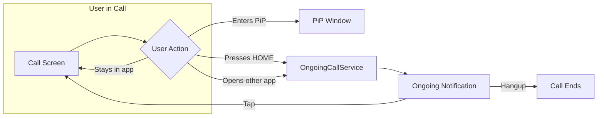

Keep calls alive when users navigate away from your app. Background handling ensures the call continues running when users press the home button, switch to another app, or lock their device.

## Overview

When a user leaves your call screen, the operating system may terminate it to free resources. The SDK provides `CometChatOngoingCallService` — a utility that:
- Keeps the call session active in the background
- Shows an ongoing notification in the status bar (Android)
- Allows users to return to the call with a single tap
- Provides a hangup action directly from the notification



## When to Use

| Scenario | Solution |
|----------|----------|
| User stays in call screen | No action needed |
| User enters Picture-in-Picture | [PiP Mode](/calls/flutter/picture-in-picture) handles this |
| User presses HOME during call | **Use CometChatOngoingCallService** |
| User switches to another app | **Use CometChatOngoingCallService** |
| Receiving calls when app is killed | [VoIP Calling](/calls/flutter/voip-calling) handles this |

<Note>
Background Handling is different from [VoIP Calling](/calls/flutter/voip-calling). VoIP handles **receiving** calls when the app is not running. Background Handling keeps an **active** call alive when the user leaves the app.
</Note>

<Warning>
`CometChatOngoingCallService` starts an Android foreground service with a persistent notification showing mute/unmute and hang up actions. On iOS, this is a no-op since iOS uses CallKit for ongoing call notifications.
</Warning>

---

## Implementation

### Step 1: Add Manifest Permissions (Android)

Add the required permissions to your `android/app/src/main/AndroidManifest.xml`:

```xml
<manifest xmlns:android="http://schemas.android.com/apk/res/android">

    <!-- Required for foreground service -->
    <uses-permission android:name="android.permission.FOREGROUND_SERVICE" />
    <uses-permission android:name="android.permission.FOREGROUND_SERVICE_MEDIA_PLAYBACK" />
    <uses-permission android:name="android.permission.FOREGROUND_SERVICE_MICROPHONE" />
    <uses-permission android:name="android.permission.FOREGROUND_SERVICE_CAMERA" />
    <uses-permission android:name="android.permission.POST_NOTIFICATIONS" />

</manifest>
```

### Step 2: Start Service on Session Join

Start the ongoing call service when the user successfully joins a call session:

```dart
import 'package:cometchat_calls_sdk/cometchat_calls_sdk.dart';

class _CallScreenState extends State<CallScreen> {
  Widget? callWidget;

  @override
  void initState() {
    super.initState();
    _setupSessionListener();
    _joinCall();
  }

  void _setupSessionListener() {
    CallSession.getInstance()?.addSessionStatusListener(
      SessionStatusListener(
        onSessionJoined: () {
          // Start the foreground service to keep call alive in background
          CometChatOngoingCallService.launch();
        },
        onSessionLeft: () {
          // Stop the service when call ends
          CometChatOngoingCallService.abort();
          if (mounted) Navigator.of(context).pop();
        },
        onConnectionClosed: () {
          CometChatOngoingCallService.abort();
        },
      ),
    );
  }

  void _joinCall() {
    final sessionSettings = CometChatCalls.SessionSettingsBuilder()
        ..setTitle("My Call");

    CometChatCalls.joinSession(
      sessionId: widget.sessionId,
      sessionSettings: sessionSettings.build(),
      onSuccess: (Widget? widget) {
        setState(() => callWidget = widget);
      },
      onError: (CometChatCallsException e) {
        debugPrint("Failed to join: ${e.message}");
        Navigator.of(context).pop();
      },
    );
  }

  @override
  void dispose() {
    // Always stop the service when screen is disposed
    CometChatOngoingCallService.abort();
    CallSession.getInstance()?.removeSessionStatusListener();
    super.dispose();
  }

  @override
  Widget build(BuildContext context) {
    return Scaffold(
      body: callWidget ?? const Center(child: CircularProgressIndicator()),
    );
  }
}
```

<Note>
Flutter listeners are not lifecycle-aware. You must manually remove listeners in `dispose()` and call `CometChatOngoingCallService.abort()` to clean up.
</Note>

---

## Complete Example

```dart
import 'package:cometchat_calls_sdk/cometchat_calls_sdk.dart';
import 'package:flutter/material.dart';

class CallScreen extends StatefulWidget {
  final String sessionId;

  const CallScreen({super.key, required this.sessionId});

  @override
  State<CallScreen> createState() => _CallScreenState();
}

class _CallScreenState extends State<CallScreen> {
  Widget? callWidget;

  @override
  void initState() {
    super.initState();
    _setupSessionListener();
    _joinCall();
  }

  void _setupSessionListener() {
    CallSession.getInstance()?.addSessionStatusListener(
      SessionStatusListener(
        onSessionJoined: () {
          // Start foreground service (Android only, no-op on iOS)
          CometChatOngoingCallService.launch();
        },
        onSessionLeft: () {
          CometChatOngoingCallService.abort();
          if (mounted) Navigator.of(context).pop();
        },
        onConnectionClosed: () {
          CometChatOngoingCallService.abort();
        },
      ),
    );
  }

  void _joinCall() {
    final sessionSettings = CometChatCalls.SessionSettingsBuilder()
        ..setTitle("My Call");

    CometChatCalls.joinSession(
      sessionId: widget.sessionId,
      sessionSettings: sessionSettings.build(),
      onSuccess: (Widget? widget) {
        setState(() => callWidget = widget);
      },
      onError: (CometChatCallsException e) {
        debugPrint("Failed to join: ${e.message}");
        if (mounted) Navigator.of(context).pop();
      },
    );
  }

  @override
  void dispose() {
    CometChatOngoingCallService.abort();
    CallSession.getInstance()?.removeSessionStatusListener();
    super.dispose();
  }

  @override
  Widget build(BuildContext context) {
    return Scaffold(
      body: callWidget ?? const Center(child: CircularProgressIndicator()),
    );
  }
}
```

---

## API Reference

### CometChatOngoingCallService

| Method | Description |
|--------|-------------|
| `launch()` | Starts the Android foreground service with an ongoing notification. No-op on iOS. |
| `abort()` | Stops the foreground service and removes the notification. No-op on iOS. |

<Note>
On iOS, ongoing call state is managed by CallKit automatically. `CometChatOngoingCallService.launch()` and `abort()` are safe to call on iOS — they simply do nothing.
</Note>

---

## Related Documentation

- [Picture-in-Picture](/calls/flutter/picture-in-picture) - Keep call visible while using other apps
- [VoIP Calling](/calls/flutter/voip-calling) - Receive calls when app is killed
- [Session Status Listener](/calls/flutter/session-status-listener) - Listen for session events
