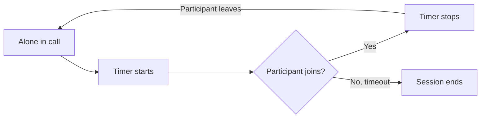

Configure automatic session termination when a user is alone in a call. Idle timeout helps manage resources by ending sessions that have no active participants.

## How Idle Timeout Works

When a user is the only participant in a call session, the idle timeout countdown begins. If no other participant joins before the timeout expires, the session automatically ends and the `onSessionTimedOut` callback is triggered.

The timer also restarts when other participants leave and only one user remains in the call.



This is useful for:
- Preventing abandoned call sessions from running indefinitely
- Managing server resources efficiently
- Providing a better user experience when the other party doesn't join

## Configure Idle Timeout

Set the idle timeout period using `setIdleTimeoutPeriod()` in `SessionSettingsBuilder`. The value is in seconds.

```dart
SessionSettings sessionSettings = CometChatCalls.SessionSettingsBuilder()
    .setIdleTimeoutPeriod(120) // 2 minutes
    .setType(SessionType.video)
    .build();

CometChatCalls.joinSession(
  sessionId: sessionId,
  sessionSettings: sessionSettings,
  onSuccess: (Widget? callWidget) {
    debugPrint("Joined session");
    // Add callWidget to your widget tree
  },
  onError: (CometChatCallsException e) {
    debugPrint("Failed: ${e.message}");
  },
);
```

| Parameter | Type | Default | Description |
|-----------|------|---------|-------------|
| `idleTimeoutPeriod` | int | 300 | Timeout in seconds when alone in the session |

## Handle Session Timeout

Listen for the `onSessionTimedOut` callback using `SessionStatusListener` to handle when the session ends due to idle timeout:

```dart
CallSession? callSession = CallSession.getInstance();

callSession?.addSessionStatusListener(SessionStatusListener(
  onSessionTimedOut: () {
    debugPrint("Session ended due to idle timeout");
    // Show message to user and navigate away from call screen
    showMessage("Call ended - no other participants joined");
    Navigator.of(context).pop();
  },
  onSessionJoined: () {},
  onSessionLeft: () {},
  onConnectionLost: () {},
  onConnectionRestored: () {},
  onConnectionClosed: () {},
));
```

<Note>
Flutter listeners are not lifecycle-aware. You must manually remove listeners in your widget's `dispose()` method to prevent memory leaks.
</Note>

## Disable Idle Timeout

To disable idle timeout and allow sessions to run indefinitely, set a value of `0`:

```dart
SessionSettings sessionSettings = CometChatCalls.SessionSettingsBuilder()
    .setIdleTimeoutPeriod(0) // Disable idle timeout
    .build();
```

<Warning>
Disabling idle timeout may result in sessions running indefinitely if participants don't join or leave properly. Use with caution.
</Warning>
