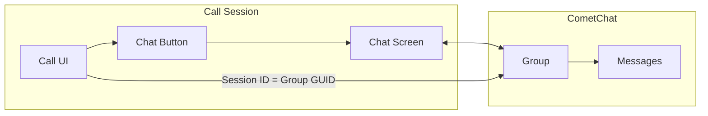

Add real-time messaging to your call experience using CometChat UI Kit. This allows participants to send text messages, share files, and communicate via chat while on a call.

## Overview

In-call chat creates a group conversation linked to the call session. When participants tap the chat button, they can:
- Send and receive text messages
- Share images, files, and media
- See message history from the current call
- Get unread message notifications via badge count



## Prerequisites

- CometChat Calls SDK integrated ([Setup](/calls/flutter/setup))
- CometChat Chat SDK integrated ([Chat SDK](/sdk/flutter/overview))
- CometChat UI Kit integrated ([UI Kit](/ui-kit/flutter/overview))

<Note>
The Chat SDK and UI Kit are separate from the Calls SDK. You'll need to add both dependencies to your `pubspec.yaml`.
</Note>

---

## Step 1: Add UI Kit Dependency

Add the CometChat UI Kit to your `pubspec.yaml`:

```yaml
dependencies:
  cometchat_chat_uikit:
    hosted:
      url: https://dart.cloudsmith.io/cometchat/cometchat/
    version: ^4.0.0
```

---

## Step 2: Enable Chat Button

Configure session settings to show the chat button:

```dart
final sessionSettings = CometChatCalls.SessionSettingsBuilder()
    ..hideChatButton(false);  // Show the chat button
```

---

## Step 3: Create Chat Group

Create or join a CometChat group using the session ID as the group GUID. This links the chat to the specific call session.

```dart
Future<void> setupChatGroup(String sessionId, String meetingName) async {
  try {
    // Try to get existing group first
    final group = await CometChat.getGroup(sessionId);
    if (!group.hasJoined) {
      await CometChat.joinGroup(sessionId, group.groupType);
    }
  } catch (e) {
    if (e is CometChatException && e.code == "ERR_GUID_NOT_FOUND") {
      // Group doesn't exist, create it
      final group = Group(
        guid: sessionId,
        name: meetingName,
        type: CometChatGroupType.public,
      );
      await CometChat.createGroup(group);
    }
  }
}
```

---

## Step 4: Handle Chat Button Click

Listen for the chat button click and navigate to your chat screen:

```dart
int unreadMessageCount = 0;

void _setupChatButtonListener() {
  CallSession.getInstance()?.addButtonClickListener(
    ButtonClickListener(
      onChatButtonClicked: () {
        // Reset unread count when opening chat
        unreadMessageCount = 0;
        CallSession.getInstance()?.setChatButtonUnreadCount(0);

        // Navigate to chat screen
        Navigator.of(context).push(
          MaterialPageRoute(
            builder: (_) => ChatScreen(
              sessionId: sessionId,
              meetingName: meetingName,
            ),
          ),
        );
      },
    ),
  );
}
```

---

## Step 5: Track Unread Messages

Listen for incoming messages and update the badge count on the chat button:

```dart
void _setupMessageListener() {
  CometChat.addMessageListener(
    "call_chat_listener",
    MessageListener(
      onTextMessageReceived: (TextMessage message) {
        // Check if message is for our call's group
        if (message.receiverType == CometChatReceiverType.group &&
            message.receiverUid == sessionId) {
          unreadMessageCount++;
          CallSession.getInstance()?.setChatButtonUnreadCount(unreadMessageCount);
        }
      },
      onMediaMessageReceived: (MediaMessage message) {
        if (message.receiverType == CometChatReceiverType.group &&
            message.receiverUid == sessionId) {
          unreadMessageCount++;
          CallSession.getInstance()?.setChatButtonUnreadCount(unreadMessageCount);
        }
      },
    ),
  );
}
```

<Note>
Remember to remove the message listener in `dispose()` to prevent memory leaks:
```dart
CometChat.removeMessageListener("call_chat_listener");
```
</Note>

---

## Step 6: Create Chat Screen

Create a chat screen using UI Kit components:

```dart
import 'package:cometchat_chat_uikit/cometchat_chat_uikit.dart';
import 'package:flutter/material.dart';

class ChatScreen extends StatefulWidget {
  final String sessionId;
  final String meetingName;

  const ChatScreen({
    super.key,
    required this.sessionId,
    required this.meetingName,
  });

  @override
  State<ChatScreen> createState() => _ChatScreenState();
}

class _ChatScreenState extends State<ChatScreen> {
  Group? group;
  bool isLoading = true;

  @override
  void initState() {
    super.initState();
    _loadGroup();
  }

  Future<void> _loadGroup() async {
    try {
      final fetchedGroup = await CometChat.getGroup(widget.sessionId);
      if (!fetchedGroup.hasJoined) {
        await CometChat.joinGroup(widget.sessionId, fetchedGroup.groupType);
      }
      setState(() {
        group = fetchedGroup;
        isLoading = false;
      });
    } catch (e) {
      if (e is CometChatException && e.code == "ERR_GUID_NOT_FOUND") {
        final newGroup = Group(
          guid: widget.sessionId,
          name: widget.meetingName,
          type: CometChatGroupType.public,
        );
        final createdGroup = await CometChat.createGroup(newGroup);
        setState(() {
          group = createdGroup;
          isLoading = false;
        });
      } else {
        setState(() => isLoading = false);
      }
    }
  }

  @override
  Widget build(BuildContext context) {
    if (isLoading) {
      return const Scaffold(
        body: Center(child: CircularProgressIndicator()),
      );
    }

    if (group == null) {
      return Scaffold(
        appBar: AppBar(title: const Text("Chat")),
        body: const Center(child: Text("Failed to load chat")),
      );
    }

    return CometChatMessages(group: group!);
  }
}
```

---

## Complete Example

Here's the complete call screen with in-call chat integration:

```dart
import 'package:cometchat_calls_sdk/cometchat_calls_sdk.dart';
import 'package:flutter/material.dart';

class CallScreen extends StatefulWidget {
  final String sessionId;
  final String meetingName;

  const CallScreen({
    super.key,
    required this.sessionId,
    required this.meetingName,
  });

  @override
  State<CallScreen> createState() => _CallScreenState();
}

class _CallScreenState extends State<CallScreen> {
  Widget? callWidget;
  int unreadMessageCount = 0;

  @override
  void initState() {
    super.initState();
    _setupChatGroup();
    _setupChatButtonListener();
    _setupMessageListener();
    _joinCall();
  }

  Future<void> _setupChatGroup() async {
    try {
      final group = await CometChat.getGroup(widget.sessionId);
      if (!group.hasJoined) {
        await CometChat.joinGroup(widget.sessionId, group.groupType);
      }
    } catch (e) {
      if (e is CometChatException && e.code == "ERR_GUID_NOT_FOUND") {
        final group = Group(
          guid: widget.sessionId,
          name: widget.meetingName,
          type: CometChatGroupType.public,
        );
        await CometChat.createGroup(group);
      }
    }
  }

  void _setupChatButtonListener() {
    CallSession.getInstance()?.addButtonClickListener(
      ButtonClickListener(
        onChatButtonClicked: () {
          unreadMessageCount = 0;
          CallSession.getInstance()?.setChatButtonUnreadCount(0);

          Navigator.of(context).push(
            MaterialPageRoute(
              builder: (_) => ChatScreen(
                sessionId: widget.sessionId,
                meetingName: widget.meetingName,
              ),
            ),
          );
        },
      ),
    );
  }

  void _setupMessageListener() {
    CometChat.addMessageListener(
      "call_chat_listener",
      MessageListener(
        onTextMessageReceived: (TextMessage message) {
          if (message.receiverType == CometChatReceiverType.group &&
              message.receiverUid == widget.sessionId) {
            unreadMessageCount++;
            CallSession.getInstance()
                ?.setChatButtonUnreadCount(unreadMessageCount);
          }
        },
      ),
    );
  }

  void _joinCall() {
    final sessionSettings = CometChatCalls.SessionSettingsBuilder()
        ..setTitle(widget.meetingName)
        ..hideChatButton(false);

    CometChatCalls.joinSession(
      sessionId: widget.sessionId,
      sessionSettings: sessionSettings.build(),
      onSuccess: (Widget? widget) {
        setState(() => callWidget = widget);
      },
      onError: (CometChatCallsException e) {
        debugPrint("Join failed: ${e.message}");
      },
    );
  }

  @override
  void dispose() {
    CometChat.removeMessageListener("call_chat_listener");
    CallSession.getInstance()?.removeButtonClickListener();
    super.dispose();
  }

  @override
  Widget build(BuildContext context) {
    return Scaffold(
      body: callWidget ?? const Center(child: CircularProgressIndicator()),
    );
  }
}
```

---

## Related Documentation

- [UI Kit Overview](/ui-kit/flutter/overview) - CometChat UI Kit components
- [Button Click Listener](/calls/flutter/button-click-listener) - Handle button clicks
- [SessionSettingsBuilder](/calls/flutter/session-settings) - Configure chat button visibility
