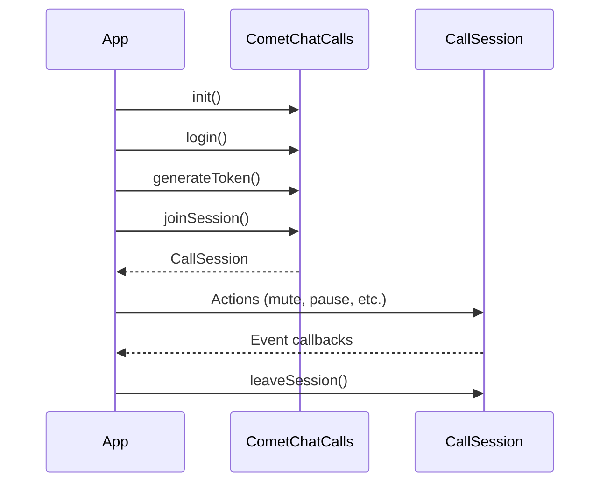

<Warning>
  This is a **beta release** of the standalone Calls SDK. APIs and features may change before the stable release. For the current stable calling integration, see the [Flutter Calling Overview](/sdk/flutter/calling-overview).
</Warning>

The CometChat Calls SDK enables real-time voice and video calling capabilities in your Flutter application. Built on top of WebRTC, it provides a complete calling solution with built-in UI components and extensive customization options.

<Info>
**Faster Integration with UI Kits**

If you're using CometChat UI Kits, voice and video calling can be quickly integrated:
- Incoming & outgoing call screens
- Call buttons with one-tap calling
- Call logs with history

👉 [Flutter UI Kit Calling Integration](/ui-kit/flutter/calling-integration)

Use this Calls SDK directly only if you need custom call UI or advanced control.
</Info>

## Prerequisites

Before integrating the Calls SDK, ensure you have:

1. **CometChat Account**: [Sign up](https://app.cometchat.com/signup) and create an app to get your App ID, Region, and API Key
2. **CometChat Users**: Users must exist in CometChat to use calling features. For testing, create users via the [Dashboard](https://app.cometchat.com) or [REST API](/rest-api/chat-apis/users/create-user). Authentication is handled by the Calls SDK - see [Authentication](/calls/flutter/authentication)
3. **Flutter Requirements**:
   - Flutter SDK: `>=2.5.0`
   - Dart SDK: `>=2.17.0 <4.0.0`
   - Android: Minimum API Level 24 (Android 7.0)
   - iOS: Minimum iOS 12
4. **Permissions**: Camera and microphone permissions for video/audio calls

## Call Flow

## Features

<CardGroup cols={2}>

<Card title="Ringing" icon="phone" href="/calls/flutter/ringing">
  Incoming and outgoing call notifications with accept/reject functionality
</Card>

<Card title="Call Layouts" icon="grid-2" href="/calls/flutter/call-layouts">
  Tile and Spotlight view modes for different call scenarios
</Card>

<Card title="Audio Modes" icon="volume-high" href="/calls/flutter/audio-modes">
  Switch between speaker, earpiece, and Bluetooth
</Card>

<Card title="Recording" icon="circle-dot" href="/calls/flutter/recording">
  Record call sessions for later playback
</Card>

<Card title="Call Logs" icon="clock-rotate-left" href="/calls/flutter/call-logs">
  Retrieve call history and details
</Card>

<Card title="Participant Management" icon="users" href="/calls/flutter/participant-management">
  Mute, pin, and manage call participants
</Card>

<Card title="Screen Sharing" icon="display" href="/calls/flutter/screen-sharing">
  View screen shares from web participants
</Card>

<Card title="Picture-in-Picture" icon="window-restore" href="/calls/flutter/picture-in-picture">
  Continue calls while using other apps
</Card>

<Card title="Raise Hand" icon="hand" href="/calls/flutter/raise-hand">
  Signal to get attention during calls
</Card>

<Card title="Idle Timeout" icon="timer" href="/calls/flutter/idle-timeout">
  Automatic session termination when alone in a call
</Card>

</CardGroup>

## Architecture

The SDK is organized around these core components:

| Component | Description |
|-----------|-------------|
| `CometChatCalls` | Main entry point for SDK initialization, authentication, and session management |
| `CallAppSettings` | Configuration for SDK initialization (App ID, Region) |
| `SessionSettings` | Configuration for individual call sessions |
| `CallSession` | Singleton that manages the active call and provides control methods |
| `Listeners` | Event interfaces for session, participant, media, and UI events |

## Sample App

<CardGroup cols={2}>

<Card title="Sample App" icon="github" href="https://github.com/cometchat/calls-sdk-flutter/tree/v5/sample-apps/cometchat-calls-sample-app-flutter">
  Explore the Flutter Calls SDK sample app on GitHub
</Card>

<Card title="Changelog" icon="list-check" href="https://github.com/cometchat/calls-sdk-flutter/releases">
  View the latest releases and changes
</Card>

</CardGroup>
