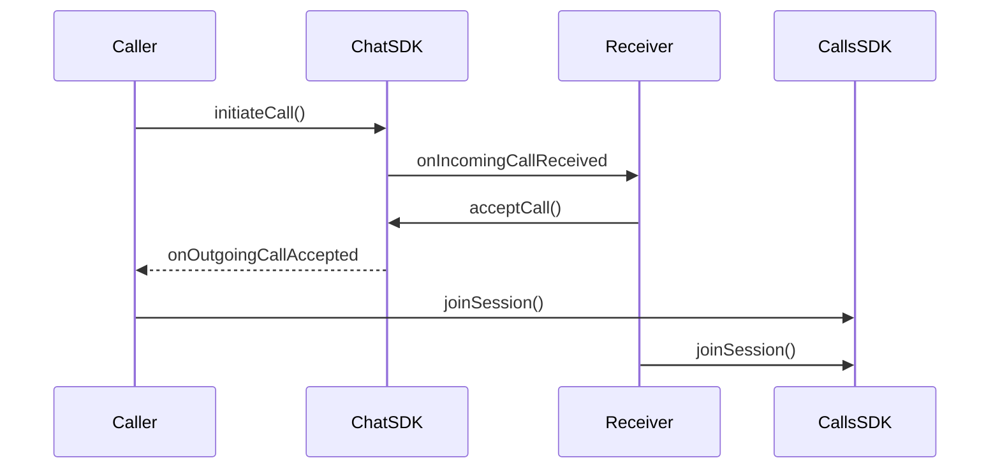
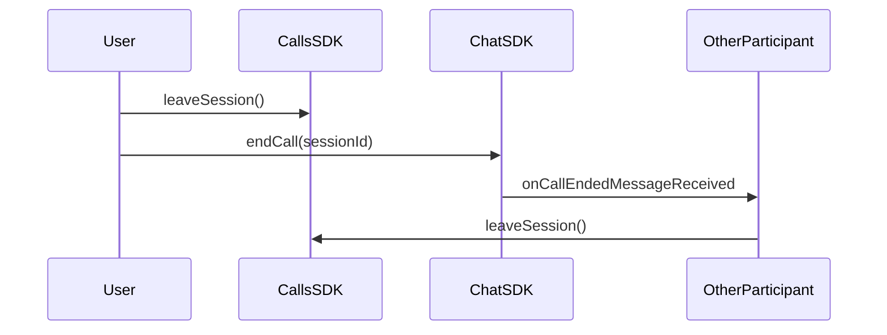

Implement incoming and outgoing call notifications with accept/reject functionality. Ringing enables real-time call signaling between users, allowing them to initiate calls and respond to incoming call requests.

<Note>
Ringing functionality requires the CometChat Chat SDK for Flutter to be integrated alongside the Calls SDK. The Chat SDK handles call signaling (initiating, accepting, rejecting calls), while the Calls SDK manages the actual call session.
</Note>

## How Ringing Works

The ringing flow involves two SDKs working together:

1. **Chat SDK** - Handles call signaling (initiate, accept, reject, cancel)
2. **Calls SDK** - Manages the actual call session once accepted



## Initiate a Call

Use the Chat SDK to initiate a call to a user or group:

```dart
String receiverID = "USER_ID";
String receiverType = CometChatConstants.receiverTypeUser;
String callType = CometChatConstants.callTypeVideo;

Call call = Call(receiverID, receiverType, callType);

CometChat.initiateCall(call,
  onSuccess: (Call call) {
    debugPrint("Call initiated: ${call.sessionId}");
    // Show outgoing call UI
  },
  onError: (CometChatException e) {
    debugPrint("Call initiation failed: ${e.message}");
  },
);
```

| Parameter | Type | Description |
|-----------|------|-------------|
| `receiverID` | String | UID of the user or GUID of the group to call |
| `receiverType` | String | `CometChatConstants.receiverTypeUser` or `receiverTypeGroup` |
| `callType` | String | `CometChatConstants.callTypeVideo` or `callTypeAudio` |
| `timeout` | int | Optional. The timeout duration in seconds for the call to be answered before it's automatically cancelled. Defaults to 45 seconds. |

## Call Timeout

By default, if the receiver does not answer within **45 seconds**, the call is automatically marked as `unanswered` and the caller receives the `onOutgoingCallRejected` callback. You can customize this duration by passing a `timeout` parameter (in seconds) when initiating the call.

```dart
String receiverID = "USER_ID";
String receiverType = CometChatConstants.receiverTypeUser;
String callType = CometChatConstants.callTypeVideo;

Call call = Call(receiverID, receiverType, callType);

// Set a custom timeout of 30 seconds
CometChat.initiateCall(call,
  timeout: 30,
  onSuccess: (Call call) {
    debugPrint("Call initiated: ${call.sessionId}");
  },
  onError: (CometChatException e) {
    debugPrint("Call initiation failed: ${e.message}");
  },
);
```

| Parameter | Type | Description |
|-----------|------|-------------|
| `call` | Call | The call object with receiver and call type details |
| `timeout` | int | Time in seconds to wait before marking the call as unanswered. Defaults to `45`. Values ≤ 0 fall back to the default `45` seconds. |

When the timeout expires without the call being accepted, the SDK automatically:
1. Sends an `unanswered` call status to the server.
2. Triggers the `onOutgoingCallRejected` callback on the caller's side with the call status set to `unanswered`.
3. Cleans up the call session.

<Note>
If the call is accepted, rejected, or cancelled before the timeout expires, the timer is automatically stopped and the timeout has no effect.
</Note>

## Listen for Incoming Calls

Register a call listener to receive incoming call notifications:

```dart
String listenerID = "UNIQUE_LISTENER_ID";

CometChat.addCallListener(listenerID, CallListener(
  onIncomingCallReceived: (Call call) {
    debugPrint("Incoming call from: ${call.callInitiator?.name}");
    // Show incoming call UI with accept/reject options
  },
  onOutgoingCallAccepted: (Call call) {
    debugPrint("Call accepted, joining session...");
    joinCallSession(call.sessionId!);
  },
  onOutgoingCallRejected: (Call call) {
    debugPrint("Call rejected");
    // Dismiss outgoing call UI
  },
  onIncomingCallCancelled: (Call call) {
    debugPrint("Incoming call cancelled");
    // Dismiss incoming call UI
  },
  onCallEndedMessageReceived: (Call call) {
    debugPrint("Call ended");
  },
));
```

| Callback | Description |
|----------|-------------|
| `onIncomingCallReceived` | A new incoming call is received |
| `onOutgoingCallAccepted` | The receiver accepted your outgoing call |
| `onOutgoingCallRejected` | The receiver rejected your outgoing call, or the call timed out as unanswered |
| `onIncomingCallCancelled` | The caller cancelled the incoming call |
| `onCallEndedMessageReceived` | The call has ended |

<Warning>
Remember to remove the call listener when it's no longer needed to prevent memory leaks. In Flutter, you must manually remove listeners in your widget's `dispose()` method:
```dart
CometChat.removeCallListener(listenerID);
```
</Warning>

## Accept a Call

When an incoming call is received, accept it using the Chat SDK:

```dart
void acceptIncomingCall(String sessionId) {
  CometChat.acceptCall(sessionId,
    onSuccess: (Call call) {
      debugPrint("Call accepted");
      joinCallSession(call.sessionId!);
    },
    onError: (CometChatException e) {
      debugPrint("Accept call failed: ${e.message}");
    },
  );
}
```

## Reject a Call

Reject an incoming call:

```dart
void rejectIncomingCall(String sessionId) {
  String status = CometChatConstants.callStatusRejected;

  CometChat.rejectCall(sessionId, status,
    onSuccess: (Call call) {
      debugPrint("Call rejected");
      // Dismiss incoming call UI
    },
    onError: (CometChatException e) {
      debugPrint("Reject call failed: ${e.message}");
    },
  );
}
```

## Cancel a Call

Cancel an outgoing call before it's answered:

```dart
void cancelOutgoingCall(String sessionId) {
  String status = CometChatConstants.callStatusCancelled;

  CometChat.rejectCall(sessionId, status,
    onSuccess: (Call call) {
      debugPrint("Call cancelled");
      // Dismiss outgoing call UI
    },
    onError: (CometChatException e) {
      debugPrint("Cancel call failed: ${e.message}");
    },
  );
}
```

## Join the Call Session

After accepting a call (or when your outgoing call is accepted), join the call session using the Calls SDK:

```dart
void joinCallSession(String sessionId) {
  SessionSettings sessionSettings = CometChatCalls.SessionSettingsBuilder()
      .setType(SessionType.video)
      .build();

  CometChatCalls.joinSession(
    sessionId: sessionId,
    sessionSettings: sessionSettings,
    onSuccess: (Widget? callWidget) {
      debugPrint("Joined call session");
      // Place callWidget in your widget tree to render the call UI
    },
    onError: (CometChatCallsException e) {
      debugPrint("Failed to join: ${e.message}");
    },
  );
}
```

<Note>
In Flutter, `joinSession` returns a `Widget?` through the `onSuccess` callback. You must place this widget in your Flutter widget tree to render the call UI. See [Join Session](/calls/flutter/join-session) for more details.
</Note>

## End a Call

Properly ending a call requires coordination between both SDKs to ensure all participants are notified and call logs are recorded correctly.

<Warning>
Always call `CometChat.endCall()` when ending a call. This notifies the other participant and ensures the call is properly logged. Without this, the other user won't know the call has ended and call logs may be incomplete.
</Warning>



When using the default call UI, listen for the end call button click using `ButtonClickListener` and call `endCall()`:

```dart
CallSession? callSession = CallSession.getInstance();

// Listen for end call button click
callSession?.addButtonClickListener(ButtonClickListener(
  onLeaveSessionButtonClicked: () {
    endCall(currentSessionId);
  },
  // Other callbacks...
));

void endCall(String sessionId) {
  // 1. Leave the call session (Calls SDK)
  CallSession.getInstance()?.leaveSession();

  // 2. Notify other participants (Chat SDK)
  CometChat.endCall(sessionId,
    onSuccess: (Call call) {
      debugPrint("Call ended successfully");
      Navigator.of(context).pop();
    },
    onError: (CometChatException e) {
      debugPrint("End call failed: ${e.message}");
      Navigator.of(context).pop();
    },
  );
}
```

The other participant receives `onCallEndedMessageReceived` callback and should leave the session:

```dart
CometChat.addCallListener(listenerID, CallListener(
  onCallEndedMessageReceived: (Call call) {
    CallSession.getInstance()?.leaveSession();
    Navigator.of(context).pop();
  },
  // Other callbacks...
));
```

## Call Status Values

| Status | Description |
|--------|-------------|
| `initiated` | Call has been initiated but not yet answered |
| `ongoing` | Call is currently in progress |
| `busy` | Receiver is busy on another call |
| `rejected` | Receiver rejected the call |
| `cancelled` | Caller cancelled before receiver answered |
| `ended` | Call ended normally |
| `missed` | Receiver didn't answer in time |
| `unanswered` | Call was not answered within the timeout duration |