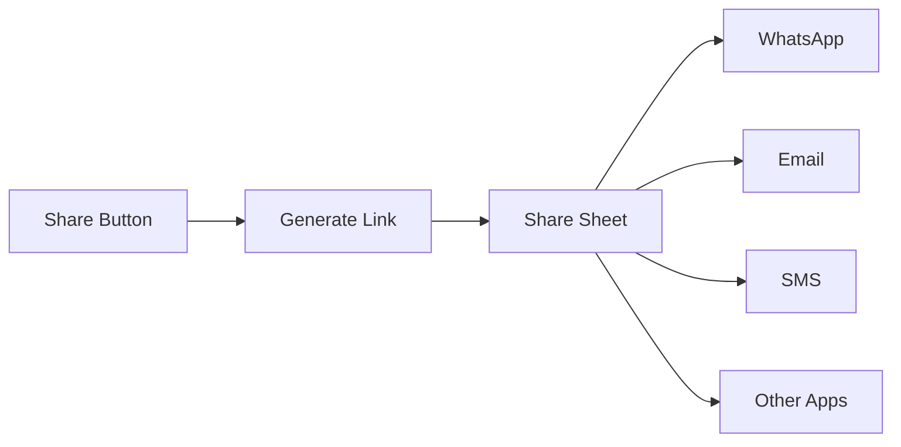

Enable participants to invite others to join a call by sharing a meeting link. The share invite button opens the platform's native share sheet, allowing users to send the invite via any messaging app, email, or social media.

## Overview

The share invite feature:
- Generates a shareable meeting link with session ID
- Opens the native share sheet (Android and iOS)
- Works with any app that supports text sharing
- Can be triggered from the default button or custom UI



## Prerequisites

- CometChat Calls SDK integrated ([Setup](/calls/flutter/setup))
- Active call session ([Join Session](/calls/flutter/join-session))
- `share_plus` package (or equivalent) for native sharing

---

## Step 1: Enable Share Button

Configure session settings to show the share invite button:

```dart
final sessionSettings = CometChatCalls.SessionSettingsBuilder()
    ..hideShareInviteButton(false);  // Show the share button
```

---

## Step 2: Handle Share Button Click

Listen for the share button click using `ButtonClickListener`:

```dart
void _setupShareButtonListener() {
  CallSession.getInstance()?.addButtonClickListener(
    ButtonClickListener(
      onShareInviteButtonClicked: () {
        _shareInviteLink();
      },
    ),
  );
}
```

---

## Step 3: Generate and Share Link

Create the meeting invite URL and open the share sheet using the `share_plus` package:

```dart
import 'package:share_plus/share_plus.dart';

void _shareInviteLink() {
  final inviteUrl = _generateInviteUrl(sessionId, meetingName);

  Share.share(
    inviteUrl,
    subject: "Join my meeting: $meetingName",
  );
}

String _generateInviteUrl(String sessionId, String meetingName) {
  final encodedName = Uri.encodeComponent(meetingName);
  // Replace with your app's deep link or web URL
  return "https://yourapp.com/join?sessionId=$sessionId&name=$encodedName";
}
```

---

## Custom Share Message

Customize the share message with more details:

```dart
void _shareInviteLink() {
  final inviteUrl = _generateInviteUrl(sessionId, meetingName);

  final shareMessage = """
📞 Join my meeting: $meetingName

Click the link below to join:
$inviteUrl

Meeting ID: $sessionId
""";

  Share.share(
    shareMessage,
    subject: "Meeting Invite: $meetingName",
  );
}
```

---

## Deep Link Handling

To allow users to join directly from the shared link, implement deep link handling in your Flutter app.

### Configure Deep Links

Add deep link configuration for both platforms:

**Android** — Add intent filters to `android/app/src/main/AndroidManifest.xml`:

```xml
<activity
    android:name=".MainActivity"
    android:exported="true">
    
    <!-- App Links (HTTPS) -->
    <intent-filter android:autoVerify="true">
        <action android:name="android.intent.action.VIEW" />
        <category android:name="android.intent.category.DEFAULT" />
        <category android:name="android.intent.category.BROWSABLE" />
        <data
            android:scheme="https"
            android:host="yourapp.com"
            android:pathPrefix="/join" />
    </intent-filter>
    
    <!-- Custom Scheme -->
    <intent-filter>
        <action android:name="android.intent.action.VIEW" />
        <category android:name="android.intent.category.DEFAULT" />
        <category android:name="android.intent.category.BROWSABLE" />
        <data
            android:scheme="yourapp"
            android:host="join" />
    </intent-filter>
</activity>
```

**iOS** — Add Associated Domains in Xcode and configure `ios/Runner/Info.plist`:

```xml
<key>CFBundleURLTypes</key>
<array>
    <dict>
        <key>CFBundleURLSchemes</key>
        <array>
            <string>yourapp</string>
        </array>
    </dict>
</array>
```

### Handle Deep Link in Flutter

```dart
import 'package:app_links/app_links.dart';

class DeepLinkHandler {
  static final _appLinks = AppLinks();

  static void initialize(BuildContext context) {
    // Handle link when app is already running
    _appLinks.uriLinkStream.listen((Uri uri) {
      _handleDeepLink(context, uri);
    });

    // Handle link that launched the app
    _appLinks.getInitialLink().then((Uri? uri) {
      if (uri != null) _handleDeepLink(context, uri);
    });
  }

  static void _handleDeepLink(BuildContext context, Uri uri) {
    final sessionId = uri.queryParameters['sessionId'];
    final meetingName = uri.queryParameters['name'] ?? 'Meeting';

    if (sessionId != null) {
      // Check if user is logged in, then navigate to call screen
      Navigator.of(context).push(
        MaterialPageRoute(
          builder: (_) => CallScreen(
            sessionId: sessionId,
            meetingName: meetingName,
          ),
        ),
      );
    }
  }
}
```

---

## Custom Share Button

If you want to use a custom share button instead of the default one, hide the default button and implement your own:

```dart
// Hide default share button
final sessionSettings = CometChatCalls.SessionSettingsBuilder()
    ..hideShareInviteButton(true);

// Add your custom button in the widget tree
ElevatedButton(
  onPressed: _shareInviteLink,
  child: const Text("Share Invite"),
)
```

---

## Complete Example

```dart
import 'package:cometchat_calls_sdk/cometchat_calls_sdk.dart';
import 'package:flutter/material.dart';
import 'package:share_plus/share_plus.dart';

class CallScreen extends StatefulWidget {
  final String sessionId;
  final String meetingName;

  const CallScreen({
    super.key,
    required this.sessionId,
    required this.meetingName,
  });

  @override
  State<CallScreen> createState() => _CallScreenState();
}

class _CallScreenState extends State<CallScreen> {
  Widget? callWidget;

  @override
  void initState() {
    super.initState();
    _setupShareButtonListener();
    _joinCall();
  }

  void _setupShareButtonListener() {
    CallSession.getInstance()?.addButtonClickListener(
      ButtonClickListener(
        onShareInviteButtonClicked: () {
          _shareInviteLink();
        },
      ),
    );
  }

  void _shareInviteLink() {
    final inviteUrl = _generateInviteUrl(widget.sessionId, widget.meetingName);

    final shareMessage = "📞 Join my meeting: ${widget.meetingName}\n\n$inviteUrl";

    Share.share(
      shareMessage,
      subject: "Meeting Invite: ${widget.meetingName}",
    );
  }

  String _generateInviteUrl(String sessionId, String meetingName) {
    final encodedName = Uri.encodeComponent(meetingName);
    return "https://yourapp.com/join?sessionId=$sessionId&name=$encodedName";
  }

  void _joinCall() {
    final sessionSettings = CometChatCalls.SessionSettingsBuilder()
        ..setTitle(widget.meetingName)
        ..hideShareInviteButton(false);

    CometChatCalls.joinSession(
      sessionId: widget.sessionId,
      sessionSettings: sessionSettings.build(),
      onSuccess: (Widget? widget) {
        setState(() => callWidget = widget);
      },
      onError: (CometChatCallsException e) {
        debugPrint("Join failed: ${e.message}");
      },
    );
  }

  @override
  void dispose() {
    CallSession.getInstance()?.removeButtonClickListener();
    super.dispose();
  }

  @override
  Widget build(BuildContext context) {
    return Scaffold(
      body: callWidget ?? const Center(child: CircularProgressIndicator()),
    );
  }
}
```

---

## Related Documentation

- [Button Click Listener](/calls/flutter/button-click-listener) - Handle button clicks
- [SessionSettingsBuilder](/calls/flutter/session-settings) - Configure share button visibility
- [Join Session](/calls/flutter/join-session) - Join a call session
