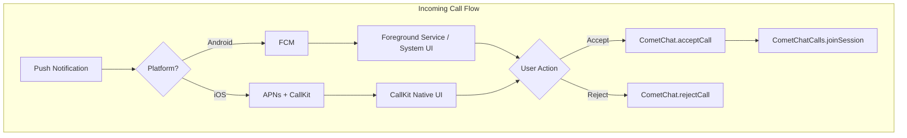
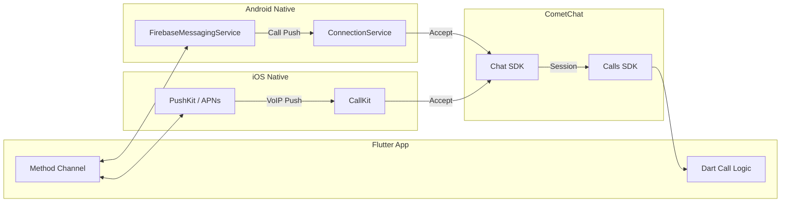
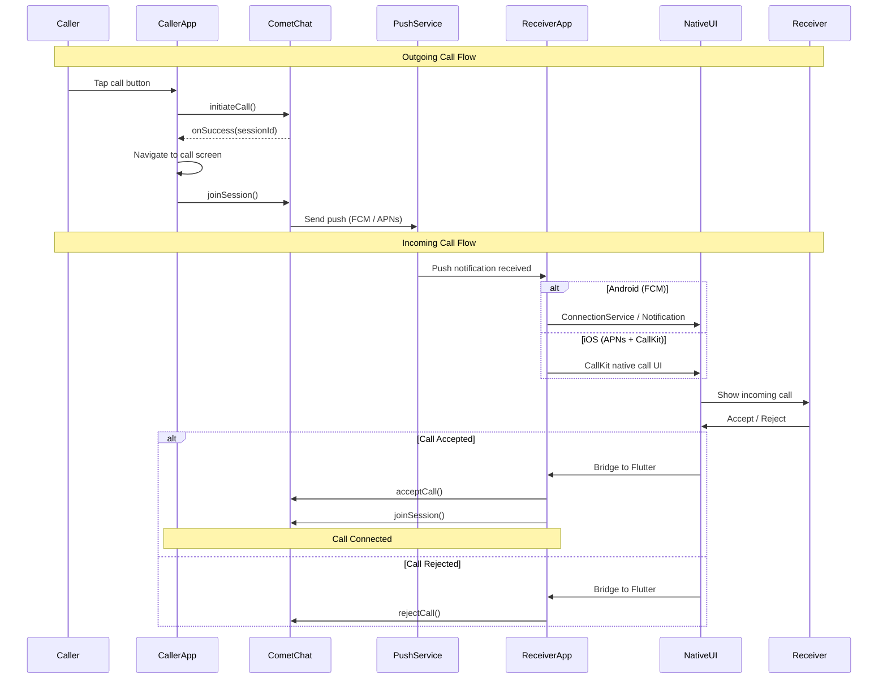

Implement native VoIP calling that works when your app is in the background or killed. This guide shows how to integrate platform-specific push notification services with CometChat to display system call UI and provide a native calling experience.

## Overview

VoIP calling differs from [basic in-app ringing](/calls/flutter/ringing) by leveraging platform-native call frameworks to:
- Show incoming calls on lock screen with system UI
- Handle calls when app is in background or killed
- Integrate with Bluetooth, car systems, and wearables
- Provide consistent call experience across devices



## Prerequisites

Before implementing VoIP calling, ensure you have:

- [CometChat Chat SDK](/sdk/flutter/overview) and [Calls SDK](/calls/flutter/setup) integrated
- Push notifications configured for both platforms:
  - [Firebase Cloud Messaging (FCM)](/notifications/android-push-notifications) for Android
  - [APNs](/notifications/ios-push-notifications) for iOS
- [Push notifications enabled](/notifications/push-integration) in CometChat Dashboard

<Warning>
VoIP calling in Flutter requires native platform code alongside your Dart code. The push notification handling and system call UI integration must be implemented natively on each platform, then bridged to Flutter via method channels or platform-specific plugins.
</Warning>

<Note>
This documentation builds on the [Ringing](/calls/flutter/ringing) functionality. Make sure you understand basic call signaling before implementing VoIP.
</Note>

---

## Architecture Overview

The VoIP implementation consists of platform-specific components working together with your Flutter app:



| Component | Platform | Purpose |
|-----------|----------|---------|
| `FirebaseMessagingService` | Android | Receives push notifications for incoming calls when app is in background |
| `ConnectionService` | Android | Android Telecom framework integration — manages call state with the system |
| `PushKit` / APNs | iOS | Receives VoIP push notifications to wake the app |
| `CallKit` | iOS | Displays native iOS call UI on lock screen and in-app |
| Method Channel | Flutter | Bridges native call events to Dart code |

---

## Android: FCM Integration

On Android, incoming calls are delivered via Firebase Cloud Messaging (FCM). When a call notification arrives while the app is in the background, you use Android's `ConnectionService` to show the system call UI.

### Step 1: Add FCM Dependencies

Add Firebase Messaging to your Android `build.gradle`:

```groovy
dependencies {
    implementation 'com.google.firebase:firebase-messaging:23.4.0'
}
```

### Step 2: Create FirebaseMessagingService

In your Android native code (`android/app/src/main/`), create a service to handle incoming call push notifications:

```kotlin
class CallFirebaseMessagingService : FirebaseMessagingService() {

    override fun onMessageReceived(remoteMessage: RemoteMessage) {
        val data = remoteMessage.data

        // Check if this is a call notification
        if (data["type"] == "call") {
            handleIncomingCall(data)
        }
    }

    private fun handleIncomingCall(data: Map<String, String>) {
        val sessionId = data["sessionId"] ?: return
        val callerName = data["senderName"] ?: "Unknown"
        val callerUid = data["senderUid"] ?: return
        val callType = data["callType"] ?: "video"

        // If app is in foreground, let CometChat's CallListener handle it
        if (isAppInForeground()) return

        // App is in background/killed — show system call UI
        // Use ConnectionService or a high-priority notification
        showIncomingCallNotification(sessionId, callerName, callerUid, callType)
    }

    override fun onNewToken(token: String) {
        // Register the FCM token with CometChat
        // Bridge to Flutter via method channel or shared preferences
    }
}
```

### Step 3: Register in AndroidManifest

```xml
<manifest xmlns:android="http://schemas.android.com/apk/res/android">

    <!-- VoIP permissions -->
    <uses-permission android:name="android.permission.FOREGROUND_SERVICE" />
    <uses-permission android:name="android.permission.FOREGROUND_SERVICE_PHONE_CALL" />
    <uses-permission android:name="android.permission.USE_FULL_SCREEN_INTENT" />
    <uses-permission android:name="android.permission.MANAGE_OWN_CALLS" />
    <uses-permission android:name="android.permission.POST_NOTIFICATIONS" />

    <application>
        <service
            android:name=".CallFirebaseMessagingService"
            android:exported="false">
            <intent-filter>
                <action android:name="com.google.firebase.MESSAGING_EVENT" />
            </intent-filter>
        </service>
    </application>
</manifest>
```

<Note>
For the full Android `ConnectionService` implementation including `PhoneAccount` registration, `CallConnection`, and `CallNotificationManager`, refer to the [Android VoIP Calling](/calls/android/voip-calling) documentation. The native Android code is identical whether used in a native Android app or a Flutter app's Android module.
</Note>

---

## iOS: APNs + CallKit Integration

On iOS, incoming VoIP calls are delivered via Apple Push Notification service (APNs) with VoIP push certificates. CallKit provides the native iOS call UI.

### Step 1: Enable Capabilities

In Xcode, enable the following capabilities for your iOS target:
- **Push Notifications**
- **Background Modes** → Voice over IP, Remote notifications

### Step 2: Configure PushKit and CallKit

In your iOS native code (`ios/Runner/`), set up PushKit to receive VoIP pushes and CallKit to display the call UI:

```swift
import PushKit
import CallKit
import Flutter

class CallKitManager: NSObject, PKPushRegistryDelegate, CXProviderDelegate {
    static let shared = CallKitManager()
    
    private let provider: CXProvider
    private let voipRegistry = PKPushRegistry(queue: .main)
    private var methodChannel: FlutterMethodChannel?
    
    override init() {
        let config = CXProviderConfiguration()
        config.supportsVideo = true
        config.maximumCallsPerGroup = 1
        config.supportedHandleTypes = [.generic]
        provider = CXProvider(configuration: config)
        
        super.init()
        provider.setDelegate(self, queue: nil)
        voipRegistry.delegate = self
        voipRegistry.desiredPushTypes = [.voIP]
    }
    
    func setMethodChannel(_ channel: FlutterMethodChannel) {
        methodChannel = channel
    }
    
    // MARK: - PKPushRegistryDelegate
    
    func pushRegistry(
        _ registry: PKPushRegistry,
        didUpdate pushCredentials: PKPushCredentials,
        for type: PKPushType
    ) {
        let token = pushCredentials.token
            .map { String(format: "%02x", $0) }
            .joined()
        // Register VoIP token with CometChat
        methodChannel?.invokeMethod("onVoIPToken", arguments: token)
    }
    
    func pushRegistry(
        _ registry: PKPushRegistry,
        didReceiveIncomingPushWith payload: PKPushPayload,
        for type: PKPushType,
        completion: @escaping () -> Void
    ) {
        guard type == .voIP else { completion(); return }
        
        let data = payload.dictionaryPayload
        let sessionId = data["sessionId"] as? String ?? ""
        let callerName = data["senderName"] as? String ?? "Unknown"
        let callType = data["callType"] as? String ?? "video"
        let hasVideo = callType == "video"
        
        // Report incoming call to CallKit
        let update = CXCallUpdate()
        update.remoteHandle = CXHandle(type: .generic, value: sessionId)
        update.localizedCallerName = callerName
        update.hasVideo = hasVideo
        
        let uuid = UUID()
        provider.reportNewIncomingCall(with: uuid, update: update) { error in
            if let error = error {
                print("Failed to report call: \(error)")
            }
            completion()
        }
    }
    
    // MARK: - CXProviderDelegate
    
    func provider(_ provider: CXProvider, perform action: CXAnswerCallAction) {
        // User tapped Accept — bridge to Flutter
        methodChannel?.invokeMethod("onCallAccepted", arguments: nil)
        action.fulfill()
    }
    
    func provider(_ provider: CXProvider, perform action: CXEndCallAction) {
        // User tapped Decline or End — bridge to Flutter
        methodChannel?.invokeMethod("onCallDeclined", arguments: nil)
        action.fulfill()
    }
    
    func providerDidReset(_ provider: CXProvider) {
        // Provider was reset — clean up
    }
}
```

### Step 3: Bridge to Flutter

Set up a method channel in your `AppDelegate` to communicate between native iOS code and Flutter:

```swift
import Flutter

@UIApplicationMain
@objc class AppDelegate: FlutterAppDelegate {
    override func application(
        _ application: UIApplication,
        didFinishLaunchingWithOptions launchOptions: [UIApplication.LaunchOptionsKey: Any]?
    ) -> Bool {
        let controller = window?.rootViewController as! FlutterViewController
        let channel = FlutterMethodChannel(
            name: "com.yourapp/calls",
            binaryMessenger: controller.binaryMessenger
        )
        
        CallKitManager.shared.setMethodChannel(channel)
        
        channel.setMethodCallHandler { (call, result) in
            switch call.method {
            case "endCall":
                // End CallKit call from Flutter side
                result(nil)
            default:
                result(FlutterMethodNotImplemented)
            }
        }
        
        GeneratedPluginRegistrant.register(with: self)
        return super.application(application, didFinishLaunchingWithOptions: launchOptions)
    }
}
```

---

## Flutter: Handle Call Events

On the Dart side, set up a method channel to receive call events from native code and manage the call lifecycle:

```dart
import 'package:flutter/services.dart';
import 'package:cometchat_calls_sdk/cometchat_calls_sdk.dart';

class VoIPCallManager {
  static const _channel = MethodChannel('com.yourapp/calls');

  static void initialize() {
    _channel.setMethodCallHandler(_handleMethodCall);
  }

  static Future<void> _handleMethodCall(MethodCall call) async {
    switch (call.method) {
      case 'onCallAccepted':
        // User accepted the call from native UI
        await _acceptAndJoinCall();
        break;
      case 'onCallDeclined':
        // User declined the call from native UI
        await _rejectCall();
        break;
      case 'onVoIPToken':
        // Register VoIP token with CometChat (iOS)
        final token = call.arguments as String;
        _registerVoIPToken(token);
        break;
    }
  }

  static Future<void> _acceptAndJoinCall() async {
    // Accept via CometChat Chat SDK, then join via Calls SDK
    // Navigate to call screen
  }

  static Future<void> _rejectCall() async {
    // Reject via CometChat Chat SDK
  }

  static void _registerVoIPToken(String token) {
    // Register token with CometChat push notification service
  }
}
```

---

## Register FCM Token

Register the FCM token with CometChat to receive push notifications on Android:

```dart
import 'package:firebase_messaging/firebase_messaging.dart';

Future<void> registerPushToken() async {
  final token = await FirebaseMessaging.instance.getToken();
  if (token != null) {
    // Register with CometChat Chat SDK
    // CometChat.registerTokenForPushNotification(token, ...)
  }
}
```

---

## Initiate Outgoing Calls

To make an outgoing VoIP call, use the CometChat Chat SDK to initiate the call, then join the session:

```dart
Future<void> initiateVoIPCall({
  required String receiverId,
  required String callType,
}) async {
  // Initiate call via CometChat Chat SDK
  // This sends a push notification to the receiver
  // On success, navigate to call screen and join session

  final sessionSettings = CometChatCalls.SessionSettingsBuilder()
      ..setType(callType == "video" ? SessionType.video : SessionType.audio);

  CometChatCalls.joinSession(
    sessionId: sessionId,
    sessionSettings: sessionSettings.build(),
    onSuccess: (Widget? widget) {
      // Navigate to call screen with the widget
    },
    onError: (CometChatCallsException e) {
      debugPrint("Failed to join: ${e.message}");
    },
  );
}
```

---

## Complete Flow Diagram

This diagram shows the complete flow for both incoming and outgoing VoIP calls:



---

## Troubleshooting

| Issue | Solution |
|-------|----------|
| Calls not received in background (Android) | Verify [FCM configuration](/notifications/android-push-notifications) and ensure high-priority notifications are enabled |
| Calls not received in background (iOS) | Ensure VoIP push certificate is configured and PushKit is registered |
| CallKit UI not showing (iOS) | Verify Background Modes capability includes "Voice over IP" |
| System call UI not showing (Android) | Ensure PhoneAccount is registered and enabled in system settings |
| Audio routing issues | Ensure `audioModeIsVoip` is set on the Android Connection |
| Method channel not responding | Verify channel name matches between native and Dart code |

---

## Related Documentation

- [Ringing](/calls/flutter/ringing) - Basic in-app call signaling
- [Actions](/calls/flutter/actions) - Control call functionality
- [Events](/calls/flutter/events) - Listen for call state changes
- [Background Handling](/calls/flutter/background-handling) - Keep active calls alive in background
