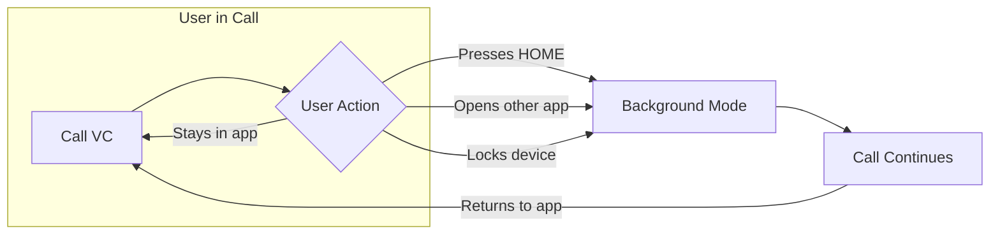

Keep calls alive when users navigate away from your app. Background handling ensures the call continues running when users press the home button, switch to another app, or lock their device.

## Overview

When a user leaves your call view controller, iOS may suspend it to free resources. Proper background handling:
- Keeps the call session active in the background
- Maintains audio/video streams
- Allows users to return to the call seamlessly

## When to Use

| Scenario | Solution |
|----------|----------|
| User stays in call view | No action needed |
| User presses HOME during call | **Use Background Modes** |
| User switches to another app | **Use Background Modes** |
| User locks device during call | **Use Background Modes** |
| Receiving calls when app is killed | [VoIP Calling](/calls/ios/voip-calling) handles this |

<Note>
Background Handling is different from [VoIP Calling](/calls/ios/voip-calling). VoIP handles **receiving** calls when the app is not running. Background Handling keeps an **active** call alive when the user leaves the app.
</Note>

---

## Enable Background Modes

In Xcode, add the following background modes to your app:

**1.** Go to your target's "Signing & Capabilities" tab

**2.** Add "Background Modes" capability

**3.** Enable the following modes:
   - Audio, AirPlay, and Picture in Picture
   - Voice over IP

<Note>
The Calls SDK automatically handles audio session configuration. You only need to enable the background modes capability.
</Note>

---

## Related Documentation

- [VoIP Calling](/calls/ios/voip-calling) - Receive calls when app is killed
- [Events](/calls/ios/events) - Session status events
