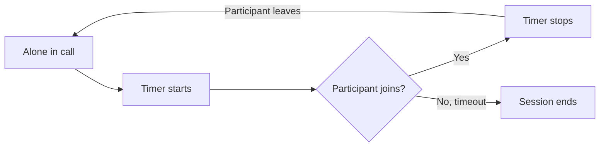

Configure automatic session termination when a user is alone in a call. Idle timeout helps manage resources by ending sessions that have no active participants.

## How Idle Timeout Works

When a user is the only participant in a call session, the idle timeout countdown begins. If no other participant joins before the timeout expires, the session automatically ends and the `onSessionTimedOut` callback is triggered.

The timer also restarts when other participants leave and only one user remains in the call.



This is useful for:
- Preventing abandoned call sessions from running indefinitely
- Managing server resources efficiently
- Providing a better user experience when the other party doesn't join

## Configure Idle Timeout

Set the idle timeout period using `setIdleTimeoutPeriod()` in `SessionSettingsBuilder`. The value is in seconds.

<Tabs>
<Tab title="Swift">
```swift
let sessionSettings = CometChatCalls.sessionSettingsBuilder
    .setIdleTimeoutPeriod(120) // 2 minutes
    .setType(.video)
    .build()

CometChatCalls.joinSession(
    sessionID: sessionId,
    callSetting: sessionSettings,
    container: callViewContainer,
    onSuccess: { message in
        print("Joined session")
    },
    onError: { error in
        print("Failed: \(error?.errorDescription ?? "")")
    }
)
```
</Tab>
<Tab title="Objective-C">
```objectivec
SessionSettings *sessionSettings = [[[[CometChatCalls sessionSettingsBuilder]
    setIdleTimeoutPeriod:120]
    setType:CallTypeVideo]
    build];

[CometChatCalls joinSessionWithSessionID:sessionId
                             callSetting:sessionSettings
                               container:self.callViewContainer
                               onSuccess:^(NSString * message) {
    NSLog(@"Joined session");
} onError:^(CometChatCallException * error) {
    NSLog(@"Failed: %@", error.errorDescription);
}];
```
</Tab>
</Tabs>

| Parameter | Type | Default | Description |
|-----------|------|---------|-------------|
| `idleTimeoutPeriod` | Int | 300 | Timeout in seconds when alone in the session |

## Handle Session Timeout

Listen for the `onSessionTimedOut` callback using `SessionStatusListener` to handle when the session ends due to idle timeout:

<Tabs>
<Tab title="Swift">
```swift
class CallViewController: UIViewController, SessionStatusListener {
    
    override func viewDidLoad() {
        super.viewDidLoad()
        CallSession.shared.addSessionStatusListener(self)
    }
    
    deinit {
        CallSession.shared.removeSessionStatusListener(self)
    }
    
    func onSessionTimedOut() {
        print("Session ended due to idle timeout")
        // Show message to user
        showToast("Call ended - no other participants joined")
        // Navigate away from call screen
        navigationController?.popViewController(animated: true)
    }

    func onSessionJoined() {}
    func onSessionLeft() {}
    func onConnectionLost() {}
    func onConnectionRestored() {}
    func onConnectionClosed() {}
}
```
</Tab>
<Tab title="Objective-C">
```objectivec
@interface CallViewController () <SessionStatusListener>
@end

@implementation CallViewController

- (void)viewDidLoad {
    [super viewDidLoad];
    [[CallSession shared] addSessionStatusListener:self];
}

- (void)dealloc {
    [[CallSession shared] removeSessionStatusListener:self];
}

- (void)onSessionTimedOut {
    NSLog(@"Session ended due to idle timeout");
    // Show message to user
    [self showToast:@"Call ended - no other participants joined"];
    // Navigate away from call screen
    [self.navigationController popViewControllerAnimated:YES];
}

- (void)onSessionJoined {}
- (void)onSessionLeft {}
- (void)onConnectionLost {}
- (void)onConnectionRestored {}
- (void)onConnectionClosed {}

@end
```
</Tab>
</Tabs>

## Disable Idle Timeout

To disable idle timeout and allow sessions to run indefinitely, set a value of `0`:

<Tabs>
<Tab title="Swift">
```swift
let sessionSettings = CometChatCalls.sessionSettingsBuilder
    .setIdleTimeoutPeriod(0) // Disable idle timeout
    .build()
```
</Tab>
<Tab title="Objective-C">
```objectivec
SessionSettings *sessionSettings = [[[CometChatCalls sessionSettingsBuilder]
    setIdleTimeoutPeriod:0]
    build];
```
</Tab>
</Tabs>

<Warning>
Disabling idle timeout may result in sessions running indefinitely if participants don't join or leave properly. Use with caution.
</Warning>
