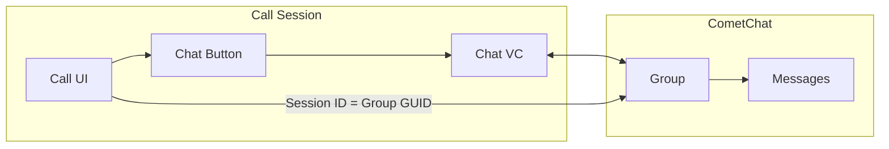

Add real-time messaging to your call experience using CometChat UI Kit. This allows participants to send text messages, share files, and communicate via chat while on a call.

## Overview

In-call chat creates a group conversation linked to the call session. When participants tap the chat button, they can:
- Send and receive text messages
- Share images, files, and media
- See message history from the current call
- Get unread message notifications via badge count



## Prerequisites

- CometChat Calls SDK integrated ([Setup](/calls/ios/setup))
- CometChat Chat SDK integrated ([Chat SDK](/sdk/ios/overview))
- CometChat UI Kit integrated ([UI Kit](/ui-kit/ios/overview))

<Note>
The Chat SDK and UI Kit are separate from the Calls SDK. You'll need to add both dependencies to your project.
</Note>

---

## Step 1: Add UI Kit Dependency

Add the CometChat UI Kit to your project via Swift Package Manager or CocoaPods:

**Swift Package Manager:**
```
https://github.com/cometchat/cometchat-chat-uikit-ios
```

**CocoaPods:**
```ruby
pod 'CometChatUIKitSwift', '~> 4.0'
```

---

## Step 2: Enable Chat Button

Configure session settings to show the chat button:

<Tabs>
<Tab title="Swift">
```swift
let sessionSettings = CometChatCalls.sessionSettingsBuilder
    .hideChatButton(false)  // Show the chat button
    .build()
```
</Tab>
<Tab title="Objective-C">
```objectivec
SessionSettings *sessionSettings = [[[CometChatCalls sessionSettingsBuilder]
    hideChatButton:NO]  // Show the chat button
    build];
```
</Tab>
</Tabs>

---

## Step 3: Create Chat Group

Create or join a CometChat group using the session ID as the group GUID. This links the chat to the specific call session.

<Tabs>
<Tab title="Swift">
```swift
private func setupChatGroup(sessionId: String, meetingName: String) {
    // Try to get existing group first
    CometChat.getGroup(GUID: sessionId) { group in
        if !group.hasJoined {
            self.joinGroup(guid: sessionId, groupType: group.groupType)
        } else {
            print("Already joined group: \(group.name ?? "")")
        }
    } onError: { error in
        if error?.errorCode == "ERR_GUID_NOT_FOUND" {
            // Group doesn't exist, create it
            self.createGroup(guid: sessionId, name: meetingName)
        } else {
            print("Error getting group: \(error?.errorDescription ?? "")")
        }
    }
}

private func createGroup(guid: String, name: String) {
    let group = Group(guid: guid, name: name, groupType: .public, password: nil)
    
    CometChat.createGroup(group: group) { createdGroup in
        print("Group created: \(createdGroup.name ?? "")")
    } onError: { error in
        print("Group creation failed: \(error?.errorDescription ?? "")")
    }
}

private func joinGroup(guid: String, groupType: CometChat.groupType) {
    CometChat.joinGroup(GUID: guid, groupType: groupType, password: nil) { joinedGroup in
        print("Joined group: \(joinedGroup.name ?? "")")
    } onError: { error in
        print("Join group failed: \(error?.errorDescription ?? "")")
    }
}
```
</Tab>
<Tab title="Objective-C">
```objectivec
- (void)setupChatGroupWithSessionId:(NSString *)sessionId meetingName:(NSString *)meetingName {
    [CometChat getGroupWithGUID:sessionId onSuccess:^(Group * group) {
        if (!group.hasJoined) {
            [self joinGroupWithGuid:sessionId groupType:group.groupType];
        } else {
            NSLog(@"Already joined group: %@", group.name);
        }
    } onError:^(CometChatException * error) {
        if ([error.errorCode isEqualToString:@"ERR_GUID_NOT_FOUND"]) {
            [self createGroupWithGuid:sessionId name:meetingName];
        } else {
            NSLog(@"Error getting group: %@", error.errorDescription);
        }
    }];
}

- (void)createGroupWithGuid:(NSString *)guid name:(NSString *)name {
    Group *group = [[Group alloc] initWithGuid:guid name:name groupType:GroupTypePublic password:nil];
    
    [CometChat createGroupWithGroup:group onSuccess:^(Group * createdGroup) {
        NSLog(@"Group created: %@", createdGroup.name);
    } onError:^(CometChatException * error) {
        NSLog(@"Group creation failed: %@", error.errorDescription);
    }];
}

- (void)joinGroupWithGuid:(NSString *)guid groupType:(GroupType)groupType {
    [CometChat joinGroupWithGUID:guid groupType:groupType password:nil onSuccess:^(Group * joinedGroup) {
        NSLog(@"Joined group: %@", joinedGroup.name);
    } onError:^(CometChatException * error) {
        NSLog(@"Join group failed: %@", error.errorDescription);
    }];
}
```
</Tab>
</Tabs>

---

## Step 4: Handle Chat Button Click

Listen for the chat button click and open your chat view controller:

<Tabs>
<Tab title="Swift">
```swift
private var unreadMessageCount = 0

private func setupChatButtonListener() {
    CallSession.shared.addButtonClickListener(self)
}

extension CallViewController: ButtonClickListener {
    
    func onChatButtonClicked() {
        // Reset unread count when opening chat
        unreadMessageCount = 0
        CallSession.shared.setChatButtonUnreadCount(0)
        
        // Open chat view controller
        let chatVC = ChatViewController()
        chatVC.sessionId = sessionId
        chatVC.meetingName = meetingName
        
        let navController = UINavigationController(rootViewController: chatVC)
        navController.modalPresentationStyle = .pageSheet
        
        if let sheet = navController.sheetPresentationController {
            sheet.detents = [.medium(), .large()]
            sheet.prefersGrabberVisible = true
        }
        
        present(navController, animated: true)
    }
}
```
</Tab>
<Tab title="Objective-C">
```objectivec
@interface CallViewController () <ButtonClickListener>
@property (nonatomic, assign) NSInteger unreadMessageCount;
@end

- (void)setupChatButtonListener {
    [[CallSession shared] addButtonClickListener:self];
}

- (void)onChatButtonClicked {
    // Reset unread count when opening chat
    self.unreadMessageCount = 0;
    [[CallSession shared] setChatButtonUnreadCount:0];
    
    // Open chat view controller
    ChatViewController *chatVC = [[ChatViewController alloc] init];
    chatVC.sessionId = self.sessionId;
    chatVC.meetingName = self.meetingName;
    
    UINavigationController *navController = [[UINavigationController alloc] initWithRootViewController:chatVC];
    navController.modalPresentationStyle = UIModalPresentationPageSheet;
    
    UISheetPresentationController *sheet = navController.sheetPresentationController;
    if (sheet) {
        sheet.detents = @[UISheetPresentationControllerDetent.mediumDetent, UISheetPresentationControllerDetent.largeDetent];
        sheet.prefersGrabberVisible = YES;
    }
    
    [self presentViewController:navController animated:YES completion:nil];
}
```
</Tab>
</Tabs>

---

## Step 5: Track Unread Messages

Listen for incoming messages and update the badge count on the chat button:

<Tabs>
<Tab title="Swift">
```swift
private func setupMessageListener() {
    CometChat.addMessageListener("CallChatListener", self)
}

extension CallViewController: CometChatMessageDelegate {
    
    func onTextMessageReceived(textMessage: TextMessage) {
        // Check if message is for our call's group
        if let receiver = textMessage.receiver as? Group,
           receiver.guid == sessionId {
            unreadMessageCount += 1
            CallSession.shared.setChatButtonUnreadCount(unreadMessageCount)
        }
    }
    
    func onMediaMessageReceived(mediaMessage: MediaMessage) {
        if let receiver = mediaMessage.receiver as? Group,
           receiver.guid == sessionId {
            unreadMessageCount += 1
            CallSession.shared.setChatButtonUnreadCount(unreadMessageCount)
        }
    }
}

deinit {
    CometChat.removeMessageListener("CallChatListener")
}
```
</Tab>
<Tab title="Objective-C">
```objectivec
- (void)setupMessageListener {
    [CometChat addMessageListener:@"CallChatListener" delegate:self];
}

- (void)onTextMessageReceived:(TextMessage *)textMessage {
    if ([textMessage.receiver isKindOfClass:[Group class]]) {
        Group *group = (Group *)textMessage.receiver;
        if ([group.guid isEqualToString:self.sessionId]) {
            self.unreadMessageCount++;
            [[CallSession shared] setChatButtonUnreadCount:self.unreadMessageCount];
        }
    }
}

- (void)onMediaMessageReceived:(MediaMessage *)mediaMessage {
    if ([mediaMessage.receiver isKindOfClass:[Group class]]) {
        Group *group = (Group *)mediaMessage.receiver;
        if ([group.guid isEqualToString:self.sessionId]) {
            self.unreadMessageCount++;
            [[CallSession shared] setChatButtonUnreadCount:self.unreadMessageCount];
        }
    }
}

- (void)dealloc {
    [CometChat removeMessageListener:@"CallChatListener"];
}
```
</Tab>
</Tabs>

---

## Step 6: Create Chat View Controller

Create a chat view controller using UI Kit components:

<Tabs>
<Tab title="Swift">
```swift
import CometChatUIKitSwift

class ChatViewController: UIViewController {
    
    var sessionId: String = ""
    var meetingName: String = ""
    
    private let messageList = CometChatMessageList()
    private let messageComposer = CometChatMessageComposer()
    private let activityIndicator = UIActivityIndicatorView(style: .large)
    
    override func viewDidLoad() {
        super.viewDidLoad()
        setupUI()
        loadGroup()
    }
    
    private func setupUI() {
        view.backgroundColor = .systemBackground
        title = meetingName
        
        navigationItem.rightBarButtonItem = UIBarButtonItem(
            barButtonSystemItem: .close,
            target: self,
            action: #selector(dismissView)
        )
        
        // Setup message list
        messageList.translatesAutoresizingMaskIntoConstraints = false
        view.addSubview(messageList)
        
        // Setup message composer
        messageComposer.translatesAutoresizingMaskIntoConstraints = false
        view.addSubview(messageComposer)
        
        // Setup activity indicator
        activityIndicator.translatesAutoresizingMaskIntoConstraints = false
        activityIndicator.hidesWhenStopped = true
        view.addSubview(activityIndicator)
        
        NSLayoutConstraint.activate([
            messageList.topAnchor.constraint(equalTo: view.safeAreaLayoutGuide.topAnchor),
            messageList.leadingAnchor.constraint(equalTo: view.leadingAnchor),
            messageList.trailingAnchor.constraint(equalTo: view.trailingAnchor),
            messageList.bottomAnchor.constraint(equalTo: messageComposer.topAnchor),
            
            messageComposer.leadingAnchor.constraint(equalTo: view.leadingAnchor),
            messageComposer.trailingAnchor.constraint(equalTo: view.trailingAnchor),
            messageComposer.bottomAnchor.constraint(equalTo: view.safeAreaLayoutGuide.bottomAnchor),
            
            activityIndicator.centerXAnchor.constraint(equalTo: view.centerXAnchor),
            activityIndicator.centerYAnchor.constraint(equalTo: view.centerYAnchor)
        ])
    }
    
    @objc private func dismissView() {
        dismiss(animated: true)
    }
    
    private func loadGroup() {
        activityIndicator.startAnimating()
        
        CometChat.getGroup(GUID: sessionId) { [weak self] group in
            guard let self = self else { return }
            
            if !group.hasJoined {
                self.joinAndSetGroup(guid: self.sessionId, groupType: group.groupType)
            } else {
                self.setGroup(group)
            }
        } onError: { [weak self] error in
            guard let self = self else { return }
            
            if error?.errorCode == "ERR_GUID_NOT_FOUND" {
                self.createAndSetGroup()
            } else {
                self.activityIndicator.stopAnimating()
                print("Error: \(error?.errorDescription ?? "")")
            }
        }
    }
    
    private func createAndSetGroup() {
        let group = Group(guid: sessionId, name: meetingName, groupType: .public, password: nil)
        
        CometChat.createGroup(group: group) { [weak self] createdGroup in
            self?.setGroup(createdGroup)
        } onError: { [weak self] error in
            self?.activityIndicator.stopAnimating()
        }
    }
    
    private func joinAndSetGroup(guid: String, groupType: CometChat.groupType) {
        CometChat.joinGroup(GUID: guid, groupType: groupType, password: nil) { [weak self] joinedGroup in
            self?.setGroup(joinedGroup)
        } onError: { [weak self] error in
            self?.activityIndicator.stopAnimating()
        }
    }
    
    private func setGroup(_ group: Group) {
        activityIndicator.stopAnimating()
        
        messageList.set(group: group)
        messageComposer.set(group: group)
    }
}
```
</Tab>
<Tab title="Objective-C">
```objectivec
#import <CometChatUIKitSwift/CometChatUIKitSwift.h>

@interface ChatViewController ()
@property (nonatomic, strong) CometChatMessageList *messageList;
@property (nonatomic, strong) CometChatMessageComposer *messageComposer;
@property (nonatomic, strong) UIActivityIndicatorView *activityIndicator;
@property (nonatomic, copy) NSString *sessionId;
@property (nonatomic, copy) NSString *meetingName;
@end

@implementation ChatViewController

- (void)viewDidLoad {
    [super viewDidLoad];
    [self setupUI];
    [self loadGroup];
}

- (void)setupUI {
    self.view.backgroundColor = [UIColor systemBackgroundColor];
    self.title = self.meetingName;
    
    self.navigationItem.rightBarButtonItem = [[UIBarButtonItem alloc]
        initWithBarButtonSystemItem:UIBarButtonSystemItemClose
        target:self
        action:@selector(dismissView)];
    
    // Setup message list
    self.messageList = [[CometChatMessageList alloc] init];
    self.messageList.translatesAutoresizingMaskIntoConstraints = NO;
    [self.view addSubview:self.messageList];
    
    // Setup message composer
    self.messageComposer = [[CometChatMessageComposer alloc] init];
    self.messageComposer.translatesAutoresizingMaskIntoConstraints = NO;
    [self.view addSubview:self.messageComposer];
    
    // Setup activity indicator
    self.activityIndicator = [[UIActivityIndicatorView alloc] initWithActivityIndicatorStyle:UIActivityIndicatorViewStyleLarge];
    self.activityIndicator.translatesAutoresizingMaskIntoConstraints = NO;
    self.activityIndicator.hidesWhenStopped = YES;
    [self.view addSubview:self.activityIndicator];
    
    [NSLayoutConstraint activateConstraints:@[
        [self.messageList.topAnchor constraintEqualToAnchor:self.view.safeAreaLayoutGuide.topAnchor],
        [self.messageList.leadingAnchor constraintEqualToAnchor:self.view.leadingAnchor],
        [self.messageList.trailingAnchor constraintEqualToAnchor:self.view.trailingAnchor],
        [self.messageList.bottomAnchor constraintEqualToAnchor:self.messageComposer.topAnchor],
        
        [self.messageComposer.leadingAnchor constraintEqualToAnchor:self.view.leadingAnchor],
        [self.messageComposer.trailingAnchor constraintEqualToAnchor:self.view.trailingAnchor],
        [self.messageComposer.bottomAnchor constraintEqualToAnchor:self.view.safeAreaLayoutGuide.bottomAnchor],
        
        [self.activityIndicator.centerXAnchor constraintEqualToAnchor:self.view.centerXAnchor],
        [self.activityIndicator.centerYAnchor constraintEqualToAnchor:self.view.centerYAnchor]
    ]];
}

- (void)dismissView {
    [self dismissViewControllerAnimated:YES completion:nil];
}

- (void)loadGroup {
    [self.activityIndicator startAnimating];
    
    __weak typeof(self) weakSelf = self;
    [CometChat getGroupWithGUID:self.sessionId onSuccess:^(Group * group) {
        if (!group.hasJoined) {
            [weakSelf joinAndSetGroupWithGuid:weakSelf.sessionId groupType:group.groupType];
        } else {
            [weakSelf setGroup:group];
        }
    } onError:^(CometChatException * error) {
        if ([error.errorCode isEqualToString:@"ERR_GUID_NOT_FOUND"]) {
            [weakSelf createAndSetGroup];
        } else {
            [weakSelf.activityIndicator stopAnimating];
        }
    }];
}

- (void)setGroup:(Group *)group {
    [self.activityIndicator stopAnimating];
    
    [self.messageList setWithGroup:group];
    [self.messageComposer setWithGroup:group];
}

@end
```
</Tab>
</Tabs>

---

## Related Documentation

- [UI Kit Overview](/ui-kit/ios/overview) - CometChat UI Kit components
- [Events](/calls/ios/events) - Button click events
- [Session Settings](/calls/ios/session-settings) - Configure chat button visibility
