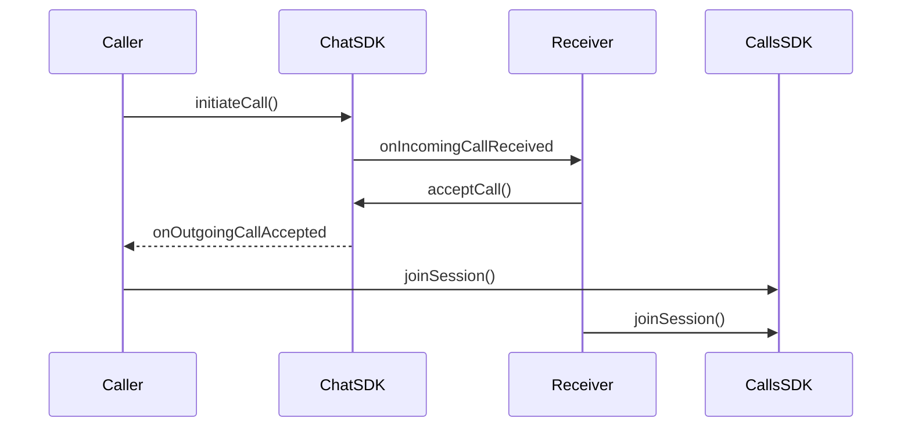
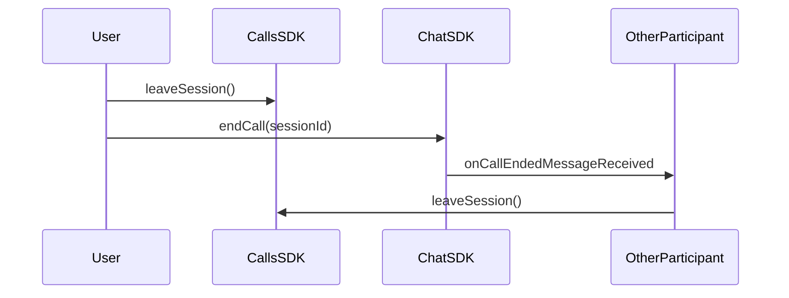

Implement incoming and outgoing call notifications with accept/reject functionality. Ringing enables real-time call signaling between users, allowing them to initiate calls and respond to incoming call requests.

<Note>
Ringing functionality requires the CometChat Chat SDK to be integrated alongside the Calls SDK. The Chat SDK handles call signaling (initiating, accepting, rejecting calls), while the Calls SDK manages the actual call session.
</Note>

## How Ringing Works

The ringing flow involves two SDKs working together:

1. **Chat SDK** - Handles call signaling (initiate, accept, reject, cancel)
2. **Calls SDK** - Manages the actual call session once accepted



## Initiate a Call

Use the Chat SDK to initiate a call to a user or group:

<Tabs>
<Tab title="Swift">
```swift
let receiverID = "USER_ID"
let receiverType: CometChat.ReceiverType = .user
let callType: CometChat.CallType = .video

let call = Call(receiverId: receiverID, callType: callType, receiverType: receiverType)

CometChat.initiateCall(call: call, onSuccess: { call in
    print("Call initiated: \(call?.sessionID ?? "")")
    // Show outgoing call UI
}, onError: { error in
    print("Call initiation failed: \(error?.errorDescription ?? "")")
})
```
</Tab>
<Tab title="Objective-C">
```objectivec
NSString *receiverID = @"USER_ID";
CometChatReceiverType receiverType = CometChatReceiverTypeUser;
CometChatCallType callType = CometChatCallTypeVideo;

Call *call = [[Call alloc] initWithReceiverId:receiverID 
                                     callType:callType 
                                 receiverType:receiverType];

[CometChat initiateCallWithCall:call 
                      onSuccess:^(Call * call) {
    NSLog(@"Call initiated: %@", call.sessionID);
    // Show outgoing call UI
} onError:^(CometChatException * error) {
    NSLog(@"Call initiation failed: %@", error.errorDescription);
}];
```
</Tab>
</Tabs>

| Parameter | Type | Description |
|-----------|------|-------------|
| `receiverID` | String | UID of the user or GUID of the group to call |
| `receiverType` | ReceiverType | `.user` or `.group` |
| `callType` | CallType | `.video` or `.audio` |

## Listen for Incoming Calls

Register a call listener to receive incoming call notifications:

<Tabs>
<Tab title="Swift">
```swift
let listenerID = "UNIQUE_LISTENER_ID"

CometChat.addCallListener(listenerID, self)

// Implement CometChatCallDelegate
extension CallViewController: CometChatCallDelegate {
    
    func onIncomingCallReceived(incomingCall: Call?, error: CometChatException?) {
        guard let call = incomingCall else { return }
        print("Incoming call from: \(call.callInitiator?.name ?? "")")
        // Show incoming call UI with accept/reject options
    }

    func onOutgoingCallAccepted(acceptedCall: Call?, error: CometChatException?) {
        guard let call = acceptedCall else { return }
        print("Call accepted, joining session...")
        joinCallSession(sessionId: call.sessionID ?? "")
    }

    func onOutgoingCallRejected(rejectedCall: Call?, error: CometChatException?) {
        print("Call rejected")
        // Dismiss outgoing call UI
    }

    func onIncomingCallCancelled(cancelledCall: Call?, error: CometChatException?) {
        print("Incoming call cancelled")
        // Dismiss incoming call UI
    }

    func onCallEndedMessageReceived(endedCall: Call?, error: CometChatException?) {
        print("Call ended")
    }
}
```
</Tab>
<Tab title="Objective-C">
```objectivec
NSString *listenerID = @"UNIQUE_LISTENER_ID";

[CometChat addCallListener:listenerID delegate:self];

// Implement CometChatCallDelegate
- (void)onIncomingCallReceivedWithIncomingCall:(Call *)incomingCall 
                                         error:(CometChatException *)error {
    NSLog(@"Incoming call from: %@", incomingCall.callInitiator.name);
    // Show incoming call UI with accept/reject options
}

- (void)onOutgoingCallAcceptedWithAcceptedCall:(Call *)acceptedCall 
                                         error:(CometChatException *)error {
    NSLog(@"Call accepted, joining session...");
    [self joinCallSessionWithSessionId:acceptedCall.sessionID];
}

- (void)onOutgoingCallRejectedWithRejectedCall:(Call *)rejectedCall 
                                         error:(CometChatException *)error {
    NSLog(@"Call rejected");
    // Dismiss outgoing call UI
}

- (void)onIncomingCallCancelledWithCancelledCall:(Call *)cancelledCall 
                                           error:(CometChatException *)error {
    NSLog(@"Incoming call cancelled");
    // Dismiss incoming call UI
}

- (void)onCallEndedMessageReceivedWithEndedCall:(Call *)endedCall 
                                          error:(CometChatException *)error {
    NSLog(@"Call ended");
}
```
</Tab>
</Tabs>

| Callback | Description |
|----------|-------------|
| `onIncomingCallReceived` | A new incoming call is received |
| `onOutgoingCallAccepted` | The receiver accepted your outgoing call |
| `onOutgoingCallRejected` | The receiver rejected your outgoing call |
| `onIncomingCallCancelled` | The caller cancelled the incoming call |
| `onCallEndedMessageReceived` | The call has ended |

<Warning>
Remember to remove the call listener when it's no longer needed to prevent memory leaks:
```swift
CometChat.removeCallListener(listenerID)
```
</Warning>

## Accept a Call

When an incoming call is received, accept it using the Chat SDK:

<Tabs>
<Tab title="Swift">
```swift
func acceptIncomingCall(sessionId: String) {
    CometChat.acceptCall(sessionID: sessionId, onSuccess: { call in
        print("Call accepted")
        self.joinCallSession(sessionId: call?.sessionID ?? "")
    }, onError: { error in
        print("Accept call failed: \(error?.errorDescription ?? "")")
    })
}
```
</Tab>
<Tab title="Objective-C">
```objectivec
- (void)acceptIncomingCallWithSessionId:(NSString *)sessionId {
    [CometChat acceptCallWithSessionID:sessionId 
                             onSuccess:^(Call * call) {
        NSLog(@"Call accepted");
        [self joinCallSessionWithSessionId:call.sessionID];
    } onError:^(CometChatException * error) {
        NSLog(@"Accept call failed: %@", error.errorDescription);
    }];
}
```
</Tab>
</Tabs>

## Reject a Call

Reject an incoming call:

<Tabs>
<Tab title="Swift">
```swift
func rejectIncomingCall(sessionId: String) {
    let status: CometChat.CallStatus = .rejected

    CometChat.rejectCall(sessionID: sessionId, status: status, onSuccess: { call in
        print("Call rejected")
        // Dismiss incoming call UI
    }, onError: { error in
        print("Reject call failed: \(error?.errorDescription ?? "")")
    })
}
```
</Tab>
<Tab title="Objective-C">
```objectivec
- (void)rejectIncomingCallWithSessionId:(NSString *)sessionId {
    [CometChat rejectCallWithSessionID:sessionId 
                                status:CometChatCallStatusRejected 
                             onSuccess:^(Call * call) {
        NSLog(@"Call rejected");
        // Dismiss incoming call UI
    } onError:^(CometChatException * error) {
        NSLog(@"Reject call failed: %@", error.errorDescription);
    }];
}
```
</Tab>
</Tabs>

## Cancel a Call

Cancel an outgoing call before it's answered:

<Tabs>
<Tab title="Swift">
```swift
func cancelOutgoingCall(sessionId: String) {
    let status: CometChat.CallStatus = .cancelled

    CometChat.rejectCall(sessionID: sessionId, status: status, onSuccess: { call in
        print("Call cancelled")
        // Dismiss outgoing call UI
    }, onError: { error in
        print("Cancel call failed: \(error?.errorDescription ?? "")")
    })
}
```
</Tab>
<Tab title="Objective-C">
```objectivec
- (void)cancelOutgoingCallWithSessionId:(NSString *)sessionId {
    [CometChat rejectCallWithSessionID:sessionId 
                                status:CometChatCallStatusCancelled 
                             onSuccess:^(Call * call) {
        NSLog(@"Call cancelled");
        // Dismiss outgoing call UI
    } onError:^(CometChatException * error) {
        NSLog(@"Cancel call failed: %@", error.errorDescription);
    }];
}
```
</Tab>
</Tabs>

## Join the Call Session

After accepting a call (or when your outgoing call is accepted), join the call session using the Calls SDK:

<Tabs>
<Tab title="Swift">
```swift
func joinCallSession(sessionId: String) {
    let sessionSettings = CometChatCalls.sessionSettingsBuilder
        .setType(.video)
        .build()

    CometChatCalls.joinSession(
        sessionID: sessionId,
        callSetting: sessionSettings,
        container: callViewContainer,
        onSuccess: { message in
            print("Joined call session")
        },
        onError: { error in
            print("Failed to join: \(error?.errorDescription ?? "")")
        }
    )
}
```
</Tab>
<Tab title="Objective-C">
```objectivec
- (void)joinCallSessionWithSessionId:(NSString *)sessionId {
    SessionSettings *sessionSettings = [[[CometChatCalls sessionSettingsBuilder]
        setType:CallTypeVideo]
        build];

    [CometChatCalls joinSessionWithSessionID:sessionId
                                 callSetting:sessionSettings
                                   container:self.callViewContainer
                                   onSuccess:^(NSString * message) {
        NSLog(@"Joined call session");
    } onError:^(CometChatCallException * error) {
        NSLog(@"Failed to join: %@", error.errorDescription);
    }];
}
```
</Tab>
</Tabs>

## End a Call

Properly ending a call requires coordination between both SDKs to ensure all participants are notified and call logs are recorded correctly.

<Warning>
Always call `CometChat.endCall()` when ending a call. This notifies the other participant and ensures the call is properly logged. Without this, the other user won't know the call has ended and call logs may be incomplete.
</Warning>



When using the default call UI, listen for the end call button click using `ButtonClickListener` and call `endCall()`:

<Tabs>
<Tab title="Swift">
```swift
class CallViewController: UIViewController, ButtonClickListener {
    
    var currentSessionId: String = ""
    
    override func viewDidLoad() {
        super.viewDidLoad()
        CallSession.shared.addButtonClickListener(self)
    }
    
    func onLeaveSessionButtonClicked() {
        endCall(sessionId: currentSessionId)
    }
    
    func endCall(sessionId: String) {
        // 1. Leave the call session (Calls SDK)
        CallSession.shared.leaveSession()

        // 2. Notify other participants (Chat SDK)
        CometChat.endCall(sessionID: sessionId, onSuccess: { call in
            print("Call ended successfully")
            self.navigationController?.popViewController(animated: true)
        }, onError: { error in
            print("End call failed: \(error?.errorDescription ?? "")")
            self.navigationController?.popViewController(animated: true)
        })
    }
    
    // Other ButtonClickListener callbacks...
}
```
</Tab>
<Tab title="Objective-C">
```objectivec
@interface CallViewController () <ButtonClickListener>
@property (nonatomic, strong) NSString *currentSessionId;
@end

@implementation CallViewController

- (void)viewDidLoad {
    [super viewDidLoad];
    [[CallSession shared] addButtonClickListener:self];
}

- (void)onLeaveSessionButtonClicked {
    [self endCallWithSessionId:self.currentSessionId];
}

- (void)endCallWithSessionId:(NSString *)sessionId {
    // 1. Leave the call session (Calls SDK)
    [[CallSession shared] leaveSession];

    // 2. Notify other participants (Chat SDK)
    [CometChat endCallWithSessionID:sessionId 
                          onSuccess:^(Call * call) {
        NSLog(@"Call ended successfully");
        [self.navigationController popViewControllerAnimated:YES];
    } onError:^(CometChatException * error) {
        NSLog(@"End call failed: %@", error.errorDescription);
        [self.navigationController popViewControllerAnimated:YES];
    }];
}

@end
```
</Tab>
</Tabs>

The other participant receives `onCallEndedMessageReceived` callback and should leave the session:

<Tabs>
<Tab title="Swift">
```swift
func onCallEndedMessageReceived(endedCall: Call?, error: CometChatException?) {
    CallSession.shared.leaveSession()
    navigationController?.popViewController(animated: true)
}
```
</Tab>
<Tab title="Objective-C">
```objectivec
- (void)onCallEndedMessageReceivedWithEndedCall:(Call *)endedCall 
                                          error:(CometChatException *)error {
    [[CallSession shared] leaveSession];
    [self.navigationController popViewControllerAnimated:YES];
}
```
</Tab>
</Tabs>

## Call Status Values

| Status | Description |
|--------|-------------|
| `initiated` | Call has been initiated but not yet answered |
| `ongoing` | Call is currently in progress |
| `busy` | Receiver is busy on another call |
| `rejected` | Receiver rejected the call |
| `cancelled` | Caller cancelled before receiver answered |
| `ended` | Call ended normally |
| `missed` | Receiver didn't answer in time |
| `unanswered` | Call was not answered |
