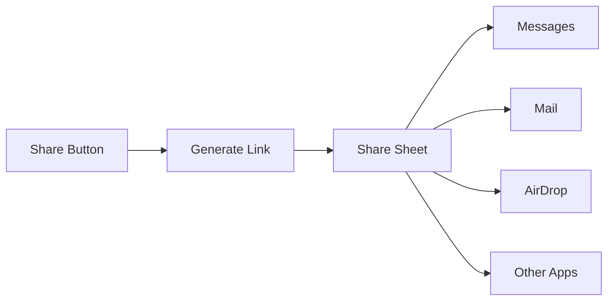

Enable participants to invite others to join a call by sharing a meeting link. The share invite button opens the system share sheet, allowing users to send the invite via any messaging app, email, or social media.

## Overview

The share invite feature:
- Generates a shareable meeting link with session ID
- Opens iOS's native share sheet
- Works with any app that supports text sharing
- Can be triggered from the default button or custom UI



## Prerequisites

- CometChat Calls SDK integrated ([Setup](/calls/ios/setup))
- Active call session ([Join Session](/calls/ios/join-session))

---

## Step 1: Enable Share Button

Configure session settings to show the share invite button:

<Tabs>
<Tab title="Swift">
```swift
let sessionSettings = CometChatCalls.sessionSettingsBuilder
    .hideShareInviteButton(false)  // Show the share button
    .build()
```
</Tab>
<Tab title="Objective-C">
```objectivec
SessionSettings *sessionSettings = [[[CometChatCalls sessionSettingsBuilder]
    hideShareInviteButton:NO]  // Show the share button
    build];
```
</Tab>
</Tabs>

---

## Step 2: Handle Share Button Click

Listen for the share button click using `ButtonClickListener`:

<Tabs>
<Tab title="Swift">
```swift
private func setupShareButtonListener() {
    CallSession.shared.addButtonClickListener(self)
}

extension CallViewController: ButtonClickListener {
    
    func onShareInviteButtonClicked() {
        shareInviteLink()
    }
}
```
</Tab>
<Tab title="Objective-C">
```objectivec
- (void)setupShareButtonListener {
    [[CallSession shared] addButtonClickListener:self];
}

- (void)onShareInviteButtonClicked {
    [self shareInviteLink];
}
```
</Tab>
</Tabs>

---

## Step 3: Generate and Share Link

Create the meeting invite URL and open the share sheet:

<Tabs>
<Tab title="Swift">
```swift
private func shareInviteLink() {
    let inviteUrl = generateInviteUrl(sessionId: sessionId, meetingName: meetingName)
    
    let activityItems: [Any] = [
        "Join my meeting: \(meetingName)",
        inviteUrl
    ]
    
    let activityVC = UIActivityViewController(
        activityItems: activityItems,
        applicationActivities: nil
    )
    
    // For iPad
    if let popover = activityVC.popoverPresentationController {
        popover.sourceView = view
        popover.sourceRect = CGRect(x: view.bounds.midX, y: view.bounds.midY, width: 0, height: 0)
        popover.permittedArrowDirections = []
    }
    
    present(activityVC, animated: true)
}

private func generateInviteUrl(sessionId: String, meetingName: String) -> URL {
    let encodedName = meetingName.addingPercentEncoding(withAllowedCharacters: .urlQueryAllowed) ?? meetingName
    
    // Replace with your app's deep link or web URL
    let urlString = "https://yourapp.com/join?sessionId=\(sessionId)&name=\(encodedName)"
    return URL(string: urlString)!
}
```
</Tab>
<Tab title="Objective-C">
```objectivec
- (void)shareInviteLink {
    NSURL *inviteUrl = [self generateInviteUrlWithSessionId:self.sessionId meetingName:self.meetingName];
    
    NSArray *activityItems = @[
        [NSString stringWithFormat:@"Join my meeting: %@", self.meetingName],
        inviteUrl
    ];
    
    UIActivityViewController *activityVC = [[UIActivityViewController alloc]
        initWithActivityItems:activityItems
        applicationActivities:nil];
    
    // For iPad
    if (activityVC.popoverPresentationController) {
        activityVC.popoverPresentationController.sourceView = self.view;
        activityVC.popoverPresentationController.sourceRect = CGRectMake(
            CGRectGetMidX(self.view.bounds),
            CGRectGetMidY(self.view.bounds),
            0, 0
        );
        activityVC.popoverPresentationController.permittedArrowDirections = 0;
    }
    
    [self presentViewController:activityVC animated:YES completion:nil];
}

- (NSURL *)generateInviteUrlWithSessionId:(NSString *)sessionId meetingName:(NSString *)meetingName {
    NSString *encodedName = [meetingName stringByAddingPercentEncodingWithAllowedCharacters:[NSCharacterSet URLQueryAllowedCharacterSet]];
    
    // Replace with your app's deep link or web URL
    NSString *urlString = [NSString stringWithFormat:@"https://yourapp.com/join?sessionId=%@&name=%@", sessionId, encodedName];
    return [NSURL URLWithString:urlString];
}
```
</Tab>
</Tabs>

---

## Custom Share Message

Customize the share message with more details:

<Tabs>
<Tab title="Swift">
```swift
private func shareInviteLink() {
    let inviteUrl = generateInviteUrl(sessionId: sessionId, meetingName: meetingName)
    
    let shareMessage = """
    📞 Join my meeting: \(meetingName)
    
    Click the link below to join:
    \(inviteUrl.absoluteString)
    
    Meeting ID: \(sessionId)
    """
    
    let activityItems: [Any] = [shareMessage]
    
    let activityVC = UIActivityViewController(
        activityItems: activityItems,
        applicationActivities: nil
    )
    
    // For iPad
    if let popover = activityVC.popoverPresentationController {
        popover.sourceView = view
        popover.sourceRect = CGRect(x: view.bounds.midX, y: view.bounds.midY, width: 0, height: 0)
        popover.permittedArrowDirections = []
    }
    
    present(activityVC, animated: true)
}
```
</Tab>
<Tab title="Objective-C">
```objectivec
- (void)shareInviteLink {
    NSURL *inviteUrl = [self generateInviteUrlWithSessionId:self.sessionId meetingName:self.meetingName];
    
    NSString *shareMessage = [NSString stringWithFormat:
        @"📞 Join my meeting: %@\n\n"
        @"Click the link below to join:\n"
        @"%@\n\n"
        @"Meeting ID: %@",
        self.meetingName, inviteUrl.absoluteString, self.sessionId];
    
    NSArray *activityItems = @[shareMessage];
    
    UIActivityViewController *activityVC = [[UIActivityViewController alloc]
        initWithActivityItems:activityItems
        applicationActivities:nil];
    
    // For iPad
    if (activityVC.popoverPresentationController) {
        activityVC.popoverPresentationController.sourceView = self.view;
        activityVC.popoverPresentationController.sourceRect = CGRectMake(
            CGRectGetMidX(self.view.bounds),
            CGRectGetMidY(self.view.bounds),
            0, 0
        );
        activityVC.popoverPresentationController.permittedArrowDirections = 0;
    }
    
    [self presentViewController:activityVC animated:YES completion:nil];
}
```
</Tab>
</Tabs>

---

## Deep Link Handling

To allow users to join directly from the shared link, implement deep link handling in your app.

### Configure Universal Links

Add Associated Domains capability in Xcode and configure your `apple-app-site-association` file on your server.

### Handle Deep Link

<Tabs>
<Tab title="Swift">
```swift
class SceneDelegate: UIResponder, UIWindowSceneDelegate {
    
    func scene(_ scene: UIScene, continue userActivity: NSUserActivity) {
        guard userActivity.activityType == NSUserActivityTypeBrowsingWeb,
              let url = userActivity.webpageURL else {
            return
        }
        
        handleDeepLink(url: url)
    }
    
    func scene(_ scene: UIScene, openURLContexts URLContexts: Set<UIOpenURLContext>) {
        guard let url = URLContexts.first?.url else { return }
        handleDeepLink(url: url)
    }
    
    private func handleDeepLink(url: URL) {
        guard let components = URLComponents(url: url, resolvingAgainstBaseURL: true),
              components.path == "/join" else {
            return
        }
        
        let queryItems = components.queryItems ?? []
        let sessionId = queryItems.first(where: { $0.name == "sessionId" })?.value
        let meetingName = queryItems.first(where: { $0.name == "name" })?.value
        
        guard let sessionId = sessionId else { return }
        
        // Check if user is logged in
        if CometChat.getLoggedInUser() != nil {
            joinCall(sessionId: sessionId, meetingName: meetingName ?? "Meeting")
        } else {
            // Save params and redirect to login
            saveJoinParams(sessionId: sessionId, meetingName: meetingName)
            showLoginScreen()
        }
    }
    
    private func joinCall(sessionId: String, meetingName: String) {
        let callVC = CallViewController()
        callVC.sessionId = sessionId
        callVC.meetingName = meetingName
        callVC.modalPresentationStyle = .fullScreen
        
        window?.rootViewController?.present(callVC, animated: true)
    }
    
    private func saveJoinParams(sessionId: String, meetingName: String?) {
        UserDefaults.standard.set(sessionId, forKey: "pendingSessionId")
        UserDefaults.standard.set(meetingName, forKey: "pendingMeetingName")
    }
    
    private func showLoginScreen() {
        // Navigate to login
    }
}
```
</Tab>
<Tab title="Objective-C">
```objectivec
- (void)scene:(UIScene *)scene continueUserActivity:(NSUserActivity *)userActivity {
    if (![userActivity.activityType isEqualToString:NSUserActivityTypeBrowsingWeb]) {
        return;
    }
    
    NSURL *url = userActivity.webpageURL;
    if (url) {
        [self handleDeepLink:url];
    }
}

- (void)scene:(UIScene *)scene openURLContexts:(NSSet<UIOpenURLContext *> *)URLContexts {
    UIOpenURLContext *context = URLContexts.anyObject;
    if (context) {
        [self handleDeepLink:context.URL];
    }
}

- (void)handleDeepLink:(NSURL *)url {
    NSURLComponents *components = [NSURLComponents componentsWithURL:url resolvingAgainstBaseURL:YES];
    
    if (![components.path isEqualToString:@"/join"]) {
        return;
    }
    
    NSString *sessionId = nil;
    NSString *meetingName = nil;
    
    for (NSURLQueryItem *item in components.queryItems) {
        if ([item.name isEqualToString:@"sessionId"]) {
            sessionId = item.value;
        } else if ([item.name isEqualToString:@"name"]) {
            meetingName = item.value;
        }
    }
    
    if (!sessionId) return;
    
    if ([CometChat getLoggedInUser] != nil) {
        [self joinCallWithSessionId:sessionId meetingName:meetingName ?: @"Meeting"];
    } else {
        [self saveJoinParamsWithSessionId:sessionId meetingName:meetingName];
        [self showLoginScreen];
    }
}

- (void)joinCallWithSessionId:(NSString *)sessionId meetingName:(NSString *)meetingName {
    CallViewController *callVC = [[CallViewController alloc] init];
    callVC.sessionId = sessionId;
    callVC.meetingName = meetingName;
    callVC.modalPresentationStyle = UIModalPresentationFullScreen;
    
    [self.window.rootViewController presentViewController:callVC animated:YES completion:nil];
}
```
</Tab>
</Tabs>

---

## Custom Share Button

If you want to use a custom share button instead of the default one, hide the default button and implement your own:

<Tabs>
<Tab title="Swift">
```swift
// Hide default share button
let sessionSettings = CometChatCalls.sessionSettingsBuilder
    .hideShareInviteButton(true)
    .build()

// Add your custom button
customShareButton.addTarget(self, action: #selector(shareInviteLink), for: .touchUpInside)
```
</Tab>
<Tab title="Objective-C">
```objectivec
// Hide default share button
SessionSettings *sessionSettings = [[[CometChatCalls sessionSettingsBuilder]
    hideShareInviteButton:YES]
    build];

// Add your custom button
[customShareButton addTarget:self action:@selector(shareInviteLink) forControlEvents:UIControlEventTouchUpInside];
```
</Tab>
</Tabs>

---

## Complete Example

<Tabs>
<Tab title="Swift">
```swift
class CallViewController: UIViewController {
    
    var sessionId: String = ""
    var meetingName: String = ""
    
    private let callContainer = UIView()
    
    override func viewDidLoad() {
        super.viewDidLoad()
        
        setupUI()
        setupShareButtonListener()
        joinCall()
    }
    
    private func setupUI() {
        view.backgroundColor = .black
        
        callContainer.translatesAutoresizingMaskIntoConstraints = false
        view.addSubview(callContainer)
        
        NSLayoutConstraint.activate([
            callContainer.topAnchor.constraint(equalTo: view.topAnchor),
            callContainer.leadingAnchor.constraint(equalTo: view.leadingAnchor),
            callContainer.trailingAnchor.constraint(equalTo: view.trailingAnchor),
            callContainer.bottomAnchor.constraint(equalTo: view.bottomAnchor)
        ])
    }
    
    private func setupShareButtonListener() {
        CallSession.shared.addButtonClickListener(self)
    }
    
    private func joinCall() {
        let sessionSettings = CometChatCalls.sessionSettingsBuilder
            .setTitle(meetingName)
            .hideShareInviteButton(false)
            .build()
        
        CometChatCalls.joinSession(
            sessionId: sessionId,
            sessionSettings: sessionSettings,
            view: callContainer
        ) { session in
            print("Joined call")
        } onError: { error in
            print("Join failed: \(error?.errorDescription ?? "")")
        }
    }
    
    @objc private func shareInviteLink() {
        let inviteUrl = generateInviteUrl(sessionId: sessionId, meetingName: meetingName)
        
        let shareMessage = "📞 Join my meeting: \(meetingName)\n\n\(inviteUrl.absoluteString)"
        
        let activityVC = UIActivityViewController(
            activityItems: [shareMessage],
            applicationActivities: nil
        )
        
        if let popover = activityVC.popoverPresentationController {
            popover.sourceView = view
            popover.sourceRect = CGRect(x: view.bounds.midX, y: view.bounds.midY, width: 0, height: 0)
            popover.permittedArrowDirections = []
        }
        
        present(activityVC, animated: true)
    }
    
    private func generateInviteUrl(sessionId: String, meetingName: String) -> URL {
        let encodedName = meetingName.addingPercentEncoding(withAllowedCharacters: .urlQueryAllowed) ?? meetingName
        return URL(string: "https://yourapp.com/join?sessionId=\(sessionId)&name=\(encodedName)")!
    }
}

extension CallViewController: ButtonClickListener {
    
    func onShareInviteButtonClicked() {
        shareInviteLink()
    }
}
```
</Tab>
<Tab title="Objective-C">
```objectivec
@interface CallViewController () <ButtonClickListener>
@property (nonatomic, strong) UIView *callContainer;
@property (nonatomic, copy) NSString *sessionId;
@property (nonatomic, copy) NSString *meetingName;
@end

@implementation CallViewController

- (void)viewDidLoad {
    [super viewDidLoad];
    
    [self setupUI];
    [self setupShareButtonListener];
    [self joinCall];
}

- (void)setupUI {
    self.view.backgroundColor = [UIColor blackColor];
    
    self.callContainer = [[UIView alloc] init];
    self.callContainer.translatesAutoresizingMaskIntoConstraints = NO;
    [self.view addSubview:self.callContainer];
    
    [NSLayoutConstraint activateConstraints:@[
        [self.callContainer.topAnchor constraintEqualToAnchor:self.view.topAnchor],
        [self.callContainer.leadingAnchor constraintEqualToAnchor:self.view.leadingAnchor],
        [self.callContainer.trailingAnchor constraintEqualToAnchor:self.view.trailingAnchor],
        [self.callContainer.bottomAnchor constraintEqualToAnchor:self.view.bottomAnchor]
    ]];
}

- (void)setupShareButtonListener {
    [[CallSession shared] addButtonClickListener:self];
}

- (void)joinCall {
    SessionSettings *sessionSettings = [[[[CometChatCalls sessionSettingsBuilder]
        setTitle:self.meetingName]
        hideShareInviteButton:NO]
        build];
    
    [CometChatCalls joinSessionWithSessionId:self.sessionId
                             sessionSettings:sessionSettings
                                        view:self.callContainer
                                   onSuccess:^(CallSession *session) {
        NSLog(@"Joined call");
    } onError:^(CometChatException *error) {
        NSLog(@"Join failed: %@", error.errorDescription);
    }];
}

- (void)shareInviteLink {
    NSURL *inviteUrl = [self generateInviteUrlWithSessionId:self.sessionId meetingName:self.meetingName];
    
    NSString *shareMessage = [NSString stringWithFormat:@"📞 Join my meeting: %@\n\n%@", self.meetingName, inviteUrl.absoluteString];
    
    UIActivityViewController *activityVC = [[UIActivityViewController alloc]
        initWithActivityItems:@[shareMessage]
        applicationActivities:nil];
    
    if (activityVC.popoverPresentationController) {
        activityVC.popoverPresentationController.sourceView = self.view;
        activityVC.popoverPresentationController.sourceRect = CGRectMake(
            CGRectGetMidX(self.view.bounds),
            CGRectGetMidY(self.view.bounds),
            0, 0
        );
        activityVC.popoverPresentationController.permittedArrowDirections = 0;
    }
    
    [self presentViewController:activityVC animated:YES completion:nil];
}

- (NSURL *)generateInviteUrlWithSessionId:(NSString *)sessionId meetingName:(NSString *)meetingName {
    NSString *encodedName = [meetingName stringByAddingPercentEncodingWithAllowedCharacters:[NSCharacterSet URLQueryAllowedCharacterSet]];
    return [NSURL URLWithString:[NSString stringWithFormat:@"https://yourapp.com/join?sessionId=%@&name=%@", sessionId, encodedName]];
}

- (void)onShareInviteButtonClicked {
    [self shareInviteLink];
}

@end
```
</Tab>
</Tabs>

---

## Related Documentation

- [Events](/calls/ios/events) - Button click events
- [Session Settings](/calls/ios/session-settings) - Configure share button visibility
- [Join Session](/calls/ios/join-session) - Join a call session
