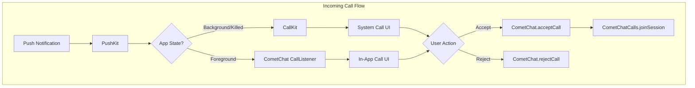

Implement native VoIP calling that works when your app is in the background or killed. This guide shows how to integrate Apple's CallKit framework with CometChat to display system call UI, handle calls from the lock screen, and provide a native calling experience.

## Overview

VoIP calling differs from [basic in-app ringing](/calls/ios/ringing) by leveraging Apple's CallKit to:
- Show incoming calls on lock screen with system UI
- Handle calls when app is in background or killed
- Integrate with CarPlay, Bluetooth, and other audio accessories
- Provide consistent call experience across iOS devices



## Prerequisites

Before implementing VoIP calling, ensure you have:

- [CometChat Chat SDK](/sdk/ios/overview) and [Calls SDK](/calls/ios/setup) integrated
- Apple Push Notification service (APNs) VoIP certificate configured
- [Push notifications enabled](/notifications/push-integration) in CometChat Dashboard
- iOS 10.0+ for CallKit support

<Note>
This documentation builds on the [Ringing](/calls/ios/ringing) functionality. Make sure you understand basic call signaling before implementing VoIP.
</Note>

---

## Architecture Overview

The VoIP implementation consists of several components working together:

| Component | Purpose |
|-----------|---------|
| `PushKit` | Receives VoIP push notifications when app is in background |
| `CXProvider` | CallKit provider that manages call state with the system |
| `CXCallController` | Requests call actions (start, end, hold) from the system |
| `CallManager` | Your custom class that coordinates between CometChat and CallKit |

---

## Step 1: Configure Push Notifications

VoIP push notifications are essential for receiving incoming calls when your app is not in the foreground.


### 1.1 Enable VoIP Capability

In Xcode, add the following capabilities to your app:
1. Go to your target's "Signing & Capabilities" tab
2. Add "Push Notifications" capability
3. Add "Background Modes" capability and enable:
   - Voice over IP
   - Background fetch
   - Remote notifications

### 1.2 Register for VoIP Push

<Tabs>
<Tab title="Swift">
```swift
import PushKit

class AppDelegate: UIResponder, UIApplicationDelegate {
    
    var voipRegistry: PKPushRegistry!
    
    func application(_ application: UIApplication, didFinishLaunchingWithOptions launchOptions: [UIApplication.LaunchOptionsKey: Any]?) -> Bool {
        
        // Initialize CometChat
        // CometChat.init(...)
        
        // Register for VoIP push notifications
        registerForVoIPPush()
        
        return true
    }
    
    private func registerForVoIPPush() {
        voipRegistry = PKPushRegistry(queue: DispatchQueue.main)
        voipRegistry.delegate = self
        voipRegistry.desiredPushTypes = [.voIP]
    }
}
```
</Tab>
<Tab title="Objective-C">
```objectivec
#import <PushKit/PushKit.h>

@interface AppDelegate () <PKPushRegistryDelegate>
@property (nonatomic, strong) PKPushRegistry *voipRegistry;
@end

@implementation AppDelegate

- (BOOL)application:(UIApplication *)application didFinishLaunchingWithOptions:(NSDictionary *)launchOptions {
    
    // Initialize CometChat
    // [CometChat init:...]
    
    // Register for VoIP push notifications
    [self registerForVoIPPush];
    
    return YES;
}

- (void)registerForVoIPPush {
    self.voipRegistry = [[PKPushRegistry alloc] initWithQueue:dispatch_get_main_queue()];
    self.voipRegistry.delegate = self;
    self.voipRegistry.desiredPushTypes = [NSSet setWithObject:PKPushTypeVoIP];
}

@end
```
</Tab>
</Tabs>

### 1.3 Handle VoIP Push Registration

<Tabs>
<Tab title="Swift">
```swift
extension AppDelegate: PKPushRegistryDelegate {
    
    func pushRegistry(_ registry: PKPushRegistry, didUpdate pushCredentials: PKPushCredentials, for type: PKPushType) {
        let token = pushCredentials.token.map { String(format: "%02.2hhx", $0) }.joined()
        
        // Register VoIP token with CometChat
        CometChat.registerTokenForPushNotification(token: token) { success in
            print("VoIP token registered successfully")
        } onError: { error in
            print("VoIP token registration failed: \(error?.errorDescription ?? "")")
        }
    }
    
    func pushRegistry(_ registry: PKPushRegistry, didReceiveIncomingPushWith payload: PKPushPayload, for type: PKPushType, completion: @escaping () -> Void) {
        
        guard type == .voIP else {
            completion()
            return
        }
        
        // Extract call data from payload
        let data = payload.dictionaryPayload
        guard let sessionId = data["sessionId"] as? String,
              let callerName = data["senderName"] as? String,
              let callerUid = data["senderUid"] as? String else {
            completion()
            return
        }
        
        let callType = data["callType"] as? String ?? "video"
        let hasVideo = callType == "video"
        
        // Report incoming call to CallKit
        CallManager.shared.reportIncomingCall(
            sessionId: sessionId,
            callerName: callerName,
            callerUid: callerUid,
            hasVideo: hasVideo
        ) { error in
            completion()
        }
    }
}
```
</Tab>
<Tab title="Objective-C">
```objectivec
- (void)pushRegistry:(PKPushRegistry *)registry didUpdatePushCredentials:(PKPushCredentials *)pushCredentials forType:(PKPushType)type {
    NSMutableString *token = [NSMutableString string];
    const unsigned char *data = pushCredentials.token.bytes;
    for (NSUInteger i = 0; i < pushCredentials.token.length; i++) {
        [token appendFormat:@"%02.2hhx", data[i]];
    }
    
    // Register VoIP token with CometChat
    [CometChat registerTokenForPushNotificationWithToken:token onSuccess:^(NSString * success) {
        NSLog(@"VoIP token registered successfully");
    } onError:^(CometChatException * error) {
        NSLog(@"VoIP token registration failed: %@", error.errorDescription);
    }];
}

- (void)pushRegistry:(PKPushRegistry *)registry didReceiveIncomingPushWithPayload:(PKPushPayload *)payload forType:(PKPushType)type withCompletionHandler:(void (^)(void))completion {
    
    if (![type isEqualToString:PKPushTypeVoIP]) {
        completion();
        return;
    }
    
    // Extract call data from payload
    NSDictionary *data = payload.dictionaryPayload;
    NSString *sessionId = data[@"sessionId"];
    NSString *callerName = data[@"senderName"];
    NSString *callerUid = data[@"senderUid"];
    
    if (!sessionId || !callerName || !callerUid) {
        completion();
        return;
    }
    
    NSString *callType = data[@"callType"] ?: @"video";
    BOOL hasVideo = [callType isEqualToString:@"video"];
    
    // Report incoming call to CallKit
    [[CallManager shared] reportIncomingCallWithSessionId:sessionId
                                               callerName:callerName
                                                callerUid:callerUid
                                                 hasVideo:hasVideo
                                               completion:^(NSError *error) {
        completion();
    }];
}
```
</Tab>
</Tabs>

---

## Step 2: Create CallManager

The CallManager coordinates between CometChat and CallKit:

<Tabs>
<Tab title="Swift">
```swift
import CallKit

class CallManager: NSObject {
    
    static let shared = CallManager()
    
    private let provider: CXProvider
    private let callController = CXCallController()
    
    private var activeCallUUID: UUID?
    private var activeSessionId: String?
    private var activeCallerUid: String?
    
    private override init() {
        let configuration = CXProviderConfiguration()
        configuration.supportsVideo = true
        configuration.maximumCallsPerCallGroup = 1
        configuration.supportedHandleTypes = [.generic]
        configuration.iconTemplateImageData = UIImage(named: "CallIcon")?.pngData()
        
        provider = CXProvider(configuration: configuration)
        
        super.init()
        provider.setDelegate(self, queue: nil)
    }
    
    func reportIncomingCall(sessionId: String, callerName: String, callerUid: String, hasVideo: Bool, completion: @escaping (Error?) -> Void) {
        let uuid = UUID()
        activeCallUUID = uuid
        activeSessionId = sessionId
        activeCallerUid = callerUid
        
        let update = CXCallUpdate()
        update.remoteHandle = CXHandle(type: .generic, value: callerUid)
        update.localizedCallerName = callerName
        update.hasVideo = hasVideo
        update.supportsGrouping = false
        update.supportsUngrouping = false
        update.supportsHolding = true
        update.supportsDTMF = false
        
        provider.reportNewIncomingCall(with: uuid, update: update) { error in
            if let error = error {
                print("Failed to report incoming call: \(error.localizedDescription)")
                self.activeCallUUID = nil
                self.activeSessionId = nil
            }
            completion(error)
        }
    }
    
    func startOutgoingCall(sessionId: String, receiverName: String, receiverUid: String, hasVideo: Bool) {
        let uuid = UUID()
        activeCallUUID = uuid
        activeSessionId = sessionId
        
        let handle = CXHandle(type: .generic, value: receiverUid)
        let startCallAction = CXStartCallAction(call: uuid, handle: handle)
        startCallAction.isVideo = hasVideo
        startCallAction.contactIdentifier = receiverName
        
        let transaction = CXTransaction(action: startCallAction)
        callController.request(transaction) { error in
            if let error = error {
                print("Failed to start call: \(error.localizedDescription)")
            }
        }
    }
    
    func endCall() {
        guard let uuid = activeCallUUID else { return }
        
        let endCallAction = CXEndCallAction(call: uuid)
        let transaction = CXTransaction(action: endCallAction)
        
        callController.request(transaction) { error in
            if let error = error {
                print("Failed to end call: \(error.localizedDescription)")
            }
        }
    }
    
    func reportCallEnded(reason: CXCallEndedReason) {
        guard let uuid = activeCallUUID else { return }
        provider.reportCall(with: uuid, endedAt: Date(), reason: reason)
        activeCallUUID = nil
        activeSessionId = nil
    }
    
    func reportCallConnected() {
        guard let uuid = activeCallUUID else { return }
        provider.reportOutgoingCall(with: uuid, connectedAt: Date())
    }
}
```
</Tab>
<Tab title="Objective-C">
```objectivec
#import <CallKit/CallKit.h>

@interface CallManager : NSObject <CXProviderDelegate>
@property (class, nonatomic, readonly) CallManager *shared;
- (void)reportIncomingCallWithSessionId:(NSString *)sessionId
                             callerName:(NSString *)callerName
                              callerUid:(NSString *)callerUid
                               hasVideo:(BOOL)hasVideo
                             completion:(void (^)(NSError *))completion;
- (void)startOutgoingCallWithSessionId:(NSString *)sessionId
                          receiverName:(NSString *)receiverName
                           receiverUid:(NSString *)receiverUid
                              hasVideo:(BOOL)hasVideo;
- (void)endCall;
- (void)reportCallEndedWithReason:(CXCallEndedReason)reason;
- (void)reportCallConnected;
@end

@implementation CallManager {
    CXProvider *_provider;
    CXCallController *_callController;
    NSUUID *_activeCallUUID;
    NSString *_activeSessionId;
    NSString *_activeCallerUid;
}

static CallManager *_sharedInstance = nil;

+ (CallManager *)shared {
    static dispatch_once_t onceToken;
    dispatch_once(&onceToken, ^{
        _sharedInstance = [[CallManager alloc] init];
    });
    return _sharedInstance;
}

- (instancetype)init {
    self = [super init];
    if (self) {
        CXProviderConfiguration *configuration = [[CXProviderConfiguration alloc] init];
        configuration.supportsVideo = YES;
        configuration.maximumCallsPerCallGroup = 1;
        configuration.supportedHandleTypes = [NSSet setWithObject:@(CXHandleTypeGeneric)];
        
        _provider = [[CXProvider alloc] initWithConfiguration:configuration];
        [_provider setDelegate:self queue:nil];
        _callController = [[CXCallController alloc] init];
    }
    return self;
}

- (void)reportIncomingCallWithSessionId:(NSString *)sessionId
                             callerName:(NSString *)callerName
                              callerUid:(NSString *)callerUid
                               hasVideo:(BOOL)hasVideo
                             completion:(void (^)(NSError *))completion {
    NSUUID *uuid = [NSUUID UUID];
    _activeCallUUID = uuid;
    _activeSessionId = sessionId;
    _activeCallerUid = callerUid;
    
    CXCallUpdate *update = [[CXCallUpdate alloc] init];
    update.remoteHandle = [[CXHandle alloc] initWithType:CXHandleTypeGeneric value:callerUid];
    update.localizedCallerName = callerName;
    update.hasVideo = hasVideo;
    update.supportsGrouping = NO;
    update.supportsUngrouping = NO;
    update.supportsHolding = YES;
    update.supportsDTMF = NO;
    
    [_provider reportNewIncomingCallWithUUID:uuid update:update completion:^(NSError * _Nullable error) {
        if (error) {
            NSLog(@"Failed to report incoming call: %@", error.localizedDescription);
            self->_activeCallUUID = nil;
            self->_activeSessionId = nil;
        }
        completion(error);
    }];
}

@end
```
</Tab>
</Tabs>

---

## Step 3: Implement CXProviderDelegate

Handle CallKit callbacks for user actions:

<Tabs>
<Tab title="Swift">
```swift
extension CallManager: CXProviderDelegate {
    
    func providerDidReset(_ provider: CXProvider) {
        // Clean up any active calls
        activeCallUUID = nil
        activeSessionId = nil
    }
    
    func provider(_ provider: CXProvider, perform action: CXAnswerCallAction) {
        // User tapped "Answer" on the call UI
        guard let sessionId = activeSessionId else {
            action.fail()
            return
        }
        
        // Accept the call via CometChat
        CometChat.acceptCall(sessionID: sessionId) { call in
            action.fulfill()
            
            // Launch call UI
            DispatchQueue.main.async {
                self.launchCallViewController(sessionId: sessionId)
            }
        } onError: { error in
            print("Failed to accept call: \(error?.errorDescription ?? "")")
            action.fail()
        }
    }
    
    func provider(_ provider: CXProvider, perform action: CXEndCallAction) {
        // User tapped "Decline" or "End Call"
        guard let sessionId = activeSessionId else {
            action.fulfill()
            return
        }
        
        // Reject or end the call via CometChat
        CometChat.rejectCall(sessionID: sessionId, status: .rejected) { call in
            action.fulfill()
        } onError: { error in
            action.fulfill()
        }
        
        activeCallUUID = nil
        activeSessionId = nil
    }
    
    func provider(_ provider: CXProvider, perform action: CXSetMutedCallAction) {
        if action.isMuted {
            CallSession.shared.muteAudio()
        } else {
            CallSession.shared.unMuteAudio()
        }
        action.fulfill()
    }
    
    func provider(_ provider: CXProvider, perform action: CXSetHeldCallAction) {
        // Handle hold/unhold if needed
        action.fulfill()
    }
    
    func provider(_ provider: CXProvider, didActivate audioSession: AVAudioSession) {
        // Configure audio session for call
        do {
            try audioSession.setCategory(.playAndRecord, mode: .voiceChat)
            try audioSession.setActive(true)
        } catch {
            print("Failed to configure audio session: \(error)")
        }
    }
    
    func provider(_ provider: CXProvider, didDeactivate audioSession: AVAudioSession) {
        // Clean up audio session
        do {
            try audioSession.setActive(false)
        } catch {
            print("Failed to deactivate audio session: \(error)")
        }
    }
    
    private func launchCallViewController(sessionId: String) {
        guard let windowScene = UIApplication.shared.connectedScenes.first as? UIWindowScene,
              let rootViewController = windowScene.windows.first?.rootViewController else {
            return
        }
        
        let callVC = CallViewController()
        callVC.sessionId = sessionId
        callVC.modalPresentationStyle = .fullScreen
        
        rootViewController.present(callVC, animated: true)
    }
}
```
</Tab>
<Tab title="Objective-C">
```objectivec
- (void)providerDidReset:(CXProvider *)provider {
    _activeCallUUID = nil;
    _activeSessionId = nil;
}

- (void)provider:(CXProvider *)provider performAnswerCallAction:(CXAnswerCallAction *)action {
    if (!_activeSessionId) {
        [action fail];
        return;
    }
    
    NSString *sessionId = _activeSessionId;
    
    [CometChat acceptCallWithSessionID:sessionId onSuccess:^(Call * call) {
        [action fulfill];
        
        dispatch_async(dispatch_get_main_queue(), ^{
            [self launchCallViewControllerWithSessionId:sessionId];
        });
    } onError:^(CometChatException * error) {
        NSLog(@"Failed to accept call: %@", error.errorDescription);
        [action fail];
    }];
}

- (void)provider:(CXProvider *)provider performEndCallAction:(CXEndCallAction *)action {
    if (!_activeSessionId) {
        [action fulfill];
        return;
    }
    
    [CometChat rejectCallWithSessionID:_activeSessionId status:CometChatCallStatusRejected onSuccess:^(Call * call) {
        [action fulfill];
    } onError:^(CometChatException * error) {
        [action fulfill];
    }];
    
    _activeCallUUID = nil;
    _activeSessionId = nil;
}

- (void)provider:(CXProvider *)provider performSetMutedCallAction:(CXSetMutedCallAction *)action {
    if (action.isMuted) {
        [[CallSession shared] muteAudio];
    } else {
        [[CallSession shared] unMuteAudio];
    }
    [action fulfill];
}
```
</Tab>
</Tabs>

---

## Step 4: Handle Call End Events

Update CallKit when the call ends from the remote side:

<Tabs>
<Tab title="Swift">
```swift
class CallViewController: UIViewController, SessionStatusListener {
    
    override func viewDidLoad() {
        super.viewDidLoad()
        CallSession.shared.addSessionStatusListener(self)
    }
    
    func onSessionLeft() {
        CallManager.shared.reportCallEnded(reason: .remoteEnded)
        dismiss(animated: true)
    }
    
    func onConnectionClosed() {
        CallManager.shared.reportCallEnded(reason: .failed)
        dismiss(animated: true)
    }
    
    func onSessionJoined() {
        CallManager.shared.reportCallConnected()
    }
    
    func onSessionTimedOut() {
        CallManager.shared.reportCallEnded(reason: .unanswered)
    }
    
    func onConnectionLost() {}
    func onConnectionRestored() {}
}
```
</Tab>
<Tab title="Objective-C">
```objectivec
- (void)viewDidLoad {
    [super viewDidLoad];
    [[CallSession shared] addSessionStatusListener:self];
}

- (void)onSessionLeft {
    [[CallManager shared] reportCallEndedWithReason:CXCallEndedReasonRemoteEnded];
    [self dismissViewControllerAnimated:YES completion:nil];
}

- (void)onConnectionClosed {
    [[CallManager shared] reportCallEndedWithReason:CXCallEndedReasonFailed];
    [self dismissViewControllerAnimated:YES completion:nil];
}

- (void)onSessionJoined {
    [[CallManager shared] reportCallConnected];
}

- (void)onSessionTimedOut {
    [[CallManager shared] reportCallEndedWithReason:CXCallEndedReasonUnanswered];
}
```
</Tab>
</Tabs>

---

## Related Documentation

- [Ringing](/calls/ios/ringing) - Basic call signaling
- [Background Handling](/calls/ios/background-handling) - Keep calls alive in background
- [Events](/calls/ios/events) - Session status events
