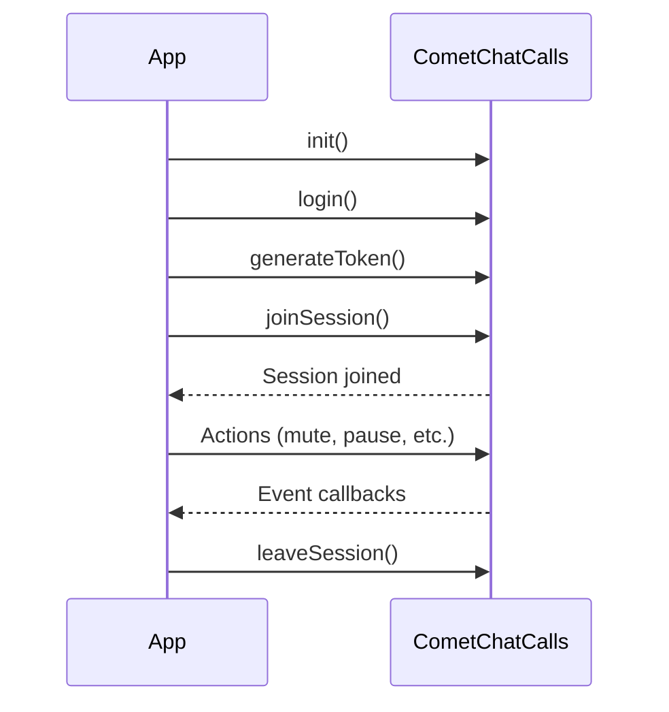

<Warning>
  This is a **beta release** of the standalone Calls SDK. APIs and features may change before the stable release. For the current stable calling integration, see the [JavaScript Calling Overview](/sdk/javascript/calling-overview).
</Warning>

The CometChat Calls SDK enables real-time voice and video calling capabilities in your web application. Built on top of WebRTC, it provides a complete calling solution with built-in UI components and extensive customization options.

<Info>
**Faster Integration with UI Kits**

If you're using CometChat UI Kits, voice and video calling can be quickly integrated:
- Incoming & outgoing call screens
- Call buttons with one-tap calling
- Call logs with history

👉 [React UI Kit Calling Integration](/ui-kit/react/calling-integration)

Use this Calls SDK directly only if you need custom call UI or advanced control.
</Info>

## Prerequisites

Before integrating the Calls SDK, ensure you have:

1. **CometChat Account**: [Sign up](https://app.cometchat.com/signup) and create an app to get your App ID, Region, and API Key
2. **CometChat Users**: Users must exist in CometChat to use calling features. For testing, create users via the [Dashboard](https://app.cometchat.com) or [REST API](/rest-api/chat-apis/users/create-user). Authentication is handled by the Calls SDK - see [Authentication](/calls/javascript/authentication)
3. **Browser Requirements**: See [Browser Compatibility](#browser-compatibility) below
4. **Permissions**: Camera and microphone permissions for video/audio calls

## Browser Compatibility

The Calls SDK requires a modern browser with WebRTC support:

| Browser | Minimum Version | Notes |
|---------|-----------------|-------|
| Chrome | 72+ | Full support |
| Firefox | 68+ | Full support |
| Safari | 12.1+ | Full support |
| Edge | 79+ | Chromium-based |
| Opera | 60+ | Full support |
| Samsung Internet | 12+ | Full support |

### Requirements

- **HTTPS**: Required for camera/microphone access in production. Localhost is exempt during development.
- **WebRTC**: The browser must support WebRTC APIs (`getUserMedia`, `RTCPeerConnection`)
- **JavaScript**: ES6+ support required

### Mobile Browsers

| Browser | Support |
|---------|---------|
| Chrome for Android | ✅ Full support |
| Safari for iOS | ✅ iOS 12.1+ |
| Firefox for Android | ✅ Full support |
| Samsung Internet | ✅ Full support |

<Note>
For native mobile apps, consider using the [iOS](/calls/ios/overview) or [Android](/calls/android/overview) SDKs for better performance and native features like CallKit/VoIP.
</Note>

## Framework Integrations

Get started quickly with framework-specific guides that include complete setup, authentication, and working call implementations:

<CardGroup cols={3}>

<Card title="React" icon="react" href="/calls/javascript/react-integration">
  Context provider pattern with hooks
</Card>

<Card title="Vue" icon="vuejs" href="/calls/javascript/vue-integration">
  Composables and reactive state management
</Card>

<Card title="Angular" icon="angular" href="/calls/javascript/angular-integration">
  Service-based architecture with RxJS
</Card>

<Card title="Next.js" icon="n" href="/calls/javascript/nextjs-integration">
  SSR handling with App Router and Pages Router
</Card>

<Card title="Ionic" icon="mobile" href="/calls/javascript/ionic-integration">
  Cross-platform with Angular, React, and Vue
</Card>

</CardGroup>

## Call Flow

## Features

<CardGroup cols={2}>

<Card title="Call Layouts" icon="grid-2" href="/calls/javascript/call-layouts">
  Tile, Sidebar, and Spotlight view modes for different call scenarios
</Card>

<Card title="Recording" icon="circle-dot" href="/calls/javascript/recording">
  Record call sessions for later playback
</Card>

<Card title="Call Logs" icon="clock-rotate-left" href="/calls/javascript/call-logs">
  Retrieve call history and details
</Card>

<Card title="Participant Management" icon="users" href="/calls/javascript/participant-management">
  Mute, pin, and manage call participants
</Card>

<Card title="Screen Sharing" icon="display" href="/calls/javascript/screen-sharing">
  Share your screen with other participants
</Card>

<Card title="Virtual Background" icon="image" href="/calls/javascript/virtual-background">
  Apply blur or custom image backgrounds
</Card>

<Card title="Raise Hand" icon="hand" href="/calls/javascript/raise-hand">
  Signal to get attention during calls
</Card>

<Card title="Idle Timeout" icon="timer" href="/calls/javascript/idle-timeout">
  Automatic session termination when alone in a call
</Card>

</CardGroup>

## Architecture

The SDK is organized around these core components:

| Component | Description |
|-----------|-------------|
| `CometChatCalls` | Main entry point for SDK initialization, authentication, session management, and call actions |
| `CallAppSettings` | Configuration object for SDK initialization (App ID, Region) |
| `CallSettings` | Configuration object for individual call sessions |
| `addEventListener` | Method to register event listeners for session, participant, media, and UI events |

## Sample App

<CardGroup cols={3}>

<Card title="React" icon="react" href="https://github.com/cometchat/calls-sdk-javascript/tree/v5/sample-apps/cometchat-calls-sample-app-react">
  React sample app
</Card>

<Card title="Angular" icon="angular" href="https://github.com/cometchat/calls-sdk-javascript/tree/v5/sample-apps/cometchat-calls-sample-app-angular">
  Angular sample app
</Card>

<Card title="Vue" icon="vuejs" href="https://github.com/cometchat/calls-sdk-javascript/tree/v5/sample-apps/cometchat-calls-sample-app-vue">
  Vue sample app
</Card>

<Card title="Svelte" icon="s" href="https://github.com/cometchat/calls-sdk-javascript/tree/v5/sample-apps/cometchat-calls-sample-app-svelte">
  Svelte sample app
</Card>

<Card title="Ionic" icon="mobile" href="https://github.com/cometchat/calls-sdk-javascript/tree/v5/sample-apps/cometchat-calls-sample-app-ionic">
  Ionic sample app
</Card>

</CardGroup>

<CardGroup cols={2}>

<Card title="Changelog" icon="list-check" href="https://github.com/cometchat/calls-sdk-javascript/releases">
  View the latest releases and changes
</Card>

</CardGroup>

