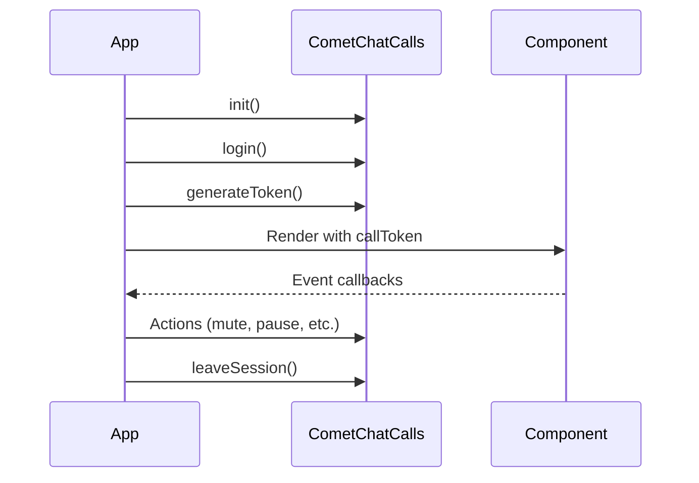

<Warning>
  This is a **beta release** of the standalone Calls SDK. APIs and features may change before the stable release. For the current stable calling integration, see the [React Native Calling Overview](/sdk/react-native/calling-overview).
</Warning>

The CometChat Calls SDK enables real-time voice and video calling capabilities in your React Native application. Built on top of WebRTC, it provides a complete calling solution with built-in UI components and extensive customization options.

<Info>
**Faster Integration with UI Kits**

If you're using CometChat UI Kits, voice and video calling can be quickly integrated:
- Incoming & outgoing call screens
- Call buttons with one-tap calling
- Call logs with history

👉 [React Native UI Kit Calling Integration](/ui-kit/react-native/calling-integration)

Use this Calls SDK directly only if you need custom call UI or advanced control.
</Info>

## Prerequisites

Before integrating the Calls SDK, ensure you have:

1. **CometChat Account**: [Sign up](https://app.cometchat.com/signup) and create an app to get your App ID, Region, and API Key
2. **CometChat Users**: Users must exist in CometChat to use calling features. For testing, create users via the [Dashboard](https://app.cometchat.com) or [REST API](/rest-api/chat-apis/users/create-user). Authentication is handled by the Calls SDK - see [Authentication](/calls/react-native/authentication)
3. **React Native Requirements**:
   - React Native 0.71 or later
   - Node.js 18 or later
   - iOS: Minimum iOS 13.0, Xcode 14.0+
   - Android: Minimum SDK API Level 24 (Android 7.0)
4. **Permissions**: Camera and microphone permissions for video/audio calls

## Call Flow

## Features

<CardGroup cols={2}>

<Card title="Ringing" icon="phone" href="/calls/react-native/ringing">
  Incoming and outgoing call notifications with accept/reject functionality
</Card>

<Card title="Call Layouts" icon="grid-2" href="/calls/react-native/call-layouts">
  Tile, Sidebar, and Spotlight view modes for different call scenarios
</Card>

<Card title="Audio Modes" icon="volume-high" href="/calls/react-native/audio-modes">
  Switch between speaker, earpiece, Bluetooth, and headphones
</Card>

<Card title="Recording" icon="circle-dot" href="/calls/react-native/recording">
  Record call sessions for later playback
</Card>

<Card title="Call Logs" icon="clock-rotate-left" href="/calls/react-native/call-logs">
  Retrieve call history and details
</Card>

<Card title="Participant Management" icon="users" href="/calls/react-native/participant-management">
  Mute, pin, and manage call participants
</Card>

<Card title="Screen Sharing" icon="display" href="/calls/react-native/screen-sharing">
  View screen shares from other participants
</Card>

<Card title="Picture-in-Picture" icon="window-restore" href="/calls/react-native/picture-in-picture">
  Continue calls while using other apps
</Card>

<Card title="Raise Hand" icon="hand" href="/calls/react-native/raise-hand">
  Signal to get attention during calls
</Card>

<Card title="Idle Timeout" icon="timer" href="/calls/react-native/idle-timeout">
  Automatic session termination when alone in a call
</Card>

</CardGroup>

## Architecture

The SDK is organized around these core components:

| Component | Description |
|-----------|-------------|
| `CometChatCalls` | Main entry point for SDK initialization, authentication, and session management |
| `CallAppSettingsBuilder` | Configuration builder for SDK initialization (App ID, Region) |
| `CallSettingsBuilder` | Configuration builder for individual call sessions |
| `CometChatCalls.Component` | React component that renders the call UI |
| `OngoingCallListener` | Event listener class for call events |

## Related Documentation

- [Setup](/calls/react-native/setup) - Install and configure the SDK
- [Authentication](/calls/react-native/authentication) - Initialize and authenticate users
- [Join Session](/calls/react-native/join-session) - Start and join calls

## Sample App

<CardGroup cols={2}>

<Card title="Sample App" icon="github" href="https://github.com/cometchat/calls-sdk-react-native/tree/v5/sample-apps/cometchat-calls-sample-app-react-native">
  Explore the React Native Calls SDK sample app on GitHub
</Card>

<Card title="Changelog" icon="list-check" href="https://github.com/cometchat/calls-sdk-react-native/releases">
  View the latest releases and changes
</Card>

</CardGroup>
