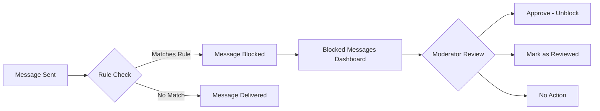

Blocked Messages provides a centralized view of all messages that have been automatically blocked by your moderation rules. Review blocked content to identify false positives, refine your rules, and optionally approve messages that were incorrectly blocked.

<Note>
**Blocked messages are hidden immediately.** Unlike flagged messages which wait for review, blocked messages are never delivered to recipients. Use this dashboard to monitor what's being blocked and catch false positives.
</Note>

---

## Quick Start

Review blocked messages in under 2 minutes:

<Steps>
  <Step title="Open Blocked Messages">
    Login to [CometChat Dashboard](https://app.cometchat.com) → Select your app → **Moderation** → **Blocked Messages**
  </Step>
  <Step title="Review Content">
    Click on a blocked message to see the content, sender, rule that triggered the block, and timestamp
  </Step>
  <Step title="Take Action (Optional)">
    Click **Approve** to unblock a false positive, or **Mark as Reviewed** to acknowledge without approving
  </Step>
</Steps>

<Frame>
  
</Frame>

---

## How It Works

| Status | Description |
|--------|-------------|
| **Blocked** | Message matched a rule and was not delivered |
| **Approved** | Moderator reviewed and unblocked the message |
| **Reviewed** | Moderator acknowledged but kept message blocked |

---

## Managing Blocked Messages

### List Blocked Messages

View all blocked messages with filtering options:
- **Date range**: Filter by when messages were blocked
- **Rule**: Filter by which rule triggered the block
- **Sender**: Search by sender UID

<Frame>
  
</Frame>

### Approve Blocked Message

Approving a blocked message:
1. Unblocks the message (makes it visible to recipients)
2. Marks it as reviewed
3. Helps identify false positives in your rules

<Frame>
  
</Frame>

<Warning>
Approving a message will deliver it to the recipient. Only approve if you're certain the message doesn't violate your guidelines.
</Warning>

### Mark as Reviewed

Mark a message as reviewed without approving it:
- Message stays blocked
- Indicates a moderator has seen it
- Useful for tracking review progress

<Frame>
  
</Frame>

---

## Best Practices

| Practice | Description |
|----------|-------------|
| **Review Regularly** | Check blocked messages weekly to catch false positives and refine rules. |
| **Track Patterns** | Look for patterns in blocked content to identify if rules need adjustment. |
| **Use Date Filters** | Filter by date range to focus on recent blocks or investigate specific incidents. |
| **Refine Rules** | If you see many false positives, adjust confidence levels in [Rules Management](/moderation/rules-management). |

---

## FAQ

<AccordionGroup>
  <Accordion title="Can blocked messages be delivered after approval?">
    Yes. When you approve a blocked message, it becomes visible to the recipient. However, depending on how much time has passed, the message may appear out of context in the conversation.
  </Accordion>
  <Accordion title="What's the difference between blocked and flagged messages?">
    Blocked messages are immediately hidden and never delivered. Flagged messages are delivered but marked for moderator review. Use "Block" for clear violations and "Flag" for borderline content.
  </Accordion>
  <Accordion title="How do I reduce false positives?">
    1. Increase confidence thresholds in your rules
    2. Add exceptions to your keyword lists
    3. Use more specific patterns instead of broad keywords
  </Accordion>
  <Accordion title="Can I bulk approve messages?">
    Yes, select multiple messages and use the bulk approve action.
  </Accordion>
</AccordionGroup>

---

## Related Resources

<CardGroup cols={2}>
  <Card title="Rules Management" icon="shield-check" href="/moderation/rules-management">
    Configure rules that block messages
  </Card>
  <Card title="Flagged Messages" icon="flag" href="/moderation/flagged-messages">
    Review messages pending moderation
  </Card>
  <Card title="Lists Management" icon="list" href="/moderation/lists-management">
    Manage keyword lists used by rules
  </Card>
  <Card title="Moderation Overview" icon="eye" href="/moderation/overview">
    Learn about the moderation system
  </Card>
</CardGroup>
