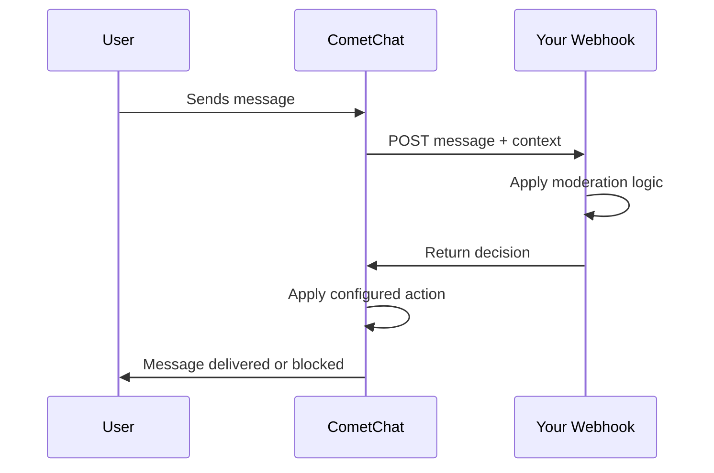

CometChat allows you to integrate your own moderation logic using a **Custom API**. This "bring your own moderation" approach lets you use any third-party service (OpenAI Moderation, Perspective API, etc.) or your own AI model while CometChat handles message interception and action enforcement.

## How It Works

1. **User sends a message** in your chat application
2. **CometChat intercepts** the message and calls your webhook endpoint
3. **Your webhook processes** the message using your custom moderation logic
4. **Your webhook responds** with a decision (violation detected or not)
5. **CometChat applies the action** you configured (block, flag, allow, etc.)

## Getting Started

<Steps>
  <Step title="Build Your Moderation Endpoint">
    Create a webhook that receives messages and returns moderation decisions. You can use any third-party moderation service or your own AI model.
  </Step>
  <Step title="Configure Custom API in CometChat">
    Set up your webhook URL, authentication, and moderation rules in the CometChat Dashboard.
    <Card title="Custom API Configuration" icon="gear" href="/moderation/custom/custom-api">
      Step-by-step guide to configure your custom moderation API
    </Card>
  </Step>
  <Step title="Handle Moderation Events (Optional)">
    Set up webhooks to receive notifications when messages are approved or blocked by your moderation logic.
    <Card title="Moderation Events" icon="bell" href="/fundamentals/webhooks-overview#moderation-events">
      Learn about moderation webhook events
    </Card>
  </Step>
</Steps>

## Key Features

- **Contextual Moderation** – Include previous messages from the conversation for better analysis
- **Error Handling** – Configure fallback behavior when your API is unavailable
- **Flexible Rules** – Apply custom moderation to text or image content
- **Real-time Processing** – Moderation decisions are applied before message delivery
