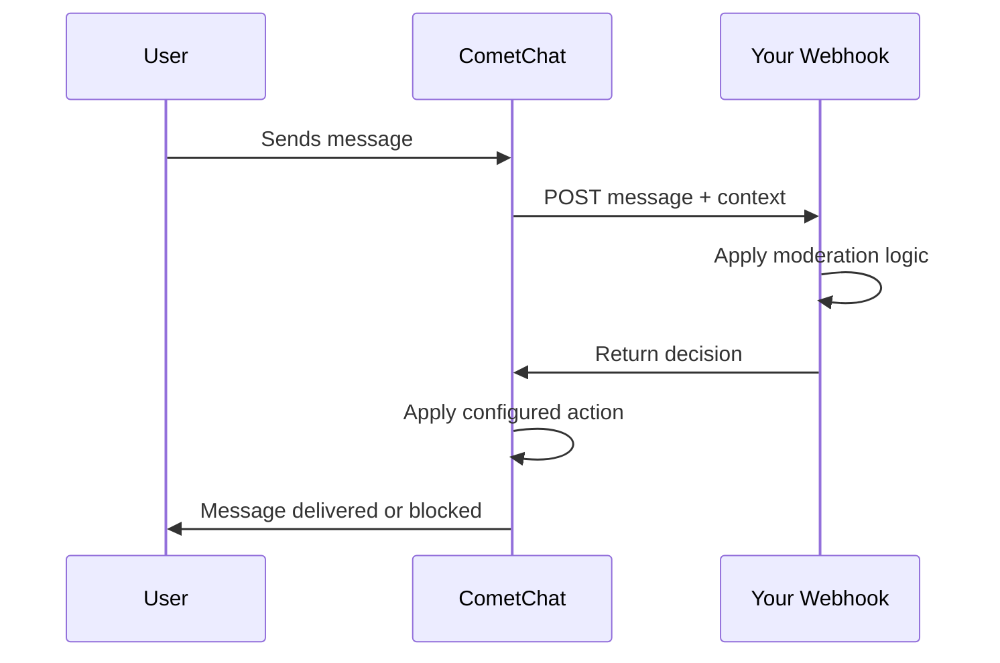

CometChat allows you to integrate your own moderation logic using a **Custom API**. This "bring your own moderation" approach lets you use any third-party service (OpenAI Moderation, Perspective API, etc.) or your own AI model while CometChat handles message interception and action enforcement.

## How It Works

1. **User sends a message** in your chat application
2. **CometChat intercepts** the message and POSTs it to your webhook URL along with optional conversation context (previous messages as plain text)
3. **Your webhook processes** the message using your custom moderation logic
4. **Your webhook responds** with a JSON decision containing `isMatchingCondition`, `confidence`, and optional `reason`
5. **CometChat compares** the returned confidence against your configured threshold and applies the appropriate action (block, flag for review, etc.)

## Getting Started

<Steps>
  <Step title="Build Your Moderation Endpoint">
    Create a webhook that accepts POST requests with message data. Your endpoint must return JSON with:
    - `isMatchingCondition` (boolean) – whether the content violates rules
    - `confidence` (number 0.0-1.0) – confidence score of the decision
    - `reason` (string, optional) – explanation for flagging
  </Step>
  <Step title="Create a Custom API List">
    In the CometChat Dashboard, go to **Moderation** → **Settings** → **List** and create a new list with:
    - **Category**: Custom API
    - **URL**: Your webhook endpoint
    - **Basic Auth** (optional): Username and password for secure authentication
  </Step>
  <Step title="Configure Advanced Settings">
    Under **Moderation** → **Settings** → **Advanced Settings**, configure:
    - **Context messages** (0-10): Number of previous messages to include for context-aware moderation
    - **Error handling**: Choose to approve or block messages when your API is unavailable
  </Step>
  <Step title="Create a Moderation Rule">
    Go to **Moderation** → **Rules** and create a rule that:
    - Selects your Custom API list
    - Sets a confidence threshold (e.g., "greater than 80%")
    - Defines actions when content is flagged
    <Card title="Custom API Configuration" icon="gear" href="/moderation/custom/custom-api">
      Step-by-step guide to configure your custom moderation API
    </Card>
  </Step>
  <Step title="Handle Moderation Events (Optional)">
    Set up webhooks to receive notifications when messages are approved or blocked by your moderation logic.
    <Card title="Moderation Events" icon="bell" href="/fundamentals/webhooks-overview#moderation-events">
      Learn about moderation webhook events
    </Card>
  </Step>
</Steps>

## Key Features

- **Contextual Moderation** – Include up to 10 previous messages from the conversation for context-aware analysis
- **Secure Authentication** – Optional Basic Auth support for webhook security
- **Confidence-Based Decisions** – Set confidence thresholds to fine-tune when actions are triggered
- **Configurable Error Handling** – Choose to approve or block messages when your API is unavailable or returns an error
- **Full Message Details** – Receive complete message objects including sender/receiver info, timestamps, and metadata
- **Real-time Processing** – Moderation decisions are applied before message delivery
