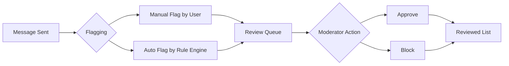

Flagged Messages allows moderators to review messages that have been flagged for potentially violating moderation rules. Messages can be flagged automatically by the rule engine or manually by end users who find content inappropriate.

<Note>
**Two-step moderation.** Unlike blocked messages which are hidden immediately, flagged messages remain visible until a moderator reviews and takes action (approve or block).
</Note>

---

## Quick Start

Review flagged messages in under 2 minutes:

<Steps>
  <Step title="Open Flagged Messages">
    Login to [CometChat Dashboard](https://app.cometchat.com) → Select your app → **Moderation** → **Flagged Messages**
  </Step>
  <Step title="Review a Message">
    Click on a flagged message to see details, context, and the reason it was flagged
  </Step>
  <Step title="Take Action">
    Click **Approve** (message stays visible) or **Block** (message is hidden)
  </Step>
</Steps>

---

## How It Works

| Step | Description |
|------|-------------|
| 1. Message Sent | A user sends a message in a conversation |
| 2. Flagging | Message is flagged either manually by users or automatically by the rule engine |
| 3. Review Queue | Flagged message appears in the Dashboard for moderator review |
| 4. Moderator Action | Moderator reviews and either approves or blocks the message |
| 5. Reviewed List | Message moves to the reviewed list with its final status |

---

## Flagging Methods

<Tabs>
  <Tab title="Manual Flagging">
    End users can manually flag messages they find inappropriate by selecting from a predefined list of reasons.
    
    <Frame>
      
    </Frame>
    
    **Configure flag reasons:** Dashboard → **Moderation** → **Advanced Settings**
    
    <Frame>
      
    </Frame>
  </Tab>
  <Tab title="Automatic Flagging">
    Messages are automatically flagged when they match moderation rules configured with the "Flag" action.
    
    <Frame>
      
    </Frame>
    
    **Set up auto-flagging:** Create a rule in [Rules Management](/moderation/rules-management) with Action set to "Flag"
  </Tab>
</Tabs>

---

## Enable Flagging in Your App

<AccordionGroup>
  <Accordion title="UI Kits">
    The Report Message feature is available in CometChat UI Kits. Users can report messages directly from the message actions menu:

    <CardGroup cols={3}>
      <Card title="React" icon={} href="/ui-kit/react/core-features#report-message" horizontal />
      <Card title="React Native" icon={} href="/ui-kit/react-native/core-features" horizontal />
      <Card title="Android" icon={} href="/ui-kit/android/core-features" horizontal />
      <Card title="iOS" icon={} href="/ui-kit/ios/core-features" horizontal />
      <Card title="Flutter" icon={} href="/ui-kit/flutter/core-features" horizontal />
      <Card title="Angular" icon={} href="/ui-kit/angular/core-features" horizontal />
      <Card title="Vue" icon={} href="/ui-kit/vue/overview" horizontal />
    </CardGroup>
  </Accordion>
  <Accordion title="Chat SDKs">
    Implement message flagging directly using CometChat Chat SDKs:

    <CardGroup cols={3}>
      <Card title="JavaScript" icon={} href="/sdk/javascript/flag-message" horizontal />
      <Card title="React Native" icon={} href="/sdk/react-native/flag-message" horizontal />
      <Card title="Android" icon={} href="/sdk/android/flag-message" horizontal />
      <Card title="iOS" icon={} href="/sdk/ios/flag-message" horizontal />
      <Card title="Flutter" icon={} href="/sdk/flutter/flag-message" horizontal />
    </CardGroup>
  </Accordion>
</AccordionGroup>

---

## Managing Flagged Messages

### List Flagged Messages

View all messages pending review in the Flagged Messages tab.

<Frame>
  
</Frame>

### Approve Message

Approving indicates the message is acceptable. It remains visible to all users and moves to the Reviewed list.

<Frame>
  
</Frame>

### Block Message

Blocking marks the message as disapproved. It's hidden from the conversation and moves to the Reviewed list.

<Frame>
  
</Frame>

<Tip>
**Bulk actions supported.** Select multiple flagged messages and approve or block them in a single action.
</Tip>

---

## FAQ

<AccordionGroup>
  <Accordion title="What happens to blocked messages?">
    Blocked messages are hidden from the conversation and no longer visible to users. The message is marked as disapproved and moved to the Reviewed list.
  </Accordion>
  <Accordion title="Can users see if their message was blocked?">
    By default, users are not notified when their message is blocked. The message simply becomes hidden from the conversation.
  </Accordion>
  <Accordion title="Can I bulk approve or block messages?">
    Yes, the Dashboard supports bulk actions. Select multiple flagged messages and approve or block them in a single action.
  </Accordion>
  <Accordion title="What's the difference between flagged and blocked messages?">
    Flagged messages are pending review and remain visible until a moderator takes action. Blocked messages are immediately hidden and don't require review.
  </Accordion>
</AccordionGroup>

---

## Related Resources

<CardGroup cols={2}>
  <Card title="Rules Management" icon="shield-check" href="/moderation/rules-management">
    Configure rules to auto-flag messages
  </Card>
  <Card title="Blocked Messages" icon="ban" href="/moderation/blocked-messages">
    View immediately blocked content
  </Card>
  <Card title="Lists Management" icon="list" href="/moderation/lists-management">
    Create keyword lists for flagging
  </Card>
  <Card title="Moderation Overview" icon="eye" href="/moderation/overview">
    Learn about the moderation system
  </Card>
</CardGroup>
