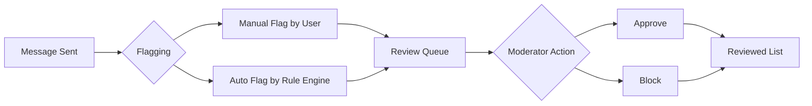

## Overview

The Flagged Messages feature in CometChat's Moderation Service enables app owners and collaborators to review messages that have been flagged for potentially violating moderation rules. Messages can be flagged automatically by the rule engine based on predefined rules, or manually by end users who find certain content inappropriate or concerning.

When a message is flagged, it becomes visible in the [CometChat Dashboard](https://app.cometchat.com) under **Moderation > Flagged Messages**. Moderators can then review these flagged messages and take one of two actions:

1. **Approve** - The message is deemed acceptable and the moderation status remains approved
2. **Block** - The message violates platform policies and the moderation status is changed to disapproved

Once either action is taken, the message is automatically moved to the Reviewed list, which contains all messages that have been reviewed by moderators.

## How It Works

| Step | Description |
|------|-------------|
| 1. Message Sent | A user sends a message in a conversation |
| 2. Flagging | Message is flagged either manually by users or automatically by the rule engine |
| 3. Review Queue | Flagged message appears in the Dashboard for moderator review |
| 4. Moderator Action | Moderator reviews and either approves or blocks the message |
| 5. Reviewed List | Message moves to the reviewed list with its final status |

## Dashboard vs REST API

You can manage flagged messages through either the Dashboard or REST API:

| Action | Dashboard | REST API |
|--------|-----------|----------|
| List flagged messages | **Moderation > Flagged Messages** | [List Flagged Messages API](/rest-api/moderation/list-flagged-messages) |
| Approve message | Click "Approve" button | [Approve/Block API](/rest-api/moderation/blockreview-flagged-message) |
| Block message | Click "Block" button | [Approve/Block API](/rest-api/moderation/blockreview-flagged-message) |
| Flag a message | - | [Flag Message API](/rest-api/moderation/flag-a-message) |
| Configure flag reasons | **Moderation > Advanced Settings** | [Reason APIs](/rest-api/moderation/create-reasons) |

## Flagging Methods

### Manual Flagging by End Users

End users can manually flag messages they find inappropriate or concerning by selecting from a predefined list of reasons. These flag reasons are configurable through the CometChat Dashboard, where you can either use the default options or create custom flagging reasons tailored to your platform's needs.

<Frame>
  
</Frame>

Once configured, these reasons will appear in the user interface, allowing users to select the most appropriate reason when reporting a message.

Messages can also be flagged programmatically via the [Flag Message API](/rest-api/moderation/flag-a-message).

<Accordion title="Enable Report Message in UI Kits">
The Report Message feature is available in CometChat UI Kits. Users can report messages directly from the message actions menu:

<CardGroup cols={3}>
  <Card title="React" icon={} href="/ui-kit/react/core-features#report-message" horizontal />
  <Card title="React Native" icon={} href="/ui-kit/react-native/core-features" horizontal />
  <Card title="Android" icon={} href="/ui-kit/android/core-features" horizontal />
  <Card title="iOS" icon={} href="/ui-kit/ios/core-features" horizontal />
  <Card title="Flutter" icon={} href="/ui-kit/flutter/core-features" horizontal />
  <Card title="Angular" icon={} href="/ui-kit/angular/core-features" horizontal />
  <Card title="Vue" icon={} href="/ui-kit/vue/overview" horizontal />
</CardGroup>
</Accordion>

<Accordion title="Enable Report Message in Chat SDKs">
You can implement message flagging directly using CometChat Chat SDKs:

<CardGroup cols={3}>
  <Card title="JavaScript" icon={} href="/sdk/javascript/flag-message" horizontal />
  <Card title="React Native" icon={} href="/sdk/react-native/flag-message" horizontal />
  <Card title="Android" icon={} href="/sdk/android/flag-message" horizontal />
  <Card title="iOS" icon={} href="/sdk/ios/flag-message" horizontal />
  <Card title="Flutter" icon={} href="/sdk/flutter/flag-message" horizontal />
</CardGroup>
</Accordion>

### Automatic Flagging by Rule Engine

Messages can be automatically flagged when they violate predefined moderation rules. When setting up moderation rules in the Dashboard, you can configure the action to "flag" messages that match specific criteria. This ensures that potentially problematic content is automatically identified and queued for review without requiring manual intervention from users.

For example, if a message contains profane words, it would be automatically flagged.

<Frame>
  
</Frame>

### Configuring Flag Reasons

You can customize the flagging reasons available to end users through the [CometChat Dashboard](https://app.cometchat.com) under **Moderation > Advanced Settings**. The platform provides a set of default flagging reasons that cover common moderation scenarios, or you can create custom reasons that align with your platform's specific community guidelines and policies.

<Frame>
  
</Frame>

Flag reasons can also be configured via the [Reason APIs](/rest-api/moderation/create-reasons).

## Managing Flagged Messages

### List Flagged Messages

Retrieves the list of messages that have been flagged by the moderation system or manually by users.

<Frame>
  
</Frame>

**REST API:** [List Flagged Messages](/rest-api/moderation/list-flagged-messages)

---

### Approve Flagged Message

Approving a flagged message indicates that it has been reviewed and is considered acceptable according to platform guidelines. The message remains visible to all users.

<Frame>
  
</Frame>

**REST API:** [Approve/Block Flagged Message](/rest-api/moderation/blockreview-flagged-message)

---

### Block Flagged Message

Blocking a flagged message marks it as disapproved and moves it to the reviewed list. Blocked messages are hidden from the conversation and are no longer visible to users.

<Frame>
  
</Frame>

**REST API:** [Approve/Block Flagged Message](/rest-api/moderation/blockreview-flagged-message)

## Frequently Asked Questions

<AccordionGroup>
  <Accordion title="What happens to blocked messages?">
    Blocked messages are hidden from the conversation and are no longer visible to users. The message is marked as disapproved and moved to the Reviewed list in the Dashboard.
  </Accordion>
  <Accordion title="Can users see if their message was blocked?">
    By default, users are not notified when their message is blocked. The message simply becomes hidden from the conversation.
  </Accordion>
  <Accordion title="Can I bulk approve or block messages?">
    Yes, the Dashboard supports bulk actions. You can select multiple flagged messages and approve or block them in a single action.
  </Accordion>
</AccordionGroup>
