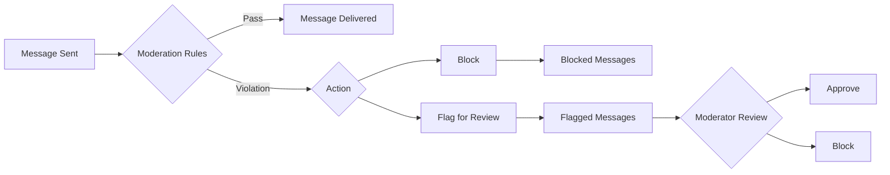

The Moderation feature provides a comprehensive suite of capabilities designed to manage and enforce message moderation rules across various types of messages, ensuring your platform remains safe and compliant for all users.

## Key Benefits

- **Automated Content Filtering** - Automatically detect and handle inappropriate content before it reaches users
- **Customizable Rules** - Create rules tailored to your platform's specific community guidelines
- **Multi-format Support** - Moderate text messages, images, and videos
- **Real-time Protection** - Messages are moderated instantly as they are sent
- **Manual Review** - Users can report content, and moderators can review flagged messages

## How It Works

## Quick Navigation

<CardGroup cols={2}>
  <Card title="Rules Management" icon="gavel" href="/moderation/rules-management">
    Create and manage moderation rules to detect inappropriate content
  </Card>
  <Card title="Lists Management" icon="list" href="/moderation/lists-management">
    Manage keyword lists and regex patterns for content filtering
  </Card>
  <Card title="Flagged Messages" icon="flag" href="/moderation/flagged-messages">
    Review messages flagged by users or the rule engine
  </Card>
  <Card title="Blocked Messages" icon="ban" href="/moderation/blocked-messages">
    View messages that were blocked due to rule violations
  </Card>
</CardGroup>

## Getting Started

<Steps>
  <Step title="Access Moderation Settings">
    Navigate to the [CometChat Dashboard](https://app.cometchat.com) and go to **Moderation** section
  </Step>
  <Step title="Create Moderation Rules">
    Set up rules to automatically detect and handle inappropriate content. See [Rules Management](/moderation/rules-management)
  </Step>
  <Step title="Configure Flag Reasons">
    Customize the reasons users can select when reporting messages. Go to **Moderation > Advanced Settings**
  </Step>
  <Step title="Integrate with Your App">
    Enable moderation features in your UI Kit or implement using the SDK/REST API
  </Step>
</Steps>

## Platform Integration

Moderation is supported across all CometChat platforms. Choose your integration method:

### UI Kits

UI Kits provide built-in support for message moderation and the Report Message feature:

<CardGroup cols={3}>
  <Card title="React" icon={} href="/ui-kit/react/core-features#moderation" />
  <Card title="React Native" icon={} href="/ui-kit/react-native/core-features#moderation" />
  <Card title="Android" icon={} href="/ui-kit/android/core-features#moderation" />
  <Card title="iOS" icon={} href="/ui-kit/ios/core-features#moderation" />
  <Card title="Flutter" icon={} href="/ui-kit/flutter/core-features#moderation" />
  <Card title="Angular" icon={} href="/ui-kit/angular/core-features#moderation" />
</CardGroup>

### Chat SDKs

Implement message flagging directly using CometChat Chat SDKs:

<CardGroup cols={3}>
  <Card title="JavaScript" icon={} href="/sdk/javascript/ai-moderation" />
  <Card title="React Native" icon={} href="/sdk/react-native/ai-moderation" />
  <Card title="Android" icon={} href="/sdk/android/ai-moderation" />
  <Card title="iOS" icon={} href="/sdk/ios/ai-moderation" />
  <Card title="Flutter" icon={} href="/sdk/flutter/ai-moderation" />
</CardGroup>

---

## Rules Management

This feature enables you to define and manage a set of moderation rules tailored to address inappropriate messages under various conditions. You can establish specific criteria that determine what constitutes unacceptable behavior or content, such as the use of offensive language, unsafe content, or sharing sensitive information.

By customizing these rules, you ensure that the moderation system effectively identifies and manages messages that violate your platform's standards, thereby maintaining a safe and respectful environment for all users.

For more detailed management, refer to the [Rules Management](/moderation/rules-management) section.

## Lists Management

This feature allows you to create and manage comprehensive lists of keywords or regex patterns that are used for message moderation. These lists serve as a vital component in identifying and handling inappropriate content.

Once created, these keyword lists can be linked to various moderation rules when creating or updating rules, ensuring that the moderation system effectively detects and manages content that violates your standards.

For more detailed management, refer to the [Lists Management](/moderation/lists-management) section.

## Flagged Messages

This feature enables you to access and manage all messages that require moderation review. You can view a complete list of messages that have been automatically flagged by the rule engine for policy violations or manually reported by users for inappropriate content.

For more details, refer to the [Flagged Messages](/moderation/flagged-messages) section.

## Blocked Messages

This feature allows you to retrieve all the violated messages. You can retrieve a comprehensive list of messages that have been blocked due to violations of moderation rules. Additionally, you can perform searches within this list to find specific messages or filter results based on date ranges.

For more details, refer to the [Blocked Messages](/moderation/blocked-messages) section.

---

## Available Moderation Rules

Our platform offers a wide range of moderation rules to help you detect and manage various types of risky, sensitive, or inappropriate content.

<Tabs>
  <Tab title="Message Rules">
    | Name | Description |
    |------|-------------|
    | **Word Pattern Match** | Identifies profane or offensive words using word matching |
    | **Contact Details Removal** | Detects and removes phone numbers from text |
    | **Email Detection** | Detects and removes email addresses from messages |
    | **Spam Detection (English)** | Detects spam messages in English |
    | **Scam Detection (English)** | Detects scam or fraudulent text in English |
    | **Platform Circumvention (English)** | Identifies attempts to bypass platform rules |
    | **Toxicity Detection (English)** | Detects toxic or harmful language in text |
    | **Explicit or Inappropriate Content** | Detects explicit sexual descriptions, graphic violence, or unsuitable text |
    | **Privacy and Sensitive Info** | Identifies sensitive personal information shared without consent |
    | **Hate and Harassment** | Detects hateful or harassing language toward individuals or groups |
    | **Self-Harm or Suicidal Content** | Detects content suggesting self-harm or suicidal thoughts |
    | **Impersonation or Fraud** | Detects deceptive attempts to impersonate individuals or organizations |
    | **Violent or Terroristic Threats** | Detects content promoting violence or extremism |
    | **Non-Consensual Sexual Content** | Detects sexual exploitation, grooming, or non-consensual content |
    | **Spam and Scam** | Identifies spam, phishing attempts, and fraudulent schemes |
  </Tab>
  <Tab title="Image Rules">
    | Name | Description |
    |------|-------------|
    | **Unsafe & Prohibited Content** | Detects unsafe or prohibited content in images |
    | **Terrorism or Extremist Promotion** | Detects extremist propaganda, terrorist symbols, or violent ideologies |
    | **Minor Safety and Exploitation** | Detects child sexual content or exploitative imagery of minors |
    | **Self-Harm or Suicidal Content** | Detects imagery suggesting self-harm or suicidal ideation |
    | **Privacy or Personal Data** | Identifies images containing personal or sensitive data |
    | **Graphic Violence or Gore** | Detects images of extreme violence or gore |
    | **Explicit or Sexual Content** | Identifies nudity, explicit sexual content, or suggestive imagery |
    | **Hate or Harassment** | Detects hate symbols, harassment, or extremist imagery |
    | **Fraud or Scam Indicators** | Flags manipulated or fraudulent images, such as fake IDs |
  </Tab>
  <Tab title="Video Rules">
    | Name | Description |
    |------|-------------|
    | **Unsafe & Prohibited Content** | Detects unsafe or prohibited content in video files |
  </Tab>
</Tabs>
