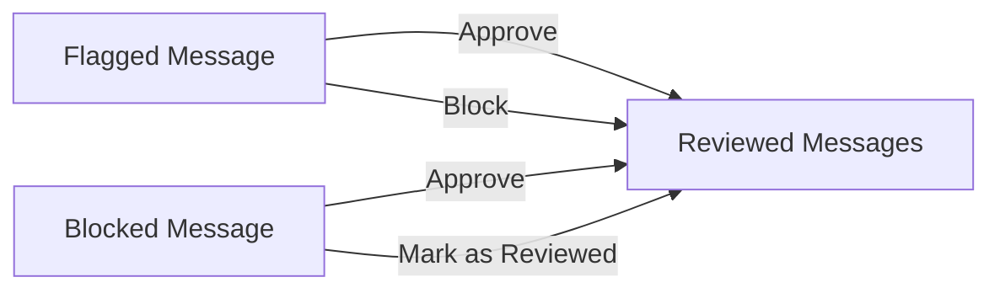

Reviewed Messages is your audit trail for all moderation decisions. When a moderator takes action on a flagged or blocked message (approve, block, or mark as reviewed), it automatically moves here for record-keeping.

<Note>
**Complete moderation history.** Use this dashboard to track moderator activity, audit decisions, and maintain compliance records.
</Note>

---

## Quick Start

Access your moderation history:

<Steps>
  <Step title="Open Reviewed Messages">
    Login to [CometChat Dashboard](https://app.cometchat.com) → Select your app → **Moderation** → **Reviewed Messages**
  </Step>
  <Step title="Filter Results">
    Use date range, status, or moderator filters to find specific decisions
  </Step>
  <Step title="Review Details">
    Click on any message to see the original content, rule triggered, and moderator action taken
  </Step>
</Steps>

<Frame>
  
</Frame>

---

## How Messages Get Here

| Source | Action Taken | Result |
|--------|--------------|--------|
| Flagged Message | Approved | Message visible, marked reviewed |
| Flagged Message | Blocked | Message hidden, marked reviewed |
| Blocked Message | Approved | Message unblocked, marked reviewed |
| Blocked Message | Mark as Reviewed | Message stays blocked, marked reviewed |

---

## What You Can See

Each reviewed message includes:

| Field | Description |
|-------|-------------|
| **Message Content** | The original text, image, or media that was moderated |
| **Sender** | User who sent the message |
| **Rule Triggered** | Which moderation rule flagged/blocked the message |
| **Action Taken** | Approved, Blocked, or Marked as Reviewed |
| **Moderator** | Who made the decision |
| **Timestamp** | When the decision was made |

---

## Use Cases

| Use Case | Description |
|----------|-------------|
| **Compliance Audits** | Maintain records of all moderation decisions for regulatory compliance. |
| **Moderator Performance** | Track moderator activity and decision patterns. |
| **Rule Effectiveness** | Analyze which rules generate the most reviews to optimize your setup. |
| **Dispute Resolution** | Reference historical decisions when users dispute moderation actions. |

---

## FAQ

<AccordionGroup>
  <Accordion title="Can I undo a moderation decision?">
    You cannot directly undo from the Reviewed Messages list. However, if a message was blocked, you can find it and approve it to make it visible again.
  </Accordion>
  <Accordion title="How long are reviewed messages stored?">
    Reviewed messages are stored according to your data retention settings. Check your app settings for specific retention periods.
  </Accordion>
  <Accordion title="Can I export reviewed messages?">
    Yes, you can export reviewed messages for compliance or analysis purposes from the Dashboard.
  </Accordion>
</AccordionGroup>

---

## Related Resources

<CardGroup cols={2}>
  <Card title="Flagged Messages" icon="flag" href="/moderation/flagged-messages">
    Messages pending review
  </Card>
  <Card title="Blocked Messages" icon="ban" href="/moderation/blocked-messages">
    Automatically blocked content
  </Card>
  <Card title="Rules Management" icon="shield-check" href="/moderation/rules-management">
    Configure moderation rules
  </Card>
  <Card title="Moderation Overview" icon="eye" href="/moderation/overview">
    Learn about the moderation system
  </Card>
</CardGroup>
