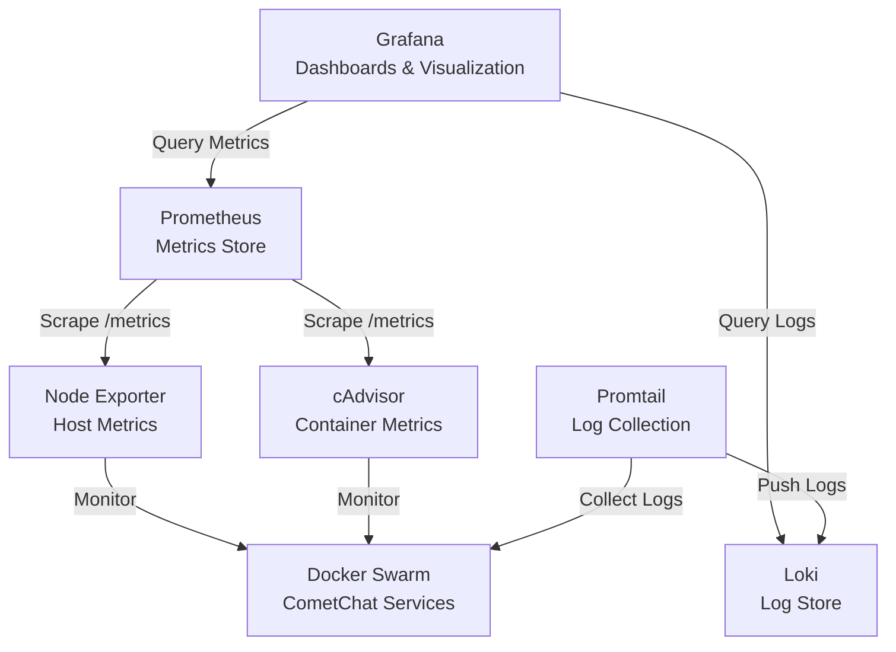

Monitoring ensures system health, operational visibility, and SLA compliance for CometChat on-premise deployments.

## Monitoring stack

The following open-source tools form the monitoring and observability stack for CometChat on-premise deployments:

- **Prometheus**: Collects and stores metrics from all services
- **Grafana**: Visualizes metrics with dashboards and alerts
- **Loki**: Stores and queries logs from all containers
- **Promtail**: Tails logs from Docker containers and pushes them to Loki
- **Node Exporter**: Collects host-level metrics (CPU, memory, disk, network)
- **cAdvisor**: Collects container-level resource usage metrics

## Architecture



## Key metrics to monitor

### Infrastructure
- CPU usage per node
- Memory usage per node
- Disk space and I/O
- Network traffic
- Container resource usage

### Application services
- WebSocket active connections
- Chat API request rate and latency
- API error rates (4xx, 5xx)
- Service uptime

### Data stores
- **Kafka**: Consumer lag, message throughput
- **Redis**: Memory usage, cache hit ratio, connected clients
- **MongoDB**: Operation latency, connections, replication lag
- **TiDB**: Query duration, region health, storage capacity

### Load balancer
- NGINX request rate
- Response status codes
- Active connections

## Alerting

Alerts should focus on user impact, capacity risks, and data integrity rather than raw metric noise.

Set up alerts for these critical conditions:

- CPU usage > 80% for 5 minutes
- Memory usage > 85% for 5 minutes
- Disk space < 15%
- Service down for 2 minutes
- Database query latency > 100ms
- Kafka consumer lag > 10,000 messages
- Redis memory > 90%
- WebSocket connection errors > 10/second
- API error rate > 5%
- Container restarts

These thresholds are recommended starting points and should be adjusted based on workload characteristics and environment scale.

## Grafana dashboards

Create dashboards to visualize:

1. **Overview**: System health, active users, request rates, error rates
2. **Infrastructure**: CPU, memory, disk, network per node
3. **WebSocket**: Active connections, message throughput, errors
4. **API**: Request rate, latency, error rates by endpoint
5. **Databases**: Query performance, connections, replication status
6. **Kafka**: Consumer lag, throughput, partition health
7. **Logs & Error Analysis**: Error aggregation, log volume, search, and correlation with metrics

### Logs & Error Analysis Dashboard

This dashboard provides centralized visibility into application errors, log patterns, and system anomalies for rapid troubleshooting and incident investigation.

**Key Visualizations:**

- **Error Volume by Service**: Time-series graph showing error log count per service, helping identify which components are experiencing issues
- **Top Error Messages**: Table displaying the most frequent error messages with occurrence counts, enabling quick identification of recurring problems
- **Log Volume Trends**: Track total log volume over time to detect unusual spikes that may indicate issues or attacks
- **Error Rate by Severity**: Breakdown of errors by severity level (CRITICAL, ERROR, WARNING) for prioritization
- **Service Health Correlation**: Side-by-side view of error logs and service metrics (CPU, memory, latency) to correlate errors with resource constraints
- **Search & Filter**: Interactive LogQL query panel for ad-hoc log searches and pattern matching
- **Recent Critical Errors**: Live feed of the latest critical errors across all services for immediate awareness

## Log queries

Use Loki's LogQL to search and filter logs across all services:

```logql
# View all errors
{service="chat-api"} |= "error"

# WebSocket connection issues
{service="websocket"} |~ "connection.*failed"

# API 5xx errors
{service="nginx"} |~ "HTTP/[0-9.]+ 5[0-9]{2}"

# High latency requests
{service="chat-api"} | json | latency > 1000
```

## Troubleshooting

### First check Grafana dashboards

Start with the Overview dashboard to determine blast radius before drilling into component-level dashboards. Confirm whether the issue is node-level, service-level, or data-store related before diving into individual components.

### Check Prometheus targets
```bash
curl http://localhost:9090/api/v1/targets
```

### Check Loki status
```bash
curl http://localhost:3100/ready
```

### View Promtail logs
```bash
docker service logs promtail
```

### Check service metrics
```bash
# Node Exporter
curl http://localhost:9100/metrics

# cAdvisor
curl http://localhost:8080/metrics
```
