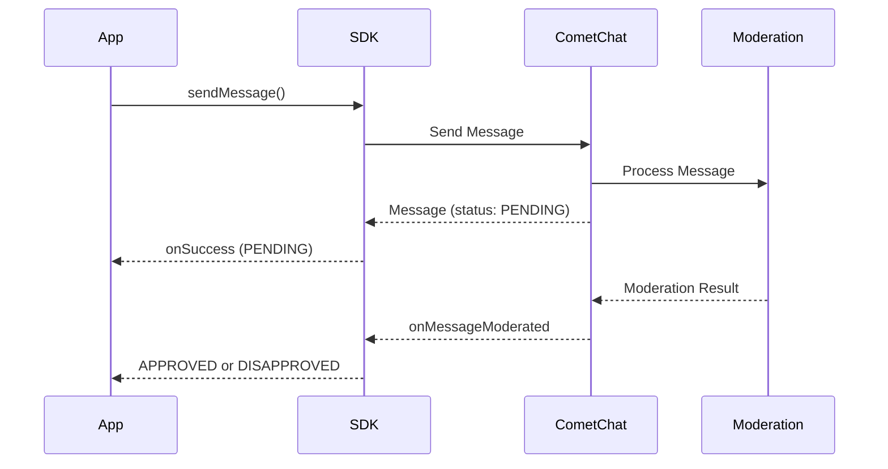

## Overview

AI Moderation in the CometChat SDK helps ensure that your chat application remains safe and compliant by automatically reviewing messages for inappropriate content. This feature leverages AI to moderate messages in real-time, reducing manual intervention and improving user experience.

<Note>
For a broader understanding of moderation features, configuring rules, and managing flagged messages, see the [Moderation Overview](/moderation/overview).
</Note>

## Prerequisites

Before using AI Moderation, ensure the following:

1. Moderation is enabled for your app in the [CometChat Dashboard](https://app.cometchat.com)
2. Moderation rules are configured under **Moderation > Rules**
3. You're using CometChat SDK version that supports moderation

## How It Works



| Step | Description |
|------|-------------|
| 1. Send Message | App sends a text, image, or video message |
| 2. Pending Status | Message is sent with `PENDING` moderation status |
| 3. AI Processing | Moderation service analyzes the content |
| 4. Result Event | `onMessageModerated` event fires with final status |

## Supported Message Types

Moderation is triggered **only** for the following message types:

| Message Type | Moderated | Notes |
|--------------|-----------|-------|
| Text Messages | ✅ | Content analyzed for inappropriate text |
| Image Messages | ✅ | Images scanned for unsafe content |
| Video Messages | ✅ | Videos analyzed for prohibited content |
| Custom Messages | ❌ | Not subject to AI moderation |
| Action Messages | ❌ | Not subject to AI moderation |

## Moderation Status

The `getModerationStatus()` method returns one of the following values:

| Status | Enum Value | Description |
|--------|------------|-------------|
| Pending | `ModerationStatus.PENDING` | Message is being processed by moderation |
| Approved | `ModerationStatus.APPROVED` | Message passed moderation and is visible |
| Disapproved | `ModerationStatus.DISAPPROVED` | Message violated rules and was blocked |

## Implementation

### Step 1: Send a Message and Check Initial Status

When you send a text, image, or video message, check the initial moderation status:

<Tabs>
  <Tab title="Kotlin">
    ```kotlin
    val textMessage = TextMessage(receiverUID, "Hello, how are you?", CometChatConstants.RECEIVER_TYPE_USER)

    CometChat.sendMessage(textMessage, object : CometChat.CallbackListener<TextMessage>() {
        override fun onSuccess(message: TextMessage) {
            // Check moderation status
            if (message.moderationStatus == ModerationStatus.PENDING) {
                Log.d(TAG, "Message is under moderation review")
                // Show pending indicator in UI
            }
        }

        override fun onError(e: CometChatException) {
            Log.e(TAG, "Message sending failed: ${e.message}")
        }
    })
    ```
  </Tab>
  <Tab title="Java">
    ```java
    TextMessage textMessage = new TextMessage(receiverUID, "Hello, how are you?", CometChatConstants.RECEIVER_TYPE_USER);

    CometChat.sendMessage(textMessage, new CometChat.CallbackListener<TextMessage>() {
        @Override
        public void onSuccess(TextMessage message) {
            // Check moderation status
            if (message.getModerationStatus().equals(ModerationStatus.PENDING)) {
                Log.d(TAG, "Message is under moderation review");
                // Show pending indicator in UI
            }
        }

        @Override
        public void onError(CometChatException e) {
            Log.e(TAG, "Message sending failed: " + e.getMessage());
        }
    });
    ```
  </Tab>
</Tabs>

### Step 2: Listen for Moderation Results

Register a message listener to receive moderation results in real-time:

<Tabs>
  <Tab title="Kotlin">
    ```kotlin
    val listenerID = "MODERATION_LISTENER"

    CometChat.addMessageListener(listenerID, object : CometChat.MessageListener() {
        override fun onMessageModerated(message: BaseMessage) {
            when (message) {
                is TextMessage -> {
                    when (message.moderationStatus) {
                        ModerationStatus.APPROVED -> {
                            Log.d(TAG, "Message ${message.id} approved")
                            // Update UI to show message normally
                        }
                        ModerationStatus.DISAPPROVED -> {
                            Log.d(TAG, "Message ${message.id} blocked")
                            // Handle blocked message (hide or show warning)
                        }
                    }
                }
                is MediaMessage -> {
                    when (message.moderationStatus) {
                        ModerationStatus.APPROVED -> {
                            Log.d(TAG, "Media message ${message.id} approved")
                        }
                        ModerationStatus.DISAPPROVED -> {
                            Log.d(TAG, "Media message ${message.id} blocked")
                        }
                    }
                }
            }
        }
    })

    // Don't forget to remove the listener when done
    // CometChat.removeMessageListener(listenerID)
    ```
  </Tab>
  <Tab title="Java">
    ```java
    String listenerID = "MODERATION_LISTENER";

    CometChat.addMessageListener(listenerID, new CometChat.MessageListener() {
        @Override
        public void onMessageModerated(BaseMessage message) {
            if (message instanceof TextMessage) {
                TextMessage textMessage = (TextMessage) message;
                if (textMessage.getModerationStatus().equals(ModerationStatus.APPROVED)) {
                    Log.d(TAG, "Message " + message.getId() + " approved");
                    // Update UI to show message normally
                } else if (textMessage.getModerationStatus().equals(ModerationStatus.DISAPPROVED)) {
                    Log.d(TAG, "Message " + message.getId() + " blocked");
                    // Handle blocked message (hide or show warning)
                }
            } else if (message instanceof MediaMessage) {
                MediaMessage mediaMessage = (MediaMessage) message;
                if (mediaMessage.getModerationStatus().equals(ModerationStatus.APPROVED)) {
                    Log.d(TAG, "Media message " + message.getId() + " approved");
                } else if (mediaMessage.getModerationStatus().equals(ModerationStatus.DISAPPROVED)) {
                    Log.d(TAG, "Media message " + message.getId() + " blocked");
                }
            }
        }
    });

    // Don't forget to remove the listener when done
    // CometChat.removeMessageListener(listenerID);
    ```
  </Tab>
</Tabs>

### Step 3: Handle Disapproved Messages

When a message is disapproved, handle it appropriately in your UI:

<Tabs>
  <Tab title="Kotlin">
    ```kotlin
    fun handleDisapprovedMessage(message: BaseMessage) {
        val messageId = message.id

        // Option 1: Hide the message completely
        hideMessageFromUI(messageId)

        // Option 2: Show a placeholder message
        showBlockedPlaceholder(messageId, "This message was blocked by moderation")

        // Option 3: Notify the sender (if it's their message)
        if (message.sender.uid == currentUserUID) {
            showNotification("Your message was blocked due to policy violation")
        }
    }
    ```
  </Tab>
  <Tab title="Java">
    ```java
    private void handleDisapprovedMessage(BaseMessage message) {
        int messageId = message.getId();

        // Option 1: Hide the message completely
        hideMessageFromUI(messageId);

        // Option 2: Show a placeholder message
        showBlockedPlaceholder(messageId, "This message was blocked by moderation");

        // Option 3: Notify the sender (if it's their message)
        if (message.getSender().getUid().equals(currentUserUID)) {
            showNotification("Your message was blocked due to policy violation");
        }
    }
    ```
  </Tab>
</Tabs>

## Next Steps
After implementing AI Moderation, consider adding a reporting feature to allow users to flag messages they find inappropriate. For more details, see the [Flag Message](/sdk/android/flag-message) documentation.
