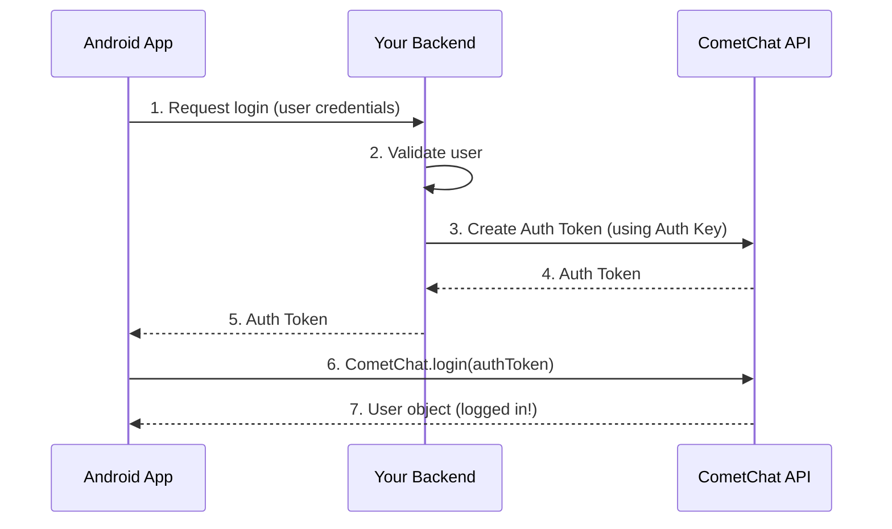

<Note>
**Recommended for Production**: Auth Token login is the secure way to authenticate users in production applications.
</Note>

Auth Token login keeps your Auth Key secure on your server while providing time-limited, revocable tokens to your mobile app.

## How It Works



## Why Use Auth Tokens?

| Feature | Auth Key | Auth Token |
|---------|----------|------------|
| Security | ❌ Exposed in client | ✅ Key stays on server |
| Revocable | ❌ No | ✅ Yes |
| Expiration | ❌ Never expires | ✅ Can expire |
| Per-user control | ❌ No | ✅ Yes |

## Prerequisites

- CometChat SDK initialized
- Backend server to generate Auth Tokens
- User created in CometChat

## Server-Side: Generate Auth Token

Your backend server needs to call the CometChat API to generate tokens.

### API Endpoint

```
POST https://{{appId}}.api-{{region}}.cometchat.io/v3/users/{{uid}}/auth_tokens
```

### Request Headers

```
apiKey: YOUR_AUTH_KEY
Content-Type: application/json
```

### Example (Node.js)

```javascript
// Your backend server
const express = require('express');
const axios = require('axios');

const APP_ID = 'YOUR_APP_ID';
const REGION = 'us'; // or 'eu'
const AUTH_KEY = 'YOUR_AUTH_KEY'; // Keep this secret!

app.post('/api/cometchat/token', async (req, res) => {
    const { uid } = req.body;
    
    try {
        const response = await axios.post(
            `https://${APP_ID}.api-${REGION}.cometchat.io/v3/users/${uid}/auth_tokens`,
            {},
            {
                headers: {
                    'apiKey': AUTH_KEY,
                    'Content-Type': 'application/json'
                }
            }
        );
        
        res.json({ authToken: response.data.data.authToken });
    } catch (error) {
        res.status(500).json({ error: 'Failed to generate token' });
    }
});
```

<Note>
See the [Create Auth Token API](https://api-explorer.cometchat.com/reference/create-authtoken) for complete documentation.
</Note>

## Client-Side: Login with Token

### Method Signature

```kotlin
fun login(
    authToken: String,
    callbackListener: CallbackListener<User>
)
```

### Parameters

| Parameter | Type | Required | Description |
|-----------|------|----------|-------------|
| `authToken` | `String` | Yes | Auth Token from your server |
| `callbackListener` | `CallbackListener<User>` | Yes | Callback for success/error |

### Complete Example

<Tabs>
<Tab title="Kotlin">
```kotlin
import com.cometchat.chat.core.CometChat
import com.cometchat.chat.models.User
import com.cometchat.chat.exceptions.CometChatException
import kotlinx.coroutines.Dispatchers
import kotlinx.coroutines.withContext

class AuthRepository {
    
    private val apiService: YourApiService // Your Retrofit/Ktor service
    
    suspend fun loginToCometChat(uid: String): Result<User> {
        return withContext(Dispatchers.IO) {
            try {
                // Check if already logged in
                CometChat.getLoggedInUser()?.let { user ->
                    return@withContext Result.success(user)
                }
                
                // Step 1: Get Auth Token from your server
                val tokenResponse = apiService.getCometChatToken(uid)
                val authToken = tokenResponse.authToken
                
                // Step 2: Login to CometChat with the token
                loginWithToken(authToken)
            } catch (e: Exception) {
                Result.failure(e)
            }
        }
    }
    
    private suspend fun loginWithToken(authToken: String): Result<User> {
        return suspendCancellableCoroutine { continuation ->
            CometChat.login(authToken, object : CometChat.CallbackListener<User>() {
                override fun onSuccess(user: User?) {
                    user?.let {
                        Log.d("CometChat", "Login successful: ${it.uid}")
                        continuation.resume(Result.success(it))
                    } ?: continuation.resume(Result.failure(Exception("User is null")))
                }
                
                override fun onError(e: CometChatException?) {
                    Log.e("CometChat", "Login failed: ${e?.message}")
                    continuation.resume(Result.failure(e ?: Exception("Unknown error")))
                }
            })
        }
    }
}

// Usage in ViewModel or Activity
class LoginViewModel : ViewModel() {
    
    private val authRepository = AuthRepository()
    
    fun login(uid: String) {
        viewModelScope.launch {
            val result = authRepository.loginToCometChat(uid)
            result.onSuccess { user ->
                // Navigate to chat
                _loginState.value = LoginState.Success(user)
            }.onFailure { error ->
                // Show error
                _loginState.value = LoginState.Error(error.message)
            }
        }
    }
}
```
</Tab>
<Tab title="Java">
```java
import com.cometchat.chat.core.CometChat;
import com.cometchat.chat.models.User;
import com.cometchat.chat.exceptions.CometChatException;

public class AuthManager {
    
    private YourApiService apiService; // Your Retrofit service
    
    public void loginToCometChat(String uid, LoginCallback callback) {
        // Check if already logged in
        User loggedInUser = CometChat.getLoggedInUser();
        if (loggedInUser != null) {
            callback.onSuccess(loggedInUser);
            return;
        }
        
        // Step 1: Get Auth Token from your server
        apiService.getCometChatToken(uid).enqueue(new Callback<TokenResponse>() {
            @Override
            public void onResponse(Call<TokenResponse> call, Response<TokenResponse> response) {
                if (response.isSuccessful() && response.body() != null) {
                    String authToken = response.body().getAuthToken();
                    
                    // Step 2: Login to CometChat
                    loginWithToken(authToken, callback);
                } else {
                    callback.onError("Failed to get auth token");
                }
            }
            
            @Override
            public void onFailure(Call<TokenResponse> call, Throwable t) {
                callback.onError("Network error: " + t.getMessage());
            }
        });
    }
    
    private void loginWithToken(String authToken, LoginCallback callback) {
        CometChat.login(authToken, new CometChat.CallbackListener<User>() {
            @Override
            public void onSuccess(User user) {
                Log.d("CometChat", "Login successful: " + user.getUid());
                callback.onSuccess(user);
            }
            
            @Override
            public void onError(CometChatException e) {
                Log.e("CometChat", "Login failed: " + e.getMessage());
                callback.onError(e.getMessage());
            }
        });
    }
    
    public interface LoginCallback {
        void onSuccess(User user);
        void onError(String error);
    }
}

// Usage
AuthManager authManager = new AuthManager();
authManager.loginToCometChat("user123", new AuthManager.LoginCallback() {
    @Override
    public void onSuccess(User user) {
        // Navigate to chat screen
    }
    
    @Override
    public void onError(String error) {
        // Show error message
    }
});
```
</Tab>
</Tabs>

## Simple Example

If you just want to test Auth Token login:

<Tabs>
<Tab title="Kotlin">
```kotlin
import com.cometchat.chat.core.CometChat
import com.cometchat.chat.models.User
import com.cometchat.chat.exceptions.CometChatException

// Auth Token received from your server
val authToken = "eyJhbGciOiJIUzI1NiIsInR5cCI6IkpXVCJ9..."

CometChat.login(authToken, object : CometChat.CallbackListener<User>() {
    override fun onSuccess(user: User?) {
        Log.d("CometChat", "Login successful: ${user?.uid}")
        // Proceed to chat
    }
    
    override fun onError(e: CometChatException?) {
        Log.e("CometChat", "Login failed: ${e?.message}")
        
        when (e?.code) {
            "ERR_AUTH_TOKEN_NOT_FOUND" -> {
                // Token is invalid, get a new one
                refreshAuthToken()
            }
            "ERR_AUTH_TOKEN_EXPIRED" -> {
                // Token expired, get a new one
                refreshAuthToken()
            }
            else -> {
                showError("Login failed: ${e?.message}")
            }
        }
    }
})
```
</Tab>
<Tab title="Java">
```java
import com.cometchat.chat.core.CometChat;
import com.cometchat.chat.models.User;
import com.cometchat.chat.exceptions.CometChatException;

// Auth Token received from your server
String authToken = "eyJhbGciOiJIUzI1NiIsInR5cCI6IkpXVCJ9...";

CometChat.login(authToken, new CometChat.CallbackListener<User>() {
    @Override
    public void onSuccess(User user) {
        Log.d("CometChat", "Login successful: " + user.getUid());
        // Proceed to chat
    }
    
    @Override
    public void onError(CometChatException e) {
        Log.e("CometChat", "Login failed: " + e.getMessage());
        
        if ("ERR_AUTH_TOKEN_NOT_FOUND".equals(e.getCode()) ||
            "ERR_AUTH_TOKEN_EXPIRED".equals(e.getCode())) {
            // Token is invalid or expired, get a new one
            refreshAuthToken();
        } else {
            showError("Login failed: " + e.getMessage());
        }
    }
});
```
</Tab>
</Tabs>

## Error Codes

| Error Code | Description | Solution |
|------------|-------------|----------|
| `ERR_AUTH_TOKEN_NOT_FOUND` | Token is invalid | Generate a new token |
| `ERR_AUTH_TOKEN_EXPIRED` | Token has expired | Generate a new token |
| `ERR_UID_NOT_FOUND` | User doesn't exist | Create user first |
| `ERR_INIT_NOT_CALLED` | SDK not initialized | Call `CometChat.init()` first |

## Token Management Best Practices

### 1. Token Refresh Strategy

```kotlin
class TokenManager {
    
    fun handleTokenError(error: CometChatException, onNewToken: (String) -> Unit) {
        when (error.code) {
            "ERR_AUTH_TOKEN_NOT_FOUND",
            "ERR_AUTH_TOKEN_EXPIRED" -> {
                // Request new token from server
                refreshToken { newToken ->
                    onNewToken(newToken)
                }
            }
        }
    }
    
    private fun refreshToken(callback: (String) -> Unit) {
        // Call your server to get a new token
        apiService.refreshCometChatToken().enqueue(...)
    }
}
```

### 2. Secure Token Storage

```kotlin
// Use EncryptedSharedPreferences for token storage
val masterKey = MasterKey.Builder(context)
    .setKeyScheme(MasterKey.KeyScheme.AES256_GCM)
    .build()

val securePrefs = EncryptedSharedPreferences.create(
    context,
    "secure_prefs",
    masterKey,
    EncryptedSharedPreferences.PrefKeyEncryptionScheme.AES256_SIV,
    EncryptedSharedPreferences.PrefValueEncryptionScheme.AES256_GCM
)

// Store token
securePrefs.edit().putString("cometchat_token", authToken).apply()

// Retrieve token
val token = securePrefs.getString("cometchat_token", null)
```

### 3. Token Expiration

You can set token expiration when creating tokens on your server:

```javascript
// Server-side: Create token with expiration
const response = await axios.post(
    `https://${APP_ID}.api-${REGION}.cometchat.io/v3/users/${uid}/auth_tokens`,
    {
        // Token expires in 1 hour (3600 seconds)
        // Or set to 0 for no expiration
    },
    { headers: { 'apiKey': AUTH_KEY } }
);
```

## Related Pages

<CardGroup cols={2}>
  <Card title="Auth Key Login" href="/sdk/android/authentication/login-with-auth-key">
    Quick login for development
  </Card>
  <Card title="Logout" href="/sdk/android/authentication/logout">
    End user sessions properly
  </Card>
  <Card title="Login Listeners" href="/sdk/android/authentication/login-listeners">
    Monitor authentication state
  </Card>
  <Card title="Create User API" href="https://api-explorer.cometchat.com/reference/creates-user">
    Create users via API
  </Card>
</CardGroup>
