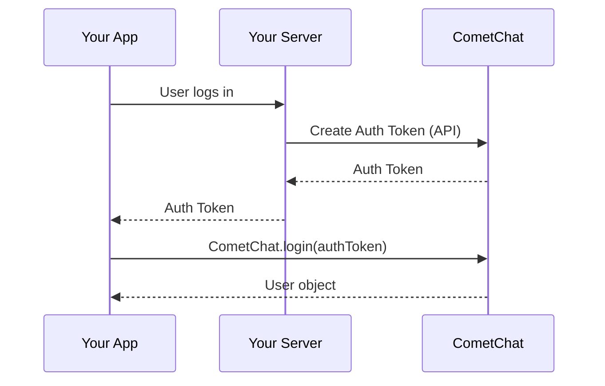

This guide covers the authentication options available in the CometChat Android SDK.

## Authentication Flow



## Authentication Methods

CometChat provides two authentication methods:

| Method | Security | Use Case |
|--------|----------|----------|
| [Auth Key Login](/sdk/android/authentication/login-with-auth-key) | ⚠️ Low | Development/POC only |
| [Auth Token Login](/sdk/android/authentication/login-with-auth-token) | ✅ High | **Production (Recommended)** |

<Warning>
**Security Best Practice**: Never use Auth Key in production. Auth Keys are embedded in client code and can be extracted. Always use Auth Tokens for production apps.
</Warning>

## Before You Login

### Create User

Before logging in a user, you must add them to CometChat:

1. **For POC/Development**: Create users via the [CometChat Dashboard](https://app.cometchat.com)
2. **For Production**: Use the [Create User API](https://api-explorer.cometchat.com/reference/creates-user) when users sign up

<Note>
**Test Users Available**

We provide 5 test users for development:
- `cometchat-uid-1` through `cometchat-uid-5`
</Note>

### Check Existing Session

The SDK maintains the logged-in user's session. Before calling `login()`, check if a session exists:

<Tabs>
<Tab title="Kotlin">
```kotlin
import com.cometchat.chat.core.CometChat

val loggedInUser = CometChat.getLoggedInUser()

if (loggedInUser != null) {
    // User is already logged in
    Log.d("CometChat", "Already logged in as: ${loggedInUser.uid}")
    // Proceed to your chat screen
} else {
    // No session exists, need to login
    // Call CometChat.login()
}
```
</Tab>
<Tab title="Java">
```java
import com.cometchat.chat.core.CometChat;
import com.cometchat.chat.models.User;

User loggedInUser = CometChat.getLoggedInUser();

if (loggedInUser != null) {
    // User is already logged in
    Log.d("CometChat", "Already logged in as: " + loggedInUser.getUid());
    // Proceed to your chat screen
} else {
    // No session exists, need to login
    // Call CometChat.login()
}
```
</Tab>
</Tabs>

<Note>
**Important**: Only call `login()` when `getLoggedInUser()` returns `null`. Calling login when already logged in is unnecessary and wastes resources.
</Note>

## Quick Comparison

### Auth Key Login (Development Only)

```kotlin
// Simple but NOT secure - development only
CometChat.login(uid, authKey, callback)
```

- ✅ Quick to implement
- ✅ Good for prototyping
- ❌ Auth Key exposed in client code
- ❌ **Never use in production**

### Auth Token Login (Production)

```kotlin
// Secure - recommended for production
CometChat.login(authToken, callback)
```

- ✅ Auth Key stays on your server
- ✅ Tokens can be revoked
- ✅ Tokens can expire
- ✅ **Use this in production**

## User Object

After successful login, you receive a `User` object with these properties:

| Property | Type | Description |
|----------|------|-------------|
| `uid` | `String` | Unique user identifier |
| `name` | `String` | Display name |
| `avatar` | `String` | Avatar URL |
| `status` | `String` | `online` or `offline` |
| `role` | `String` | User role |
| `metadata` | `JSONObject` | Custom user data |
| `lastActiveAt` | `Long` | Last activity timestamp |

## Error Handling

Common authentication errors:

| Error Code | Description | Solution |
|------------|-------------|----------|
| `ERR_UID_NOT_FOUND` | User doesn't exist | Create user first |
| `ERR_INVALID_API_KEY` | Invalid Auth Key | Check your Auth Key |
| `ERR_AUTH_TOKEN_NOT_FOUND` | Invalid Auth Token | Generate new token |
| `ERR_AUTH_TOKEN_EXPIRED` | Token expired | Generate new token |

## Next Steps

<CardGroup cols={2}>
  <Card title="Auth Key Login" href="/sdk/android/authentication/login-with-auth-key">
    Quick login for development
  </Card>
  <Card title="Auth Token Login" href="/sdk/android/authentication/login-with-auth-token">
    Secure login for production
  </Card>
  <Card title="Logout" href="/sdk/android/authentication/logout">
    End user sessions properly
  </Card>
  <Card title="Login Listeners" href="/sdk/android/authentication/login-listeners">
    Monitor authentication state changes
  </Card>
</CardGroup>

## Related Pages

<CardGroup cols={2}>
  <Card title="Key Concepts" href="/sdk/android/concepts/key-concepts">
    Understand UIDs and authentication
  </Card>
  <Card title="User Management" href="/sdk/android/user-management/overview">
    Create and manage users
  </Card>
</CardGroup>
