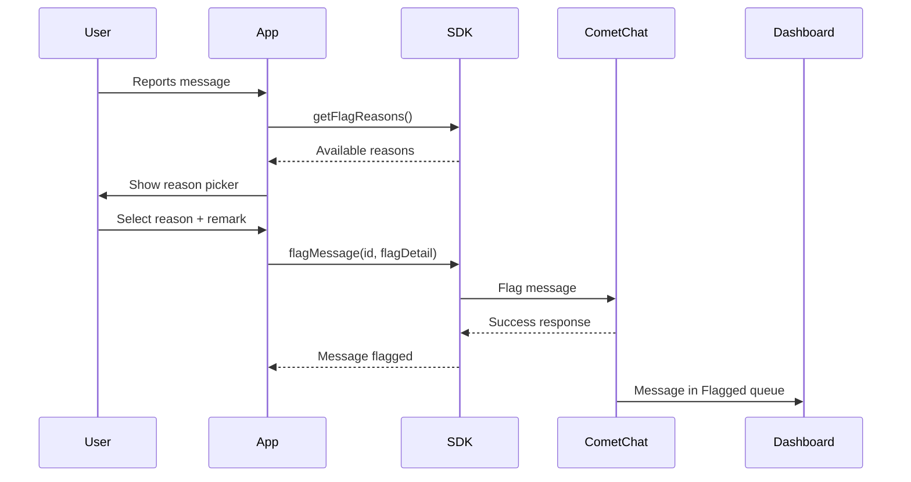

## Overview

Flagging messages allows users to report inappropriate content to moderators or administrators. When a message is flagged, it appears in the [CometChat Dashboard](https://app.cometchat.com) under **Moderation > Flagged Messages** for review.

<Note>
For a complete understanding of how flagged messages are reviewed and managed, see the [Flagged Messages](/moderation/flagged-messages) documentation.
</Note>

## Prerequisites

Before using the flag message feature:

1. Moderation must be enabled for your app in the [CometChat Dashboard](https://app.cometchat.com)
2. Flag reasons should be configured under **Moderation > Advanced Settings**

## How It Works



## Get Flag Reasons

Before flagging a message, retrieve the list of available flag reasons configured in your Dashboard:

<Tabs>
  <Tab title="Kotlin">
    ```kotlin
    CometChat.getFlagReasons(object : CometChat.CallbackListener<MutableList<FlagReason?>>() {
        override fun onSuccess(reasons: MutableList<FlagReason?>?) {
            Log.d(TAG, "Flag reasons fetched: $reasons")
            // Use reasons to populate your report dialog UI
            reasons?.forEach { reason ->
                Log.d(TAG, "Reason ID: ${reason?.id}, Title: ${reason?.reason}")
            }
        }

        override fun onError(e: CometChatException) {
            Log.e(TAG, "Error fetching flag reasons: ${e.message}")
        }
    })
    ```
  </Tab>
  <Tab title="Java">
    ```java
    CometChat.getFlagReasons(new CometChat.CallbackListener<List<FlagReason>>() {
        @Override
        public void onSuccess(List<FlagReason> reasons) {
            Log.d(TAG, "Flag reasons fetched: " + reasons);
            // Use reasons to populate your report dialog UI
            for (FlagReason reason : reasons) {
                Log.d(TAG, "Reason ID: " + reason.getId() + ", Title: " + reason.getReason());
            }
        }

        @Override
        public void onError(CometChatException e) {
            Log.e(TAG, "Error fetching flag reasons: " + e.getMessage());
        }
    });
    ```
  </Tab>
</Tabs>

### Response

The response is a list of `FlagReason` objects containing:

| Property | Type | Description |
|----------|------|-------------|
| id | String | Unique identifier for the reason |
| reason | String | Display text for the reason |

## Flag a Message

To flag a message, use the `flagMessage()` method with the message ID and a `FlagDetail` object:

<Tabs>
  <Tab title="Kotlin">
    ```kotlin
    val messageId = 123L  // ID of the message to flag

    val flagDetail = FlagDetail().apply {
        reasonId = "spam"  // Required: ID from getFlagReasons()
        remark = "This message contains promotional content"  // Optional
    }

    CometChat.flagMessage(messageId, flagDetail, object : CometChat.CallbackListener<String?>() {
        override fun onSuccess(response: String?) {
            Log.d(TAG, "Message flagged successfully: $response")
        }

        override fun onError(e: CometChatException?) {
            Log.e(TAG, "Message flagging failed: ${e?.message}")
        }
    })
    ```
  </Tab>
  <Tab title="Java">
    ```java
    long messageId = 123L;  // ID of the message to flag

    FlagDetail flagDetail = new FlagDetail();
    flagDetail.setReasonId("spam");  // Required: ID from getFlagReasons()
    flagDetail.setRemark("This message contains promotional content");  // Optional

    CometChat.flagMessage(messageId, flagDetail, new CometChat.CallbackListener<String>() {
        @Override
        public void onSuccess(String response) {
            Log.d(TAG, "Message flagged successfully: " + response);
        }

        @Override
        public void onError(CometChatException e) {
            Log.e(TAG, "Message flagging failed: " + e.getMessage());
        }
    });
    ```
  </Tab>
</Tabs>

### Parameters

| Parameter | Type | Required | Description |
|-----------|------|----------|-------------|
| messageId | long | Yes | The ID of the message to flag |
| flagDetail | FlagDetail | Yes | Contains flagging details |
| flagDetail.reasonId | String | Yes | ID of the flag reason (from `getFlagReasons()`) |
| flagDetail.remark | String | No | Additional context or explanation from the user |

### Response

```json
{
  "message": "Message {id} has been flagged successfully."
}
```

## Complete Example

Here's a complete implementation showing how to build a report message flow:

<Tabs>
  <Tab title="Kotlin">
    ```kotlin
    class ReportMessageHandler {
        private var flagReasons: List<FlagReason?> = emptyList()

        // Load flag reasons (call this on app init or when needed)
        fun loadFlagReasons(callback: (List<FlagReason?>) -> Unit) {
            CometChat.getFlagReasons(object : CometChat.CallbackListener<MutableList<FlagReason?>>() {
                override fun onSuccess(reasons: MutableList<FlagReason?>?) {
                    flagReasons = reasons ?: emptyList()
                    callback(flagReasons)
                }

                override fun onError(e: CometChatException) {
                    Log.e(TAG, "Failed to load flag reasons: ${e.message}")
                    callback(emptyList())
                }
            })
        }

        // Get reasons for UI display
        fun getReasons(): List<FlagReason?> = flagReasons

        // Flag a message with selected reason
        fun flagMessage(
            messageId: Long,
            reasonId: String,
            remark: String? = null,
            callback: (Boolean, String?) -> Unit
        ) {
            val flagDetail = FlagDetail().apply {
                this.reasonId = reasonId
                remark?.let { this.remark = it }
            }

            CometChat.flagMessage(messageId, flagDetail, object : CometChat.CallbackListener<String?>() {
                override fun onSuccess(response: String?) {
                    callback(true, response)
                }

                override fun onError(e: CometChatException?) {
                    callback(false, e?.message)
                }
            })
        }
    }

    // Usage
    val reportHandler = ReportMessageHandler()

    // Load reasons when app initializes
    reportHandler.loadFlagReasons { reasons ->
        // Display reasons in UI for user to select
    }

    // When user submits the report
    reportHandler.flagMessage(123L, "spam", "User is sending promotional links") { success, message ->
        if (success) {
            showToast("Message reported successfully")
        }
    }
    ```
  </Tab>
</Tabs>
