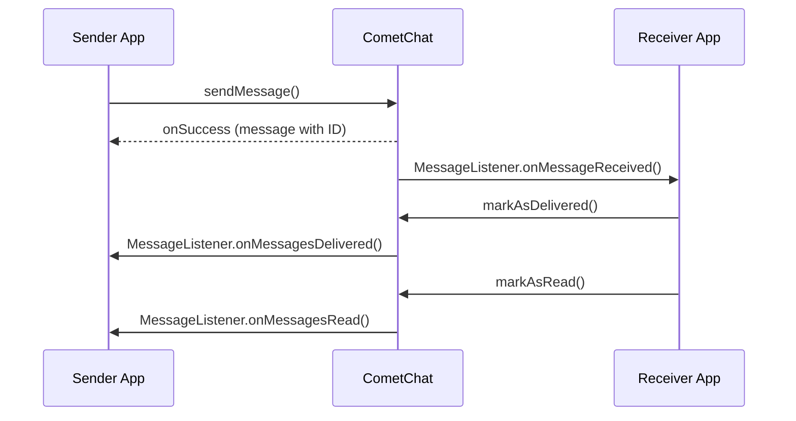

Messaging is the core feature of CometChat. This guide covers all messaging capabilities available in the Android SDK.

## Message Types

CometChat supports multiple message types:

| Type | Class | Description |
|------|-------|-------------|
| Text | `TextMessage` | Plain text messages |
| Media | `MediaMessage` | Images, videos, audio, files |
| Custom | `CustomMessage` | Custom JSON data |
| Interactive | `InteractiveMessage` | Forms, cards, buttons |

## Message Flow



## Quick Start

### Send a Message

<Tabs>
<Tab title="Kotlin">
```kotlin
import com.cometchat.chat.core.CometChat
import com.cometchat.chat.models.TextMessage
import com.cometchat.chat.constants.CometChatConstants

val receiverUID = "user123"
val message = TextMessage(receiverUID, "Hello!", CometChatConstants.RECEIVER_TYPE_USER)

CometChat.sendMessage(message, object : CometChat.CallbackListener<TextMessage>() {
    override fun onSuccess(sentMessage: TextMessage) {
        Log.d("Message", "Sent: ${sentMessage.id}")
    }
    override fun onError(e: CometChatException) {
        Log.e("Message", "Error: ${e.message}")
    }
})
```
</Tab>
<Tab title="Java">
```java
import com.cometchat.chat.core.CometChat;
import com.cometchat.chat.models.TextMessage;
import com.cometchat.chat.constants.CometChatConstants;

String receiverUID = "user123";
TextMessage message = new TextMessage(receiverUID, "Hello!", CometChatConstants.RECEIVER_TYPE_USER);

CometChat.sendMessage(message, new CometChat.CallbackListener<TextMessage>() {
    @Override
    public void onSuccess(TextMessage sentMessage) {
        Log.d("Message", "Sent: " + sentMessage.getId());
    }
    @Override
    public void onError(CometChatException e) {
        Log.e("Message", "Error: " + e.getMessage());
    }
});
```
</Tab>
</Tabs>

### Receive Messages

<Tabs>
<Tab title="Kotlin">
```kotlin
import com.cometchat.chat.core.CometChat
import com.cometchat.chat.models.BaseMessage
import com.cometchat.chat.models.TextMessage

CometChat.addMessageListener("message_listener", object : CometChat.MessageListener() {
    override fun onTextMessageReceived(message: TextMessage) {
        Log.d("Message", "Received: ${message.text}")
    }
})
```
</Tab>
<Tab title="Java">
```java
import com.cometchat.chat.core.CometChat;
import com.cometchat.chat.models.TextMessage;

CometChat.addMessageListener("message_listener", new CometChat.MessageListener() {
    @Override
    public void onTextMessageReceived(TextMessage message) {
        Log.d("Message", "Received: " + message.getText());
    }
});
```
</Tab>
</Tabs>

## Features

### Core Messaging
- [Send Messages](/sdk/android/features/messaging/send-message) - Text, media, custom messages
- [Receive Messages](/sdk/android/features/messaging/receive-messages) - Real-time message listener
- [Retrieve Conversations](/sdk/android/features/messaging/retrieve-conversations) - Fetch conversation list
- [Edit Messages](/sdk/android/features/messaging/edit-message) - Modify sent messages
- [Delete Messages](/sdk/android/features/messaging/delete-message) - Remove messages

### Enhanced Features
- [Threaded Messages](/sdk/android/features/messaging/threaded-messages) - Reply threads
- [Typing Indicators](/sdk/android/features/messaging/typing-indicators) - Show typing status
- [Delivery & Read Receipts](/sdk/android/features/messaging/delivery-read-receipts) - Message status
- [Reactions](/sdk/android/features/messaging/reactions) - Emoji reactions
- [Mentions](/sdk/android/features/messaging/mentions) - @mention users

### Advanced
- [Interactive Messages](/sdk/android/features/messaging/interactive-messages) - Forms and cards
- [Transient Messages](/sdk/android/features/messaging/transient-messages) - Ephemeral messages
- [Unread Counts](/sdk/android/features/messaging/unread-counts) - Badge counts
- [Mute Conversations](/sdk/android/features/messaging/mute-conversations) - Notification control

## Message Object

All messages extend `BaseMessage` with these common properties:

| Property | Type | Description |
|----------|------|-------------|
| `id` | `Long` | Unique message ID |
| `sender` | `User` | Message sender |
| `receiverUid` | `String` | Receiver UID or GUID |
| `receiverType` | `String` | `user` or `group` |
| `sentAt` | `Long` | Send timestamp |
| `deliveredAt` | `Long` | Delivery timestamp |
| `readAt` | `Long` | Read timestamp |
| `type` | `String` | Message type |
| `category` | `String` | Message category |
| `metadata` | `JSONObject` | Custom data |

## Related Pages

<CardGroup cols={2}>
  <Card title="Send Message" href="/sdk/android/features/messaging/send-message">
    Send text, media, and custom messages
  </Card>
  <Card title="Receive Messages" href="/sdk/android/features/messaging/receive-messages">
    Listen for incoming messages
  </Card>
  <Card title="Message Structure" href="/sdk/android/concepts/message-structure">
    Understand message objects
  </Card>
  <Card title="Real-time Listeners" href="/sdk/android/concepts/real-time-listeners">
    All listener types
  </Card>
</CardGroup>
