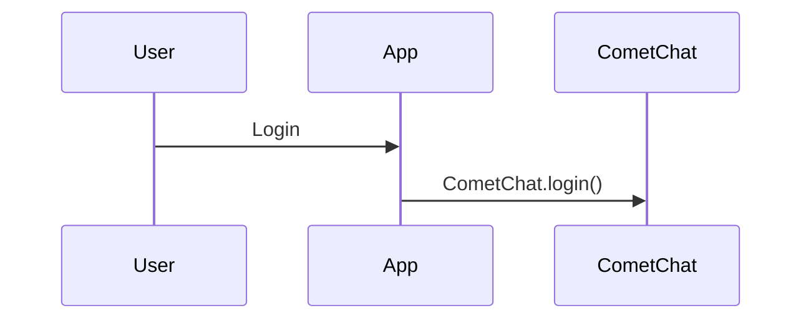

# CometChat SDK Documentation Improvement Guidelines

These guidelines document the patterns, standards, and improvements applied to SDK documentation. Use this as a reference when improving documentation for any SDK technology (JavaScript, Android, iOS, Flutter, React Native) with AI assistance.

> **Scope:** This document covers SDK documentation only. For UI Kit documentation guidelines, see `ui-kit/[technology]/documentation-improvement-guidelines.md`.

---

## Table of Contents

1. [Quick Reference Blocks](#1-quick-reference-blocks)
2. [Available Via Notes](#2-available-via-notes)
3. [Code Examples: Tab Conventions](#3-code-examples-tab-conventions)
4. [Tab Naming Standards](#4-tab-naming-standards)
5. [Mintlify Components](#5-mintlify-components)
6. [Next Steps Navigation](#6-next-steps-navigation)
7. [Page Structure Templates](#7-page-structure-templates)
8. [Feature Page Anatomy](#8-feature-page-anatomy)
9. [Navigation Organization](#9-navigation-organization)
10. [Integration Guides](#10-integration-guides)
11. [Glossary & Key Concepts](#11-glossary--key-concepts)
12. [Security & Init Warnings](#12-security--init-warnings)
13. [Cross-Linking & References](#13-cross-linking--references)
14. [What NOT to Do](#14-what-not-to-do)
15. [File Classification](#15-file-classification)
16. [File-by-File Checklist](#16-file-by-file-checklist)
17. [Prompt Template for AI Assistants](#17-prompt-template-for-ai-assistants)

---

## 1. Quick Reference Blocks

Every content page should have a Quick Reference block at the very top, immediately after the frontmatter.

**Why:** AI agents parsing docs need a fast, copy-paste-ready summary. Developers scanning docs want the TL;DR.

### Feature Pages (Messaging, Users, Groups, Calling, etc.)

Show the most common API calls for that feature:

```mdx
{/* TL;DR for Agents and Quick Reference */}
<Info>
**Quick Reference for AI Agents & Developers**

```javascript
// Send text message to user
const msg = new CometChat.TextMessage("UID", "Hello!", CometChat.RECEIVER_TYPE.USER);
await CometChat.sendMessage(msg);

// Send to group
const msg = new CometChat.TextMessage("GUID", "Hello!", CometChat.RECEIVER_TYPE.GROUP);
await CometChat.sendMessage(msg);

// Media message
const msg = new CometChat.MediaMessage("UID", file, CometChat.MESSAGE_TYPE.IMAGE, CometChat.RECEIVER_TYPE.USER);
await CometChat.sendMediaMessage(msg);
```
</Info>
```

### Overview/Hub Pages

For overview pages that link to sub-pages, list the paths instead of code:

```mdx
<Info>
**Quick Reference for AI Agents & Developers**

Choose your path:
- **Chat Only** → [guide-chat-only](/sdk/javascript/guide-chat-only) - Text, media, groups
- **Calls Only** → [guide-calls-only](/sdk/javascript/guide-calls-only) - Standalone video/audio
- **Chat + Calls** → [guide-chat-calls](/sdk/javascript/guide-chat-calls) - Full communication
</Info>
```

### Setup/Getting Started Pages

Show install + init + login in one block:

```mdx
<Info>
**Quick Setup Reference**

```bash
# Install
npm install @cometchat/chat-sdk-javascript

# Initialize (run once at app start)
CometChat.init(APP_ID, appSettings)

# Login (after init)
CometChat.login(UID, AUTH_KEY)  # Dev only
CometChat.login(AUTH_TOKEN)     # Production
```

**Required Credentials:** App ID, Region, Auth Key (dev) or Auth Token (prod)
**Get from:** [CometChat Dashboard](https://app.cometchat.com) → Your App → API & Auth Keys
</Info>
```

### Reference Pages (Listeners, Message Structure, Key Concepts)

Show the most-used API calls or constants:

```mdx
<Info>
**Quick Reference for AI Agents & Developers**

```javascript
// Add message listener
CometChat.addMessageListener("LISTENER_ID", new CometChat.MessageListener({
  onTextMessageReceived: (message) => { },
  onMediaMessageReceived: (message) => { }
}));

// Remove listener
CometChat.removeMessageListener("LISTENER_ID");
```
</Info>
```

### Rules (all page types)

- Keep it to 5–15 lines of code maximum
- Show the most common use cases only
- Use real method names and constants — no pseudocode
- Include comments explaining what each snippet does
- Use `await` style for brevity (async/await is most readable)
- Skip error handling in the quick reference (full examples come later)

### Skip Quick Reference for

- Redirect-only pages (changelog links, sample app links)
- Pure navigation/index pages with no content
- Version-specific legacy folders (`2.0/`, `3.0/`)

---

## 2. Available Via Notes

Add an "Available via" note on **feature pages only** — pages that document a user-facing capability.

### What qualifies as a feature page

- Messaging: `send-message`, `receive-message`, `edit-message`, `delete-message`, `threaded-messages`, `reactions`, `mentions`, `interactive-messages`, `transient-messages`
- Users: `user-presence`, `block-users`, `retrieve-users`, `user-management`
- Groups: `groups-overview`, `create-group`, `join-group`, `leave-group`, `delete-group`, `update-group`, `retrieve-groups`, `retrieve-group-members`, `group-add-members`, `group-kick-ban-members`, `group-change-member-scope`, `transfer-group-ownership`
- Conversations: `retrieve-conversations`, `delete-conversation`
- Receipts & indicators: `delivery-read-receipts`, `typing-indicators`
- Calling: `default-call`/`default-calling`, `direct-call`/`direct-calling`, `call-logs`, `recording`
- AI: `ai-agents`, `ai-chatbots-overview`, `ai-moderation`, `ai-user-copilot-overview`
- Other: `flag-message`, `mentions`

### What does NOT get "Available via"

- Setup/installation pages (`overview`, `setup`, `setup-sdk`, `calling-setup`)
- Configuration pages (`managing-web-sockets-connections-manually`, `session-timeout`, `connection-status`)
- Styling/customization pages (`custom-css`, `video-view-customisation`, `virtual-background`, `presenter-mode`)
- Reference pages (`all-real-time-listeners`, `message-structure-and-hierarchy`, `key-concepts`, `login-listener`)
- Guide pages (`guide-chat-only`, `guide-calls-only`, `guide-chat-calls`, `guide-moderation`, `guide-notifications`, `guides`)
- Overview/hub pages that just link to sub-pages (`messaging-overview`, `users-overview`, `calling-overview`, `advanced-overview`, `resources-overview`, `extensions-overview`)
- Migration pages (`upgrading-from-v3`, `upgrading-from-v2`)
- Framework-specific pages (`react-overview`, `angular-overview`, `vue-overview`)
- Changelog, rate limits, webhooks overview
- Standalone calling (implementation approach, not a feature)

### Pattern

```mdx
<Note>
**Available via:** SDK | [REST API](https://api-explorer.cometchat.com) | [UI Kits](/ui-kit/react/overview)
</Note>
```

### Common combinations

| Feature Type | Available Via |
| --- | --- |
| Messaging features (send, receive, edit, delete, threads, reactions) | SDK \| REST API \| UI Kits |
| Calling features (ringing, direct call) | SDK \| UI Kits |
| User/Group management | SDK \| REST API \| UI Kits |
| Conversations (retrieve, delete) | SDK \| REST API \| UI Kits |
| Receipts, typing indicators | SDK \| REST API \| UI Kits |
| AI features (moderation, agents, copilot) | SDK \| REST API \| UI Kits \| Dashboard |
| Call logs | SDK \| REST API \| Dashboard |
| Flag/report message | SDK \| REST API \| Dashboard |
| Recording | SDK \| Dashboard |
| Advanced filtering | SDK \| REST API |

### Placement

Right after the introductory sentence/paragraph, before the first `##` section heading.

---

## 3. Code Examples: Tab Conventions

Every code example should provide multiple language variants in tabs. The tabs differ by SDK technology.

### JavaScript SDK

```mdx
<Tabs>
<Tab title="JavaScript">
```javascript
CometChat.sendMessage(textMessage).then(
  (message) => console.log("Sent:", message),
  (error) => console.log("Error:", error)
);
```
</Tab>
<Tab title="TypeScript">
```typescript
CometChat.sendMessage(textMessage).then(
  (message: CometChat.TextMessage) => console.log("Sent:", message),
  (error: CometChat.CometChatException) => console.log("Error:", error)
);
```
</Tab>
<Tab title="Async/Await">
```javascript
try {
  const message = await CometChat.sendMessage(textMessage);
  console.log("Sent:", message);
} catch (error) {
  console.log("Error:", error);
}
```
</Tab>
</Tabs>
```

### Android SDK

```mdx
<Tabs>
<Tab title="Kotlin">
```kotlin
CometChat.sendMessage(textMessage, object : CometChat.CallbackListener<TextMessage>() {
    override fun onSuccess(message: TextMessage) {
        Log.d(TAG, "Message sent: ${message.text}")
    }
    override fun onError(e: CometChatException) {
        Log.e(TAG, "Error: ${e.message}")
    }
})
```
</Tab>
<Tab title="Java">
```java
CometChat.sendMessage(textMessage, new CometChat.CallbackListener<TextMessage>() {
    @Override
    public void onSuccess(TextMessage message) {
        Log.d(TAG, "Message sent: " + message.getText());
    }
    @Override
    public void onError(CometChatException e) {
        Log.e(TAG, "Error: " + e.getMessage());
    }
});
```
</Tab>
</Tabs>
```

### iOS SDK

```mdx
<Tabs>
<Tab title="Swift">
```swift
CometChat.sendTextMessage(message: textMessage, onSuccess: { message in
    print("Message sent: \(message.text)")
}, onError: { error in
    print("Error: \(error?.errorDescription)")
})
```
</Tab>
</Tabs>
```

### Flutter SDK

```mdx
<Tabs>
<Tab title="Dart">
```dart
CometChat.sendMessage(textMessage, onSuccess: (TextMessage message) {
  debugPrint("Message sent: ${message.text}");
}, onError: (CometChatException e) {
  debugPrint("Error: ${e.message}");
});
```
</Tab>
</Tabs>
```

### React Native SDK

```mdx
<Tabs>
<Tab title="JavaScript">
```javascript
CometChat.sendMessage(textMessage).then(
  (message) => console.log("Sent:", message),
  (error) => console.log("Error:", error)
);
```
</Tab>
<Tab title="TypeScript">
```typescript
CometChat.sendMessage(textMessage).then(
  (message: CometChat.TextMessage) => console.log("Sent:", message),
  (error: CometChat.CometChatException) => console.log("Error:", error)
);
```
</Tab>
</Tabs>
```

### Contextual tabs (all platforms)

When showing alternative approaches (not language variants), use descriptive tab titles:

```mdx
<Tabs>
<Tab title="To User">
  <!-- send message to user -->
</Tab>
<Tab title="To Group">
  <!-- send message to group -->
</Tab>
</Tabs>
```

```mdx
<Tabs>
<Tab title="npm">...</Tab>
<Tab title="yarn">...</Tab>
<Tab title="pnpm">...</Tab>
<Tab title="CDN">...</Tab>
</Tabs>
```

### Rules

- Every major code block should have language tabs — don't leave single-language examples
- TypeScript tabs should add proper type annotations, not just rename the file
- Async/Await tab (JavaScript SDK) should show try/catch pattern
- Simple one-liners (e.g., `CometChat.disconnect()`) can skip tabs — use a single block
- Keep code copy-paste ready: include variable declarations, imports where needed
- Use realistic placeholder values: `"user_uid"`, `"group_guid"`, `"YOUR_APP_ID"`
- For "To User" / "To Group" tabs, show the same operation for both receiver types

---

## 4. Tab Naming Standards

Use consistent tab titles across all pages. Never use arbitrary or inconsistent titles.

### Correct tab titles by platform

| Platform | Primary Tab | Secondary Tab | Tertiary Tab |
| --- | --- | --- | --- |
| JavaScript SDK | `JavaScript` | `TypeScript` | `Async/Await` |
| Android SDK | `Kotlin` | `Java` | — |
| iOS SDK | `Swift` | `Objective-C` (if supported) | — |
| Flutter SDK | `Dart` | — | — |
| React Native SDK | `JavaScript` | `TypeScript` | — |

### Contextual tab titles (all platforms)

| Tab Content | Title |
| --- | --- |
| Send to user | `To User` |
| Send to group | `To Group` |
| npm install | `npm` |
| yarn install | `yarn` |
| pnpm install | `pnpm` |
| CDN script tag | `CDN` |
| ES Module import | `ES Modules` |
| CommonJS require | `CommonJS` |
| Dashboard setup | `Dashboard (Testing)` |
| REST API setup | `REST API (Production)` |
| SDK setup | `SDK (On-the-fly)` |
| All users presence | `All Users` |
| By role presence | `By Role` |
| Friends only presence | `Friends Only` |
| File input upload | `From File Input` |
| URL upload | `From URLs` |
| Users only filter | `Users Only` |
| Groups only filter | `Groups Only` |
| Hide AI agents | `Hide AI Agents` |
| Only AI agents | `Only AI Agents` |

### When to use language tabs vs contextual tabs

- **Language tabs** (JavaScript/TypeScript/Async/Await): When showing the same code in different language styles
- **Contextual tabs** (To User/To Group, npm/yarn): When showing alternative approaches or configurations
- **Framework tabs** (React/Next.js/Vue/Angular/Nuxt): When showing framework-specific implementations

---

## 5. Mintlify Components

Use these Mintlify components consistently across all pages:

### Steps — For sequential procedures

```mdx
<Steps>
  <Step title="Install the SDK">
    npm install @cometchat/chat-sdk-javascript
  </Step>
  <Step title="Initialize">
    CometChat.init(appID, appSettings);
  </Step>
</Steps>
```

**Use for:** Setup flows, multi-step procedures, getting started guides, authentication flows.

### Tabs — For code variants and alternative approaches

**Use for:** Language variants (JS/TS/Async), package manager options (npm/yarn), platform-specific code, alternative approaches (To User/To Group), framework-specific implementations (React/Vue/Angular).

### CardGroup + Card — For navigation and next steps

```mdx
<CardGroup cols={2}>
  <Card title="Send Messages" icon="paper-plane" href="/sdk/javascript/send-message">
    Send text, media, and custom messages
  </Card>
</CardGroup>
```

**Use for:** Next Steps sections, feature overviews, choosing between options, guide hub pages.

### AccordionGroup + Accordion — For supplementary info

```mdx
<AccordionGroup>
  <Accordion title="Best Practice Name">
    Explanation of the best practice.
  </Accordion>
</AccordionGroup>
```

**Use for:** Best practices, FAQs, troubleshooting tips, edge cases, common errors, framework-specific patterns.

### Note, Warning, Info — For callouts

```mdx
<Note>Informational callout — general tips and context.</Note>
<Warning>Critical warning — data loss, security, breaking changes.</Warning>
<Info>Highlighted info — quick references, availability, requirements.</Info>
```

**Use for:**

- `<Note>` — Prerequisites, tips, general information, "Available via" notes, test user info
- `<Warning>` — Destructive operations, security concerns (Auth Key in production), init-before-login, mutually exclusive options
- `<Info>` — Quick references, feature requirements, plan restrictions, feature flags

### Frame — For images/screenshots

```mdx
<Frame>
  
</Frame>
```

**Use for:** Architecture diagrams, flow diagrams, dashboard screenshots.

### Mermaid — For flow diagrams

```mdx

```

**Use for:** Authentication flows, message delivery flows, call signaling flows. Preserve existing mermaid diagrams — never remove them.

---

## 6. Next Steps Navigation

Every content page should end with a `## Next Steps` section using CardGroup.

### Pattern

```mdx
---

## Next Steps

<CardGroup cols={2}>
  <Card title="Related Feature" icon="icon-name" href="/path/to/page">
    One-line description of what they'll learn
  </Card>
  <Card title="Another Feature" icon="icon-name" href="/path/to/page">
    One-line description
  </Card>
</CardGroup>
```

### Rules

- Always use `cols={2}` for consistency
- Include 2–4 cards (not more)
- Link to logically next topics (what would the developer need after this?)
- Use descriptive FontAwesome icon names
- Keep descriptions to one short sentence
- Use `## Next Steps` as the heading — not `## Next Steps & Further Reading` or other variants
- Do NOT include bullet-list links alongside the CardGroup — the cards are sufficient

### Logical next step patterns

| Current Page | Suggested Next Steps |
| --- | --- |
| Overview | Setup SDK, Key Concepts |
| Setup SDK | Authentication, Send First Message |
| Authentication | Send Message, User Management |
| Send Message | Receive Messages, Edit Message, Interactive Messages |
| Receive Message | Delivery Receipts, Typing Indicators |
| Edit Message | Delete Message, Send Message |
| Delete Message | Edit Message, Receive Message |
| Threaded Messages | Send Message, Receive Message |
| Reactions | Send Message, Receive Message |
| Mentions | Send Message, Receive Message |
| Users Overview | Retrieve Users, User Presence, Block Users |
| User Presence | Retrieve Users, Connection Status |
| Block Users | Retrieve Users, User Management |
| Groups Overview | Create Group, Retrieve Groups |
| Create Group | Join Group, Add Members |
| Join Group | Leave Group, Retrieve Members |
| Retrieve Conversations | Delete Conversation, Typing Indicators, Read Receipts |
| Calling Overview | Calling Setup, Default Call |
| Default Call (Ringing) | Direct Call, Call Logs, Recording |
| Direct Call | Default Call, Recording |
| Call Logs | Default Call, Recording |
| AI Agents | AI Chatbots, AI Moderation |
| Guides Hub | Individual guides |
| Key Concepts | Setup SDK, Send Message |

---

## 7. Page Structure Templates

### Feature Page Structure

```text
1. Frontmatter (title, sidebarTitle, description)
2. Quick Reference block (Info component with code)
3. Introductory sentence (1-2 lines, what this feature does)
4. Available Via note (feature pages only)
5. Main content sections with code examples in tabs
6. Parameter tables after code examples
7. Common Use Cases / Examples
8. Real-Time Events / Listeners (if applicable)
9. Best Practices (AccordionGroup) — if applicable
10. Troubleshooting (AccordionGroup) — if applicable
11. Next Steps (CardGroup)
```

### Overview/Hub Page Structure

```text
1. Frontmatter (title, sidebarTitle, description)
2. Quick Reference block (Info with links to sub-pages)
3. Introductory paragraph
4. Available Via note (if this is a feature overview like Groups Overview)
5. Key concepts / types / constants tables
6. Quick Start examples
7. Sub-feature CardGroups (management, membership, etc.)
8. Object properties table
9. Common Use Cases with code
10. Real-Time Events
11. Next Steps (CardGroup)
```

### Setup/Getting Started Page Structure

```text
1. Frontmatter (title, sidebarTitle, description)
2. Quick Reference block (Info with install + init + login)
3. Intro paragraph
4. Prerequisites (Steps component)
5. Installation (Tabs for npm/yarn/pnpm/CDN)
6. Import (Tabs for ES Modules/CommonJS/CDN)
7. Initialize CometChat (Tabs for JS/TS/Async)
8. Complete Quick Start example
9. Configuration Options (tables + code)
10. Framework Integration (Tabs for React/Next.js/Vue/Angular/Nuxt)
11. Next Steps (CardGroup)
```

### Authentication Page Structure

```text
1. Frontmatter (title, sidebarTitle, description)
2. Quick Reference block (Info with login methods)
3. Intro paragraph + note about user management
4. Authentication Flow (mermaid diagram)
5. Choose Your Method (CardGroup: Auth Key vs Auth Token)
6. Create a User (Tabs: Dashboard/REST API/SDK)
7. Login with Auth Key (Tabs: JS/TS/Async) + Warning
8. Login with Auth Token (Tabs: JS/TS/Async) + Steps
9. Check Login Status
10. Logout
11. Server-Side Token Generation (Tabs: Node.js/Python)
12. User Object properties table
13. Login Listeners
14. Best Practices (AccordionGroup)
15. Troubleshooting (AccordionGroup)
16. Next Steps (CardGroup)
```

### Guide Page Structure

```text
1. Frontmatter (title, sidebarTitle, description)
2. Quick Reference block (Info with guide path links)
3. What you'll build (outcome)
4. Prerequisites (accounts, keys, dependencies)
5. Step-by-step implementation (Steps component)
6. Complete working code at the end
7. Integration Checklist
8. Next Steps (CardGroup — related guides + feature docs)
```

### Migration Page Structure

```text
1. Frontmatter (title, description)
2. Quick Reference block (Info with summary of key changes)
3. Breaking changes list
4. Migration steps
5. API changes tables
6. Next Steps (CardGroup)
```

### Frontmatter template

```yaml
---
title: "Human-Readable Title"
sidebarTitle: "Short Sidebar Name"  # Optional, only if title is too long for sidebar
description: "One sentence describing what this page covers"
---
```

---

## 8. Feature Page Anatomy

Every SDK feature page follows a consistent structure. When improving these pages, enhance each section without changing the order.

### 1. Quick Reference + Intro

- Quick Reference block with copy-paste ready code
- 1–2 sentence description of what the feature does
- "Available via" note (feature pages only)
- Type/method overview table (if multiple operations exist)

### 2. Main Operations

Each operation gets its own `##` section with:
- Code examples in language tabs (JS/TS/Async or platform equivalents)
- Contextual tabs where applicable (To User / To Group)
- Parameter table after the code
- Optional features (metadata, tags, etc.) as sub-sections

### 3. Response/Object Properties

- Table showing the returned object's properties
- Getter methods and their return types
- Example code accessing properties

### 4. Filtering / Request Builders

- `RequestBuilder` pattern with all available methods
- Filter options table
- Pagination examples (`fetchNext()` pattern)

### 5. Real-Time Events / Listeners

- Listener registration code
- All event callbacks documented
- Cleanup/removal code
- Link to full listeners reference

### 6. Common Use Cases

- Complete working examples for typical scenarios
- Framework-specific examples (React hooks, Vue composables, etc.)

### 7. Best Practices & Troubleshooting

- AccordionGroup with best practices
- AccordionGroup with common errors and solutions

### 8. Next Steps

- CardGroup with 2-4 related pages

### Adding Missing Tabs

When improving existing pages:

- If a code block shows `.then()` pattern → add TypeScript and Async/Await tabs
- If a code block shows only Async/Await → add JavaScript (.then()) and TypeScript tabs
- If a code block shows only TypeScript → add JavaScript and Async/Await tabs
- For Android: if only Java → add Kotlin tab; if only Kotlin → add Java tab
- Do NOT convert existing single-tab examples to no-tab code blocks — always keep tabs

### Parameter Table Format

The existing SDK docs use this table format:

```markdown
| Parameter | Type | Description |
| --- | --- | --- |
| `receiverID` | string | UID of user or GUID of group |
| `messageText` | string | The text content |
| `receiverType` | string | `CometChat.RECEIVER_TYPE.USER` or `GROUP` |
```

Preserve this format. When adding new parameters, follow the same pattern.

### Object Properties Table Format

```markdown
| Property | Method | Description |
| --- | --- | --- |
| ID | `getConversationId()` | Unique conversation identifier |
| Type | `getConversationType()` | `user` or `group` |
| Last Message | `getLastMessage()` | Most recent message object |
```

### Filter Options Table Format

```markdown
| Method | Description |
| --- | --- |
| `setLimit(limit)` | Number of results (max 50) |
| `setSearchKeyword(keyword)` | Search by name |
| `setTags(tags)` | Filter by tags |
```

---

## 9. Navigation Organization

The SDK sidebar should follow this structure (adapt per technology):

```text
SDK v4
├── Overview
├── Setup
├── Key Concepts
├── Authentication
│   └── Login, Logout, Auth Tokens
├── Messaging
│   ├── Overview
│   ├── Send Message
│   ├── Receive Message
│   ├── Edit / Delete Message
│   ├── Threaded Messages
│   ├── Reactions
│   ├── Mentions
│   ├── Message Structure & Hierarchy
│   ├── Interactive Messages
│   ├── Transient Messages
│   └── Additional Message Filtering
├── Users
│   ├── Overview
│   ├── Retrieve Users
│   ├── User Presence
│   ├── Block Users
│   └── User Management
├── Groups
│   ├── Overview
│   ├── Create / Update / Delete Group
│   ├── Join / Leave Group
│   ├── Retrieve Groups / Members
│   ├── Add Members / Kick-Ban
│   ├── Change Scope / Transfer Ownership
├── Conversations
│   ├── Retrieve Conversations
│   └── Delete Conversation
├── Receipts & Indicators
│   ├── Delivery & Read Receipts
│   ├── Typing Indicators
│   └── Flag Message
├── Calling
│   ├── Overview
│   ├── Setup
│   ├── Default Calling (Ringing)
│   ├── Direct Calling
│   ├── Standalone Calling
│   ├── Recording
│   ├── Call Logs
│   ├── Session Timeout
│   ├── Presenter Mode
│   ├── Virtual Background
│   ├── Video View Customisation
│   └── Custom CSS
├── AI Features
│   ├── AI Agents
│   ├── AI Chatbots
│   ├── AI Moderation
│   └── AI User Copilot
├── Advanced
│   ├── Connection Status
│   ├── WebSocket Management
│   ├── Login Listeners
│   ├── All Real-Time Listeners
│   └── Webhooks
├── Integration Guides
│   ├── Hub Page
│   ├── Chat Only
│   ├── Calls Only
│   ├── Chat + Calls
│   ├── Moderation
│   └── Notifications
├── Framework Guides (JavaScript SDK only)
│   ├── React
│   ├── Angular
│   └── Vue
├── Resources
│   ├── Rate Limits
│   ├── Extensions
│   └── Changelog
└── Migration Guide
```

---

## 10. Integration Guides

The SDK should have step-by-step integration guides for common scenarios. These are separate from feature docs — they walk through a complete implementation from zero.

### Guides to have

- **Chat Only** — Text + media + groups (no calling)
- **Calls Only** — Standalone video/audio (no chat SDK)
- **Chat + Calls** — Full communication suite
- **Moderation** — Content filtering setup
- **Notifications** — Push alerts

### Guide structure

```text
1. What you'll build (outcome)
2. Prerequisites (accounts, keys, dependencies)
3. Step-by-step implementation (Steps component)
4. Complete working code at the end
5. Integration checklist
6. Next steps / what to add
```

### Rules

- Every step must have copy-paste ready code
- Include expected output or what the developer should see
- Link back to detailed feature docs for customization
- Keep guides focused — one scenario per guide
- Include a "Quick Decision Guide" table on the hub page

---

## 11. Glossary & Key Concepts

SDK-specific terms that should be defined or linked when first used:

| Term | Definition |
| --- | --- |
| UID | Unique User Identifier — alphanumeric string you assign to each user |
| GUID | Group Unique Identifier — alphanumeric string you assign to each group |
| Auth Key | Development-only credential for quick testing. Never use in production |
| Auth Token | Secure, per-user token generated via REST API. Use in production |
| REST API Key | Server-side credential for REST API calls. Never expose in client code |
| Receiver Type | Specifies if a message target is a `user` or `group` |
| Scope | Group member role: `admin`, `moderator`, or `participant` |
| Listener | Callback handler for real-time events (messages, presence, calls, groups) |
| Conversation | A chat thread between two users or within a group |
| Metadata | Custom JSON data attached to users, groups, or messages |
| Tags | String labels for categorizing users, groups, conversations, or messages |
| RequestBuilder | Builder pattern class for constructing filtered/paginated queries |
| AppSettings | Configuration object for initializing the SDK (App ID, Region, presence) |
| Transient Message | Ephemeral message not stored on server (typing indicators, live reactions) |
| Interactive Message | Message with actionable UI elements (forms, cards, buttons) |

Include 10–20 terms. Define acronyms. Link to relevant pages where the concept is explained in detail.

---

## 12. Security & Init Warnings

### Init Warning

```mdx
<Warning>
`CometChat.init()` must be called before any other SDK method. Calling `login()`, `sendMessage()`, or registering listeners before `init()` will fail.
</Warning>
```

### Auth Key Warning

```mdx
<Warning>
**Auth Key** is for development/testing only. In production, generate **Auth Tokens** on your server using the REST API and pass them to the client. Never expose Auth Keys in production client code.
</Warning>
```

### SSR/Framework Note (JavaScript SDK only)

```mdx
<Note>
**Server-Side Rendering (SSR):** CometChat SDK requires browser APIs (`window`, `WebSocket`). For Next.js, Nuxt, or other SSR frameworks, initialize the SDK only on the client side using dynamic imports or `useEffect`. See the [Framework Integration](/sdk/javascript/setup-sdk#framework-integration) section.
</Note>
```

### Listener Cleanup Warning

```mdx
<Warning>
Always remove listeners when they're no longer needed (e.g., on component unmount or page navigation). Failing to remove listeners can cause memory leaks and duplicate event handling.
</Warning>
```

### Destructive Operation Warning

```mdx
<Warning>
This operation is irreversible. Deleted [messages/groups/conversations] cannot be recovered.
</Warning>
```

### Placement

- Init + Auth Key warnings: on `overview` and `setup` pages
- SSR note: on `overview` and framework-specific pages (JavaScript SDK only)
- Listener cleanup: on any page that registers listeners
- Destructive warnings: on delete pages (`delete-message`, `delete-group`, `delete-conversation`)

---

## 13. Cross-Linking & References

Link related concepts together. When a page references a concept explained elsewhere, add an inline link.

### Standard cross-links

- On messaging pages: "For a deeper understanding of how messages are structured, see [Message Structure & Hierarchy](/sdk/[tech]/message-structure-and-hierarchy)."
- On any page using listeners: "Remember to [remove listeners](/sdk/[tech]/all-real-time-listeners) when they're no longer needed."
- On pages using RequestBuilders: "See [Additional Message Filtering](/sdk/[tech]/additional-message-filtering) for all builder options."
- On feature pages: Link to the REST API equivalent when available.
- On calling pages: Link to [Calling Setup](/sdk/[tech]/calling-setup) for SDK installation.
- On AI pages: Link to Dashboard for enabling features.

### Related feature links

- Send Message → Receive Message, Edit Message, Delete Message
- Receive Message → Delivery Receipts, Typing Indicators
- Create Group → Join Group, Add Members, Retrieve Groups
- Groups Overview → all group sub-pages
- Users Overview → all user sub-pages
- Default Call ↔ Direct Call ↔ Standalone Calling
- Retrieve Conversations → Delete Conversation, Typing Indicators

---

## 14. What NOT to Do

Lessons learned from the SDK documentation improvement process:

1. **Do NOT remove existing prose or explanatory text.** Even if it seems verbose, developers rely on explanations. Only add — never subtract content.

2. **Do NOT remove code examples.** Every code snippet exists for a reason. Add more variants (TypeScript, Async/Await, Kotlin) but never remove existing ones.

3. **Do NOT remove mermaid diagrams or flow charts.** Visual aids help developers understand authentication flows, message delivery, and call signaling.

4. **Do NOT remove framework-specific guides.** React, Angular, Vue, Next.js, Nuxt guides are all valuable even if they seem redundant.

5. **Do NOT minimize or condense docs.** The goal is comprehensive, not concise. More detail is better than less.

6. **Do NOT add "Available via" to non-feature pages.** Setup guides, configuration pages, reference pages, guide pages, and migration pages should not have availability notes.

7. **Do NOT change section headings** that developers may have bookmarked or that other pages link to.

8. **Do NOT restructure content within pages** unless explicitly asked. Navigation reorganization (sidebar order) is fine; content reorganization within pages is risky.

9. **Do NOT remove AccordionGroup sections** (best practices, troubleshooting, common errors). These are high-value for developers debugging issues.

10. **Do NOT remove server-side code examples** (Node.js, Python token generation). These are critical for production implementations.

11. **Do NOT add UI Kit component code to SDK docs.** SDK docs show raw API calls. UI Kit component rendering belongs in UI Kit docs.

12. **Do NOT remove "Complete Working Example" sections.** These end-to-end examples are the most valuable part of many pages.

---

## 15. File Classification

### Full Treatment (Quick Reference + Available Via + Next Steps)

**Messaging feature pages:**
- `send-message`, `receive-message`, `edit-message`, `delete-message`
- `threaded-messages`, `reactions`, `mentions`
- `interactive-messages`, `transient-messages`
- `delivery-read-receipts`, `typing-indicators`
- `flag-message`

**User feature pages:**
- `user-presence`, `block-users`, `retrieve-users`, `user-management`

**Group feature pages:**
- `groups-overview`, `create-group`, `join-group`, `leave-group`, `delete-group`, `update-group`
- `retrieve-groups`, `retrieve-group-members`
- `group-add-members`, `group-kick-ban-members` / `group-kick-member`
- `group-change-member-scope`, `transfer-group-ownership`

**Conversation feature pages:**
- `retrieve-conversations`, `delete-conversation`

**Calling feature pages:**
- `default-call` / `default-calling`, `direct-call` / `direct-calling`
- `call-logs`, `recording`

**AI feature pages:**
- `ai-agents`, `ai-chatbots-overview`, `ai-moderation`, `ai-user-copilot-overview`

### Quick Reference + Next Steps Only (No "Available Via")

**Setup/config pages:**
- `overview`, `setup` / `setup-sdk`, `calling-setup`
- `key-concepts`, `authentication-overview`

**Reference pages:**
- `all-real-time-listeners` / `all-real-time-delegates-listeners`
- `message-structure-and-hierarchy`
- `additional-message-filtering`
- `connection-status`, `session-timeout`
- `managing-web-sockets-connections-manually` / `managing-web-socket-connections-manually`
- `login-listener` / `login-listeners`

**Calling config/customization pages:**
- `standalone-calling`, `presenter-mode`, `virtual-background`
- `video-view-customisation`, `custom-css`

**Overview/hub pages:**
- `messaging-overview`, `users-overview`, `groups-overview` (gets Available Via), `calling-overview`
- `advanced-overview`, `resources-overview`, `extensions-overview`
- `ai-user-copilot-overview` (gets Available Via — it's a feature)

**Guide pages:**
- `guides`, `guide-chat-only`, `guide-calls-only`, `guide-chat-calls`
- `guide-moderation`, `guide-notifications`

**Framework pages (JavaScript SDK only):**
- `react-overview`, `angular-overview`, `vue-overview`

**Migration pages:**
- `upgrading-from-v3`, `upgrading-from-v2`, `upgrading-from-v3-to-v4`

**Platform-specific pages:**
- `android-overview`, `ios-overview`
- `publishing-app-on-playstore`, `publishing-app-on-appstore`
- `connection-behaviour`, `web-socket-connection-behaviour`
- Platform-specific push notification pages (iOS)

**Resource pages:**
- `rate-limits`, `webhooks-overview`

### Skip Entirely

- `changelog` (auto-generated or link page)
- Legacy version folders (`2.0/`, `3.0/`)
- `research.md` (internal notes)

---

## 16. File-by-File Checklist

Use this checklist when improving each SDK documentation file:

```text
[ ] Frontmatter has title, description (and sidebarTitle if needed)
[ ] Quick Reference block present at top (Info component with code)
[ ] "Available via" note present (ONLY if this is a feature page)
[ ] Introductory sentence explains what the feature does
[ ] All code examples have language tabs (JS/TS/Async or platform equivalents)
[ ] Tab titles use standard names (JavaScript/TypeScript/Async/Await, Kotlin/Java, Swift, Dart)
[ ] Parameter tables follow code examples where applicable
[ ] Object properties tables present for returned objects
[ ] Filter options table present for RequestBuilder pages
[ ] Pagination example shown for list/fetch operations
[ ] Real-time listeners documented with register + cleanup code
[ ] Best Practices section (AccordionGroup) where applicable
[ ] Troubleshooting section (AccordionGroup) where applicable
[ ] Next Steps section at bottom with CardGroup (2-4 relevant links)
[ ] Next Steps uses ## Next Steps heading (not variants)
[ ] No bullet-list links alongside CardGroup in Next Steps
[ ] Cross-links to related pages where concepts are referenced
[ ] Security warnings where applicable (init, auth keys, destructive operations)
[ ] Listener cleanup warnings on pages that register listeners
[ ] No content, code examples, diagrams, or explanatory text removed
[ ] Code is copy-paste ready with realistic placeholders
[ ] Mermaid diagrams preserved (never removed)
[ ] Framework-specific examples preserved
[ ] Server-side code examples preserved
[ ] Page reads naturally from top to bottom — journey feels logical
```

---

## 17. Prompt Template for AI Assistants

When asking an AI assistant to improve SDK docs for any technology, use this prompt:

```text
Improve the [TECHNOLOGY] SDK documentation files following these guidelines:

1. Add a Quick Reference block at the top of every content page using <Info> component
   with copy-paste ready code snippets (5-15 lines, most common use cases)

2. Add "Available via: SDK | REST API | UI Kits" notes on FEATURE PAGES ONLY
   (not setup, config, reference, guide, or migration pages)

3. Ensure all code examples have language tabs:
   - For JavaScript: JavaScript | TypeScript | Async/Await
   - For Android: Kotlin | Java
   - For iOS: Swift
   - For Flutter: Dart
   - For React Native: JavaScript | TypeScript

4. Use standard tab titles: "JavaScript", "TypeScript", "Async/Await", "Kotlin", "Java", etc.
   Use contextual titles for approach tabs: "To User", "To Group", "npm", "yarn"

5. Add a description field to frontmatter on every page

6. Add Next Steps navigation at the bottom of every page using <CardGroup cols={2}>
   with 2-4 cards linking to logically next topics. Use ## Next Steps heading only.

7. Use Mintlify components: <Steps>, <Tabs>, <CardGroup>, <Card>,
   <AccordionGroup>, <Accordion>, <Note>, <Warning>, <Info>, <Frame>

8. CRITICAL: Do NOT remove any existing content, code examples, mermaid diagrams,
   framework guides, server-side examples, or explanatory text. Only ADD improvements.

9. Add cross-links between related feature pages

10. Add security warnings on init/login pages
    (Auth Key for dev only, Auth Token for production)

11. Add listener cleanup warnings on pages that register listeners

12. Add Best Practices and Troubleshooting AccordionGroups where applicable

13. Preserve existing mermaid diagrams and flow charts

Reference: sdk/documentation-improvement-guidelines.md
```

---

## Summary of Improvements Applied (JavaScript SDK)

All ~75 content files in `sdk/javascript/` have been improved:

1. **Quick Reference blocks** added to all content files
2. **Multi-language tabs** (JavaScript, TypeScript, Async/Await) added to all code examples
3. **Next Steps navigation** (CardGroup) added to bottom of every page
4. **"Available via" notes** added to all feature pages
5. **Integration Guides** created: 6 new step-by-step guides (chat-only, calls-only, chat+calls, moderation, notifications, hub page)
6. **Glossary** added to key-concepts.mdx with 15 defined terms
7. **Framework Integration** section with React, Next.js (App/Pages Router), Vue, Nuxt, Angular
8. **Complete Working Examples** added to overview and setup pages
9. **Common Errors & Solutions** AccordionGroup added to overview
10. **Best Practices & Troubleshooting** AccordionGroups added to authentication and feature pages
11. **Init + Auth Key warnings** added to overview and setup pages
12. **SSR/framework note** added to overview
13. **Message structure cross-links** added throughout messaging pages
14. **Mintlify components** used throughout: Steps, Tabs, CardGroup, Card, AccordionGroup, Accordion, Note, Warning, Info, Frame
15. **Existing content preserved** — no diagrams, code examples, or explanatory text removed