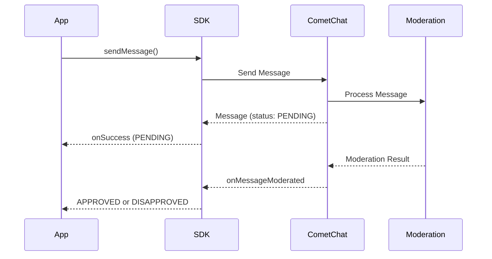

## Overview

AI Moderation in the CometChat SDK helps ensure that your chat application remains safe and compliant by automatically reviewing messages for inappropriate content. This feature leverages AI to moderate messages in real-time, reducing manual intervention and improving user experience.

<Note>
For a broader understanding of moderation features, configuring rules, and managing flagged messages, see the [Moderation Overview](/moderation/overview).
</Note>

## Prerequisites

Before using AI Moderation, ensure the following:

1. Moderation is enabled for your app in the [CometChat Dashboard](https://app.cometchat.com)
2. Moderation rules are configured under **Moderation > Rules**
3. You're using CometChat SDK version that supports moderation

## How It Works



| Step | Description |
|------|-------------|
| 1. Send Message | App sends a text, image, or video message |
| 2. Pending Status | Message is sent with `PENDING` moderation status |
| 3. AI Processing | Moderation service analyzes the content |
| 4. Result Event | `onMessageModerated` event fires with final status |

## Supported Message Types

Moderation is triggered **only** for the following message types:

| Message Type | Moderated | Notes |
|--------------|-----------|-------|
| Text Messages | ✅ | Content analyzed for inappropriate text |
| Image Messages | ✅ | Images scanned for unsafe content |
| Video Messages | ✅ | Videos analyzed for prohibited content |
| Custom Messages | ❌ | Not subject to AI moderation |
| Action Messages | ❌ | Not subject to AI moderation |

## Moderation Status

The `moderationStatus` property returns one of the following enum values:

| Status | Enum Value | Description |
|--------|------------|-------------|
| Pending | `ModerationStatusEnum.PENDING` | Message is being processed by moderation |
| Approved | `ModerationStatusEnum.APPROVED` | Message passed moderation and is visible |
| Disapproved | `ModerationStatusEnum.DISAPPROVED` | Message violated rules and was blocked |

## Implementation

### Step 1: Send a Message and Check Initial Status

When you send a text, image, or video message, check the initial moderation status:

<Tabs>
  <Tab title="Dart">
    ```dart
    TextMessage textMessage = TextMessage(
      text: "Hello, how are you?",
      receiverUid: receiverUID,
      receiverType: ReceiverTypeConstants.user,
    );

    CometChat.sendMessage(
      textMessage,
      onSuccess: (TextMessage message) {
        // Check moderation status
        if (message.moderationStatus?.value == ModerationStatusEnum.PENDING.value) {
          print("Message is under moderation review");
          // Show pending indicator in UI
        }
      },
      onError: (CometChatException e) {
        print("Message sending failed: ${e.message}");
      },
    );
    ```
  </Tab>
</Tabs>

### Step 2: Listen for Moderation Results

Implement the `MessageListener` to receive moderation results in real-time:

<Tabs>
  <Tab title="Dart">
    ```dart
    class ModerationListener with MessageListener {
      
      @override
      void onMessageModerated(BaseMessage message) {
        if (message is TextMessage) {
          switch (message.moderationStatus?.value) {
            case ModerationStatusEnum.APPROVED:
              print("Message ${message.id} approved");
              // Update UI to show message normally
              break;
              
            case ModerationStatusEnum.DISAPPROVED:
              print("Message ${message.id} blocked");
              // Handle blocked message (hide or show warning)
              handleDisapprovedMessage(message);
              break;
          }
        } else if (message is MediaMessage) {
          switch (message.moderationStatus?.value) {
            case ModerationStatusEnum.APPROVED:
              print("Media message ${message.id} approved");
              break;
              
            case ModerationStatusEnum.DISAPPROVED:
              print("Media message ${message.id} blocked");
              handleDisapprovedMessage(message);
              break;
          }
        }
      }
    }

    // Register the listener
    CometChat.addMessageListener("MODERATION_LISTENER", ModerationListener());

    // Don't forget to remove the listener when done
    // CometChat.removeMessageListener("MODERATION_LISTENER");
    ```
  </Tab>
</Tabs>

### Step 3: Handle Disapproved Messages

When a message is disapproved, handle it appropriately in your UI:

<Tabs>
  <Tab title="Dart">
    ```dart
    void handleDisapprovedMessage(BaseMessage message) {
      int messageId = message.id;
      
      // Option 1: Hide the message completely
      hideMessageFromUI(messageId);
      
      // Option 2: Show a placeholder message
      showBlockedPlaceholder(messageId, "This message was blocked by moderation");
      
      // Option 3: Notify the sender (if it's their message)
      if (message.sender?.uid == currentUserUID) {
        showNotification("Your message was blocked due to policy violation");
      }
    }
    ```
  </Tab>
</Tabs>

## Next Steps
After implementing AI Moderation, consider adding a reporting feature to allow users to flag messages they find inappropriate. For more details, see the [Flag Message](/sdk/flutter/flag-message) documentation.
