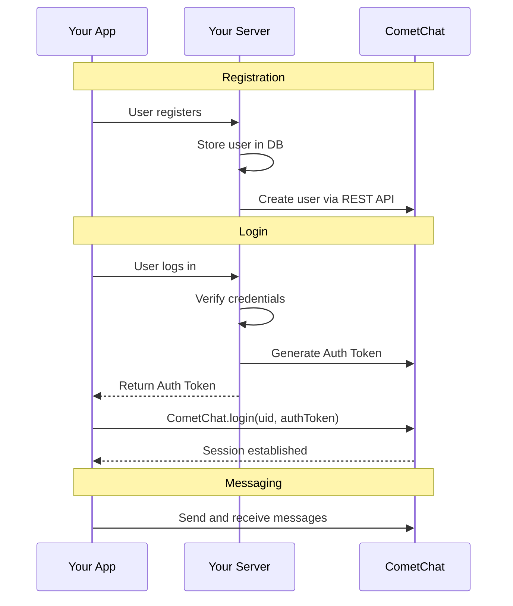

To allow a user to use CometChat, the user must log in to CometChat.

**CometChat does not handle user management.** You must handle user registration and login at your end. Once the user is logged into your app/site, you can log in the user to CometChat **programmatically**. The user does not ever directly login to CometChat.

**CometChat does not handle friends management.** If you want to associate friends with your users, you must handle friends management in your app. Once two users are friends, you can associate them as friends in CometChat.

### Typical Workflow



| Your App | Your Server | CometChat |
|----------|-------------|-----------|
| User registers | Store user info in your database | Create user via REST API (ID & name) |
| User logs in | Verify credentials, retrieve user ID | Log in user programmatically |
| User sends a friend request | Display the request to the potential friend | No action required |
| User accepts a friend request | Display the users as friends | Add both users as friends via REST API |

## Create User

Before you login the user, you must add the user to CometChat.

1. **For proof of concept/MVPs**: Create the user using the [CometChat Dashboard](https://app.cometchat.com/).
2. **For production apps**: Use the CometChat [Create User API](https://api-explorer.cometchat.com/reference/creates-user) to create the user when your user signs up in your app.

<Note>

We have setup 5 users for testing having UIDs: `cometchat-uid-1`, `cometchat-uid-2`, `cometchat-uid-3`, `cometchat-uid-4` and `cometchat-uid-5`.

</Note>

Once initialization is successful, you will need to log the user into CometChat using the `login()` method.

We recommend you call the CometChat `login()` method once your user logs into your app. The `login()` method needs to be called only once.

<Warning>

The CometChat SDK maintains the session of the logged-in user within the SDK. Thus you do not need to call the login method for every session. You can use the CometChat.getLoggedInUser() method to check if there is any existing session in the SDK. This method should return the details of the logged-in user. If this method returns null, it implies there is no session present within the SDK and you need to log the user into ComeChat.

</Warning>

## Login using Auth Key

This straightforward authentication method is ideal for proof-of-concept (POC) development or during the early stages of application development. For production environments, however, we strongly recommend using an [AuthToken](#login-using-auth-token) instead of an Auth Key to ensure enhanced security.

<Tabs>
<Tab title="Dart">
```dart
String UID = "user_id"; // Replace with the UID of the user to login
String authKey = "AUTH_KEY"; // Replace with your App Auth Key

final user = await CometChat.getLoggedInUser();
if (user == null) {
await CometChat.login(UID, authKey,
		onSuccess: (User user) {
			debugPrint("Login Successful : $user" );
		}, onError: (CometChatException e) {
			debugPrint("Login failed with exception:  ${e.message}");
		});
}
```

</Tab>

</Tabs>

| Parameter | Description                                        |
| --------- | -------------------------------------------------- |
| UID       | The `UID` of the user that you would like to login |
| authKey   | CometChat App Auth Key                             |

After the user logs in, their information is returned in the `User` object.

## Login using Auth Token

This advanced authentication procedure does not use the Auth Key directly in your client code thus ensuring safety.

1. [Create a User](https://api-explorer.cometchat.com/reference/creates-user) via the CometChat API when the user signs up in your app.
2. [Create an Auth Token](https://api-explorer.cometchat.com/reference/create-authtoken) via the CometChat API for the new user every time the user logs in to your app.
3. Pass the **Auth Token** to your client and use it in the `login()` method.

<Tabs>
<Tab title="Dart">
```dart
String authToken = "AUTH_TOKEN";
var user = await CometChat.getLoggedInUser(onSuccess: (_){}, onError: (_){});
if (user == null) {
 if(authToken!=null){
   await  CometChat.loginWithAuthToken(authToken,
                                       onSuccess: (User loggedInUser){
                                         debugPrint("Login Successful : $user" );
                                       }, onError: ( CometChatException e){
                                         debugPrint("Login failed with exception:  ${e.message}");
                                       });
 }
}
```

</Tab>

</Tabs>

| Parameter                                      | Description |
| ---------------------------------------------- | ----------- |
| authToken                                      | Auth Token of the user you would like to login |

After the user logs in, their information is returned in the `User` object.

## Logout

You can use the `logout()` method to log out the user from CometChat. We suggest you call this method once your user has been successfully logged out from your app.

<Tabs>
<Tab title="Dart">
```dart
CometChat.logout( onSuccess: ( successMessage) {
    debugPrint("Logout successful with message $successMessage");
  }, onError: (CometChatException e ){
    debugPrint("Logout failed with exception:  ${e.message}");
      }
  );
```

</Tab>

</Tabs>
