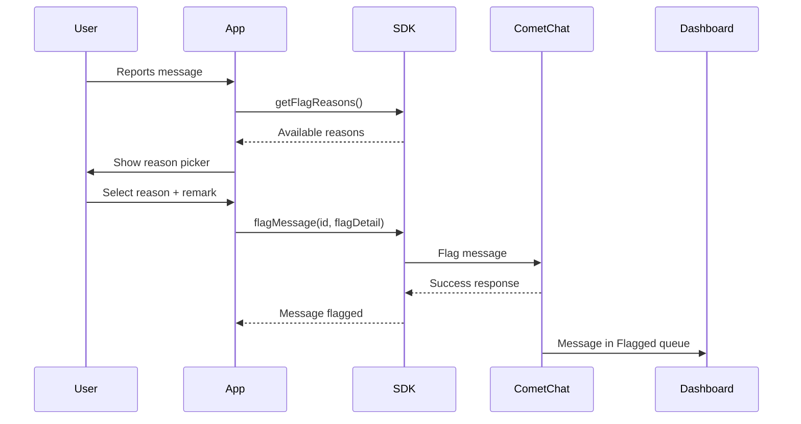

## Overview

Flagging messages allows users to report inappropriate content to moderators or administrators. When a message is flagged, it appears in the [CometChat Dashboard](https://app.cometchat.com) under **Moderation > Flagged Messages** for review.

<Note>
For a complete understanding of how flagged messages are reviewed and managed, see the [Flagged Messages](/moderation/flagged-messages) documentation.
</Note>

## Prerequisites

Before using the flag message feature:

1. Moderation must be enabled for your app in the [CometChat Dashboard](https://app.cometchat.com)
2. Flag reasons should be configured under **Moderation > Advanced Settings**

## How It Works



## Get Flag Reasons

Before flagging a message, retrieve the list of available flag reasons configured in your Dashboard:

<Tabs>
  <Tab title="Dart">
    ```dart
    CometChat.getFlagReasons(
      onSuccess: (List<FlagReason> reasons) {
        print("Flag reasons fetched: $reasons");
        // Use reasons to populate your report dialog UI
        for (var reason in reasons) {
          print("Reason ID: ${reason.id}, Title: ${reason.title}");
        }
      },
      onError: (CometChatException e) {
        print("Error fetching flag reasons: ${e.message}");
      },
    );
    ```
  </Tab>
</Tabs>

### Response

The response is a list of `FlagReason` objects containing:

| Property | Type | Description |
|----------|------|-------------|
| id | String | Unique identifier for the reason |
| title | String | Display text for the reason |

## Flag a Message

To flag a message, use the `flagMessage()` method with the message ID and a `FlagDetail` object:

<Tabs>
  <Tab title="Dart">
    ```dart
    int messageId = 123;  // ID of the message to flag

    FlagDetail flagDetail = FlagDetail()
      ..reasonId = "spam"  // Required: ID from getFlagReasons()
      ..remark = "This message contains promotional content";  // Optional

    CometChat.flagMessage(
      messageId,
      flagDetail,
      onSuccess: (String response) {
        print("Message flagged successfully: $response");
      },
      onError: (CometChatException e) {
        print("Message flagging failed: ${e.message}");
      },
    );
    ```
  </Tab>
</Tabs>

### Parameters

| Parameter | Type | Required | Description |
|-----------|------|----------|-------------|
| messageId | int | Yes | The ID of the message to flag |
| flagDetail | FlagDetail | Yes | Contains flagging details |
| flagDetail.reasonId | String | Yes | ID of the flag reason (from `getFlagReasons()`) |
| flagDetail.remark | String | No | Additional context or explanation from the user |

### Response

```json
{
  "message": "Message {id} has been flagged successfully."
}
```

## Complete Example

Here's a complete implementation showing how to build a report message flow:

<Tabs>
  <Tab title="Dart">
    ```dart
    class ReportMessageHandler {
      List<FlagReason> _flagReasons = [];

      // Load flag reasons (call this on app init or when needed)
      Future<List<FlagReason>> loadFlagReasons() async {
        final completer = Completer<List<FlagReason>>();
        
        CometChat.getFlagReasons(
          onSuccess: (List<FlagReason> reasons) {
            _flagReasons = reasons;
            completer.complete(reasons);
          },
          onError: (CometChatException e) {
            print("Failed to load flag reasons: ${e.message}");
            completer.complete([]);
          },
        );
        
        return completer.future;
      }

      // Get reasons for UI display
      List<FlagReason> getReasons() => _flagReasons;

      // Flag a message with selected reason
      Future<bool> flagMessage(
        int messageId,
        String reasonId, {
        String? remark,
      }) async {
        final completer = Completer<bool>();
        
        FlagDetail flagDetail = FlagDetail()
          ..reasonId = reasonId;
        
        if (remark != null) {
          flagDetail.remark = remark;
        }

        CometChat.flagMessage(
          messageId,
          flagDetail,
          onSuccess: (String response) {
            print("Message flagged successfully");
            completer.complete(true);
          },
          onError: (CometChatException e) {
            print("Failed to flag message: ${e.message}");
            completer.complete(false);
          },
        );
        
        return completer.future;
      }
    }

    // Usage
    final reportHandler = ReportMessageHandler();

    // Load reasons when app initializes
    await reportHandler.loadFlagReasons();

    // When user submits the report
    final success = await reportHandler.flagMessage(
      123,
      "spam",
      remark: "User is sending promotional links",
    );

    if (success) {
      showToast("Message reported successfully");
    }
    ```
  </Tab>
</Tabs>
