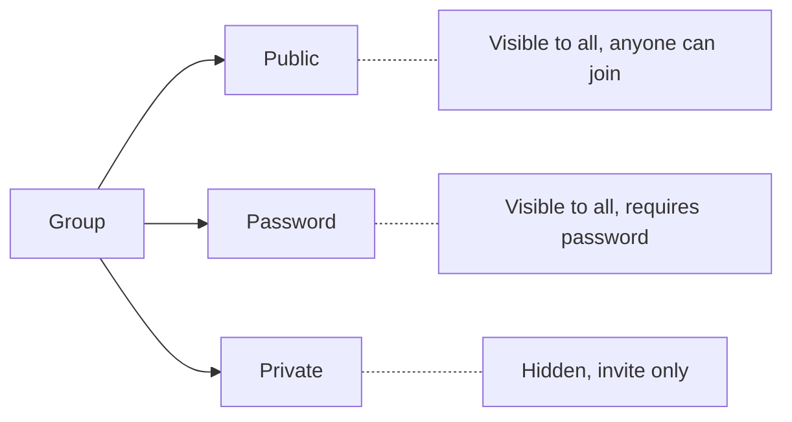
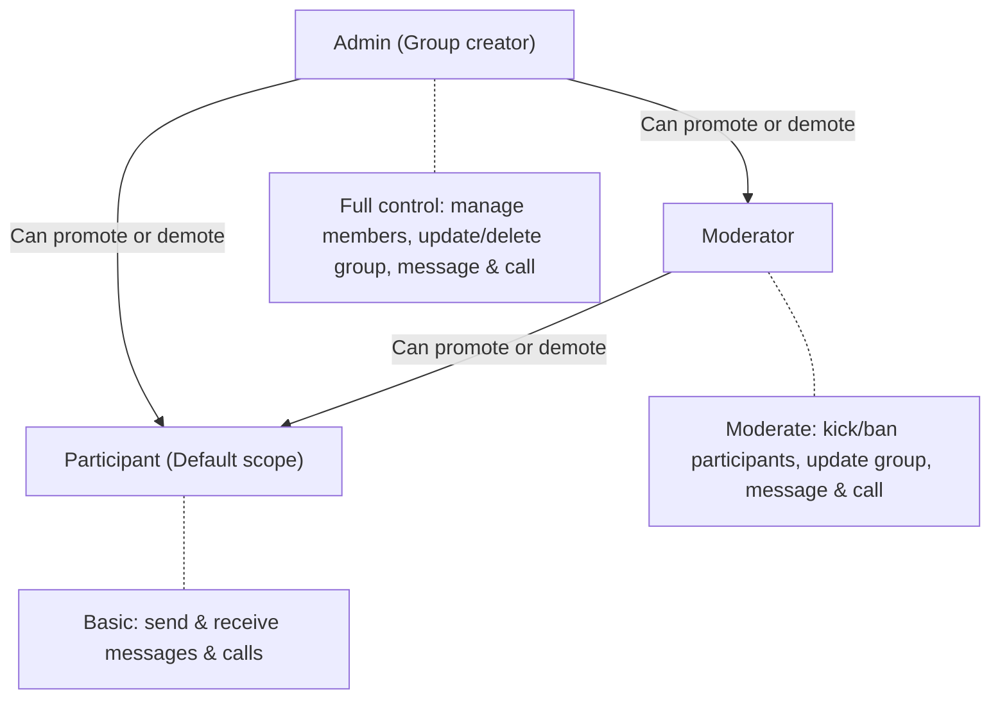

A group can be used for multiple users to communicate with each other on a particular topic or interest.

## GUID

- Each group is uniquely identified using a GUID.
- The GUID is typically the primary ID of the group from your database. If you do not store group information in your database, you can generate a random string for use as GUID.

<Warning>
GUID can be alphanumeric with underscore and hyphen. Spaces, punctuation and other special characters are not allowed.
</Warning>

## Group Types

CometChat supports three different types of groups:

| Type | Visibility | Participation |
|------|-----------|---------------|
| Public | All users | Any user can choose to join |
| Password | All users | Any user with a valid password can join |
| Private | Only members | Invited users are auto-joined |

## Member Scopes

Once a participant joins a group, they become a member. Members remain part of the group indefinitely — to stop receiving messages, calls, and notifications, a member must be kicked, banned, or leave the group.

| Scope | Default | Privileges |
|-------|---------|-----------|
| Admin | Group creator | Manage all members, add members, kick & ban anyone, send & receive messages & calls, update & delete group |
| Moderator | — | Change scope of participants, kick & ban participants, update group, send & receive messages & calls |
| Participant | All other members | Send & receive messages & calls |
