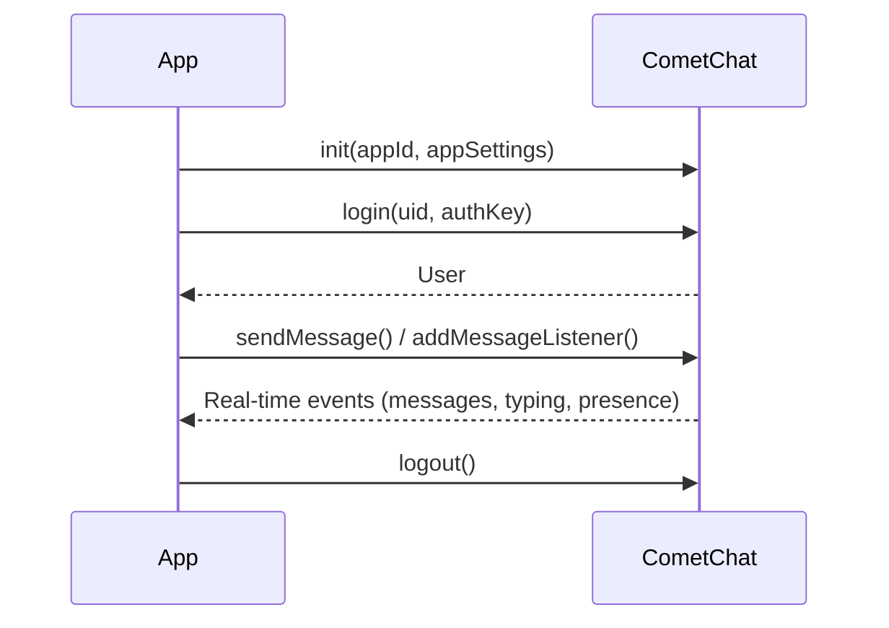

The CometChat Chat SDK for Flutter enables real-time messaging, user management, group conversations, and more in your Flutter application. Built as a pure Dart implementation in v5, it removes the dependency on platform channels and works seamlessly across Android, iOS, Web, and desktop.

<Warning>
This is a **beta release** of the CometChat Flutter Chat SDK v5. APIs and features may change before the stable release.
</Warning>

<Info>
**Faster Integration with UI Kits**

If you're using CometChat UI Kits, messaging features can be quickly integrated with pre-built components:
- Conversation lists, message composers, and thread views
- Typing indicators, read receipts, and reactions
- Group management and user profiles

👉 [Flutter UI Kit Overview](/ui-kit/flutter/overview)

Use this Chat SDK directly only if you need custom UI or advanced control.
</Info>

<Warning>
**Upgrading from v4?**

If you're migrating an existing app from CometChat SDK v4, check out the [Upgrading from v4](/sdk/flutter/5.0/upgrading-from-v4-guide) guide for breaking changes, deprecated methods, and migration instructions.
</Warning>

Before integrating the Chat SDK, ensure you have a [CometChat Account](https://app.cometchat.com/signup) with your App ID, Region, and Auth Key. Flutter SDK `>=1.2` is required, with Android API Level 21+ and iOS 11+. Users must exist in CometChat to send or receive messages — see [Authentication](/sdk/flutter/5.0/authentication-overview) for details.

<CardGroup cols={2}>

<Card title="Messaging" icon="message" href="/sdk/flutter/5.0/messaging-overview">
  Send text, media, and custom messages in 1-on-1 or group conversations
</Card>

<Card title="Groups" icon="users" href="/sdk/flutter/5.0/groups-overview">
  Create, join, and manage group conversations with member roles and scopes
</Card>

<Card title="Real-time Listeners" icon="bolt" href="/sdk/flutter/5.0/real-time-listeners">
  Listen for messages, typing indicators, read receipts, and presence changes in real time
</Card>

<Card title="Typing Indicators" icon="keyboard" href="/sdk/flutter/5.0/typing-indicators">
  Show real-time typing status for users and groups
</Card>

<Card title="User Presence" icon="circle-dot" href="/sdk/flutter/5.0/user-presence">
  Track online/offline status of users with configurable subscription modes
</Card>

<Card title="Reactions" icon="face-smile" href="/sdk/flutter/5.0/reactions">
  Add and manage emoji reactions on messages
</Card>

<Card title="Threaded Messages" icon="comments" href="/sdk/flutter/5.0/threaded-messages">
  Organize conversations with message threads
</Card>

<Card title="Delivery & Read Receipts" icon="check-double" href="/sdk/flutter/5.0/delivery-read-receipts">
  Track message delivery and read status
</Card>

<Card title="AI Agents" icon="robot" href="/sdk/flutter/5.0/ai-agents">
  Integrate AI-powered agents into your chat experience
</Card>

<Card title="Calling" icon="phone" href="/sdk/flutter/5.0/calling-overview">
  Voice and video calling with built-in UI components
</Card>

</CardGroup>

| Component | Description |
|-----------|-------------|
| `CometChat` | Main entry point for initialization, authentication, messaging, and real-time events |
| `AppSettings` | Configuration for SDK initialization (App ID, Region, presence subscription) |
| `User` | Represents a CometChat user with UID, name, avatar, and metadata |
| `Group` | Represents a group conversation with GUID, type, and member management |
| `BaseMessage` | Base class for all message types (text, media, custom, action) |
| `MessageListener` | Event interface for real-time message, typing, and receipt events |
| `ConnectionListener` | Event interface for WebSocket connection status changes |
