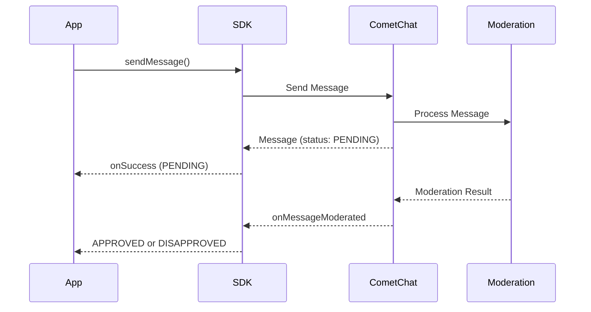

<Accordion title="AI Integration Quick Reference">

```dart
// Send message and check moderation status
CometChat.sendMessage(textMessage, onSuccess: (TextMessage message) {
  if (message.moderationStatus?.value == ModerationStatusEnum.PENDING.value) {
    // Message is under moderation review
  }
}, onError: (e) {});

// Listen for moderation results
CometChat.addMessageListener("MODERATION_LISTENER", MessageListener(
  onMessageModerated: (BaseMessage message) {
    // Handle APPROVED or DISAPPROVED status
  },
));

// Remove listener when done
CometChat.removeMessageListener("MODERATION_LISTENER");
```

**Moderation Status:** `PENDING` → `APPROVED` or `DISAPPROVED`
**Supported Types:** Text, Image, Video messages
</Accordion>

## Overview

AI Moderation in the CometChat SDK helps ensure that your chat application remains safe and compliant by automatically reviewing messages for inappropriate content. This feature leverages AI to moderate messages in real-time, reducing manual intervention and improving user experience.

<Note>
**Available via:** SDK | [REST API](https://api-explorer.cometchat.com) | [UI Kits](/ui-kit/flutter/overview) | [Dashboard](https://app.cometchat.com)
</Note>

<Note>
For a broader understanding of moderation features, configuring rules, and managing flagged messages, see the [Moderation Overview](/moderation/overview).
</Note>

## Prerequisites

Before using AI Moderation, ensure the following:

1. Moderation is enabled for your app in the [CometChat Dashboard](https://app.cometchat.com)
2. Moderation rules are configured under **Moderation > Rules**
3. You're using CometChat SDK version that supports moderation

## How It Works



| Step | Description |
|------|-------------|
| 1. Send Message | App sends a text, image, or video message |
| 2. Pending Status | Message is sent with `PENDING` moderation status |
| 3. AI Processing | Moderation service analyzes the content |
| 4. Result Event | `onMessageModerated` event fires with final status |

## Supported Message Types

Moderation is triggered **only** for the following message types:

| Message Type | Moderated | Notes |
|--------------|-----------|-------|
| Text Messages | ✅ | Content analyzed for inappropriate text |
| Image Messages | ✅ | Images scanned for unsafe content |
| Video Messages | ✅ | Videos analyzed for prohibited content |

Moderation applies to [`TextMessage`](/sdk/reference/messages#textmessage) and [`MediaMessage`](/sdk/reference/messages#mediamessage) types.
| Custom Messages | ❌ | Not subject to AI moderation |
| Action Messages | ❌ | Not subject to AI moderation |

## Moderation Status

The `moderationStatus` property returns one of the following enum values:

| Status | Enum Value | Description |
|--------|------------|-------------|
| Pending | `ModerationStatusEnum.PENDING` | Message is being processed by moderation |
| Approved | `ModerationStatusEnum.APPROVED` | Message passed moderation and is visible |
| Disapproved | `ModerationStatusEnum.DISAPPROVED` | Message violated rules and was blocked |

## Implementation

### Step 1: Send a Message and Check Initial Status

When you send a text, image, or video message, check the initial moderation status:

<Tabs>
  <Tab title="Dart">
    ```dart
    TextMessage textMessage = TextMessage(
      text: "Hello, how are you?",
      receiverUid: receiverUID,
      receiverType: ReceiverTypeConstants.user,
    );

    CometChat.sendMessage(
      textMessage,
      onSuccess: (TextMessage message) {
        // Check moderation status
        if (message.moderationStatus?.value == ModerationStatusEnum.PENDING.value) {
          print("Message is under moderation review");
          // Show pending indicator in UI
        }
      },
      onError: (CometChatException e) {
        print("Message sending failed: ${e.message}");
      },
    );
    ```
  </Tab>
</Tabs>

<Accordion title="Response">
**On Success** — A `TextMessage` object containing all details of the sent message, including the initial moderation status:

<span id="send-moderated-message-object" style={{scrollMarginTop: '100px'}}></span>

**TextMessage Object:**

| Parameter | Type | Description | Sample Value |
|-----------|------|-------------|--------------|
| `id` | number | Unique message ID | `501` |
| `metadata` | object | Custom metadata attached to the message | `{}` |
| `receiver` | object | Receiver user object | [See below ↓](#send-moderated-receiver-object) |
| `editedBy` | string | UID of the user who edited the message | `null` |
| `conversationId` | string | Unique conversation identifier | `"cometchat-uid-1_user_cometchat-uid-2"` |
| `sentAt` | number | Epoch timestamp when the message was sent | `1745554729` |
| `receiverUid` | string | UID of the receiver | `"cometchat-uid-2"` |
| `type` | string | Type of the message | `"text"` |
| `readAt` | number | Epoch timestamp when the message was read | `0` |
| `deletedBy` | string | UID of the user who deleted the message | `null` |
| `deliveredAt` | number | Epoch timestamp when the message was delivered | `0` |
| `deletedAt` | number | Epoch timestamp when the message was deleted | `0` |
| `replyCount` | number | Number of replies to this message | `0` |
| `sender` | object | Sender user object | [See below ↓](#send-moderated-sender-object) |
| `receiverType` | string | Type of the receiver | `"user"` |
| `editedAt` | number | Epoch timestamp when the message was edited | `0` |
| `parentMessageId` | number | ID of the parent message (for threads) | `-1` |
| `readByMeAt` | number | Epoch timestamp when read by the current user | `0` |
| `category` | string | Message category | `"message"` |
| `deliveredToMeAt` | number | Epoch timestamp when delivered to the current user | `0` |
| `updatedAt` | number | Epoch timestamp when the message was last updated | `1745554729` |
| `text` | string | The text content of the message | `"Hello, how are you?"` |
| `tags` | array | List of tags associated with the message | `[]` |
| `unreadRepliesCount` | number | Count of unread replies | `0` |
| `mentionedUsers` | array | List of mentioned users | `[]` |
| `hasMentionedMe` | boolean | Whether the current user is mentioned | `false` |
| `reactions` | array | List of reactions on the message | `[]` |
| `moderationStatus` | string | Moderation status of the message | `"pending"` |
| `quotedMessageId` | number | ID of the quoted message | `null` |

---

<span id="send-moderated-sender-object" style={{scrollMarginTop: '100px'}}></span>

**`sender` Object:**

| Parameter | Type | Description | Sample Value |
|-----------|------|-------------|--------------|
| `uid` | string | Unique identifier of the sender | `"cometchat-uid-1"` |
| `name` | string | Display name of the sender | `"Andrew Joseph"` |
| `link` | string | Profile link | `null` |
| `avatar` | string | Avatar URL | `"https://assets.cometchat.io/sampleapp/v2/users/cometchat-uid-1.webp"` |
| `metadata` | object | Custom metadata | `{}` |
| `status` | string | Online status | `"online"` |
| `role` | string | User role | `"default"` |
| `statusMessage` | string | Status message | `null` |
| `tags` | array | User tags | `[]` |
| `hasBlockedMe` | boolean | Whether this user has blocked the current user | `false` |
| `blockedByMe` | boolean | Whether the current user has blocked this user | `false` |
| `lastActiveAt` | number | Epoch timestamp of last activity | `1745554700` |

---

<span id="send-moderated-receiver-object" style={{scrollMarginTop: '100px'}}></span>

**`receiver` Object:**

| Parameter | Type | Description | Sample Value |
|-----------|------|-------------|--------------|
| `uid` | string | Unique identifier of the receiver | `"cometchat-uid-2"` |
| `name` | string | Display name of the receiver | `"George Alan"` |
| `link` | string | Profile link | `null` |
| `avatar` | string | Avatar URL | `"https://assets.cometchat.io/sampleapp/v2/users/cometchat-uid-2.webp"` |
| `metadata` | object | Custom metadata | `{}` |
| `status` | string | Online status | `"offline"` |
| `role` | string | User role | `"default"` |
| `statusMessage` | string | Status message | `null` |
| `tags` | array | User tags | `[]` |
| `hasBlockedMe` | boolean | Whether this user has blocked the current user | `false` |
| `blockedByMe` | boolean | Whether the current user has blocked this user | `false` |
| `lastActiveAt` | number | Epoch timestamp of last activity | `1745550000` |

</Accordion>

<Accordion title="Error">

| Parameter | Type | Description | Sample Value |
|-----------|------|-------------|--------------|
| `code` | string | Error code identifier | `"ERR_BLOCKED_BY_EXTENSION"` |
| `message` | string | Human-readable error message | `"Message blocked by moderation."` |
| `details` | string | Additional technical details | `"The message was flagged and blocked by the AI moderation extension."` |

</Accordion>

### Step 2: Listen for Moderation Results

Implement the `MessageListener` to receive moderation results in real-time:

<Tabs>
  <Tab title="Dart">
    ```dart
    class ModerationListener with MessageListener {
      
      @override
      void onMessageModerated(BaseMessage message) {
        if (message is TextMessage) {
          switch (message.moderationStatus?.value) {
            case ModerationStatusEnum.APPROVED:
              print("Message ${message.id} approved");
              // Update UI to show message normally
              break;
              
            case ModerationStatusEnum.DISAPPROVED:
              print("Message ${message.id} blocked");
              // Handle blocked message (hide or show warning)
              handleDisapprovedMessage(message);
              break;
          }
        } else if (message is MediaMessage) {
          switch (message.moderationStatus?.value) {
            case ModerationStatusEnum.APPROVED:
              print("Media message ${message.id} approved");
              break;
              
            case ModerationStatusEnum.DISAPPROVED:
              print("Media message ${message.id} blocked");
              handleDisapprovedMessage(message);
              break;
          }
        }
      }
    }

    // Register the listener
    CometChat.addMessageListener("MODERATION_LISTENER", ModerationListener());

    // Don't forget to remove the listener when done
    // CometChat.removeMessageListener("MODERATION_LISTENER");
    ```
  </Tab>
</Tabs>

### Step 3: Handle Disapproved Messages

When a message is disapproved, handle it appropriately in your UI:

<Tabs>
  <Tab title="Dart">
    ```dart
    void handleDisapprovedMessage(BaseMessage message) {
      int messageId = message.id;
      
      // Option 1: Hide the message completely
      hideMessageFromUI(messageId);
      
      // Option 2: Show a placeholder message
      showBlockedPlaceholder(messageId, "This message was blocked by moderation");
      
      // Option 3: Notify the sender (if it's their message)
      if (message.sender?.uid == currentUserUID) {
        showNotification("Your message was blocked due to policy violation");
      }
    }
    ```
  </Tab>
</Tabs>

## Next Steps

After implementing AI Moderation, explore these related features:

<CardGroup cols={2}>
  <Card title="AI Agents" icon="robot" href="/sdk/flutter/ai-agents">
    Build intelligent AI-powered agents for automated conversations
  </Card>
  <Card title="Flag Message" icon="flag" href="/sdk/flutter/flag-message">
    Allow users to manually report inappropriate messages
  </Card>
  <Card title="AI Chatbots" icon="comments" href="/sdk/flutter/ai-chatbots-overview">
    Create automated chatbot experiences for your users
  </Card>
  <Card title="Receive Messages" icon="inbox" href="/sdk/flutter/receive-messages">
    Handle incoming messages and moderation events
  </Card>
</CardGroup>
