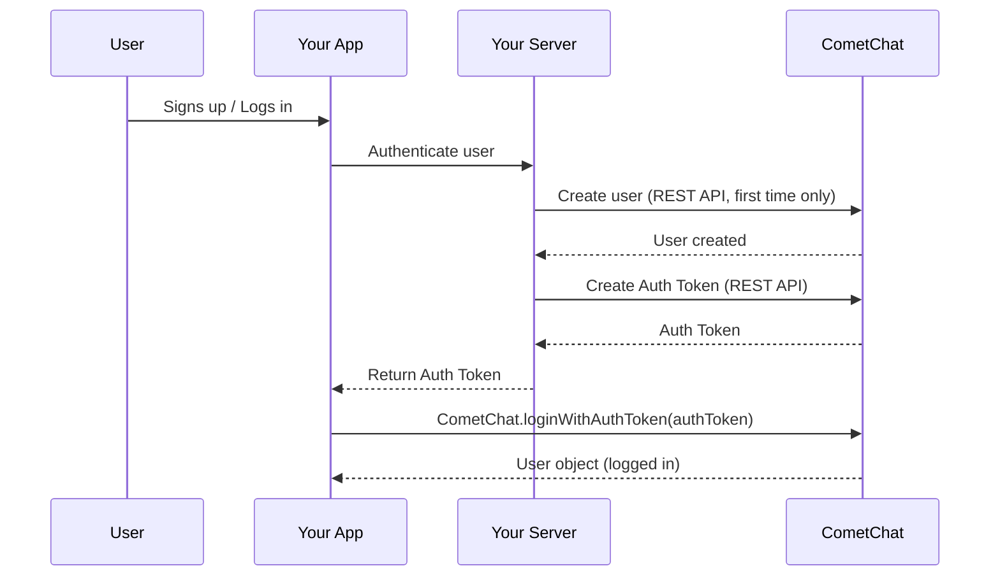

{/* TL;DR for Agents and Quick Reference */}
<Accordion title="AI Integration Quick Reference">

```dart
// Check existing session
User? user = await CometChat.getLoggedInUser();

// Login with Auth Key (development only)
CometChat.login("cometchat-uid-1", "AUTH_KEY",
  onSuccess: (User user) { debugPrint("Logged in: $user"); },
  onError: (CometChatException e) { debugPrint("Error: ${e.message}"); }
);

// Login with Auth Token (production)
CometChat.loginWithAuthToken("AUTH_TOKEN",
  onSuccess: (User user) { debugPrint("Logged in: $user"); },
  onError: (CometChatException e) { debugPrint("Error: ${e.message}"); }
);

// Logout
CometChat.logout(
  onSuccess: (String msg) { debugPrint("Logged out"); },
  onError: (CometChatException e) { debugPrint("Error: ${e.message}"); }
);
```

**Create users via:** [Dashboard](https://app.cometchat.com) (testing) | [REST API](https://api-explorer.cometchat.com/reference/creates-user) (production)
**Test UIDs:** `cometchat-uid-1` through `cometchat-uid-5`
</Accordion>

After [initializing](/sdk/flutter/setup) the SDK, the next step is to authenticate your user. CometChat provides two login methods — Auth Key for quick development, and Auth Token for production — both accessed through the `login()` method.

### How It Works



## Before You Log In

### Create a User

A user must exist in CometChat before they can log in.

- **During development:** Create users from the [CometChat Dashboard](https://app.cometchat.com). Five test users are already available with UIDs `cometchat-uid-1` through `cometchat-uid-5`.
- **In production:** Call the [Create User REST API](https://api-explorer.cometchat.com/reference/creates-user) when a user signs up in your app.

<Note>

We have setup 5 users for testing having UIDs: `cometchat-uid-1`, `cometchat-uid-2`, `cometchat-uid-3`, `cometchat-uid-4` and `cometchat-uid-5`.

</Note>

### Check for an Existing Session

The SDK persists the logged-in user's session locally. Before calling `login()`, always check whether a session already exists — this avoids unnecessary login calls and keeps your app responsive.

```dart
User? user = await CometChat.getLoggedInUser();
if (user != null) {
  // User is already logged in — proceed to your app
}
```

If `getLoggedInUser()` returns `null`, no active session exists and you need to call `login()`.

| Method | Returns | Description |
| ------ | ------- | ----------- |
| `CometChat.getLoggedInUser()` | `Future<User?>` | Returns the currently logged-in user, or `null` if no session exists |


## Login with Auth Key

This straightforward authentication method is ideal for proof-of-concept (POC) development or during the early stages of application development. For production environments, however, we strongly recommend using an [Auth Token](#login-with-auth-token) instead of an Auth Key to ensure enhanced security.

<Warning>
Auth Keys are meant for development and testing only. For production, use [Auth Token login](#login-with-auth-token) instead. Never ship Auth Keys in client-side code.
</Warning>

<Tabs>
<Tab title="Dart">
```dart
String UID = "user_id"; // Replace with the UID of the user to login
String authKey = "AUTH_KEY"; // Replace with your App Auth Key

final user = await CometChat.getLoggedInUser();
if (user == null) {
await CometChat.login(UID, authKey,
		onSuccess: (User user) {
			debugPrint("Login Successful : $user" );
		}, onError: (CometChatException e) {
			debugPrint("Login failed with exception:  ${e.message}");
		});
}
```

</Tab>

</Tabs>

| Parameter | Type | Description |
| --------- | ---- | ----------- |
| `UID` | `String` | The UID of the user to log in |
| `authKey` | `String` | Your CometChat Auth Key |

On success, the `onSuccess` callback receives a [`User`](/sdk/flutter/user-management) object containing the logged-in user's details.

<Accordion title="Response">
**On Success** — A `User` object representing the logged-in user:

<span id="login-authkey-user-object" style={{scrollMarginTop: '100px'}}></span>

**User Object:**

| Parameter | Type | Description | Sample Value |
|-----------|------|-------------|--------------|
| `uid` | string | Unique identifier of the user | `"cometchat-uid-1"` |
| `name` | string | Display name of the user | `"Andrew Joseph"` |
| `link` | string | Profile link | `null` |
| `avatar` | string | Avatar URL | `"https://assets.cometchat.io/sampleapp/v2/users/cometchat-uid-1.webp"` |
| `metadata` | object | Custom metadata | `{}` |
| `status` | string | Online status | `"online"` |
| `role` | string | User role | `"default"` |
| `statusMessage` | string | Status message | `null` |
| `tags` | array | User tags | `[]` |
| `hasBlockedMe` | boolean | Whether this user has blocked the current user | `false` |
| `blockedByMe` | boolean | Whether the current user has blocked this user | `false` |
| `lastActiveAt` | number | Epoch timestamp of last activity | `1745554700` |

</Accordion>

<Accordion title="Error">

**CometChatException:**

| Parameter | Type | Description | Sample Value |
|-----------|------|-------------|--------------|
| `code` | string | Error code identifier | `"ERR_UID_NOT_FOUND"` |
| `message` | string | Human-readable error message | `"The specified UID does not exist."` |
| `details` | string | Additional technical details | `"Please verify the UID and try again."` |

</Accordion>

## Login with Auth Token

Auth Token login keeps your Auth Key off the client entirely. Your server generates a token via the REST API and passes it to the client.

1. [Create the user](https://api-explorer.cometchat.com/reference/creates-user) via the REST API when they sign up (first time only).
2. [Generate an Auth Token](https://api-explorer.cometchat.com/reference/create-authtoken) on your server and return it to the client.
3. Pass the token to `loginWithAuthToken()`.

<Tabs>
<Tab title="Dart">
```dart
String authToken = "AUTH_TOKEN";
var user = await CometChat.getLoggedInUser(onSuccess: (_){}, onError: (_){});
if (user == null) {
 if(authToken!=null){
   await  CometChat.loginWithAuthToken(authToken,
                                       onSuccess: (User loggedInUser){
                                         debugPrint("Login Successful : $user" );
                                       }, onError: ( CometChatException e){
                                         debugPrint("Login failed with exception:  ${e.message}");
                                       });
 }
}
```

</Tab>

</Tabs>

| Parameter | Type | Description |
| --------- | ---- | ----------- |
| `authToken` | `String` | Auth Token generated on your server for the user |

On success, the `onSuccess` callback receives a [`User`](/sdk/flutter/user-management) object containing the logged-in user's details.

<Accordion title="Response">
**On Success** — A `User` object representing the logged-in user:

<span id="login-authtoken-user-object" style={{scrollMarginTop: '100px'}}></span>

**User Object:**

| Parameter | Type | Description | Sample Value |
|-----------|------|-------------|--------------|
| `uid` | string | Unique identifier of the user | `"cometchat-uid-1"` |
| `name` | string | Display name of the user | `"Andrew Joseph"` |
| `link` | string | Profile link | `null` |
| `avatar` | string | Avatar URL | `"https://assets.cometchat.io/sampleapp/v2/users/cometchat-uid-1.webp"` |
| `metadata` | object | Custom metadata | `{}` |
| `status` | string | Online status | `"online"` |
| `role` | string | User role | `"default"` |
| `statusMessage` | string | Status message | `null` |
| `tags` | array | User tags | `[]` |
| `hasBlockedMe` | boolean | Whether this user has blocked the current user | `false` |
| `blockedByMe` | boolean | Whether the current user has blocked this user | `false` |
| `lastActiveAt` | number | Epoch timestamp of last activity | `1745554700` |

</Accordion>

<Accordion title="Error">

**CometChatException:**

| Parameter | Type | Description | Sample Value |
|-----------|------|-------------|--------------|
| `code` | string | Error code identifier | `"ERR_UID_NOT_FOUND"` |
| `message` | string | Human-readable error message | `"The specified UID does not exist."` |
| `details` | string | Additional technical details | `"Please verify the UID and try again."` |

</Accordion>

## Logout

Call `logout()` when your user logs out of your app. This clears the local session.

<Tabs>
<Tab title="Dart">
```dart
CometChat.logout( onSuccess: ( successMessage) {
    debugPrint("Logout successful with message $successMessage");
  }, onError: (CometChatException e ){
    debugPrint("Logout failed with exception:  ${e.message}");
      }
  );
```

</Tab>

</Tabs>

<Accordion title="Response">
**On Success** — A `String` message confirming the logout:

| Parameter | Type | Description | Sample Value |
|-----------|------|-------------|--------------|
| `message` | string | Success confirmation message | `"Logout successful"` |

</Accordion>

<Accordion title="Error">

**CometChatException:**

| Parameter | Type | Description | Sample Value |
|-----------|------|-------------|--------------|
| `code` | string | Error code identifier | `"ERR_NOT_LOGGED_IN"` |
| `message` | string | Human-readable error message | `"No active user session."` |
| `details` | string | Additional technical details | `"Please log in before attempting to log out."` |

</Accordion>

---

## Next Steps

<CardGroup cols={2}>
  <Card title="Send Messages" icon="paper-plane" href="/sdk/flutter/send-message">
    Send your first text, media, or custom message
  </Card>
  <Card title="User Management" icon="users-gear" href="/sdk/flutter/user-management">
    Create, update, and manage users in your app
  </Card>
  <Card title="Connection Status" icon="signal" href="/sdk/flutter/connection-status">
    Monitor the SDK connection state in real time
  </Card>
  <Card title="Login Listeners" icon="tower-broadcast" href="/sdk/flutter/login-listeners">
    Listen for login and logout events in real time
  </Card>
</CardGroup>
