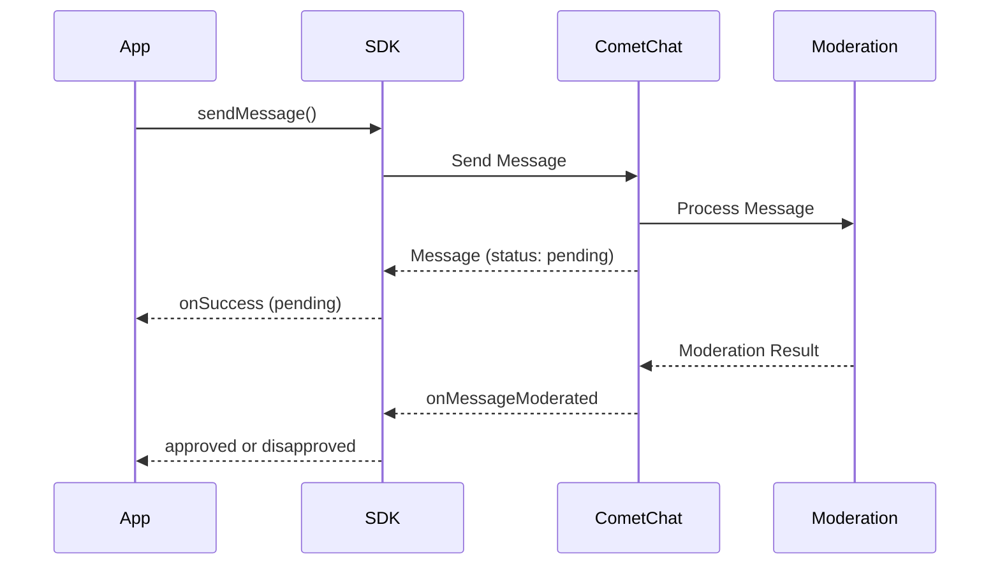

<Accordion title="AI Integration Quick Reference">

```swift
// Send message - check moderation status
CometChat.sendTextMessage(message: textMessage) { sentMessage in
    if let msg = sentMessage as? TextMessage {
        let status = msg.getModerationStatus() // "pending" | "approved" | "disapproved"
    }
}

// Listen for moderation results
func onMessageModerated(moderatedMessage: BaseMessage) {
    if let msg = moderatedMessage as? TextMessage {
        let status = msg.getModerationStatus()
        // Handle "approved" or "disapproved"
    }
}
```

**Supported types:** Text, Image, Video messages only
**Statuses:** `"pending"` -> `"approved"` or `"disapproved"`
</Accordion>

AI Moderation automatically reviews messages for inappropriate content in real-time. When a user sends a text, image, or video message, it's held in a `pending` state while the moderation service analyzes it, then marked as `approved` or `disapproved` via the `onMessageModerated` event.

`getModerationStatus()` is available on [`TextMessage`](/sdk/reference/messages#textmessage) and [`MediaMessage`](/sdk/reference/messages#mediamessage) objects. Custom messages are not subject to moderation.

<Note>
For configuring moderation rules and managing flagged messages from the dashboard, see the [Moderation Overview](/moderation/overview).
</Note>

## Prerequisites

1. Moderation enabled in the [CometChat Dashboard](https://app.cometchat.com)
2. Moderation rules configured under **Moderation > Rules**
3. CometChat SDK version that supports moderation

## How It Works



| Step | Description |
|------|-------------|
| 1. Send Message | App sends a text, image, or video message |
| 2. Pending Status | Message is sent with `pending` moderation status |
| 3. AI Processing | Moderation service analyzes the content |
| 4. Result Event | `onMessageModerated` event fires with final status |

## Supported Message Types

| Message Type | Moderated | Notes |
|--------------|-----------|-------|
| Text Messages | Yes | Content analyzed for inappropriate text |
| Image Messages | Yes | Images scanned for unsafe content |
| Video Messages | Yes | Videos analyzed for prohibited content |
| Custom Messages | No | Not subject to AI moderation |
| Action Messages | No | Not subject to AI moderation |

## Moderation Status

The `getModerationStatus()` method returns one of the following string values:

| Status | Value | Description |
|--------|-------|-------------|
| Pending | `"pending"` | Message is being processed by moderation |
| Approved | `"approved"` | Message passed moderation and is visible |
| Disapproved | `"disapproved"` | Message violated rules and was blocked |

## Implementation

### Step 1: Send a Message and Check Initial Status

When you send a text, image, or video message, check the initial moderation status:

<Tabs>
  <Tab title="Swift">
    ```swift
    let textMessage = TextMessage(receiverUid: receiverUID, text: "Hello, how are you?", receiverType: .user)

    CometChat.sendTextMessage(message: textMessage) { sentMessage in
        if let message = sentMessage as? TextMessage {
            if message.getModerationStatus() == "pending" {
                print("Message is under moderation review")
            }
        }
    } onError: { error in
        print("Message sending failed: \(error?.errorDescription ?? "")")
    }
    ```
  </Tab>
  <Tab title="Objective-C">
    ```objc
    TextMessage *textMessage = [[TextMessage alloc] initWithReceiverUid:receiverUID text:@"Hello, how are you?" receiverType:ReceiverTypeUser];

    [CometChat sendTextMessageWithMessage:textMessage onSuccess:^(TextMessage *sentMessage) {
        if ([[sentMessage getModerationStatus] isEqualToString:@"pending"]) {
            NSLog(@"Message is under moderation review");
        }
    } onError:^(CometChatException *error) {
        NSLog(@"Message sending failed: %@", error.errorDescription);
    }];
    ```
  </Tab>
</Tabs>

### Step 2: Listen for Moderation Results

Register a message listener to receive moderation results in real-time:

<Tabs>
  <Tab title="Swift">
    ```swift
    extension YourViewController: CometChatMessageDelegate {
        
        func onMessageModerated(moderatedMessage: BaseMessage) {
            if let message = moderatedMessage as? TextMessage {
                switch message.getModerationStatus() {
                case "approved":
                    print("Message \(message.id) approved")
                case "disapproved":
                    print("Message \(message.id) blocked")
                    handleDisapprovedMessage(message)
                default:
                    break
                }
            }
        }
    }

    // Register the delegate
    CometChat.addMessageListener("MODERATION_LISTENER", self)

    // Don't forget to remove the listener when done
    // CometChat.removeMessageListener("MODERATION_LISTENER")
    ```
  </Tab>
  <Tab title="Objective-C">
    ```objc
    - (void)onMessageModerated:(BaseMessage *)message {
        if ([message isKindOfClass:[TextMessage class]]) {
            TextMessage *textMessage = (TextMessage *)message;
            
            if ([[textMessage getModerationStatus] isEqualToString:@"approved"]) {
                NSLog(@"Message %d approved", message.id);
            } else if ([[textMessage getModerationStatus] isEqualToString:@"disapproved"]) {
                NSLog(@"Message %d blocked", message.id);
                [self handleDisapprovedMessage:message];
            }
        }
    }

    // Register the delegate
    [CometChat addMessageListener:@"MODERATION_LISTENER" delegate:self];
    ```
  </Tab>
</Tabs>

### Step 3: Handle Disapproved Messages

When a message is disapproved, handle it appropriately in your UI:

<Tabs>
  <Tab title="Swift">
    ```swift
    func handleDisapprovedMessage(_ message: BaseMessage) {
        let messageId = message.id
        
        // Option 1: Hide the message completely
        hideMessageFromUI(messageId)
        
        // Option 2: Show a placeholder message
        showBlockedPlaceholder(messageId, text: "This message was blocked by moderation")
        
        // Option 3: Notify the sender (if it's their message)
        if message.sender?.uid == currentUserUID {
            showNotification("Your message was blocked due to policy violation")
        }
    }
    ```
  </Tab>
  <Tab title="Objective-C">
    ```objc
    - (void)handleDisapprovedMessage:(BaseMessage *)message {
        int messageId = message.id;
        
        [self hideMessageFromUI:messageId];
        [self showBlockedPlaceholder:messageId text:@"This message was blocked by moderation"];
        
        if ([message.sender.uid isEqualToString:currentUserUID]) {
            [self showNotification:@"Your message was blocked due to policy violation"];
        }
    }
    ```
  </Tab>
</Tabs>

<Warning>
Always remove listeners when they're no longer needed (e.g., on component unmount or page navigation). Failing to remove listeners can cause memory leaks and duplicate event handling.
</Warning>

---

## Next Steps

<CardGroup cols={2}>
  <Card title="Flag Message" icon="flag" href="/sdk/ios/flag-message">
    Allow users to report inappropriate messages manually
  </Card>
  <Card title="AI Agents" icon="robot" href="/sdk/ios/ai-agents">
    Build intelligent automated conversations with AI Agents
  </Card>
  <Card title="AI User Copilot" icon="wand-magic-sparkles" href="/sdk/ios/ai-user-copilot-overview">
    Smart replies, conversation summaries, and more
  </Card>
  <Card title="Send Messages" icon="paper-plane" href="/sdk/ios/send-message">
    Send text, media, and custom messages
  </Card>
</CardGroup>
