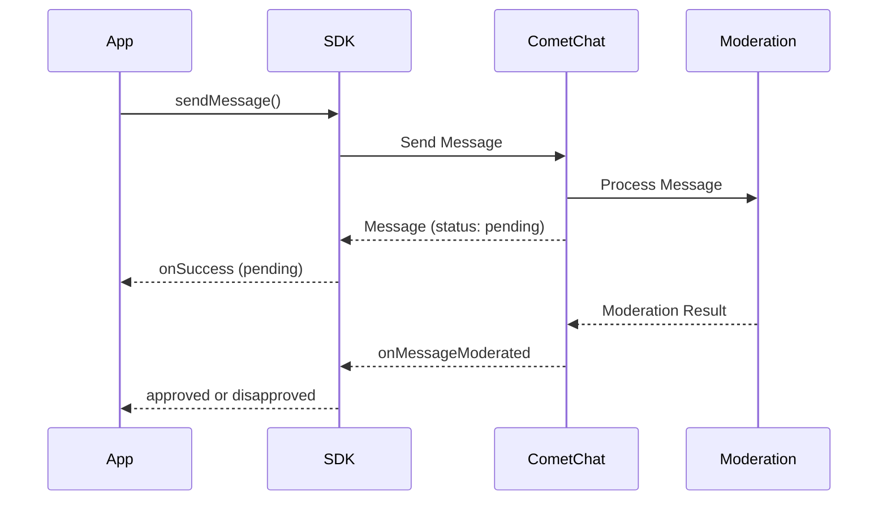

## Overview

AI Moderation in the CometChat SDK helps ensure that your chat application remains safe and compliant by automatically reviewing messages for inappropriate content. This feature leverages AI to moderate messages in real-time, reducing manual intervention and improving user experience.

<Note>
For a broader understanding of moderation features, configuring rules, and managing flagged messages, see the [Moderation Overview](/moderation/overview).
</Note>

## Prerequisites

Before using AI Moderation, ensure the following:

1. Moderation is enabled for your app in the [CometChat Dashboard](https://app.cometchat.com)
2. Moderation rules are configured under **Moderation > Rules**
3. You're using CometChat SDK version that supports moderation

## How It Works



| Step | Description |
|------|-------------|
| 1. Send Message | App sends a text, image, or video message |
| 2. Pending Status | Message is sent with `pending` moderation status |
| 3. AI Processing | Moderation service analyzes the content |
| 4. Result Event | `onMessageModerated` event fires with final status |

## Supported Message Types

Moderation is triggered **only** for the following message types:

| Message Type | Moderated | Notes |
|--------------|-----------|-------|
| Text Messages | ✅ | Content analyzed for inappropriate text |
| Image Messages | ✅ | Images scanned for unsafe content |
| Video Messages | ✅ | Videos analyzed for prohibited content |
| Custom Messages | ❌ | Not subject to AI moderation |
| Action Messages | ❌ | Not subject to AI moderation |

## Moderation Status

The `getModerationStatus()` method returns one of the following string values:

| Status | Value | Description |
|--------|-------|-------------|
| Pending | `"pending"` | Message is being processed by moderation |
| Approved | `"approved"` | Message passed moderation and is visible |
| Disapproved | `"disapproved"` | Message violated rules and was blocked |

## Implementation

### Step 1: Send a Message and Check Initial Status

When you send a text, image, or video message, check the initial moderation status:

<Tabs>
  <Tab title="Swift">
    ```swift
    let textMessage = TextMessage(receiverUid: receiverUID, text: "Hello, how are you?", receiverType: .user)

    CometChat.sendTextMessage(message: textMessage) { sentMessage in
        // Check moderation status
        if let message = sentMessage as? TextMessage {
            if message.getModerationStatus() == "pending" {
                print("Message is under moderation review")
                // Show pending indicator in UI
            }
        }
    } onError: { error in
        print("Message sending failed: \(error?.errorDescription ?? "")")
    }
    ```
  </Tab>
  <Tab title="Objective-C">
    ```objc
    TextMessage *textMessage = [[TextMessage alloc] initWithReceiverUid:receiverUID text:@"Hello, how are you?" receiverType:ReceiverTypeUser];

    [CometChat sendTextMessageWithMessage:textMessage onSuccess:^(TextMessage *sentMessage) {
        // Check moderation status
        if ([[sentMessage getModerationStatus] isEqualToString:@"pending"]) {
            NSLog(@"Message is under moderation review");
            // Show pending indicator in UI
        }
    } onError:^(CometChatException *error) {
        NSLog(@"Message sending failed: %@", error.errorDescription);
    }];
    ```
  </Tab>
</Tabs>

### Step 2: Listen for Moderation Results

Implement the `onMessageModerated` delegate method to receive moderation results in real-time:

<Tabs>
  <Tab title="Swift">
    ```swift
    extension YourViewController: CometChatMessageDelegate {
        
        func onMessageModerated(moderatedMessage: BaseMessage) {
            if let message = moderatedMessage as? TextMessage {
                switch message.getModerationStatus() {
                case "approved":
                    print("Message \(message.id) approved")
                    // Update UI to show message normally
                    
                case "disapproved":
                    print("Message \(message.id) blocked")
                    // Handle blocked message (hide or show warning)
                    handleDisapprovedMessage(message)
                    
                default:
                    break
                }
            } else if let message = moderatedMessage as? MediaMessage {
                switch message.getModerationStatus() {
                case "approved":
                    print("Media message \(message.id) approved")
                    
                case "disapproved":
                    print("Media message \(message.id) blocked")
                    handleDisapprovedMessage(message)
                    
                default:
                    break
                }
            }
        }
    }

    // Register the delegate
    CometChat.addMessageListener("MODERATION_LISTENER", self)

    // Don't forget to remove the listener when done
    // CometChat.removeMessageListener("MODERATION_LISTENER")
    ```
  </Tab>
  <Tab title="Objective-C">
    ```objc
    - (void)onMessageModerated:(BaseMessage *)message {
        if ([message isKindOfClass:[TextMessage class]]) {
            TextMessage *textMessage = (TextMessage *)message;
            
            if ([[textMessage getModerationStatus] isEqualToString:@"approved"]) {
                NSLog(@"Message %d approved", message.id);
                // Update UI to show message normally
            } else if ([[textMessage getModerationStatus] isEqualToString:@"disapproved"]) {
                NSLog(@"Message %d blocked", message.id);
                // Handle blocked message (hide or show warning)
                [self handleDisapprovedMessage:message];
            }
        } else if ([message isKindOfClass:[MediaMessage class]]) {
            MediaMessage *mediaMessage = (MediaMessage *)message;
            
            if ([[mediaMessage getModerationStatus] isEqualToString:@"approved"]) {
                NSLog(@"Media message %d approved", message.id);
            } else if ([[mediaMessage getModerationStatus] isEqualToString:@"disapproved"]) {
                NSLog(@"Media message %d blocked", message.id);
                [self handleDisapprovedMessage:message];
            }
        }
    }

    // Register the delegate
    [CometChat addMessageListener:@"MODERATION_LISTENER" delegate:self];

    // Don't forget to remove the listener when done
    // [CometChat removeMessageListener:@"MODERATION_LISTENER"];
    ```
  </Tab>
</Tabs>

### Step 3: Handle Disapproved Messages

When a message is disapproved, handle it appropriately in your UI:

<Tabs>
  <Tab title="Swift">
    ```swift
    func handleDisapprovedMessage(_ message: BaseMessage) {
        let messageId = message.id
        
        // Option 1: Hide the message completely
        hideMessageFromUI(messageId)
        
        // Option 2: Show a placeholder message
        showBlockedPlaceholder(messageId, text: "This message was blocked by moderation")
        
        // Option 3: Notify the sender (if it's their message)
        if message.sender?.uid == currentUserUID {
            showNotification("Your message was blocked due to policy violation")
        }
    }
    ```
  </Tab>
  <Tab title="Objective-C">
    ```objc
    - (void)handleDisapprovedMessage:(BaseMessage *)message {
        int messageId = message.id;
        
        // Option 1: Hide the message completely
        [self hideMessageFromUI:messageId];
        
        // Option 2: Show a placeholder message
        [self showBlockedPlaceholder:messageId text:@"This message was blocked by moderation"];
        
        // Option 3: Notify the sender (if it's their message)
        if ([message.sender.uid isEqualToString:currentUserUID]) {
            [self showNotification:@"Your message was blocked due to policy violation"];
        }
    }
    ```
  </Tab>
</Tabs>
