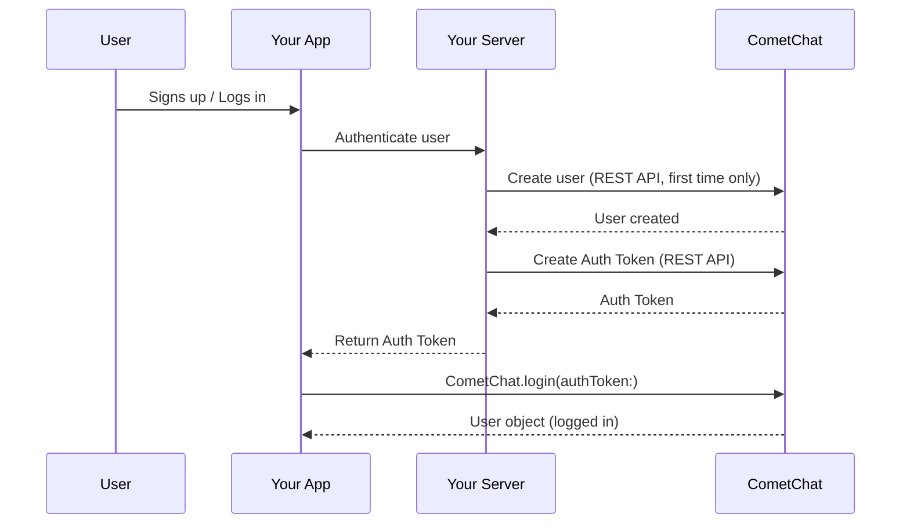

{/* TL;DR for Agents and Quick Reference */}
<Accordion title="AI Integration Quick Reference">

```swift
// Check existing session
let user = CometChat.getLoggedInUser()

// Login with Auth Key (development only)
CometChat.login(UID: "cometchat-uid-1", authKey: "AUTH_KEY", onSuccess: { user in
  print("Logged in: \(user.stringValue())")
}, onError: { error in
  print("Login failed: \(error.errorDescription)")
})

// Login with Auth Token (production)
CometChat.login(authToken: "AUTH_TOKEN", onSuccess: { user in
  print("Logged in: \(user.stringValue())")
}, onError: { error in
  print("Login failed: \(error.errorDescription)")
})

// Logout
CometChat.logout(onSuccess: { _ in
  print("Logged out")
}, onError: { error in
  print("Logout failed: \(error.errorDescription)")
})
```

**Create users via:** [Dashboard](https://app.cometchat.com) (testing) | [REST API](https://api-explorer.cometchat.com/reference/creates-user) (production)
**Test UIDs:** `cometchat-uid-1` through `cometchat-uid-5`
</Accordion>

After [initializing](/sdk/ios/setup) the SDK, the next step is to authenticate your user. CometChat provides two login methods — Auth Key for quick development, and Auth Token for production — both accessed through the `login()` method.

### How It Works



## Before You Log In

### Create a User

A user must exist in CometChat before they can log in.

- **During development:** Create users from the [CometChat Dashboard](https://app.cometchat.com). Five test users are already available with UIDs `cometchat-uid-1` through `cometchat-uid-5`.
- **In production:** Call the [Create User REST API](https://api-explorer.cometchat.com/reference/creates-user) when a user signs up in your app.

You can also create users from the client side using `createUser()` (development only):

<Tabs>
<Tab title="Swift">
```swift
let authKey = "AUTH_KEY"
let uid = "user1"
let name = "Kevin"

let newUser = User(uid: uid, name: name)

CometChat.createUser(user: newUser, apiKey: authKey, onSuccess: { (user) in
  print("User created: \(user.stringValue())")
}) { (error) in
  print("Error: \(String(describing: error?.description))")
}
```
</Tab>
<Tab title="Objective-C">
```objc
NSString *authKey = @"AUTH_KEY";
User *newUser = [[User alloc] initWithUid:@"user1" name:@"Kevin"];

[CometChat createUserWithUser:newUser apiKey:authKey onSuccess:^(User * user) {
  NSLog(@"User created: %@", [user stringValue]);
} onError:^(CometChatException * error) {
  NSLog(@"Error: %@", [error errorDescription]);
}];
```
</Tab>
</Tabs>

<Warning>
`createUser()` with Auth Key is for development only. In production, create users server-side via the [REST API](https://api-explorer.cometchat.com/reference/creates-user). See [User Management](/sdk/ios/user-management) for full details.
</Warning>

### Check for an Existing Session

The SDK persists the logged-in user's session locally. Before calling `login()`, always check whether a session already exists — this avoids unnecessary login calls and keeps your app responsive.

```swift
if let user = CometChat.getLoggedInUser() {
  // User is already logged in — proceed to your app
}
```

If `getLoggedInUser()` returns `nil`, no active session exists and you need to call `login()`.

## Login with Auth Key

Auth Key login is the simplest way to get started. Pass a UID and your Auth Key directly from the client.

<Warning>
Auth Keys are meant for development and testing only. For production, use [Auth Token login](#login-with-auth-token) instead. Never ship Auth Keys in client-side code.
</Warning>

<Tabs>
<Tab title="Swift">
```swift
let uid = "cometchat-uid-1"
let authKey = "AUTH_KEY"

if CometChat.getLoggedInUser() == nil {
  CometChat.login(UID: uid, authKey: authKey, onSuccess: { (user) in
    print("Login successful: " + user.stringValue())
  }) { (error) in
    print("Login failed with error: " + error.errorDescription)
  }
}
```
</Tab>

<Tab title="Objective-C">
```objc
NSString *uid = @"cometchat-uid-1";
NSString *authKey = @"AUTH_KEY";

[CometChat loginWithUID:uid authKey:authKey onSuccess:^(User * user) {
  NSLog(@"Login successful: %@", [user stringValue]);
} onError:^(CometChatException * error) {
  NSLog(@"Login failed with error: %@", [error errorDescription]);
}];
```
</Tab>
</Tabs>

| Parameter | Description |
| --------- | ----------- |
| UID | The UID of the user to log in |
| authKey | Your CometChat Auth Key |

On success, the callback returns a [`User`](/sdk/reference/entities#user) object containing the logged-in user's details.

## Login with Auth Token

Auth Token login keeps your Auth Key off the client entirely. Your server generates a token via the REST API and passes it to the client.

1. [Create the user](https://api-explorer.cometchat.com/reference/creates-user) via the REST API when they sign up (first time only).
2. [Generate an Auth Token](https://api-explorer.cometchat.com/reference/create-authtoken) on your server and return it to the client.
3. Pass the token to `login()`.

<Tabs>
<Tab title="Swift">
```swift
let authToken = "AUTH_TOKEN"

if CometChat.getLoggedInUser() == nil {
  CometChat.login(authToken: authToken, onSuccess: { (user) in
    print("Login successful: " + user.stringValue())
  }) { (error) in
    print("Login failed with error: " + error.errorDescription)
  }
}
```
</Tab>

<Tab title="Objective-C">
```objc
NSString *authToken = @"AUTH_TOKEN";

[CometChat loginWithAuthToken:authToken onSuccess:^(User * user) {
  NSLog(@"Login successful: %@", [user stringValue]);
} onError:^(CometChatException * error) {
  NSLog(@"Login failed with error: %@", [error errorDescription]);
}];
```
</Tab>
</Tabs>

| Parameter | Description |
| --------- | ----------- |
| authToken | Auth Token generated on your server for the user |

On success, the callback returns a [`User`](/sdk/reference/entities#user) object containing the logged-in user's details.

## Logout

Call `logout()` when your user logs out of your app. This clears the local session.

<Tabs>
<Tab title="Swift">
```swift
CometChat.logout(onSuccess: { (response) in
  print("Logout completed successfully")
}) { (error) in
  print("Logout failed with error: " + error.errorDescription)
}
```
</Tab>

<Tab title="Objective-C">
```objc
[CometChat logoutOnSuccess:^(NSString * response) {
  NSLog(@"Logout completed successfully");
} onError:^(CometChatException * error) {
  NSLog(@"Logout failed: %@", [error errorDescription]);
}];
```
</Tab>
</Tabs>

---

## Next Steps

<CardGroup cols={2}>
  <Card title="Send Messages" icon="paper-plane" href="/sdk/ios/send-message">
    Send your first text, media, or custom message
  </Card>
  <Card title="User Management" icon="users-gear" href="/sdk/ios/user-management">
    Create, update, and delete users programmatically
  </Card>
  <Card title="Connection Status" icon="signal" href="/sdk/ios/connection-status">
    Monitor the SDK connection state in real time
  </Card>
  <Card title="Ringing Calls" icon="phone" href="/sdk/ios/default-calling">
    Implement voice and video calls with ringing
  </Card>
</CardGroup>
