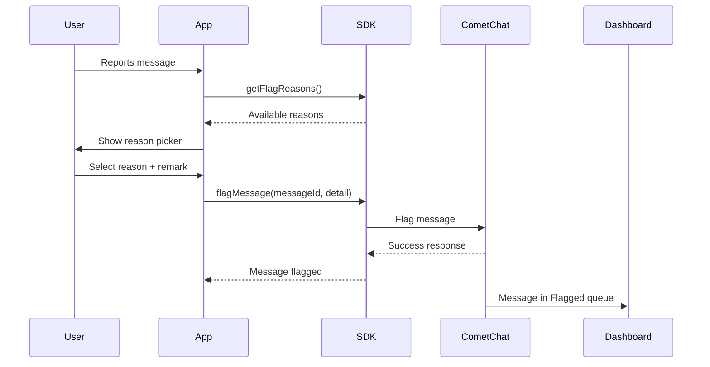

## Overview

Flagging messages allows users to report inappropriate content to moderators or administrators. When a message is flagged, it appears in the [CometChat Dashboard](https://app.cometchat.com) under **Moderation > Flagged Messages** for review.

<Note>
For a complete understanding of how flagged messages are reviewed and managed, see the [Flagged Messages](/moderation/flagged-messages) documentation.
</Note>

## Prerequisites

Before using the flag message feature:

1. Moderation must be enabled for your app in the [CometChat Dashboard](https://app.cometchat.com)
2. Flag reasons should be configured under **Moderation > Advanced Settings**

## How It Works



## Get Flag Reasons

Before flagging a message, retrieve the list of available flag reasons configured in your Dashboard:

<Tabs>
  <Tab title="Swift">
    ```swift
    CometChat.getFlagReasons { reasons in
        print("Flag reasons fetched: \(reasons)")
        // Use reasons to populate your report dialog UI
        for reason in reasons {
            print("Reason ID: \(reason.id ?? ""), Title: \(reason.reason ?? "")")
        }
    } onError: { error in
        print("Error fetching flag reasons: \(error?.errorDescription ?? "")")
    }
    ```
  </Tab>
</Tabs>

### Response

The response is an array of `FlagReason` objects containing:

| Property | Type | Description |
|----------|------|-------------|
| id | String | Unique identifier for the reason |
| reason | String | Display text for the reason |

## Flag a Message

To flag a message, use the `flagMessage()` method with the message ID and a `FlagDetail` object:

<Tabs>
  <Tab title="Swift">
    ```swift
    let messageId = 123  // ID of the message to flag
    
    let flagDetail = FlagDetail(
        messageId: messageId,
        reasonId: "spam",  // Required: ID from getFlagReasons()
        remark: "This message contains promotional content"  // Optional
    )

    CometChat.flagMessage(messageId: messageId, detail: flagDetail) { response in
        print("Message flagged successfully: \(response)")
    } onError: { error in
        print("Message flagging failed: \(error?.errorDescription ?? "")")
    }
    ```
  </Tab>
</Tabs>

### Parameters

| Parameter | Type | Required | Description |
|-----------|------|----------|-------------|
| messageId | Int | Yes | The ID of the message to flag |
| detail | FlagDetail | Yes | Contains flagging details |
| detail.reasonId | String | Yes | ID of the flag reason (from `getFlagReasons()`) |
| detail.remark | String | No | Additional context or explanation from the user |

### Response

```json
{
  "message": "Message {id} has been flagged successfully."
}
```

## Complete Example

Here's a complete implementation showing how to build a report message flow:

<Tabs>
  <Tab title="Swift">
    ```swift
    class ReportMessageHandler {
        private var flagReasons: [FlagReason] = []
        
        // Load flag reasons (call this on app init or when needed)
        func loadFlagReasons(completion: @escaping ([FlagReason]) -> Void) {
            CometChat.getFlagReasons { [weak self] reasons in
                self?.flagReasons = reasons
                completion(reasons)
            } onError: { error in
                print("Failed to load flag reasons: \(error?.errorDescription ?? "")")
                completion([])
            }
        }
        
        // Get reasons for UI display
        func getReasons() -> [FlagReason] {
            return flagReasons
        }
        
        // Flag a message with selected reason
        func flagMessage(
            messageId: Int,
            reasonId: String,
            remark: String? = nil,
            completion: @escaping (Bool, String?) -> Void
        ) {
            let flagDetail = FlagDetail(
                messageId: messageId,
                reasonId: reasonId,
                remark: remark ?? ""
            )
            
            CometChat.flagMessage(messageId: messageId, detail: flagDetail) { response in
                completion(true, response)
            } onError: { error in
                completion(false, error?.errorDescription)
            }
        }
    }

    // Usage
    let reportHandler = ReportMessageHandler()

    // Load reasons when app initializes
    reportHandler.loadFlagReasons { reasons in
        // Display reasons in UI for user to select
    }

    // When user submits the report
    reportHandler.flagMessage(messageId: 123, reasonId: "spam", remark: "User is sending promotional links") { success, message in
        if success {
            showToast("Message reported successfully")
        }
    }
    ```
  </Tab>
</Tabs>
