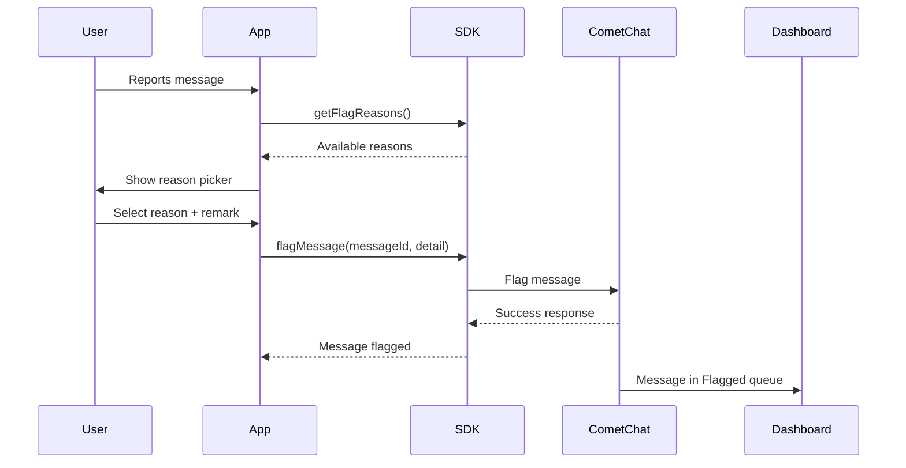

{/* TL;DR for Agents and Quick Reference */}
<Info>
**Quick Reference for AI Agents & Developers**

- **Get flag reasons:** `CometChat.getFlagReasons(onSuccess:onError:)`
- **Flag message:** `CometChat.flagMessage(messageId:detail:onSuccess:onError:)`
- **Review flagged:** CometChat Dashboard → Moderation → Flagged Messages
- **Related:** [Moderation](/moderation/overview) · [AI Moderation](/sdk/ios/ai-moderation) · [Messaging Overview](/sdk/ios/messaging-overview)
</Info>

## Overview

Flagging messages allows users to report inappropriate content to moderators or administrators. When a message is flagged, it appears in the [CometChat Dashboard](https://app.cometchat.com) under **Moderation > Flagged Messages** for review.

<Note>
For a complete understanding of how flagged messages are reviewed and managed, see the [Flagged Messages](/moderation/flagged-messages) documentation.
</Note>

## Prerequisites

Before using the flag message feature:

| Requirement | Location |
|-------------|----------|
| Enable Moderation | CometChat Dashboard > App Settings |
| Configure Flag Reasons | Dashboard > Moderation > Advanced Settings |

## How It Works



---

## Get Flag Reasons

Before flagging a message, retrieve the list of available flag reasons configured in your Dashboard:

<Tabs>
<Tab title="Swift">
```swift
CometChat.getFlagReasons { reasons in
    print("Flag reasons: \(reasons)")
    for reason in reasons {
        print("ID: \(reason.id ?? "")")
    }
} onError: { error in
    print("Error: \(error?.errorDescription)")
}
```
</Tab>
</Tabs>

<Accordion title="Sample Payloads - Get Flag Reasons">
<Tabs>
<Tab title="Request">

**Method:** `CometChat.getFlagReasons(onSuccess:onError:)`

No parameters required.

</Tab>
<Tab title="Success Response">

**Response Summary:**

| Parameter | Type | Value |
|-----------|------|-------|
| count | `Int` | `3` |

**Flag Reasons Array (example IDs - actual values from Dashboard):**

| Index | ID | Type |
|-------|-----|------|
| 0 | `"spam"` | `FlagReason` |
| 1 | `"harassment"` | `FlagReason` |
| 2 | `"hate_speech"` | `FlagReason` |

**FlagReason Object Properties:**

| Property | Type | Description |
|----------|------|-------------|
| id | `String?` | Unique identifier for the reason |
| reason | `String?` | Display text for the reason |

</Tab>
<Tab title="Error Response">

**Object Type:** CometChatException

| Parameter | Type | Value |
|-----------|------|-------|
| errorCode | `String` | `"ERR_FEATURE_NOT_ACCESSIBLE"` |
| errorDescription | `String` | `"Moderation feature is not available. To enable this feature, please upgrade your plan."` |

</Tab>
</Tabs>
</Accordion>

---

## Flag a Message

To flag a message, use the `flagMessage()` method with the message ID and a `FlagDetail` object:

<Tabs>
<Tab title="Swift">
```swift
let flagDetail = FlagDetail(
    messageId: 12345,
    reasonId: "spam",
    remark: "This message contains promotional content"
)

CometChat.flagMessage(messageId: 12345, detail: flagDetail) { response in
    print("Message flagged: \(response)")
} onError: { error in
    print("Error: \(error?.errorDescription)")
}
```
</Tab>
</Tabs>

<Accordion title="Sample Payloads - Flag Message">
<Tabs>
<Tab title="Request">

**Method:** `CometChat.flagMessage(messageId:detail:onSuccess:onError:)`

| Parameter | Type | Value |
|-----------|------|-------|
| messageId | `Int` | `12345` |
| reasonId | `String` | `"spam"` |
| remark | `String` | `"This message contains promotional content"` |

**FlagDetail Object:**

| Parameter | Type | Required | Description |
|-----------|------|----------|-------------|
| messageId | `Int` | YES | ID of message to flag |
| reasonId | `String` | YES | ID from `getFlagReasons()` |
| remark | `String` | NO | Additional context |

</Tab>
<Tab title="Success Response">

**Response:**

| Parameter | Type | Value |
|-----------|------|-------|
| message | `String` | `"Message 12345 has been flagged successfully."` |

</Tab>
<Tab title="Error Response">

**Object Type:** CometChatException

| Parameter | Type | Value |
|-----------|------|-------|
| errorCode | `String` | `"ERR_FEATURE_NOT_ACCESSIBLE"` |
| errorDescription | `String` | `"Moderation feature is not available. To enable this feature, please upgrade your plan."` |

</Tab>
</Tabs>
</Accordion>

<Accordion title="More Sample Payloads">
<Tabs>
<Tab title="Flag for Harassment">

**Request:**

| Parameter | Type | Value |
|-----------|------|-------|
| messageId | `Int` | `12345` |
| reasonId | `String` | `"harassment"` |
| remark | `String` | `"Inappropriate behavior towards other users"` |

**Swift Code:**
```swift
let flagDetail = FlagDetail(
    messageId: 12345,
    reasonId: "harassment",
    remark: "Inappropriate behavior towards other users"
)
CometChat.flagMessage(messageId: 12345, detail: flagDetail) { response in
    print("Message flagged: \(response)")
} onError: { error in
    print("Error: \(error?.errorDescription)")
}
```

</Tab>
<Tab title="Flag for Hate Speech">

**Request:**

| Parameter | Type | Value |
|-----------|------|-------|
| messageId | `Int` | `12345` |
| reasonId | `String` | `"hate_speech"` |
| remark | `String` | `"Contains offensive language"` |

**Swift Code:**
```swift
let flagDetail = FlagDetail(
    messageId: 12345,
    reasonId: "hate_speech",
    remark: "Contains offensive language"
)
CometChat.flagMessage(messageId: 12345, detail: flagDetail) { response in
    print("Message flagged: \(response)")
} onError: { error in
    print("Error: \(error?.errorDescription)")
}
```

</Tab>
</Tabs>
</Accordion>

---

## Implementation Flow

| Step | Action | Method |
|------|--------|--------|
| 1 | Load flag reasons on app init | `CometChat.getFlagReasons()` |
| 2 | Cache reasons for UI | Store in array/state |
| 3 | Show reason picker to user | Display cached reasons |
| 4 | User selects reason + remark | Capture selection |
| 5 | Submit flag | `CometChat.flagMessage()` |
| 6 | Review in Dashboard | Moderation > Flagged |

---

## Complete Example

<Tabs>
<Tab title="Swift">
```swift
class ReportMessageHandler {
    private var flagReasons: [FlagReason] = []
    
    func loadFlagReasons(completion: @escaping ([FlagReason]) -> Void) {
        CometChat.getFlagReasons { [weak self] reasons in
            self?.flagReasons = reasons
            completion(reasons)
        } onError: { error in
            completion([])
        }
    }
    
    func flagMessage(messageId: Int, reasonId: String, remark: String?) {
        let flagDetail = FlagDetail(
            messageId: messageId,
            reasonId: reasonId,
            remark: remark ?? ""
        )
        
        CometChat.flagMessage(messageId: messageId, detail: flagDetail) { response in
            print("Success: \(response)")
        } onError: { error in
            print("Error: \(error?.errorDescription ?? "")")
        }
    }
}
```
</Tab>
</Tabs>

---

## Common Error Codes

| Error Code | Description | Resolution |
|------------|-------------|------------|
| `ERR_NOT_LOGGED_IN` | User is not logged in | Login first |
| `ERR_MESSAGE_NOT_FOUND` | Message doesn't exist | Verify message ID |
| `ERR_INVALID_REASON_ID` | Invalid flag reason ID | Use ID from `getFlagReasons()` |
| `ERR_FEATURE_NOT_ACCESSIBLE` | Moderation not enabled | Enable in Dashboard or upgrade plan |
