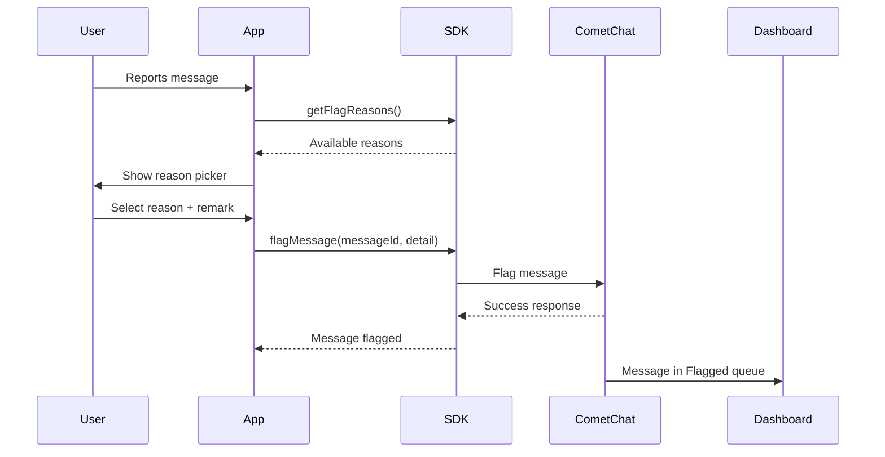

<Accordion title="AI Integration Quick Reference">

```swift
// Get available flag reasons
CometChat.getFlagReasons { reasons in } onError: { error in }

// Flag a message
let detail = FlagDetail(messageId: 12345, reasonId: "spam", remark: "Promotional content")
CometChat.flagMessage(messageId: 12345, detail: detail) { response in } onError: { error in }
```
</Accordion>

## Overview

Flagging messages allows users to report inappropriate content to moderators or administrators. When a message is flagged, it appears in the [CometChat Dashboard](https://app.cometchat.com) under **Moderation > Flagged Messages** for review.

<Note>
For a complete understanding of how flagged messages are reviewed and managed, see the [Flagged Messages](/moderation/flagged-messages) documentation.
</Note>

## Prerequisites

| Requirement | Location |
|-------------|----------|
| Enable Moderation | CometChat Dashboard > App Settings |
| Configure Flag Reasons | Dashboard > Moderation > Advanced Settings |

## How It Works



## Get Flag Reasons

Before flagging a message, retrieve the list of available flag reasons configured in your Dashboard:

```swift
CometChat.getFlagReasons { reasons in
    print("Flag reasons: \(reasons)")
    for reason in reasons {
        print("ID: \(reason.id ?? "")")
    }
} onError: { error in
    print("Error: \(error?.errorDescription)")
}
```

## Flag a Message

Use `flagMessage()` with the message ID and a `FlagDetail` object:

```swift
let flagDetail = FlagDetail(
    messageId: 12345,
    reasonId: "spam",
    remark: "This message contains promotional content"
)

CometChat.flagMessage(messageId: 12345, detail: flagDetail) { response in
    print("Message flagged: \(response)")
} onError: { error in
    print("Error: \(error?.errorDescription)")
}
```

### Parameters

| Parameter | Type | Required | Description |
|-----------|------|----------|-------------|
| messageId | `Int` | Yes | ID of the [`BaseMessage`](/sdk/reference/messages#basemessage) to flag |
| reasonId | `String` | Yes | ID from `getFlagReasons()` |
| remark | `String` | No | Additional context |

## Complete Example

```swift
class ReportMessageHandler {
    private var flagReasons: [FlagReason] = []

    func loadFlagReasons(completion: @escaping ([FlagReason]) -> Void) {
        CometChat.getFlagReasons { [weak self] reasons in
            self?.flagReasons = reasons
            completion(reasons)
        } onError: { error in
            completion([])
        }
    }

    func flagMessage(messageId: Int, reasonId: String, remark: String?) {
        let flagDetail = FlagDetail(
            messageId: messageId,
            reasonId: reasonId,
            remark: remark ?? ""
        )

        CometChat.flagMessage(messageId: messageId, detail: flagDetail) { response in
            print("Success: \(response)")
        } onError: { error in
            print("Error: \(error?.errorDescription ?? "")")
        }
    }
}
```

---

## Next Steps

<CardGroup cols={2}>
  <Card title="AI Moderation" icon="shield-check" href="/sdk/ios/ai-moderation">
    Automate content moderation with AI
  </Card>
  <Card title="Delete a Message" icon="trash" href="/sdk/ios/delete-message">
    Remove messages from conversations
  </Card>
  <Card title="Receive Messages" icon="envelope-open" href="/sdk/ios/receive-message">
    Listen for incoming messages in real time
  </Card>
  <Card title="Send Messages" icon="paper-plane" href="/sdk/ios/send-message">
    Send text, media, and custom messages
  </Card>
</CardGroup>
