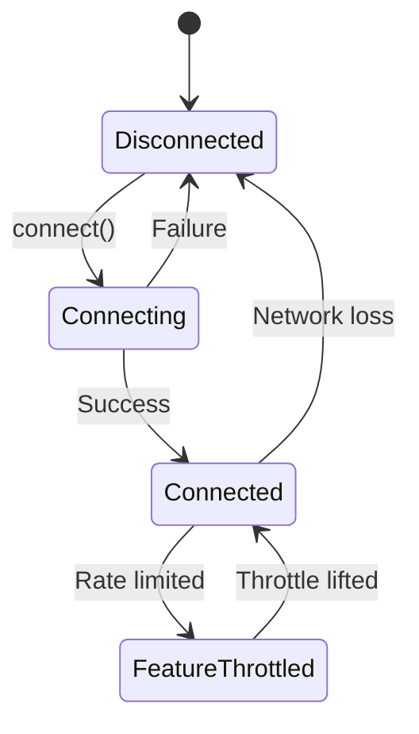

{/* TL;DR for Agents and Quick Reference */}
<Info>
**Quick Reference for AI Agents & Developers**

```javascript
// Connection status listener
CometChat.addConnectionListener("CONN_LISTENER", new CometChat.ConnectionListener({
  onConnected: () => console.log("Connected"),
  onDisconnected: () => console.log("Disconnected"),
  onConnecting: () => console.log("Connecting...")
}));

// Manual WebSocket control
CometChat.connect();     // Connect
CometChat.disconnect();  // Disconnect

// Login listener
CometChat.addLoginListener("AUTH_LISTENER", new CometChat.LoginListener({
  loginSuccess: (user) => console.log("Logged in"),
  logoutSuccess: () => console.log("Logged out")
}));
```
</Info>

Build robust, production-ready chat applications with advanced SDK capabilities including connection management, real-time listeners, and performance optimization.

## Advanced Capabilities

<CardGroup cols={2}>
  <Card title="Connection Status" icon="wifi" href="/sdk/javascript/connection-status">
    Monitor WebSocket connection state and handle network changes gracefully
  </Card>
  <Card title="Manual WebSocket Management" icon="plug" href="/sdk/javascript/managing-web-sockets-connections-manually">
    Take full control of WebSocket connections for advanced use cases
  </Card>
  <Card title="Real-Time Listeners" icon="tower-broadcast" href="/sdk/javascript/all-real-time-listeners">
    Comprehensive guide to all event listeners available in the SDK
  </Card>
  <Card title="Login Listener" icon="right-to-bracket" href="/sdk/javascript/login-listener">
    Handle authentication state changes and session management
  </Card>
</CardGroup>

## When to Use Advanced Features

| Feature | Use Case | Benefit |
|---------|----------|---------|
| Connection Status | Mobile apps, unstable networks | Graceful offline handling |
| Manual WebSocket | Background apps, battery optimization | Resource efficiency |
| Real-Time Listeners | Custom UI updates, analytics | Full event control |
| Login Listener | Multi-device sync, security | Session management |

## Connection Management

Understanding connection states is crucial for production applications:



<Tabs>
<Tab title="JavaScript">
```javascript
// Monitor connection status
CometChat.addConnectionListener(
  "CONNECTION_LISTENER",
  new CometChat.ConnectionListener({
    onConnected: () => {
      console.log("Connected to CometChat");
      // Enable chat features
    },
    onDisconnected: () => {
      console.log("Disconnected from CometChat");
      // Show offline indicator
    },
    onConnecting: () => {
      console.log("Connecting...");
      // Show loading state
    },
    onFeatureThrottled: () => {
      console.log("Feature throttled");
      // Handle rate limiting
    }
  })
);
```
</Tab>
<Tab title="TypeScript">
```typescript
// Monitor connection status
CometChat.addConnectionListener(
  "CONNECTION_LISTENER",
  new CometChat.ConnectionListener({
    onConnected: (): void => {
      console.log("Connected to CometChat");
      // Enable chat features
    },
    onDisconnected: (): void => {
      console.log("Disconnected from CometChat");
      // Show offline indicator
    },
    onConnecting: (): void => {
      console.log("Connecting...");
      // Show loading state
    },
    onFeatureThrottled: (): void => {
      console.log("Feature throttled");
      // Handle rate limiting
    }
  })
);
```
</Tab>
</Tabs>

## Best Practices

<AccordionGroup>
  <Accordion title="Always Handle Disconnections">
    Implement reconnection logic and offline indicators to maintain good UX during network issues.
    
    ```javascript
    onDisconnected: () => {
      showOfflineIndicator();
      queueOutgoingMessages();
    }
    ```
  </Accordion>
  
  <Accordion title="Clean Up Listeners">
    Remove listeners when components unmount to prevent memory leaks.
    
    ```javascript
    // On component unmount
    CometChat.removeConnectionListener("CONNECTION_LISTENER");
    ```
  </Accordion>
  
  <Accordion title="Use Manual WebSocket for Background Apps">
    Disconnect WebSocket when app goes to background to save battery and resources.
    
    ```javascript
    document.addEventListener("visibilitychange", () => {
      if (document.hidden) {
        CometChat.disconnect();
      } else {
        CometChat.connect();
      }
    });
    ```
  </Accordion>
</AccordionGroup>

## Next Steps

<CardGroup cols={2}>
  <Card title="Connection Status" icon="wifi" href="/sdk/javascript/connection-status">
    Deep dive into connection state management
  </Card>
  <Card title="Manual WebSocket" icon="plug" href="/sdk/javascript/managing-web-sockets-connections-manually">
    Learn manual connection control
  </Card>
</CardGroup>
